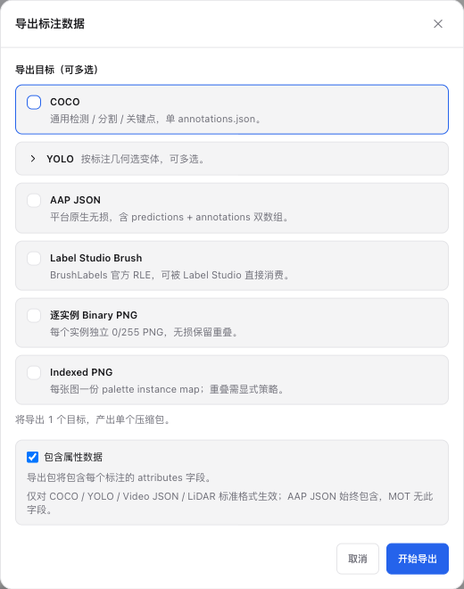

# Mask 标注导入与数据导出格式



<!-- TODO(0.8.1) IMAGE_CHECKLIST: 导出对话框，COCO / YOLO / AAP JSON 选项 + 当前选中状态 + 导出范围（项目 / 批次）。 -->

项目 Dashboard 的「导出」入口会打开居中的导出弹窗。导出目标可多选，一次导出产出**一个**压缩包：勾选单个目标时落包根，勾选多个目标时各目标落各自的 `{target}/` 子目录。

图片项目可选 **COCO / YOLO 检测 / YOLO 旋转框 / YOLO 分割 / Label Studio Brush / 逐实例 Binary PNG / Indexed PNG / AAP JSON**；视频轨迹项目可选 **Video JSON / YOLO 逐帧检测 / YOLO 逐帧分割 / COCO 逐帧分割 / DAVIS Mask / YouTube-VOS / MOTS / AAP JSON / MOT / KITTI**；点云项目可选 **AAP JSON / KITTI 3D / nuScenes JSON / Point Mask**。

> **YOLO 拆三个变体（几何映射不同）**：`YOLO 检测`(det) 导矩形框、`YOLO 旋转框`(obb) 导 rotated_bbox 四角、`YOLO 分割`(seg) 导 polygon / mask 多边形。每个变体只取匹配的几何，其余跳过。

## 格式 × 项目类型对照（先看这张表）

导出弹窗里能勾哪些目标，**取决于项目的媒体类型**（图像 / 视频 / 点云）。跨模态目标会被后端拒绝（400），所以弹窗只展示当前项目可用的目标。下表是三套 `EXPORT_TARGETS` 的实际可选项与「选哪个」决策：

| 项目类型     | 可选导出目标       | 内部 target 名                | 选它的时机                                                          |
| ------------ | ------------------ | ----------------------------- | ------------------------------------------------------------------- |
| **图像**     | COCO               | `coco`                        | 训练 Detectron2 / MMDetection（检测 / 分割 / 关键点）               |
| 图像         | YOLO 检测          | `yolo-det`（`yolo` 为旧别名） | 训练 YOLOv8 检测（矩形框）                                          |
| 图像         | YOLO 旋转框        | `yolo-obb`                    | 训练 YOLOv8 OBB（rotated_bbox）                                     |
| 图像         | YOLO 分割          | `yolo-seg`                    | 训练 YOLOv8 分割（polygon / mask）                                  |
| 图像         | Label Studio Brush | `label-studio-brush`          | 与 Label Studio BrushLabels 交换实例 Mask                           |
| 图像         | 逐实例 Binary PNG  | `binary-png`                  | 以独立 0/255 PNG 无损保留重叠实例                                   |
| 图像         | Indexed PNG        | `indexed-png`                 | 交换单张 palette instance map；重叠时需显式 winner 策略             |
| 图像         | AAP JSON           | `aap_json`                    | 跨实例无损迁移 / 客户自训模型预测灌入 / 备份                        |
| **视频轨迹** | Video JSON         | `video_json`                  | 轨迹备份 / 质检 / 继续编辑                                          |
| 视频轨迹     | YOLO 逐帧检测      | `yolo-frames-det`             | 视频逐帧检测训练（polygon / polyline 降级为顶点外接框）             |
| 视频轨迹     | YOLO 逐帧分割      | `yolo-frames-seg`             | 视频逐帧分割训练（保留多边形顶点；bbox / polyline 跳过）            |
| 视频轨迹     | COCO 逐帧分割      | `coco-frames-seg`             | 视频逐帧分割训练（标准 COCO；保留多边形顶点；bbox / polyline 跳过） |
| 视频轨迹     | DAVIS Mask         | `davis`                       | 视频对象分割训练 / 评测（序列级 palette PNG）                       |
| 视频轨迹     | YouTube-VOS        | `youtube-vos`                 | 稀疏关键帧对象分割数据交换                                          |
| 视频轨迹     | MOTS               | `mots`                        | compressed RLE 多对象跟踪与分割数据交换                             |
| 视频轨迹     | AAP JSON           | `aap_json`                    | 视频跨实例无损迁移                                                  |
| 视频轨迹     | MOT 16/17/20       | `mot`                         | 多目标跟踪评测（trackeval）                                         |
| 视频轨迹     | KITTI Tracking     | `kitti`                       | KITTI 跟踪工具链                                                    |
| **点云**     | AAP JSON           | `aap_json`                    | 点云跨实例无损迁移 / 备份（保留 3D 几何）                           |
| 点云         | KITTI 3D           | `kitti`                       | KITTI 3D 检测训练前处理（KITTI camera 坐标）                        |
| 点云         | nuScenes JSON      | `nuscenes`                    | 单帧 3D 检测训练前处理（nuScenes 风格表集）                         |
| 点云         | Point Mask         | `pointmask`                   | 逐点语义分割训练前处理                                              |

> **VOC** 仍存在于后端（`voc` 目标，仅可单选、走同步下载），但**前端导出弹窗已隐藏**，普通用户在 UI 里看不到，故不在上表。

> **视频几何的导出边界**：AAP JSON 与 Video JSON 保真保存单帧 OBB 的 `cx/cy/w/h/angle`、关键点的完整 `{x,y,v}` 数组，以及 bbox、polygon、polyline 与 Mask 轨迹；Video JSON 的媒体引用不具备跨实例可移植性。MOT / KITTI / YOLO / COCO 逐帧、DAVIS、YouTube-VOS 与 MOTS 没有单帧 OBB 或关键点表示，预检会将其列为不支持，不会静默降级。既有 polygon / polyline 和 Mask 的格式映射保持不变。
>
> **同名 target 跨模态语义不同**：`kitti` 在视频项目里是 **KITTI Tracking 2D**（逐帧 2D 框），在点云项目里是 **KITTI 3D**（label_2 3D 框 + calib），二者不可混淆。

## 导入 Mask 标注

项目卡片 `⋮` 菜单的「导入 Mask 标注」由后端格式 registry 驱动，只列出当前项目媒体类型下已验证且开放 UI 的 adapter。图片项目可导入 AAP JSON、COCO Instance、Label Studio BrushLabels、逐实例 Binary PNG、Indexed PNG 和 YOLO Segmentation；视频项目可导入 COCO Frames、DAVIS、YouTube-VOS 与 MOTS。

1. 选择格式并上传 JSON 或 ZIP；浏览器会计算 SHA-256，上传后先生成短时预检收据。
2. 预检展示无损、有损或不支持，并列出尺寸冲突、任务未匹配和未知类别。未知类别必须映射到项目类别并重新预检。
3. 有损计划需显式确认，不支持计划不可执行。提交后按 task 原子导入，可在任务铃查看进度。

COCO 导入接受 polygon、uncompressed RLE 和 compressed RLE。Label Studio 必须提供与 labeling config 一致的 `from_name` / `to_name`、原图尺寸与 `value.format="rle"`。PNG 包必须带 `manifest.json`：Binary PNG 为 8-bit `L`、0/255 像素，每个实例独立文件；Indexed PNG 为 8-bit `P`，0 是背景，1–255 是实例 ID。manifest 中的媒体路径、尺寸、类别、实例身份和内容 SHA-256 都会校验。

视频格式导入会按序列匹配任务。COCO Frames 从 `source_frame_index` 与 `attributes.__track_id` 恢复源帧和轨迹；DAVIS 使用 palette ID 与 `davis_manifest.json`；MOTS 必须带 `mots_manifest.json`，明确类别、轨迹、帧号基准和源帧映射。YouTube-VOS 的稀疏帧必须选择「未标注帧记为 outside」或「最近关键帧保持」，预检会把前者的语义折叠报告为有损。

## 导出流程

在导出弹窗点「开始导出」时，系统先根据当前项目内容、格式和选项生成预检报告：

- **无损**：同一次操作直接入队。
- **有损**：报告列出稳定损失码和说明；勾选「我已了解以上格式损失」后再次提交。
- **不支持**：报告指出无法表达的标注类型，必须调整格式或项目内容，不能继续导出。

报告同时显示估算对象数和文件数。修改导出目标、属性选项或视频帧模式会使上一份报告失效并重新预检。
未知损失码也会按原值显示，不会被忽略。

预检通过后**不会即时下载**：后端创建后台任务并弹出 toast「导出已入队，可在右上角任务铃查看进度并下载」，弹窗随即关闭。

<!-- TODO IMAGE_CHECKLIST: 右上角任务铃（JobsBell）里「数据导出」进度条 + 完成后的「下载」按钮（导出已异步化，无独立进度条页，待补 JobsBell 截图）。 -->

1. 在**右上角任务铃（JobsBell）**里能看到一条「数据导出」任务，附带进度条。
2. 任务完成后，该条目出现「下载」按钮；个人通知中心也会出现「导出完成」通知，点击通知可打开下载链接。
3. 产物（ZIP）的下载链接 **7 天内有效，可反复点击下载**（任务铃在后台不轮询，故不会自动下载，需手动点）。下载文件名为可读的 `{项目编号}_{数据集名}_{任务号前 8 位}.zip`（项目跨多个数据集时省略数据集名）。

> **重复导出走缓存**：一周内对**同一范围（项目 / 批次）+ 同一组导出目标 + 同一参数**、且标注与项目类别 / 属性配置均未变化的重复导出会**瞬间完成**（复用上次生成的产物）。目标集合顺序无关（勾选顺序不影响命中）。只要标注、类别 / 属性定义、导出选项或格式 adapter 合同发生变化，就会重新生成。多个相同的未命中请求只会构建一份产物，其余任务等待并复用它。

导出会自动跳过当前类别定义中不存在的孤儿标注，并只导出当前 attribute schema 内的用户属性 key。项目设置里删除类别 / 属性不会立即破坏已有标注；导出层会先兜底收敛，避免 schema 与 data 不一致。

## 图片产物形态：仅标注 + 回源脚本（不含图片本体）

为了控制体积、并尊重「用户本地往往已有原图」的现实，图片导出的 ZIP **只包含标注与回源脚本，不打包图片本体**。无论图片项目选哪种格式，包内都含以下公共文件：

| 文件                    | 条件                                                                       | 说明                                                                                       |
| ----------------------- | -------------------------------------------------------------------------- | ------------------------------------------------------------------------------------------ |
| `classes.txt`           | 总是                                                                       | 类别清单（每行一个类名，行号即类别索引）                                                   |
| `attribute_schema.json` | **仅 `include_attributes=True`**（导出弹窗「包含属性数据」勾选，默认勾选） | 属性 schema；取消勾选则**不产出**此文件                                                    |
| `data.yaml`             | 总是                                                                       | YOLO 训练入口，`path` / `train` / `val` / `nc` / `names` 已配好                            |
| `images_manifest.json`  | 总是                                                                       | 每张图一条记录，含相对路径、所属 dataset，以及 **7 天有效的预签名下载 URL + `expires_at`** |
| `fetch_images.py`       | 总是                                                                       | 回源脚本（纯 Python stdlib），跑它把原图按相对路径下载到 `images/`，与 `labels/` 平行      |

**回源脚本用法**：解压 ZIP 后执行

```bash
python fetch_images.py
```

脚本读取 `images_manifest.json` 里的预签名 URL，把图片下载到 `images/<同相对路径>`，与 `labels/` 严格平行 → 即取即训。本地已有原图时可不跑此脚本。预签名 URL **7 天有效**（与导出产物生命周期对齐，无需配置 MinIO 密钥）；脚本启动时会校验 `expires_at`，临近过期会提示尽快下载。

各格式的标注落点不同，详见下文。

## COCO JSON

图片 `raster_mask` 以标准 COCO compressed RLE 写入 `segmentation`，并设置 `iscrowd=1`；`bbox` 与 `area` 从实际前景像素计算，不使用上传时的占位框。polygon / multi_polygon 继续输出多边形 segmentation，其他不兼容几何计入 `info.skipped_annotations`。

最常用格式，适配 Detectron2、MMDetection、YOLOv8 等。COCO 是单文档格式，落在包根的 `annotations.json`（无 per-image label 文件）。图片的 `width` / `height` 现在取**真实尺寸**（来自 dataset 记录；早期版本曾硬编码 1920×1280，已修复）。

COCO 单文件可同时承载多种几何：

- `bbox`：矩形框（也作为 polygon / keypoint 标注的外接框）。
- `segmentation`：polygon / multi_polygon 标注的多边形顶点（像素坐标；孔洞/多连通域的完整还原留作后续）。
- `keypoints` + `num_keypoints`：keypoint 标注的 `[x,y,v,…]`（v=0 未标注 / 1 遮挡 / 2 可见）。骨架拓扑写在对应 `categories[].keypoints`（节点名）+ `categories[].skeleton`（连线，COCO 1-indexed），直接来自项目 keypoint 工具单位的 `keypoint_schema`。
- `attributes.__track_id`：跨帧同一对象的 `track_id`（启用 `include_attributes` 时）。<!-- since v0.21.2 · ADR-0045：原 `__group_id`（Ctrl+G 组号），编组下线后统一到 track_id -->

> `rotated_bbox` / `polyline` 无 COCO 原生表示，不进 COCO（rotated 走 `YOLO 旋转框`，polyline 走 AAP JSON）；被跳过的条数记在 `info.skipped_annotations`。

> **id 从 0 起**：`images[].id`、`annotations[].id`、`categories[].id` 都是 **0-based** 连续整数（不是 COCO 官方常见的 1-based）。`image_id` / `category_id` 引用的是这些 0 起的 id。下游若假设 1-based 需自行偏移。

结构：

```json
{
  "info": {"skipped_annotations": 0, "...": "..."},
  "images": [{"id": 0, "file_name": "...", "width": 800, "height": 600}],
  "annotations": [
    {
      "id": 0,
      "image_id": 0,
      "category_id": 0,
      "bbox": [x, y, w, h],
      "segmentation": [[x1, y1, x2, y2, ...]],
      "keypoints": [x1, y1, v1, x2, y2, v2],
      "num_keypoints": 2,
      "area": 12345,
      "iscrowd": 0
    }
  ],
  "categories": [
    {"id": 0, "name": "person", "supercategory": "keypoint",
     "keypoints": ["nose", "left_eye"], "skeleton": [[1, 2]]}
  ]
}
```

> COCO `categories[].skeleton` 仍用 **1-indexed** 关节序号（COCO 骨架约定，与 0-based id 无关）；其余 id 全部 0-based。

## YOLO（det / obb / seg 三个变体）

YOLO 不同变体的标注行格式互不相同，因此导出拆成三个可独立选择的目标：

| 目标               | 行格式                                        | 取哪种几何                            |
| ------------------ | --------------------------------------------- | ------------------------------------- |
| `YOLO 检测`(det)   | `<cls> <cx> <cy> <w> <h>`（归一化）           | bbox                                  |
| `YOLO 旋转框`(obb) | `<cls> <x1> <y1> … <x4> <y4>`（归一化四角）   | rotated_bbox                          |
| `YOLO 分割`(seg)   | `<cls> <x1> <y1> <x2> <y2> …`（归一化多边形） | polygon / multi_polygon / raster_mask |

> OBB 四角在像素空间按旋转角计算后再归一化（图像非正方形时直接在归一化坐标旋转会变形）。seg 对 multi_polygon 和 Mask 的每个连通域各出一行。Mask 转 polygon 无法保留孔洞、细结构与曲线边界，预检会以 `holes_polygonized` / `components_split` 报告并要求有损确认。

## Label Studio Brush 与 PNG Mask 包

- `label-studio-brush`：`annotations.json` 使用 Label Studio BrushLabels 的 RGBA RLE，保留标签、原始尺寸和 `from_name` / `to_name`。
- `binary-png`：`manifest.json` 将每个 annotation 映射到独立 `masks/<task>/<annotation>.png`，因此实例重叠仍然无损。
- `indexed-png`：每个 task 只写一张 palette PNG。单图超过 255 个实例会阻止导出；存在重叠时默认阻止，也可显式选择 `z_order`、`larger_area` 或 `smaller_area`。非 `error` 策略会在 manifest 的 `loss_report` 记录被覆盖实例、像素数和 winner 策略。

label 文件按**镜像目录**组织，保留原数据集的递归子目录结构：

```
{project_id}/{dataset_id}/labels/<原图相对路径>.txt
```

例如 `animals/cat/001.jpg` → `{project_id}/{dataset_id}/labels/animals/cat/001.txt`。这修复了过去只用叶子文件名、导致同名跨目录文件互相覆盖、丢失目录结构的问题。`fetch_images.py` 拉下来的原图会落在与之平行的 `images/` 树下。

启用 `include_attributes` 时，每个 label 旁会附一个同名的 `.attrs.json`（如 `001.attrs.json`）。

附带 `data.yaml`（YOLOv8 Ultralytics 入口格式，`names` 是 **`索引: 类名` 字典**而非 list；`path/train/val` 都指向回源后的 `images/`）：

```yaml
# YOLO 数据集入口（由 AAP 导出生成）
# images/ 由 fetch_images.py 按 images_manifest.json 回源；labels/ 已在包内。
path: .
train: images
val: images
nc: 3
names:
  0: person
  1: car
  2: bicycle
```

> `path: .` 表示数据集根就是 ZIP 解压目录；`train` 与 `val` 都指向同一个 `images/`（导出不做 train/val 划分，需自行切分）。视频逐帧 YOLO 的 `data.yaml` 同构，只是注释改为「由 fetch_frames.py 抽帧」。

导入向导也支持把 YOLO zip 作为外部预测导入。导入时选择对应变体 `det` / `obb` / `seg`；`classes.txt` 或 `data.yaml` 用于把类别索引映射回项目类别。OBB 导入会用 task 对应 `DatasetItem.width/height` 在像素空间还原旋转框，四角不构成矩形时降级为 polygon。

### 图像 YOLO ZIP 包目录树

<!-- TODO(v0.14.18) IMAGE_CHECKLIST: images/export/yolo-dir-tree.png — 解压后 YOLO 单目标导出包目录树（terminal 截图）；标注红框：labels/ 镜像层级。[manual] -->

**单目标**（只勾一个 YOLO 变体）落包根，`labels/` 按 `{project_id}/{dataset_id}/labels/<原图相对路径>.txt` 镜像层级：

```
{下载文件名}.zip 解压后/
├── classes.txt
├── attribute_schema.json          # 仅 include_attributes=True
├── data.yaml
├── images_manifest.json
├── fetch_images.py
├── {project_id}/
│   └── {dataset_id}/
│       └── labels/                 # ← 镜像原数据集递归子目录
│           ├── 001.txt             # 来自 dataset 根的 001.jpg
│           └── animals/
│               └── cat/
│                   └── 002.txt     # 来自 animals/cat/002.jpg
└── images/                         # fetch_images.py 回源后才出现，与 labels/ 平行同层级
    ├── 001.jpg
    └── animals/cat/002.jpg
```

**多目标**（如同时勾 `yolo-det` + `yolo-seg`，或再加 `coco`）时，每个目标各落自己的 `{target}/` 子目录，`classes.txt` / `attribute_schema.json` / `images_manifest.json` / `fetch_images.py` 仍在包根共享：

```
{下载文件名}.zip 解压后/
├── classes.txt
├── attribute_schema.json
├── images_manifest.json
├── fetch_images.py
├── yolo-det/
│   ├── data.yaml
│   └── {project_id}/{dataset_id}/labels/...
├── yolo-seg/
│   ├── data.yaml
│   └── {project_id}/{dataset_id}/labels/...
└── coco/
    └── annotations.json
```

> 单目标且只选 COCO / AAP JSON（无 YOLO）时，包根仍补一份 `data.yaml`（兼容旧布局），COCO/AAP 的标注落包根 `annotations.json`。

## AAP JSON 1.3（无损）

> AAP JSON 是平台原生无损中间格式。当前 schema 1.3 在 task 层包含 `media_type` 与视频元数据，并可无损透传图片 `raster_mask` 和视频 `video_track_mask`。`mask_objects` 携带内容寻址 RLE 对象，使引用在导出后仍可移植并校验哈希。与 COCO / YOLO 并列，但**包含**它们丢失的项目、来源、属性与渲染配置。

<!-- history: 1.1 added tool bindings, 1.2 added media blocks, 1.3 added portable raster mask objects. -->

适合场景：

- **跨实例迁移**：A 平台 → B 平台，标注不丢失。
- **客户自家模型预测导入**：导出空项目结构 → 客户用自家模型填 `predictions[]` → 在 Dashboard 项目卡片 `⋮` 菜单选择「导入预测」，或上传到 `/projects/{id}/predictions/import` 端点。
- **dataset snapshot 锚点**：版本化备份 / 训练复现。

AAP JSON 是单文档格式，落在包根的 `annotations.json`（无 per-image label 文件）。

结构（简化）：

```json
{
  "schema_version": "1.3",
  "exported_at": "2026-05-19T10:00:00Z",
  "exported_from": {
    "platform": "aap",
    "platform_version": "0.11.17",
    "project_display_id": "P-12",
    "batch_display_id": "BT-3"
  },
  "project": {
    "name": "Traffic Sign",
    "type_key": "image-det",
    "classes_config": {},
    "attribute_schema": { "fields": [] },
    "tool_bindings": {
      "bbox": {
        "enabled": true,
        "classes": [{ "name": "stop_sign", "color": "#ff0000", "order": 0 }],
        "attribute_schema": { "fields": [] }
      }
    },
    "rendering_config": {},
    "annotation_guide": "..."
  },
  "tasks": [
    {
      "task_match": {
        "display_id": "T-101",
        "file_path": "datasets/foo/img_001.jpg"
      },
      "media_type": "image",
      "video": null,
      "annotations": [
        {
          "geometry": { "type": "bbox", "x": 0.1, "y": 0.2, "w": 0.3, "h": 0.4 },
          "class_name": "stop_sign",
          "tool_unit_id": "bbox",
          "attributes": {},
          "confidence": null,
          "source": "manual"
        }
      ],
      "predictions": [
        {
          "geometry": { "type": "bbox", "x": 0.1, "y": 0.2, "w": 0.3, "h": 0.4 },
          "class_name": "stop_sign",
          "tool_unit_id": "bbox",
          "confidence": 0.92,
          "model_version": "ext-yolov8-v1",
          "source": "external_import"
        }
      ]
    }
  ]
}
```

关键规则：

- `schema_version` 必填，breaking change 升 major，导入端 `major > 1` 返 422; minor 升级(如 1.0 → 1.1) 只加可空字段, 老 reader 走 `extra="ignore"` 继续兼容。
- `annotations[]` 与 `predictions[]` **分开两个数组**（不混 type 字段）。
- 导出严格写满 null；导入 lenient 忽略未知字段、缺失按默认。
- `task_match` 走 `display_id` 优先（全局唯一），`file_path` fallback；跨项目 `display_id` 不允许偷换项目。
- `geometry` 使用平台**内部格式**（`bbox` / `polygon` / `multi_polygon` / `polyline` / `rotated_bbox` / `keypoint`），不嵌套 LabelStudio shape。预测导入端也接受可选 `shapes[]`，用于把多个 shape 合并到同一条 prediction；`video_bbox` / `video_track_bbox` 暂不导入。
- `project.tool_bindings` (工具维度类别 / 属性绑定) + 每条 annotation / prediction 的 `tool_unit_id`(`bbox` / `region` / `polyline` / `rotated_bbox` / `keypoint` / `lidar_box_3d` / `point_mask_3d`)。导入端缺失时按 LS shape 类型回退派生(rectanglelabels→bbox, 带 rotation 的 rectanglelabels→rotated_bbox, polygonlabels→region, polylinelabels→polyline, keypointlabels→keypoint)。遗留文件中的 `ai_interactive` 会按几何归位到 `region` / `bbox`，新导出不再产生该值。

详见 [ADR-0024](../../dev/adr/archive/0024-aap-json-format) · [ADR-0026](../../dev/adr/archive/0026-tool-unit-class-and-attribute-binding) · [API 导入指南](../../api/guides/import.md)。

## 点云标准训练格式

`lidar` 项目导出统一走异步 zip 管线，可选 **AAP JSON / KITTI 3D / nuScenes JSON / Point Mask**。标准点云目标只打包标注、标定、manifest 和回源脚本；相机图片与点云本体通过 `images_manifest.json` / `pointclouds_manifest.json` 里的 7 天预签名 URL 回源（点云回源脚本是 `fetch_pointclouds.py`，把点云拉到 `velodyne/`；图片回源脚本是 `fetch_images.py`，把图片拉到 `images/<camera>/`）。

| 目标          | 主要文件                                                                      | 用途                                                           |
| ------------- | ----------------------------------------------------------------------------- | -------------------------------------------------------------- |
| KITTI 3D      | `label_2/<frame>.txt`、`calib/<frame>.txt`、`calib_raw/<camera>/<frame>.json` | 3D 检测训练前处理，box 输出为 KITTI camera 坐标                |
| nuScenes JSON | **9 个表 JSON**（见下）                                                       | 单帧 3D 检测训练前处理                                         |
| Point Mask    | `segmentation/<frame>.label`、`category_map.json`                             | `point_mask_3d` 逐点语义 label（little-endian uint32 类别 id） |

**nuScenes JSON 实际产出 9 个表文件**（不是早期文档误写的 4 个），每个表落一个同名 `.json`：

`sample.json`、`sample_annotation.json`、`category.json`、`attribute.json`、`visibility.json`、`instance.json`、`calibrated_sensor.json`、`sample_data.json`、`ego_pose.json`。

nuScenes JSON 当前是**单帧 sample 风格、ego/ISO 坐标、占位 `ego_pose`**的子集（`ego_pose` 行是单位平移 + 单位四元数的占位，带 `_aap_note` 说明）。它不等同于完整 nuScenes global 轨迹导出，不能直接用于 nuScenes devkit 的多帧跟踪评测；完整 global 轨迹依赖后续 ego pose 数据模型。

### `axis_frame` 坐标系参数（`iso` | `source`）

导出 API 带一个 `axis_frame` 查询参数（默认 `iso`），控制 **3D box geometry 的坐标轴约定**：

- `axis_frame=iso`（默认）：3D box 的 PSR（position / size / rotation）保持平台**内部归一化 ISO 约定**（+X 前 / +Y 左 / +Z 上）。
- `axis_frame=source`：把 box 映射回该数据集导入时声明的 `axis_convention`（dataset metadata 里的轴约定），还原到用户原始坐标系。

注意作用范围：`axis_frame` 影响 **AAP JSON 与 COCO**（携带 3D / 框 geometry 的格式）。**KITTI 3D 导出与 `axis_frame` 无关——它的 `label_2` 永远输出 KITTI camera 坐标**（3D 检测标签的固定约定），是 ISO→KITTI camera 的固定逆变换。nuScenes 子集当前固定 ego/ISO 坐标。

### 缺标定时的 `.unverified` 文件名标记

KITTI 3D 的 `calib/<frame>` 标定文件**有标定时叫 `<frame>.txt`，缺标定时改名为 `<frame>.unverified.txt`**：缺标定时文件内容是单位矩阵占位（P2 / R0_rect / Tr_velo_to_cam 全为单位阵），并在文件头写显式警告，禁止下游拿它做 3D→2D 投影。`.unverified.txt` 后缀就是给下游/人工一眼识别「这帧没有真实标定」的信号，避免静默把占位矩阵当真实标定消费。

### 点云 ZIP 包目录树（单目标 KITTI 3D）

```
{下载文件名}.zip 解压后/
├── classes.txt
├── attribute_schema.json          # 仅 include_attributes=True
├── README.txt
├── label_2/
│   ├── scene01_000.txt            # KITTI camera 坐标 3D box（每帧一文件）
│   └── scene01_001.txt
├── calib/
│   ├── scene01_000.txt            # 有标定
│   └── scene01_001.unverified.txt # 缺标定 → 单位矩阵占位 + 警告头
├── calib_raw/
│   └── cam_front/
│       ├── scene01_000.json       # 原始标定原样透传
│       └── scene01_001.json
├── velodyne/                      # 空占位目录，fetch_pointclouds.py 回源点云到此
├── images/
│   └── cam_front/                 # 空占位目录，fetch_images.py 回源相机图到此
├── pointclouds_manifest.json      # 点云预签名 URL + expires_at
├── images_manifest.json           # 相机图预签名 URL + expires_at
├── fetch_pointclouds.py
└── fetch_images.py
```

> 多目标导出时（如同时勾 KITTI 3D + Point Mask），每个目标各自落 `kitti/` 与 `pointmask/` 子目录，`classes.txt` / `attribute_schema.json` 仍在包根共享。

## 视频轨迹

`video-track` 项目导出统一走异步 zip 管线，可选 **Video JSON / YOLO 逐帧检测 / YOLO 逐帧分割 / COCO 逐帧分割 / DAVIS Mask / YouTube-VOS / MOTS / AAP JSON / MOT / KITTI**。导出包含标注主体 + `manifest.json` + `fetch_videos.py`；需要图像序列的目标另带 `fetch_frames.py`，按每个输出目录自己的起始编号、位数与扩展名抽帧。

**Video JSON**（帧模式二选一）：

- **关键帧**：默认模式，只导出人工 / 预测关键帧，适合备份、质检和后续继续编辑。
- **所有帧**：导出时按相邻有效关键帧线性插值展开每帧 bbox，适合下游训练或逐帧质检。
- 顶层包含 `export_type: "video_tracks"`、`frame_mode`、项目 / 类别 / 任务信息、`tracks[]`、扁平 `keyframes[]`、旧版 `video_bbox[]` 和 `video_metadata`。

**YOLO 逐帧（检测）**：目标名 `yolo-frames-det`。每个视频 = 一个 sequence，按项目采样网格抽帧，包内写 `labels/{sequence}/{frame:06d}.txt`，行格式与图片 YOLO 检测一致：`<cls> <cx> <cy> <w> <h>`（归一化）。来源同时包含：

- `video_bbox`：单帧框的 `frame_index` 落在采样网格上才输出，off-grid 框跳过。
- `video_track_bbox`：按相邻有效关键帧线性插值摊平成逐帧框，再只取采样网格帧；`outside` 区间不输出框。

`fetch_frames.py` 会把对应帧抽到 `images/{sequence}/{frame:06d}.jpg`，与 `labels/{sequence}` 对齐；ZIP 不直接包含帧图。每个采样帧都会有一个 label 文件，空帧写空 `.txt`。

**YOLO 逐帧（分割）**：目标名 `yolo-frames-seg`。抽帧与目录布局同上（`labels/{sequence}/{frame:06d}.txt` + `fetch_frames.py`），但行格式与图片 `yolo-seg` 同构——每行 `<cls>` 后跟归一化多边形顶点。来源：单帧 `video_polygon` 的 `frame_index` 落网格才输出，`video_track_polygon` 按弧长插值展开到采样网格；bbox / polyline 几何跳过（矩形请用 `yolo-frames-det`）。

**COCO 逐帧（分割）**：目标名 `coco-frames-seg`。产出单个标准 COCO `annotations.json`。polygon 使用顶点数组与 `iscrowd=0`；Mask 轨迹使用标准 compressed RLE、像素面积、紧致 bbox 与 `iscrowd=1`，并在 attributes 中携带轨迹与遮挡信息。bbox / polyline 跳过。帧由 `fetch_frames.py` 抽到 `images/{sequence}/`，ZIP 不含帧图。

**DAVIS Mask**：目标名 `davis`。每个采样帧写 `Annotations/Full-Resolution/{sequence}/{frame:05d}.png`，PNG 模式为 `P`，背景为 0，对象 ID 在整个 sequence 内稳定分配为 1–254，255 保留为 void。存在实例重叠时默认阻止导出，也可显式选择 `z_order`、`larger_area` 或 `smaller_area` winner；取舍会进入有损报告。`outside` 帧不写该对象，`occluded` 通过 `davis_manifest.json` 保留。`fetch_frames.py` 把对应图像抽到 `JPEGImages/Full-Resolution/{sequence}/{frame:05d}.jpg`。

**YouTube-VOS**：目标名 `youtube-vos`。只把 Mask 关键帧写为 `Annotations/{sequence}/{frame:05d}.png`，`meta.json` 保存对象类别、轨迹身份、输出帧与源帧映射。palette 约束和实例重叠策略与 DAVIS 一致。导入时必须显式选择稀疏 gap 语义，避免把数据集未采样帧静默解释为对象离场。

**MOTS**：目标名 `mots`。每行使用 `frame track class height width compressed_rle` 六列格式；可选择 0-based 或 1-based 输出帧号。`mots_manifest.json` 明确序列路径、类别、轨迹、源 annotation 与输出帧到源帧的映射，因此导入不依赖整数 ID 猜测业务身份。MOTS 没有遮挡字段，预检会报告对应损失。

**MOT 16/17/20**：每个视频 = 一个 sequence，落 `{sequence}/gt/gt.txt`（`frame,id,bb_left,bb_top,bb_w,bb_h,conf,x,y,z`）+ `{sequence}/seqinfo.ini`，可直接喂 trackeval。轨迹整数 `id` 自动派生；帧号按采样网格重排 1..N（如 60fps 采 10fps 则 `frameRate=10`）。

**KITTI Tracking 2D**：每视频落 `labels/{sequence}.txt`，**17 列**空格分隔，列顺序为 `frame track_id type truncated occluded alpha x1 y1 x2 y2 h w l x y z rotation_y`。2D 版本里 `truncated=0`、`occluded∈{0,1}`、`alpha` 与全部 3D 字段（`h w l x y z rotation_y`）占位 `-1`，只有 `x1 y1 x2 y2` 是真实 2D 框（像素）。帧号取采样网格序号 0-based。

**AAP JSON**：单文档无损中间格式，所有视频轨迹 geometry 原样保留；Mask 内容通过 `mask_objects` 随包迁移。详见上节。

### 视频 ZIP 包目录树（多目标 MOT + YOLO 逐帧示例）

视频导出不物理打包帧：包内只带标注 + 网格帧号，帧由 `fetch_frames.py` 用本地 ffmpeg 就地抽取。MOT/KITTI 的 `{sequence}/img1/` 与 YOLO 逐帧的 `images/{sequence}/` 都是抽帧后才出现的目录。

```
{下载文件名}.zip 解压后/
├── manifest.json                  # 各 sequence 的预签名 URL + 网格帧号 + frame_start_number
├── fetch_videos.py                # 回源视频到 videos/
├── fetch_frames.py                # 按网格帧号抽帧（MOT/KITTI/YOLO 逐帧才有）
├── mot/
│   └── {sequence}/
│       ├── gt/gt.txt              # frame,id,bb_left,bb_top,bb_w,bb_h,conf,x,y,z（帧号 1-based）
│       └── seqinfo.ini
├── yolo-frames-det/
│   ├── classes.txt
│   ├── attribute_schema.json      # 仅 include_attributes=True
│   ├── data.yaml
│   └── labels/
│       └── {sequence}/
│           ├── 000001.txt         # 每个采样帧一个 .txt，空帧写空文件
│           └── 000002.txt
└── videos/                        # fetch_videos.py 回源后出现
    └── {sequence}.mp4
```

> 视频**单目标**时该目标落包根（无 `{target}/` 前缀），多目标才各落子目录；`manifest.json` / `fetch_videos.py` 始终在包根共享。

目标消失语义（各格式共用）：

- `outside` 闭区间段表示目标在该段帧内不存在。
- 所有帧模式 / YOLO 逐帧 / MOT / KITTI 都不跨越 `outside` 段插值，也不在其中输出 bbox（MOT/KITTI 直接省略该帧，YOLO 保留该帧空 label 或其它对象的 label）。
- `occluded=true` 表示目标存在但被遮挡，仍可参与插值；MOT 仍输出该帧，KITTI 置 occluded 列=1。

## 选哪个？（按用途速查）

页首的「格式 × 项目类型对照」表按项目模态列出可选项；下表是同一信息的「按用途」视角速查：

| 用途                                                  | 推荐                 |
| ----------------------------------------------------- | -------------------- |
| 训练 YOLOv8 检测                                      | YOLO 检测            |
| 训练 YOLOv8 旋转框 (OBB)                              | YOLO 旋转框          |
| 训练 YOLOv8 分割                                      | YOLO 分割            |
| 训练 Detectron2 / MMDetection（检测 / 分割 / 关键点） | COCO                 |
| **跨实例无损迁移 / 客户自训模型预测灌入**             | **AAP JSON**         |
| 数据迁移 / 备份                                       | AAP JSON             |
| 视频轨迹备份 / 质检                                   | Video JSON（关键帧） |
| 视频逐帧训练（目标检测）                              | YOLO 逐帧            |
| 视频逐帧质检 / 自定义脚本处理                         | Video JSON（所有帧） |
| 视频对象分割训练 / DAVIS 评测                         | DAVIS Mask           |
| 稀疏视频对象分割数据交换                              | YouTube-VOS          |
| 多对象跟踪与分割数据交换                              | MOTS                 |
| 视频多目标跟踪评测（trackeval）                       | MOT 16/17/20         |
| 视频跟踪（KITTI 工具链）                              | KITTI Tracking       |
| 视频跨实例无损迁移                                    | AAP JSON             |
