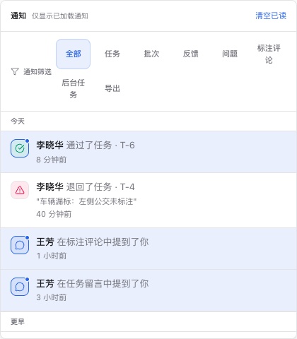

# 通知中心

通知分类和任务中心的状态选项使用统一紧凑筛选样式，留在各自浮层内；通知分类只影响已加载通知，任务中心保留账号自己的状态偏好。 [筛选操作说明](/user-guide/reference/filtering)。

右上角铃铛是个人通知中心，主界面与全屏标注 / 审核工作台顶栏都有同一入口。通知会持久保存，浏览器离线或 WebSocket 断开后，重新打开面板仍能看到未读消息。面板按时间分组，并支持按类型筛选。

铃铛右侧显示未读数量角标：无未读时不显示角标，1–99 显示精确数字，100 及以上显示 `99+`；鼠标悬停与读屏标签始终公布精确数字（如「通知，128 条未读」）。未读数来自账号级的未读统计，与当前加载页数、筛选、项目和任务无关；短暂刷新失败时保留上一次成功数值，初次获取失败时提示「未读数暂不可用」，不会误显示为 0。

从通知点击进入目标时，标注 / 审核工作台会先完成视频与 Mask 的离开检查：取消离开则保留当前任务、画面与草稿；同项目任务直达复用工作台的切换确认。打开通知行本身即视为已读，即使目标不可用或取消了跳转。

跨批次任务通知会同时切换到目标批次和任务，任务队列及上一条 / 下一条随目标批次更新。批次通知、后台任务详情中的「查看数据集」「查看项目数据」「返回项目列表」也经过离开检查；在确认弹窗中选择「继续绘制」后，草稿和底层任务详情均保留，可关闭详情继续编辑。通知详情或目标错误弹窗打开期间，Delete 等快捷键不会修改背后的标注。

顶栏的性能监控、后台任务和通知使用相同大小及位置的面板，内容较多时在面板内滚动。点击面板外任意位置、再次点击当前按钮或按 `Esc` 均可关闭；点击另一个入口直接切换面板。窄屏会自动缩小面板，性能监控展开趋势图时保持外框大小。

## 通知类型完整列表

下表列出平台当前可配置的通知类型，以及点击行为与所属筛选 tab：

| type                                | 业务含义           | 点击行为                                                   | 筛选 tab |
| ----------------------------------- | ------------------ | ---------------------------------------------------------- | -------- |
| `task.approved`                     | 任务审核通过       | 打开对应任务，读取当前状态与退回理由                       | 任务     |
| `task.rejected`                     | 任务被退回         | 打开对应任务，读取当前状态与退回理由                       | 任务     |
| `task.reopened`                     | 任务重新打开       | 打开对应任务，读取当前状态与退回理由                       | 任务     |
| `batch.rejected`                    | 批次被驳回         | 跳转工作台（批次视图）                                     | 批次     |
| `batch.review_reopened`             | 批次审核重新打开   | 跳转工作台（批次视图）                                     | 批次     |
| `batch.admin_locked`                | 管理员锁定批次     | 跳转工作台（批次视图）                                     | 批次     |
| `batch.admin_unlocked`              | 管理员解锁批次     | 跳转工作台（批次视图）                                     | 批次     |
| `batch.unarchived`                  | 批次取消归档       | 跳转工作台（批次视图）                                     | 批次     |
| `failed_prediction.retry.started`   | 失败预测重试已开始 | 仅标已读（无跳转）                                         | 全部     |
| `failed_prediction.retry.succeeded` | 失败预测重试成功   | 仅标已读（无跳转）                                         | 全部     |
| `failed_prediction.retry.failed`    | 失败预测重试失败   | 仅标已读（无跳转）                                         | 全部     |
| `export.ready`                      | 导出完成，可下载   | 打开该次导出详情，检查有效期后下载                         | 导出     |
| `export.failed`                     | 导出失败           | 打开该次导出详情与失败原因                                 | 导出     |
| `job.completed`                     | 后台任务完成       | 打开该次作业详情与结果                                     | 后台任务 |
| `job.failed`                        | 后台任务失败       | 打开该次作业详情与结果                                     | 后台任务 |
| `job.cancelled`                     | 后台任务已取消     | 打开该次作业详情与结果                                     | 后台任务 |
| `bug_report.commented`              | BUG 反馈收到评论   | super_admin/project_admin 跳 `/bugs`，其他角色打开反馈抽屉 | 反馈     |
| `bug_report.status_changed`         | BUG 反馈状态变更   | 同上                                                       | 反馈     |
| `bug_report.reopened`               | BUG 反馈重新打开   | 同上                                                       | 反馈     |
| `feedback.reply_created`            | 问题收到新回复     | 打开问题详情，查找并突出显示指定回复                       | 问题     |
| `feedback.status_changed`           | 问题状态变化       | 打开问题详情，读取当前状态                                 | 问题     |
| `annotation.comment_mentioned`      | 标注评论提到了你   | 打开原标注评论及其阅读范围                                 | 标注评论 |
| `feedback.comment_mentioned`        | 任务留言提到了你   | 打开原任务留言并突出显示                                   | 任务留言 |
| `user.deactivation_requested`       | 申请注销账号       | 仅标已读                                                   | 全部     |
| `user.deactivation_completed`       | 账号注销完成       | 仅标已读                                                   | 全部     |

> **任务直达**：点击任务或批次通知会先检查当前目标和权限，再打开对应工作台；退回理由以工作台读回的最新状态为准。目标被删除、转派或失去权限时显示说明，可重新打开或查看当前任务，不会自动进入另一条任务。首页“退回待处理”入口使用“待重做”筛选，选择批次及返回后保持该条件。
>
> **其他通知**：反馈保持原有页面或抽屉入口；导出与后台作业使用同一任务详情。`failed_prediction` 和 `user` 通知仍仅标已读。“后台任务”筛选只匹配 `async_job`，因此 `failed_prediction.retry.*` 只出现在“全部”。
>
> **失败预测重试**：`failed_prediction.retry.started` 会落一条通知中心条目；`succeeded` / `failed` 主要作为 WebSocket 实时进度事件，重试最终结果通常以后台任务通知（`job.completed` / `job.failed`）形式落地。三者均可在 [通知偏好](./settings#通知偏好) 单独静音。

## 讨论通知

问题回复通知发给仍有任务权限的原作者。状态变化通知发给原作者和全部有效回复的参与者，包括较早或嵌套回复的作者。任务留言和标注评论提及通知发给仍可访问任务的被提及者。收件人会去重并排除操作人，已失去权限或停用的账号不会收到新通知。

点击时会重新核对任务、问题或原评论的身份和权限；旧回复和评论可继续分页查找，加载过程可取消或重试。工作台会打开相应页签并突出显示目标；若同时选中另一条已载入标注，评论发送目标随选择切换，原目标草稿仍保留。只阅读未载入标注的评论不改变发送目标。已删除或不可访问时显示说明，不会跳到另一条任务。视频和 Mask 的编辑确认继续有效，协作视频不会因阅读评论自动认领分段。详见[从通知返回讨论](../workbench/discussion#从通知返回讨论)。

## 重要消息提醒

在可见的浏览器标签页中，重要通知到达时会弹出一条短暂的浮动提醒，不会抢焦点也不会自动跳转；1 秒内的多条重要事件合并为一条「收到 N 条重要通知，请查看通知中心」。提醒按通知去重，同一标签页不会重复弹出；隐藏标签页不弹提醒，只同步未读角标。哪些类型弹出提醒由[通知偏好](#通知偏好)控制。

断线期间错过的事件由 30 秒轮询与回前台 / 重连时的立即刷新补齐；重新连接只同步持久化状态，不会回放历史提醒。

## 已读、删除和清空

- 点开某条通知会自动标记为已读，部分类型同时跳转到对应目标（见上表）。
- 通知行右侧的删除按钮会删除该条通知；如果删除的是未读通知，未读数量会同步减少。
- 「全部已读」只把当前未读通知标记为已读。
- 「清空已读」会删除当前用户所有已读通知，不影响未读通知。
- 同一账号开在多个浏览器 / 设备时，一端执行已读、删除或清空后，其他在线端会通过通知 WebSocket 立即刷新，不必等 30 秒轮询。

删除只影响自己的通知记录，不会影响其他用户，也不会删除后台任务、导出产物或原始业务对象。

## 浏览历史通知

- 列表按 `今天` / `本周` / `更早` 分组，组内仍按创建时间倒序。
- 顶部筛选支持 `全部` / `任务` / `批次` / `反馈` / `问题` / `标注评论` / `后台任务` / `导出`，筛选只作用于当前已加载通知。
- 每条通知左侧图标按类型和结果着色：失败 / 退回为危险色，完成 / 通过为成功色，后台任务为 AI 色，反馈为强调色。
- 首次打开默认加载最近 30 条；有更多历史时底部出现「加载更多」按钮并继续累积显示。

面板会明确标出“已加载”范围。切换分类不会请求完整历史；继续加载后，新增通知也按当前分类显示。

## 后台任务与结果

右上角“后台任务”可查看进行中和已结束的作业，使用“加载更早任务”查找历史。“查看详情”打开该次作业的项目、数据集、执行阶段、结果计数和失败原因；离开导入页面后仍可回来核对结果。导入包含文件错误时可以展开查看具体文件。

关联目标入口会重新检查权限。目标已删除或权限改变时保留本次任务记录并显示说明。只对已有安全重试链路的已结束批量预标提供“重试失败项”，成功项保留；导入任务不提供一键重复导入。

导出链接过期、有效期未知或文件不可用时，详情提示返回项目列表重新导出。隐藏已结束条目只影响列表显示，通知和任务记录仍保留。

## 通知偏好

进入 [设置 → 通知偏好](./settings#通知偏好) 或 [工作台设置 → 通知](../workbench/settings#通知) 可以按通知类型分别设置「接收通知」与「弹出提示」，两个入口共享同一份账号级设置。

- **接收通知**：关闭后，新事件不会写入通知中心，也不会推送到在线会话；已经存在的历史通知及其未读状态不受影响。
- **弹出提示**：只影响可见页面中的瞬时提醒，不影响通知列表与角标。需要先开启接收才能弹出；关闭接收不会重置该选择，重新开启接收时恢复。

默认只对重要类型弹出提醒（任务退回、批次驳回 / 重开 / 管理员锁定、评论提及、问题回复、后台任务失败、导出失败）；普通完成类事件默认不弹，可以按需打开，未知的新类型默认不弹。

以上表格中的 type 均可单独设置。问题回复、问题状态、任务留言提及和标注评论提及分别设置，不提供线程级未读统计或邮件提醒。静音机制说明见 [设置页 · 通知偏好](./settings#通知偏好)。

后台任务的显示筛选和隐藏记录按当前账号保存。切换账号时会关闭原账号的任务列表和详情；原请求稍后完成不会替新账号打开页面或显示操作结果。
