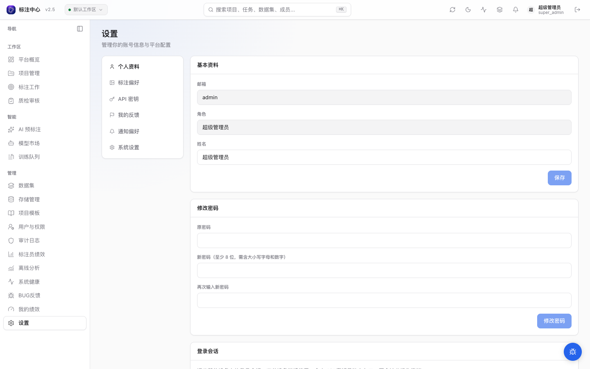
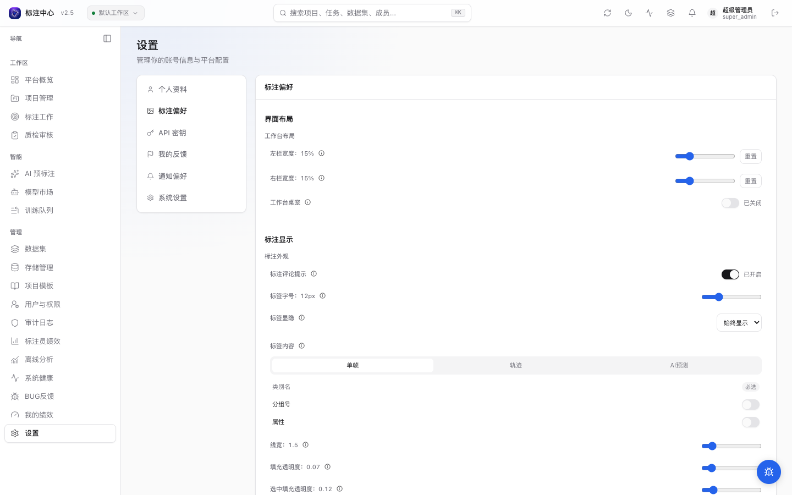
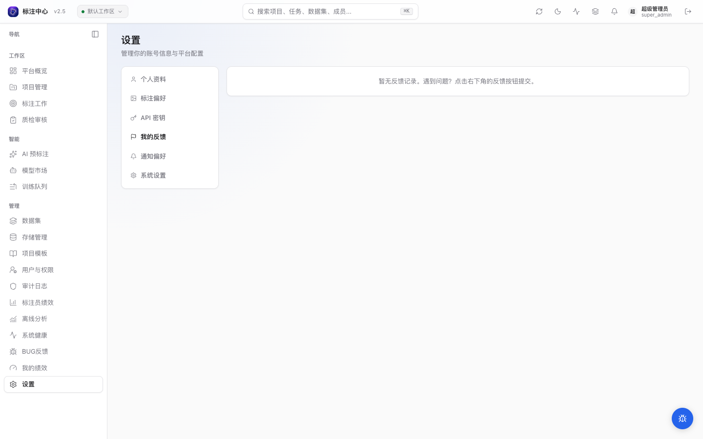
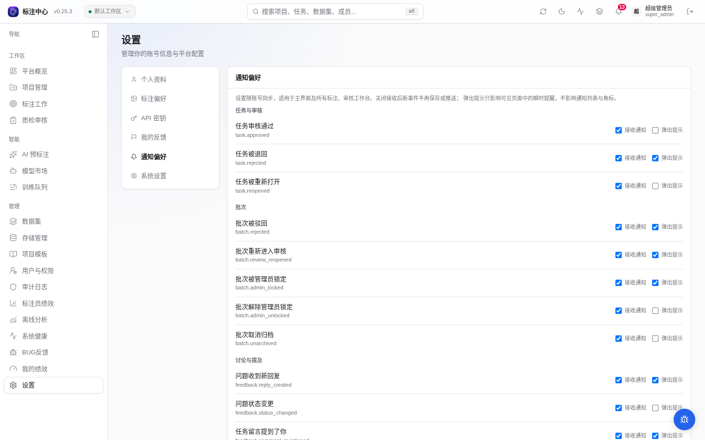
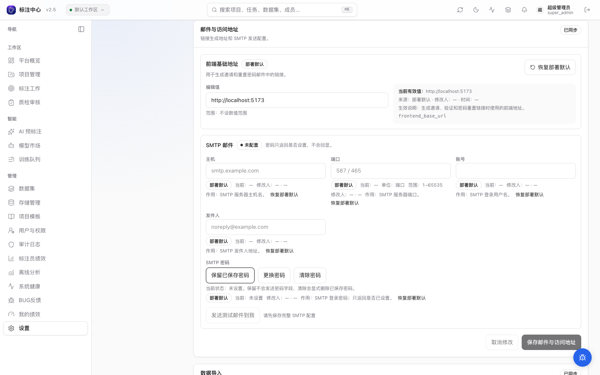

# 设置页

侧边栏底部 **设置**（`/settings`）是所有用户都可见的个性化入口。左侧导航按角色显示 4 ~ 5 个分区：

| 分区 | 谁能看 | 主要内容 |
|---|---|---|
| 个人资料 | 所有人 | 姓名、邮箱、密码、注销账号 |
| 标注偏好 | 所有人 | 工作台默认值（图像显示、视频播放、点云视角 / 上色、性能采样率） |
| API 密钥 | 所有人 | 自助创建 / 吊销个人 API key（程序化访问 / SDK / CLI） |
| 我的反馈 | 所有人 | 自己提交的 BUG 工单与状态 |
| 通知偏好 | 所有人 | 单独静音 in-app / 邮件通知 type |
| **系统设置** | **仅 super_admin** | SMTP、开放注册、邀请有效期、前端基础地址等全局配置 |

实现位于 `apps/web/src/pages/Settings/SettingsPage.tsx`。

## 个人资料

- **显示名**：可修改；提交后立即生效
- **邮箱**：只读，不可在设置页自助修改
- **修改密码**：需要旧密码，新密码强度规则与注册一致（≥ 8 字符，需含大小写字母 + 数字，三项缺一不可）
- **请求停用账号**：写入 `deactivation_requested_at`，进入 7 天冷静期；冷静期内可撤销
- **当前角色**：只读，不能自助升级

::: warning 注销 ≠ 物理删除
所有历史标注、审核、评论都通过 user_id 关联，注销后这些记录仍然存在但显示为「已注销用户」。
:::

## 标注偏好（Workbench）

驱动工作台的用户级配置（`useWorkbenchConfig`），存于后端用户偏好，跨浏览器同步。v0.15.3 起按 **通用 / 图片 / 视频 / 点云** 四分类组织（暂无字段的分类不显示），并新增工作台内的设置抽屉入口（齿轮菜单 →「工作台设置」，改动实时预览），详见 [工作台设置](../workbench/settings)：

| 分类 | 字段 | 说明 |
|---|---|---|
| 通用 | `longTaskSampleRate` | PerformanceObserver longtask 采样率（0–1），性能调试用；普通用户保持默认 |
| 通用 | `confirmDelete` / `recentClassesLimit` | 删除确认策略和最近类别数量 |
| 通用 | `crossFrameOverlayEnabled` / `crossFrameOverlayK` / `crossFrameOverlayScope` | 邻帧框叠加开关、帧数与对象范围 |
| 通用 | `performanceTier` | 视频缓存 / 预取窗口与点云抽稀上限档位（轻量 / 标准 / 激进） |
| 图片 | `smoothImage` | 图像平滑开关；关闭后显示像素级 nearest-neighbor（适合医学影像 / 像素艺术） |
| 图片 | `cssImageFilter` | 任意 CSS 滤镜字符串（如 `brightness(1.2) contrast(1.1)`）；失焦时保存；留空恢复原图 |
| 图片 | `controlPointsSize` | 多边形 / 折线顶点控制点半径（像素，2–20），影响拖拽手柄大小 |
| 图片 | `autoFitOnResize` | 展开 / 收起边栏或画布容器尺寸变化后，自动让图片重新适应画布 |
| 视频 | `defaultPlaybackRate` / `largeFrameStep` | 视频任务默认播放速率和大步进帧数 |
| 视频 | `autoFitOnResize` | 展开 / 收起或拖宽边栏后，自动让视频重新适应画布 |
| 点云 | `pointSize` / `pointMaskSelectMode` | 点云点径和点云分割工具的默认点选模式 |
| 点云 | `neighborPointOverlay` / `neighborPointOverlayK` / `neighborPointCull` | 邻帧点云叠加开关、帧数与动态目标处理方式 |
| 点云 | `persistCameraView` | 记住 3D 主视角的相机位置、目标点、up 向量和 orbit / BEV 模式 |
| 点云 | `colorizeWithCamera` / `colorizeContrast` / `colorizeBrightness` / `colorizeGamma` | 相机 RGB 上色开关与色彩调整 |
| 点云 | `showDepthHint` | 相机图深度热力与 hover 深度读数 |
| 点云 | `showGrid` / `showAxisGizmo` / `cameraDamping` | 地面网格、坐标轴和 OrbitControls 阻尼 |

修改即时生效，不需要重登。被项目级工作台规范锁定的字段显示「项目锁定」并禁用。

## API 密钥

自助管理**个人** API key，用于程序化访问平台 API（CI / 脚本 / 官方 [Python SDK / CLI / TUI](../../dev/sdk/quickstart)）。所有登录用户都可在此创建，无需管理员协助（超管也可在「用户与权限」页顶部的「API 密钥」按钮进入同一界面）。

- **新建密钥**：填名称 + 选权限——勾「完全访问」（full-access，等同你本人全部权限），或细选权限范围 scope（`annotations:read` / `annotations:write` / `predictions:read` / `datasets:read`，默认 `annotations:read`）。可选**有效期**（30 / 90 / 365 天 / 永不 / 自定义）。创建后弹出**一次性明文** key，请立即复制保存——离开本页后无法再次查看，只剩前缀。
- **列表**：显示名称 / 前缀 / 权限 / 有效期 / 最后使用 / 创建时间；已吊销的标灰，已过期的带徽标。
- **编辑 / 轮换**：可改名称 / scope / 有效期；轮换换发新明文、旧 key 立即失效。
- **吊销**：不可恢复，吊销后该 key 立即失效。

::: warning scope 自 v0.15.11 起强制
key 的权限在路由层经 `require_scopes` 校验，缺少所需 scope 的请求返回 **403**；过期的 key 一律 **401**。含「完全访问」（`*`）的 key 绕过 scope 校验、等同全权。已挂强制的 scope：`annotations:read` / `annotations:write` / `datasets:read` / `predictions:read`（其余路由暂不限制）——**未覆盖端点仍遵从你的账号角色，只勾读 scope 不等于只读隔离**。详见 [API 鉴权指南](../../api/guides/auth#api-key)。
:::

拿到 key 后接入 SDK：`aap login --url <平台地址> --api-key ak_...`，详见 [SDK 快速上手](../../dev/sdk/quickstart)。

## 我的反馈

罗列当前用户通过右下角浮动按钮提交过的 BUG 工单，按时间倒序。每条显示 `display_id` + 标题 + 严重度 + 状态。

点击展开查看：

- 当前 resolution（如果超管已填）
- 所有评论时间线
- 是否可重开（仅 `fixed` / `wont_fix` 终态可重开，重开后回到 `triaged`）

对应超管侧操作详见 [BUG 反馈管理](../superadmin/bug-management)。

## 通知偏好

逐 type 切换 **站内通知（in-app）** 开关。关闭后，新事件不进入站内通知中心；已存档通知不受影响。邮件 digest 当前尚未开放配置。所有已知 type 见 [通知中心](./notifications)。

::: tip 静音 = 全链路屏蔽
静音不只是关闭 WS 推送，而是 `NotificationService` 在写表前先查偏好，被静音的 type 不写表、不发 PubSub。
:::

## 系统设置（super_admin 专属）

只对 super_admin 显示，对应 `app/services/system_settings_service.py`（`EDITABLE_KEYS` 白名单）。UI 可配条目：

| 条目 | 说明 |
|---|---|
| **开放注册** (`allow_open_registration`) | 允许新用户自助注册（注册为 Viewer 角色） |
| **邀请有效期** (`invitation_ttl_days`) | 邀请链接有效天数（1–90 天） |
| **前端基础地址** (`frontend_base_url`) | 用于生成邀请 / 重置密码邮件中的链接 |
| **SMTP 服务器** | host / port / 账号 / 发件人 / 密码；底部「发送测试邮件到我」按钮验证连通 |

修改后立即落 DB，无需重启 API 容器。

> **仅 env 可配（不在 UI）**：`SECRET_KEY`、`DATABASE_URL`、`CAPTCHA` 密钥、登录限流阈值（`login_captcha_threshold`）、存储连接器主机白名单（`connector_host_allowlist`，经专属连接器路由端点读写）等属于启动时常量或专项接口，本页不支持修改。详见 [环境变量参考](../../dev/reference/env-vars)。
