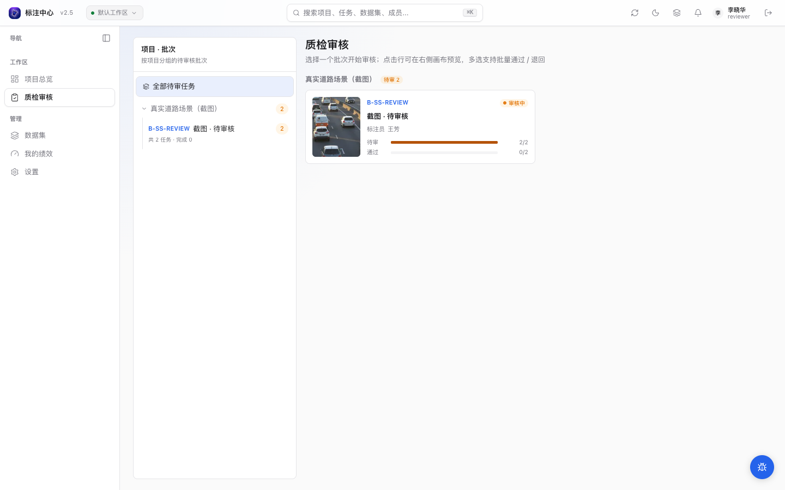

# 审核流程

> 适用角色：审核员 / 项目管理员

## 审核工作台




平台提供两个独立的审核入口：

- **ReviewPage**（`/review`）：未选批次时显示按项目分组的**批次卡片网格**（封面缩略图、待审 / 通过进度条，卡片上还标出该批次的标注员姓名），点卡进入该批次的任务列表；左侧栏顶部「全部待审任务」可跨批次平铺全部待审任务，进入批次后标题区「返回全部批次」回到卡片概览。选中批次后在任务列表浏览、选择待审任务，也可在列表侧直接通过 / 退回单条任务。
- **WorkbenchShell review 模式**（`/projects/:id/review`）：全屏审核工作台，进入后显示完整标注画布（图片任务）或时间轴（视频任务）以及 diff 视图，在顶部操作区执行通过 / 退回动作。

审核工作台与标注工作台共用同一个 `WorkbenchShell` 外壳，仅 `mode` 参数不同。审核模式只替换顶部操作、横幅、任务锁、通过 / 退回流程和 diff 视图，不复制一套独立页面。因此图片、视频和未来 Stage 的查看方式会同步进入审核入口。

## 审核操作

| 操作     | 含义                                         | 后果                                |
| -------- | -------------------------------------------- | ----------------------------------- |
| **通过** | 标注合格                                     | 任务进入 `completed`                |
| **退回** | 需要修改，必须选「原因类型」（可附自由备注） | 任务回到原标注员，状态变 `rejected` |

### 退回原因类型

退回时必须从以下 4 类中选一项（`RejectReasonType` **结构化枚举**，便于后续 reject 率统计 → [super_admin 离线分析](../superadmin/analytics)）：

| 类型             | 中文 label     | 适用场景                         |
| ---------------- | -------------- | -------------------------------- |
| `missing`        | 漏标           | 应该标的目标没标到               |
| `extra`          | 多标           | 标了不该标的（噪声框 / 误标）    |
| `wrong_label`    | 类别错误       | 几何形状对，类别选错             |
| `wrong_geometry` | 位置或尺寸不准 | 类别对，框位置 / 大小 / 形状不准 |

旁边的「补充说明」是**可选**自由文本，建议写清楚具体目标 / 帧号，例如 `trk_person_01 frame 128: 车辆消失后仍有插值框`。


<!-- TODO(0.8.1) IMAGE_CHECKLIST: 点「退回」弹出的备注表单，含原因下拉 + 富文本备注框。 -->

完整退回流程会先定位待审任务，再选择结构化原因、填写补充说明并确认：

<DocsVideo
  src="/media/review/reject-flow.mp4"
  poster="/media/review/reject-flow-poster.webp"
  alt="从质检批次卡片进入审核工作台，核对错误车辆框并填写结构化原因退回任务"
  caption="退回前批次有 2 条待审；确认“位置或尺寸不准”并填写明确返工要求后，任务离开待审队列，批次卡片同步变为 1/2。"
/>

### 退回接口请求体

调用 `POST /api/v1/tasks/{task_id}/review/reject` 时的 JSON 请求体：

```json
{
  "reason_type": "missing",
  "reason": "trk_person_01 frame 128: 车辆消失后仍有插值框"
}
```

- `reason_type`：必填，取 4 枚举值之一。
- `reason`：可选自由文本，最长 2000 字符。

## 视频任务审核

视频任务会在审核工作台切到视频时间轴视图。审核时重点看：

- 轨迹列表里的类别和 `track_id` 是否能对应同一个对象。
- 第 1 帧、中间帧、最后一帧等关键位置的 bbox 是否贴合目标。
- 两个关键帧之间的虚线插值框是否发生明显漂移。
- 目标消失段是否标记了「消失」，避免插值框穿过不存在的对象。
- 被遮挡目标是否标记了「遮挡」，且框体仍覆盖可判断的目标区域。

退回视频任务时，建议在原因里写清楚 `track_id + frame_index`，例如：

```text
trk_person_01 frame 128: 车辆消失后仍有插值框，请标记为消失。
```

这样标注员重做时可以直接定位到问题轨迹和帧。

### 分段边界与 Track 质量

启用分段协同的视频会在右侧显示「Track 边界质量」。每张边界卡比较相邻 segment 的 overlap：

- HOTA 同时反映检测和关联一致性；IDF1 反映跨帧身份保持。
- MOTA L / MOTA R 分别把左侧或右侧当作参考，二者不是人工真值准确率。
- 按 Track、分段和章节的汇总显示异常帧数量；issue 列表提供 FP、FN、identity switch、fragmentation
  和几何不一致的连续帧范围。

点击 issue 会跳到首个问题帧，并排显示两侧 fragment。逐条确认系统建议的「同一轨迹 / 不同轨迹」；系统未匹配
但确属同一对象时，可从同类别、同几何类型的未匹配 fragment 手工补 pair。全部确认后点击「接受边界对账」。

输入发生变化时报告会标为 stale，不能接受，也不能通过任务或导出跨边界全轨。可重新运行质量检查，或先「返工左分段」
或「返工右分段」；标注员重新提交后会生成新报告。只有所有相关边界都已接受，系统才会裁掉 overlap 重复部分并派生
canonical 全视频轨迹。

## 审核员绩效

审核员仪表板（`ReviewerDashboard`）显示以下 `ReviewerDashboardStats` 指标：

| 指标         | 字段                        | 说明                             |
| ------------ | --------------------------- | -------------------------------- |
| 待审队列     | `pending_review_count`      | 当前仍在 `review` 状态的任务数   |
| 今日已审     | `today_reviewed`            | 当日通过 + 退回合计              |
| 平均审核耗时 | `median_review_duration_ms` | 审核耗时中位数                   |
| 累计审核     | `total_reviewed`            | 历史总审核数                     |
| 24h 通过率   | `approval_rate_24h`         | 过去 24 小时通过 / (通过 + 退回) |
| 历史通过率   | `approval_rate`             | 全量通过率                       |
| 二次返修率   | `reopen_after_approve_rate` | 通过后被标注员 reopen 的比例     |
