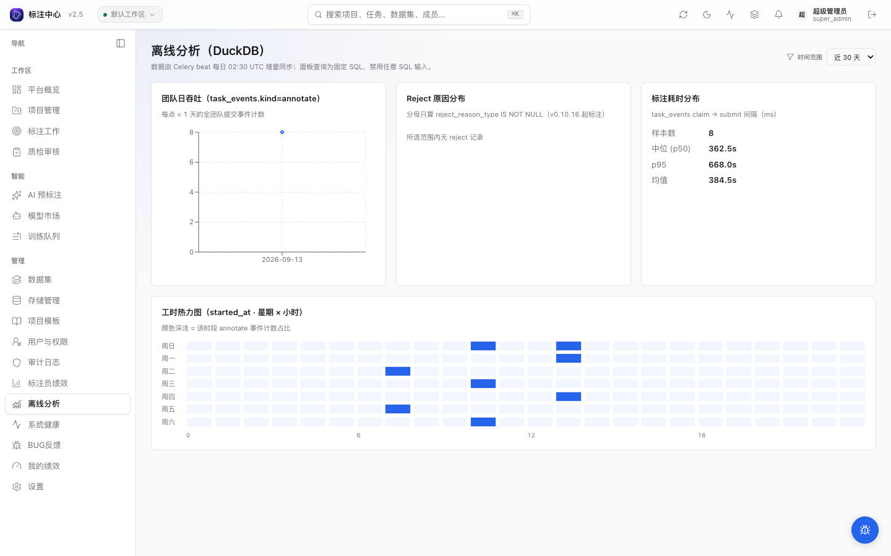
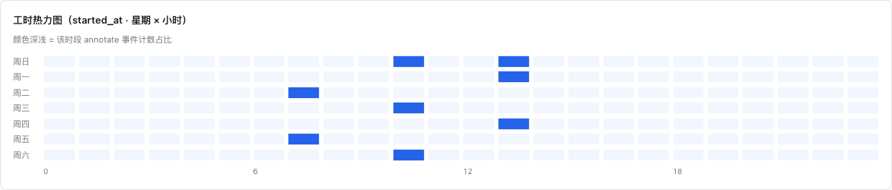

# 离线分析面板（DuckDB）

`/admin/analytics` 是 `super_admin` 专属的离线分析视图，依赖 Celery beat 每日 02:30 UTC 把
`task_events` + `audit_logs` 增量同步到本地 DuckDB 文件（`./data/duckdb/analytics.duckdb`），
**不**接收任意 SQL 输入，只暴露 4 个固定面板：

## 面板



| 面板                | 数据源                                                             | 说明                                                                                                 |
| ------------------- | ------------------------------------------------------------------ | ---------------------------------------------------------------------------------------------------- |
| **团队日吞吐**      | `task_events.kind='annotate'`                                      | 按日聚合全团队提交事件计数，recharts 折线图                                                          |
| **Reject 原因分布** | `task_events.was_rejected=true AND reject_reason_type IS NOT NULL` | 4 类 enum 次数（count）；API 同时返回占比（pct），旧数据 NULL 不入分母，recharts 横向柱图 X 轴为次数 |
| **标注耗时分布**    | `task_events.kind='annotate'` 的 claim→submit 间隔                 | 样本数 / p50 / p95 / 均值；底层字段单位 ms，前端除以 1000 后以秒（s）展示                            |
| **工时热力图**      | `task_events.kind='annotate'` 的 `started_at`                      | 星期（0=周日..6=周六）× 小时聚合事件计数；7×24 网格，格子深浅 = 时段计数强度                         |

时间范围下拉支持 **近 7 / 30 / 90 天**。



### reject_reason_type 枚举值

`reject_reason_type` 共 4 类，前端 4 个预设按钮一一对应（`apps/api/app/db/models/task.py:RejectReasonType`）：

| 枚举值           | 含义          |
| ---------------- | ------------- |
| `missing`        | 漏标          |
| `extra`          | 多标          |
| `wrong_label`    | 类别错误      |
| `wrong_geometry` | 位置/尺寸不准 |

### API 面板名称（panel_name）

固定面板通过路由 `GET /api/v1/admin/analytics/{panel_name}` 访问，可接受 `days` 参数（1–365，默认 30）：

| panel_name            | 对应面板        |
| --------------------- | --------------- |
| `throughput_daily`    | 团队日吞吐      |
| `reject_rate_by_type` | Reject 原因分布 |
| `duration_dist`       | 标注耗时分布    |
| `activity_heatmap`    | 工时热力图      |

## 为什么用 DuckDB 而不是 PG / ClickHouse

- 数据量当前未到亿级，ClickHouse 运维成本不划算；
- 但 PostgreSQL 大宽表上跑 percentile_cont 已经卡住 dashboard 渲染；
- DuckDB 单文件、列存、`read_only=True` 多 reader 并发安全，正好适配「写入很少 / 读取频繁」的分析负载。

## 数据初始化中？

如果首次同步 Celery beat 还没跑过（或 DuckDB 文件被删），端点会返回 `503`，前端展示「数据初始化中」。
强制刷一次：

```bash
# 触发同步（worker 容器内）
docker exec ai-annotation-platform-celery-worker-1 \
  celery -A app.workers.celery_app call app.workers.analytics.sync_to_duckdb

# 检查文件
ls -lh ./data/duckdb/analytics.duckdb
```

## 升级路径

DuckDB 单机能扛到约 **亿级行**。触发以下任一条件后再迁 ClickHouse：

- `task_events` 单月行数 > 1000 万
- 单个面板 query 耗时 > 10s（看浏览器 Network）
- 多用户并发读 read_only 出现锁等待

→ 见 [ROADMAP §4.3 ClickHouse 升级触发条件](../../roadmap/2026-05-18-cvat-labelstudio-inspiration)。

## 相关

- [ROADMAP §1.6 DuckDB 离线分析视图](../../roadmap/2026-05-18-cvat-labelstudio-inspiration)
- 数据源：[`apps/api/app/services/duckdb_sync.py`](../../../apps/api/app/services/duckdb_sync.py)
- 固定 query：[`apps/api/app/services/analytics_queries.py`](../../../apps/api/app/services/analytics_queries.py)
