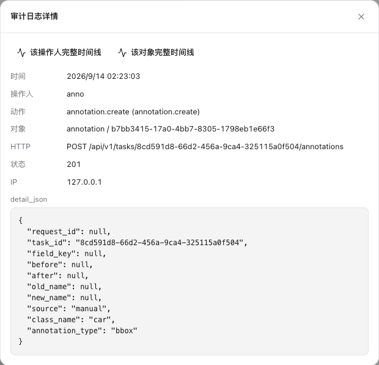
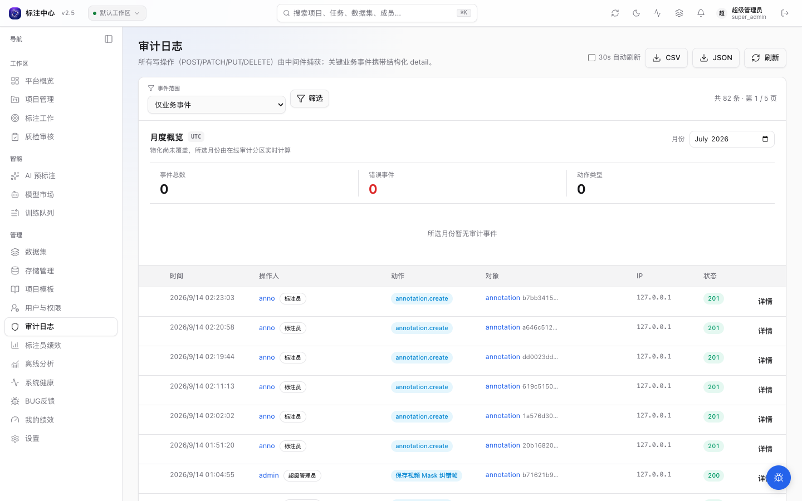

# 审计日志

`audit_logs` 表是平台关键操作的不可改追踪流水。超管可在前端审计页查询，开发者可直接 SQL。

## 入口

`/admin/audit-logs`（仅 super_admin 有前端入口；API 列表端点 project_admin 可访问，导出仅 super_admin）

## 表结构要点



| 字段 | 含义 |
|---|---|
| `actor_id` | 触发动作的用户；`ON DELETE SET NULL` 保留历史 |
| `action` | 命名空间动作，如 `project.create` / `task.approve` |
| `target_type` / `target_id` | 操作对象类型与 ID |
| `detail_json` | JSONB，存上下文（旧值、IP、UA、filter_criteria 等） |
| `created_at` | timestamptz |

`audit_logs` 受 trigger 守护——**任何 UPDATE/DELETE 默认被拒**（"audit_logs rows are immutable"）。例外：seed/reset 流程通过 `SET LOCAL "app.allow_audit_update" = 'true'` 临时豁免（详见 [Dev 数据保护](../../dev/troubleshooting/dev-data-preservation)）。

## 已覆盖动作

按命名空间组织（命名规则：`命名空间.动词`，下面列出主要动作，完整列表见 `apps/api/app/services/audit.py` 的 `AuditAction` 枚举）。前端 `auditLabels` 提供翻译。

### 用户与权限
- `auth.login` / `auth.logout` / `auth.logout_all`
- `user.invite` / `user.register` / `user.role_change` / `user.deactivate` / `user.delete`
- `user.profile_update` / `user.password_change` / `user.password_admin_reset`

### 项目
- `project.create` / `project.update` / `project.delete` / `project.transfer`
- `project.member_add` / `project.member_remove`
- `project.export`

### 数据
- `dataset.create` / `dataset.delete` / `dataset.import`
- `dataset.link` / `dataset.unlink`
- `storage_connection.create` / `storage_connection.update` / `storage_connection.delete`
- `batch.created` / `batch.status_changed` / `batch.deleted`
- `batch.distribute_even` / `batch.bulk_archive` / `batch.bulk_delete`
- `batch.export`

### AI / ML
- `predictions.import` / `predictions.purge`
- `failed_prediction.dismissed` / `failed_prediction.restored`
- `video_tracker_job.create` / `video_tracker_job.cancel` / `video_tracker_job.accept` / `video_tracker_job.discard` / `video_tracker_job.decision`
- `video_correction_job.create` / `video_correction_job.cancel`（人工 Mask 纠错传播创建 / 取消）
- `annotation.mask_mutation`（Mask 拆分、复制、合并或严格非重叠的聚合提交）
- `ml_registry.created` / `ml_registry.updated` / `ml_registry.deleted`（全局注册 CRUD）
- `ml_service_pool.created` / `ml_service_pool.updated` / `ml_service_pool.deleted` / `ml_service_pool.member_upserted` / `ml_service_pool.member_removed` / `ml_service_pool.member_drained` / `ml_service_pool.member_resumed`
- `ml_backend.created` / `ml_backend.updated` / `ml_backend.deleted` / `ml_backend.enablement` / `ml_backend.reloaded` / `ml_backend.unloaded` / `ml_backend.warmup` / `ml_backend.smoke_tested`（项目兼容与实例生命周期；详见 [ML Backend 注册](./ml-backend-registry)）

> 上述 ML 相关动作由后端以**原始字符串**写入，目前未纳入 `AuditAction` 枚举。可分别按 `action LIKE 'ml_registry.%'`、`'ml_service_pool.%'` 或 `'ml_backend.%'` 查询。

原生 Mask、实例原子操作与视频纠错审计只保存有界摘要和 lineage：对象 / 版本、窗口、backend / pool / model、候选数量、fallback、digest 与人工覆盖前后摘要。审计和普通日志都不保存 RLE counts、完整 geometry、笔迹坐标、logits、receipt 或原始 prompt 正文。

### 标注
- `annotation.create` / `annotation.update` / `annotation.delete`
- `annotation.import` / `annotation.group` / `annotation.bulk_update`
- `annotation.comment_add` / `annotation.comment_delete`

### 审核
- `task.submit` / `task.withdraw`
- `task.review_claim` / `task.approve` / `task.reject`
- `task.reopen` / `task.accept_rejection` / `task.skip`

### 系统
- `system.settings_update` / `system.bootstrap_admin`
- `audit.export` / `audit.archive`

## 查询界面



前端提供以下过滤维度（`GET /api/v1/audit-logs`）：

- 顶部时间范围选择器（`from` / `to` 参数）
- `action` 精确匹配
- `target_type` / `target_id` 按对象查
- `actor_id` 按操作人查
- `business_only=true` 排除 `http.*` 中间件元数据行
- `detail_key` + `detail_value`：`detail_json` JSONB 字段级过滤（走 GIN 索引），例如 `?detail_key=role&detail_value=super_admin`
- 行内点击展开 `detail_json`

支持导出 CSV 或 JSON（同步 `StreamingResponse`，最大 50,000 行；超限时需缩小过滤范围）：

```
GET /api/v1/audit-logs/export?format=csv&from=2026-01-01&action=task.reject
```

## 直接 SQL 查询示例

```bash
docker exec ai-annotation-platform-postgres-1 psql -U user -d annotation -c \
  "SELECT created_at, actor_id, action, target_type, target_id, detail_json
   FROM audit_logs
   WHERE created_at > NOW() - INTERVAL '1 day'
     AND action LIKE 'task.%'
   ORDER BY created_at DESC LIMIT 50;"
```

## 分区策略

`audit_logs` 按月分区（[ADR 0007](../../dev/adr/archive/0007-audit-log-partitioning)）。运维上每月初由 cron 创建下月分区，旧分区可按合规策略归档/删除（默认保留 12 个月）。

## 写入侧约定

新功能要写审计：

1. 在 `apps/api/app/services/audit.py` 的 `AuditAction` 枚举中添加新动作
2. 在业务代码中调用 `AuditService.log(db, actor=..., action=AuditAction.XXX, target_type=..., target_id=..., detail={...})`
3. 前端 `auditLabels` 加翻译
4. 新动作进 changelog

不要绕过 service 直接 INSERT——trigger 不区分来源，但 service 层负责字段统一。
