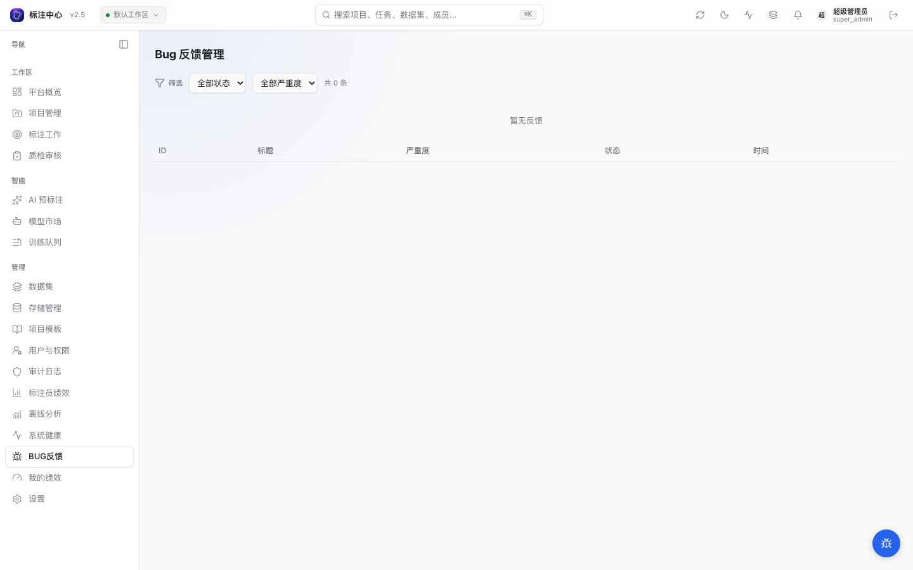
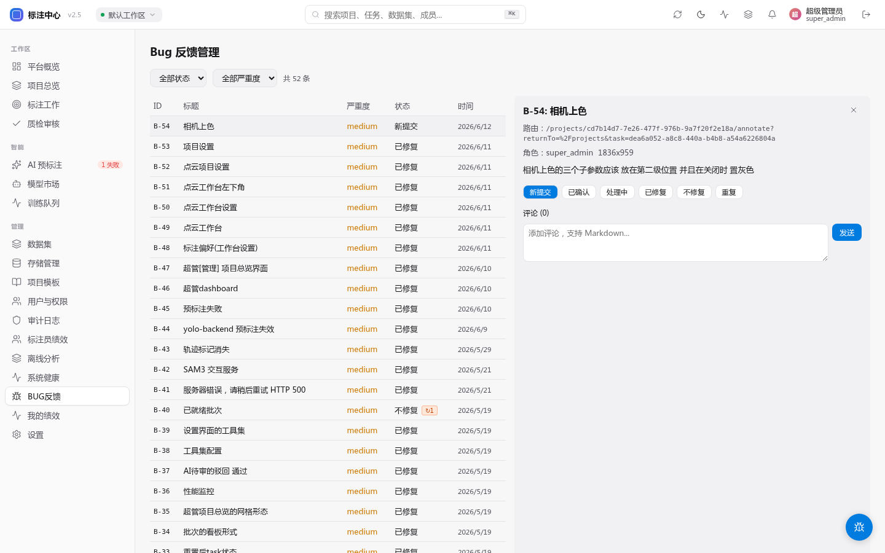

# BUG 反馈管理

平台右下角浮动的「BUG 反馈」按钮收集到的反馈会落在 `bug_reports` 表中。
`super_admin` 和 `project_admin` 均可通过 `GET /api/v1/bug_reports` API 访问工单列表；侧边栏 **管理 → BUG 反馈**（`/bugs`）入口仅对 `super_admin` 前端可见。

> 非管理员用户提交反馈后只能在「设置 → 我的反馈」里查看自己提交的工单。

## 截图附件约束

用户提交反馈时最多可上传 **5 个**附件，每个文件限制如下：

- 最大文件大小：**10 MB**
- 支持格式：**PNG / JPEG / WebP**（其他格式上传时返回 422）

## 列表与筛选

进入后默认展示最近 50 条工单，支持按 **状态 + 严重度** 两个维度过滤：

| 状态 | 含义 |
|---|---|
| `new` 新提交 | 未经分诊 |
| `triaged` 已确认 | 已被认领，需排期 |
| `in_progress` 处理中 | 已在修复 |
| `fixed` 已修复 | 修复已上线 |
| `wont_fix` 不修复 | 复现失败或非缺陷 |
| `duplicate` 重复 | 关联到已存在工单 |

| 严重度 | 触发场景 |
|---|---|
| `low` | 文案、对齐、不影响流程 |
| `medium` | 单点功能问题 |
| `high` | 工作流被阻断 |
| `critical` | 数据丢失或安全风险 |

列表每行展示 `display_id`（B-1、B-2 …）、标题、严重度徽标、状态、提交时间。如果该工单被重开过，状态后会显示 `↻N` 徽标，鼠标悬停可看最近一次重开时间。

支持以 Markdown 格式导出当前筛选结果：`GET /api/v1/bug_reports?format=markdown&status=new`。

## 详情面板

点击行打开右侧详情面板，自上而下包含：

1. **元信息**：用户提交时所在路由（`route`）、提交者角色、视口尺寸（`viewport`）、重开次数。
2. **描述正文**：用户填写的 markdown（已渲染为 HTML，由 `MarkdownBlock` 组件做安全过滤）。
3. **截图附件**：所有 attachments 以图标链接形式列出，文件大小标注在右侧；点击在新标签页打开签名 URL。
4. **处理结果（resolution）**：若已填写，显示在状态按钮上方。
5. **状态切换按钮**：6 个状态按钮并排，点击直接落库并广播 `bug_report.status_changed` 通知给提交者。当前状态高亮显示，不可重复点击。
6. **评论区**：内联 markdown 评论，所有评论者的 `author_role` 会跟在名字后；评论会作为 `bug_report.commented` 通知发给提交者。

## 重开机制

工单重开由**提交者（reporter）在评论区发评论**触发，而非管理员手动改状态：

- 触发条件：提交者在 `fixed` / `wont_fix` / `duplicate` 状态的工单上发表评论
- 触发后：工单自动转为 `triaged` 状态，`reopen_count` +1，`last_reopened_at` 更新为当前时间
- 速率限制：每个用户对同一工单每日最多触发 **5 次**重开（超限返回 429）；整体评论限制 **60 次/小时**
- 审计：重开事件记录 `bug_report.reopened` 审计日志

管理员直接通过「状态切换按钮」修改状态**不会**触发重开逻辑（直接写库，不计入 reopen_count）。

## 通知触达

详细规约见 [开发文档 · 审计与通知](../../dev/concepts/audit-and-notifications)。BUG 工单相关的 in-app 通知 type：

- `bug_report.commented` — 工单被评论
- `bug_report.status_changed` — 状态被改动
- `bug_report.reopened` — 已关闭工单被提交者重开

用户可在 **设置 → 通知偏好** 中单独静音以上 type。

## 反馈循环

- 用户在「设置 → 我的反馈」中可看到自己提交的所有工单及其当前状态、resolution、最新评论。
- 触发 `bug_report.reopened` 后，超管侧详情面板中元信息行会显示 `曾重开 N 次` 徽标，便于识别高频回归。

## 后端 API

详见 [API 文档](../../api/) 的 `/api/v1/bug-reports/*` 端点；服务实现位于 `apps/api/app/services/bug_report.py`。

::: tip 提交者排查路径
当用户报告问题时，可让其点击右下角「BUG 反馈」按钮提交：系统会**自动附带**最近 10 条 API 调用日志与 console error 日志，大幅减少复现成本。无需手工抓 HAR / DevTools。
:::
