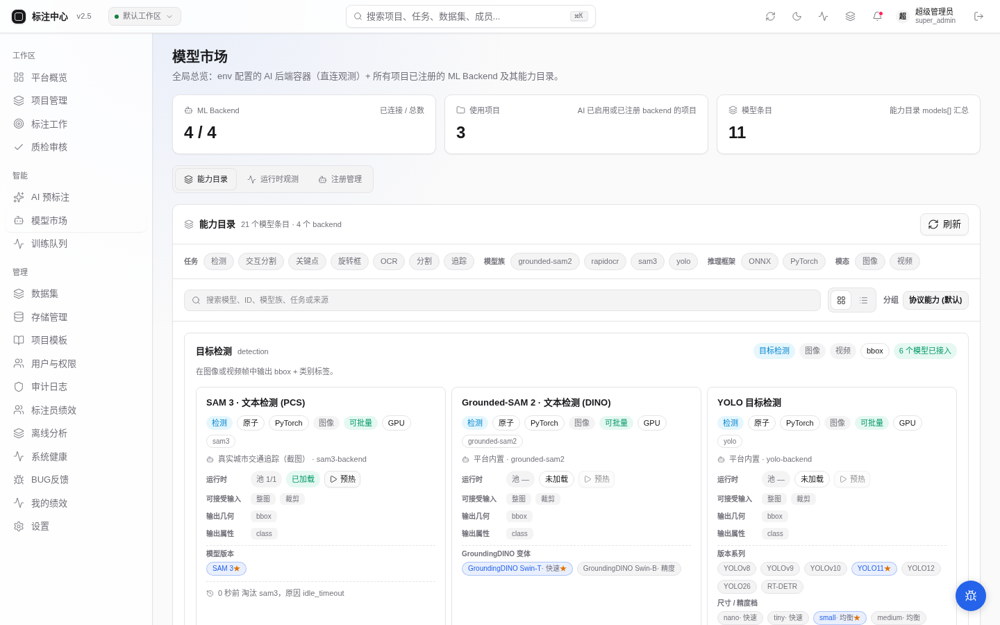

# 模型市场（/model-market）

模型市场把 ML Backend 能力目录、运行时观测、注册管理集中到同一个页面；项目管理员使用只读能力视图，超级管理员负责全局运行时与注册管理。

## 目的

跨项目纵览所有 ML Backend 与模型能力。从这里可以一站式：

- 按 model 条目检索能力目录
- 超管查看注册 backend 与未注册容器的实时健康 / GPU / pool 状态
- 超管对注册 backend 执行健康检查、卸载、预热
- 超管全局新增 / 编辑 / 删除 backend，并查看各项目对它的启用状态

## 主要视图

超级管理员看到三段切换：**能力目录 / 运行时观测 / 注册管理**；项目管理员只看到能力目录和只读注册管理。当前视图写入 `?tab=catalog|runtime|registry`，可直接分享深链。

> **按角色可见范围**：本页对超管与项目管理员开放，但内容按角色收敛。超管看到顶部统计卡与全部三段（能力目录 / 运行时观测 / 注册管理）。项目管理员**只看到能力目录 + 只读的注册管理**——顶部统计卡与「运行时观测」段隐藏（二者依赖 super_admin only 的全局 overview / observe 接口），能力目录也退到 `/instances` 单端点视图（协议卡 + model 卡，不含各项目运行时池富化，不再因拿不到 overview 而整块报错）。项目管理员对自己项目的 backend 启用仍在项目设置里做。

### 1. 能力目录

> 「能力目录」与 backend 注册解耦：默认按**协议能力 (task)** 分组渲染协议卡，无 backend 注册时仍完整展示协议层支持的全部能力 + 推荐 backend；详见 [ADR-0037](../../dev/adr/archive/0037-protocol-capability-catalog-decoupling)。

<!-- TODO IMAGE_CHECKLIST: images/superadmin/model-market/protocol-card-details.png — 能力目录协议卡 + ModelCard 详情态。 -->

能力目录默认按**协议能力 (task)** 分组：

- 始终渲染 9 张协议卡（detection / obb / segmentation / keypoint / classification / ocr / doc_layout / tracker / interactive_seg），数据来自 `GET /v1/ml-capabilities/protocol`（与 backend 注册无关）。
- 已注册 backend 的 model 按 `model.task` 字段挂载到对应卡片下；卡片标题旁显示「N 个模型已接入」徽标。
- 未挂任何 model 的协议卡显示「暂无接入」徽标，并列出**典型模型**与**推荐 backend**（含 GitHub 链接），CTA「去注册 backend」可一键跳到 `?tab=registry`。
- 零接入时顶部加 onboarding 横幅，强调「平台支持 9 类 AI 标注能力，当前还没有 backend 接入」。

已接入的 model 会复用统一的 ModelCard 展示：

- 顶部显示 task、原子 / 内置流程、infra、模态、模型族、交互式徽标，以及从 `resource_profile` 升级来的**设备**（GPU 等）与**可批量 / 交互·有状态**徽标。
- 「运行时」行显示当前 pool 尺寸、默认变体是否已加载，并提供可用时的预热按钮。
- 「可接受输入」区分整图、裁剪图、框提示、点提示；多阶段预标用它判断下游阶段能否接上游框。
- 「输出几何 / 输出属性」展示落库形态和可写属性，例如 bbox、polygon、text、class。属性优先取结构化 `output_attribute_schema` 的 label（更友好），backend 未报 schema 时回落到扁平 `output_attribute_types`。
- 「资源」行只展示设备 / batchable 之外的余项（如显存估算）；当前 backend 多数只报设备 / batchable（已在顶部徽标呈现），此时整行隐藏。变体区展示 series / size / SAM / DINO 等轴、显存估算、速度档和推荐项。
- 若 backend `/setup` 里 task、infra、prompt 或几何枚举不在平台受控词表内，卡片右上角会显示 `⚠ 协议 N`，hover 可看具体字段和值；这是诊断提示，不会阻断目录解析。

切换到「分组：backend / infra / 不分组」时进入 model-centric 视图（按 model 条目展开）。除了项目已启用的 backend，平台已知但未接入任何项目的内置 backend（如 docker-compose 自带的）也会在这里列出并标「平台内置」；仅当平台完全没有已知 backend 时才显示空态。

通用筛选：

- 卡片 / 列表切换；协议能力分组下列表按协议能力逐行展示，backend / infra / 不分组下列表按 model 条目展开。
- 搜索模型名、model id、模型族、task 中文标签和来源 backend；协议能力分组下，搜索同时过滤协议卡（命中 task label / summary / typical_models 的卡保留）。
- 与 task / model_family / infra / modality chips 过滤叠加。

### 2. 运行时观测

<!-- TODO(v0.14.18) IMAGE_CHECKLIST: images/superadmin/model-market-runtime-card.png — backend 卡片（GPU 显存 + 池状态 + 操作按钮） [manual] -->

运行时观测是 runtime-centric 视图（**仅超管可见**）。它以**全局注册 backend** 为主键展示。`ML_BACKEND_OBSERVE_URLS` 返回的实时指标按 URL join 到注册 backend：

> **信任边界**：`/observe` 直连 `ML_BACKEND_OBSERVE_URLS` 里的地址探活，**不带应用层鉴权**——它假定这些地址在可信内网、免鉴权可达。请勿把该变量指向可从不受信网络到达的地址；需要鉴权的 backend 应通过「注册管理」注册（注册项携带 `auth_method` / `auth_token`，走鉴权链路），而非只靠裸 observe URL。

- 每个全局注册 backend 一行（URL 全局唯一），实时指标取对应容器值。
- 没有任何项目启用的注册 backend 仍会出现；全局健康检查和卸载操作不依赖项目绑定。
- 观测 URL 没有匹配任何注册 backend 时，会进入「未注册容器」分组，只支持直连 observe / smoke-test。
- 已注册 backend 可执行健康检查、卸载、默认预热，并展示变体面板。
- 未注册容器会显示其自报的 `supported_trackers` 与变体目录；若只暴露通用 `supported_variants`，当前只读展示，「试启动」保持 disabled，等待 backend 实现通用 warm 接口。
- 同一 backend URL 被多个项目启用时，运行时观测按 URL 聚合为一张卡，并列出所有启用项目，避免把同一物理容器重复计数。
- CPU fallback 与 GPU residency 可同时出现；页面会分开显示。只有新鲜且完整的 `residency.gpu_loaded=false` 才能证明空驻留，`compute=cpu` 不能单独证明显存已释放。
- 卸载、预热和重载成功只表示请求被 backend 接受；是否真正释放或驻留以后续 `residency` 为准。

### 3. 注册管理

注册管理是**全局注册表**的中心，分两块：上方是跨项目共享的 backend 扁平列表，下方是只读的「项目启用概览」。每个物理 backend 全局只有一行，注册一次、所有项目共享。

**全局注册表**（扁平列表）：

| 列 | 说明 |
|---|---|
| 名称 | backend 名称 |
| URL | 注册地址（全局唯一） |
| 来源 | `manual`（超管手动注册）/ `env`（env 配置启动后自动注册） |
| 类型 | 交互式 / 批量；本地最大并发 chip（`extra_params.max_concurrency`，缺省不显示） |
| GPU 配置 | 物理资源、预算、desired → effective mode 与 blocker / 弹性超售诊断 |
| 状态 | 注册记录最近状态与错误片段 |
| 最近检查 | 上次健康检查时间 |
| 操作 | 编辑 / 删除 / 健康检查（**仅超管**） |

对应后端端点：`POST /admin/ml-integrations/registry`（新增）、`PUT /admin/ml-integrations/registry/:id`（编辑）、`DELETE /admin/ml-integrations/registry/:id`（删除）、`POST /admin/ml-integrations/registry/:id/health`（健康检查）。

**项目启用概览**（**仅超管可见 · 只读**）：列出每个启用了 AI 的项目，以及它当前启用了哪些 backend（已启用 AI 但未启用任何 backend 的项目会标黄提示），每行提供「打开项目设置 →」入口。这里只看不改——项目启用本身在项目设置里做（详见 [启用 ML 后端](../projects/ml-backends)）。

> **角色门控**：超管可在全局注册表做增删改查 + 健康检查，并看到项目启用概览。项目管理员进本 tab 时全局注册表为**只读**（隐藏注册 / 编辑 / 删除），且看不到项目启用概览与 GPU 物理资源、预算、residency / UUID 等拓扑字段——项目管理员只在自己的项目设置里勾选启用 backend。

运行时指标（GPU、cache、model_version、pool）和生命周期动作已经迁到「运行时观测」。

## 视频追踪观测与任务监控

模型市场区分**图像推理**与**视频追踪**两种模态。

### 观测 / 预热面板按模态拆分

backend 的变体面板拆成两组：

- **图像推理变体**：SAM + DINO 双下拉，预热加载到图片池（grounded-sam2 图片 predictor）。预热走 `POST /{backend_id}/reload`（含 `task_type` 可选体）或 `POST /{backend_id}/warmup`（协议 v2 §4.4，backend 声明 `warmup_endpoint=true` 时启用）。
- **视频追踪权重**：video tracker 不使用 DINO，预热加载到**独立 video 池**（`POST /reload` body 携带 `task_type=video`）。有多档视频权重时显示 SAM 下拉；只有单一视频模型时显示独立权重条目和预热按钮，不制造无意义下拉。
- 分组是否显示优先读取健康检查落库的 `health_meta.capabilities.modalities`；纯图像 backend 不显示视频组，纯视频 backend 不显示图像组。未健康检查过、没有 modalities 快照时，页面回落到 `/setup` enum / tracker 判断，避免把未知能力的 backend 误隐藏。

> ⚠️ **常见误区**：视频 tracker 用的是独立 `_video_pool`，不能只预热图片池。视频组的预热会走 `POST /reload` 并传 `task_type=video`，正确加载 video 池。
>
> 若 backend 自报支持视频但未上报 `video_pool`（旧版本），视频组会降级提示，不影响图像组。

### 视频追踪任务监控

视频追踪任务监控已并入 [`/ai-pre/jobs`](../projects/ai-preannotate) 的「视频」模态 tab；图像 tab 由 `async_jobs(kind=batch_predict|prediction_retry)` 提供，视频 tab 由 `async_jobs(kind=video_tracker)` 提供。旧链接 `/model-market/video-jobs` 自动跳转到 `/ai-pre/jobs?tab=video`。**模型市场只保留后端 / 显存池健康观测**（上面的模态拆分预热面板），任务（job）历史归 ai-pre。

<!-- 注：「能力目录」完整双层架构已在 ## 1. 能力目录 节描述，此处不再重复。 -->
<!-- 如需实例层细节请参见 ADR-0037 与 ML Backend 协议文档。 -->

## 新建 / 编辑 Backend

点「注册管理」右上角的 **「注册 backend」** 即可新增一条全局 backend 记录；点某行的「编辑」可改其 URL / 名称 / 鉴权 / GPU 资源与预算 / 驱逐优先级 / `max_concurrency` 及其他 `extra_params`。注册表单字段与校验详见 [ML Backend 注册](./ml-backend-registry)。env 配置的 backend 启动后会自动出现在列表里（来源 `env`），无需手动注册。

## 删除

「注册管理」列表支持逐条删除全局 backend（**仅超管**）。删除会从注册表移除该记录，所有引用它的项目 `ml_backend_id` 自动置空（ON DELETE SET NULL）。若有正在运行的预测 job 会返回 `HTTP 409` 阻断。项目管理员若只想让某 backend 对本项目失效，应在项目设置取消勾选启用，而非删除。删除规则详见 [ML Backend 注册](./ml-backend-registry#删除)。

## 路由历史

| 旧路由 | 新路由 | 跳转方式 |
|---|---|---|
| `/model-market/video-jobs` | `/ai-pre/jobs?tab=video` | 前端 `<Navigate replace>`（客户端跳转，非 HTTP 301） |
| `/model-market?tab=failed`（旧书签） | `/ai-pre/jobs?status=failed` | 前端检测 `tab=failed` 自动跳转 |

> `/ml-integrations` 路由**没有**配置 301 重定向，该旧路径已废弃（无路由匹配则 404）。`/admin/ml-integrations/*` 是后端 API 路径（仍在使用），与前端页面路由不同。
