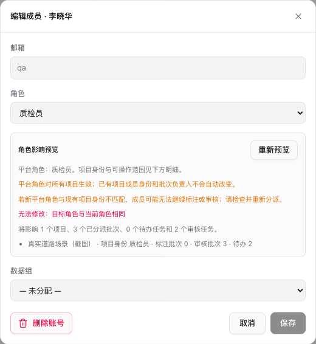
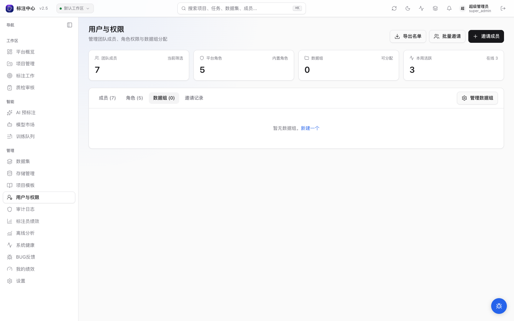

# 用户与权限管理

通过侧边栏 **管理 → 用户与权限** 进入用户管理（`/users`）。本页同时承载用户、用户组、邀请、API Key、权限矩阵等管理入口。

## 角色概览

平台把**账号身份（平台角色）**与**项目职责（项目角色）**分开。账号管理里的角色是平台角色（`apps/web/src/constants/roles.ts`，显示名取自 `ROLE_LABELS`）：

| 角色值          | 显示名     | 主要能力                                                                   |
| --------------- | ---------- | -------------------------------------------------------------------------- |
| `super_admin`   | 超级管理员 | 全平台所有功能；唯一可查看 `/admin/health`、做系统设置、查看全平台审计日志 |
| `project_admin` | 项目管理员 | 创建/管理项目；可见并管理全部启用的员工（含未分配），超级管理员对其只读    |
| `employee`      | 员工       | 参与项目工作，具体职责由各项目的项目角色决定；可在不同项目承担不同角色     |
| `viewer`        | 观察者     | 只看不动；常用于客户演示账号，加入项目时只能是只读项目角色                 |

权限映射在 `ROLE_PERMISSIONS`（`apps/web/src/constants/permissions.ts`）。

### 员工与项目角色

项目职责不再是账号级全局角色，而是**每个项目一个项目角色**：`annotator`（标注员）/ `reviewer`（质检员）/ `viewer`（观察者）。同一个员工可以在 A 项目标注、B 项目质检、C 项目只读观察。项目角色在 **项目设置 → 成员** 中分配与变更，与账号的平台角色相互独立：

- 平台 `viewer` 账号加入项目时只能是只读项目角色，不会被邀请静默升级为员工；员工可在不同项目拥有不同职责，但同一项目内只有一个角色。
- 邀请时可同时指定平台角色与（可选的）目标项目角色，落库时两者分别保存；账号角色值 `annotator` / `reviewer` 已被 `employee` 取代，仅历史记录保留。
- 变更成员项目角色需要先预检（阻塞项、受影响任务 / 批次 / 锁与接替人），再按预览版本原子提交；有未完成工作或活动认领时必须显式交接。详见 [项目成员与角色](../projects/)。
- 平台角色降级（含降为观察者）仅超级管理员可做，且不会级联改动其他项目的成员关系；合法跨项目混合角色不再被视为异常。

## 谁能编辑谁

**平台角色变更仅超级管理员可操作（含预览）**；项目管理员不通过账号管理改平台角色，而是在 **项目设置 → 成员** 中管理该项目的项目角色。`EditUserModal` 因此只对超级管理员开放平台角色选择：

|                        | 平台角色变更 | 编辑 / 重置密码 / 数据组 | 项目成员角色   |
| ---------------------- | ------------ | ------------------------ | -------------- |
| **super_admin 操作**   | ✅ 全部      | ✅                       | ✅             |
| **project_admin 操作** | ❌           | ✅（可见范围内）         | ✅（所管项目） |

> 不能修改自己的平台角色，或把最后一位启用超管降级。降级前会阻塞不兼容的成员关系、项目所有权或未完成工作，且不级联改动其他项目。

员工账号（平台角色 `employee`）属于平台级人员，项目管理员可对可见范围内**所有启用**的员工账号执行编辑、重置密码与分配数据组，无论其是否已加入自己的项目，与「用户与权限」列表、成员分配入口的可见范围一致。涉及工作交接的生命周期操作（离职处理、停用、删除账号）额外要求目标的关联项目（成员关系、批次分派、任务与锁，含已移出成员关系但仍持有他人项目任务的账号）全部落在项目管理员自己的项目内：未分配且仍启用的账号可直接处理；跨项目的账号仍须由超级管理员处理，接口会返回明确原因，列表行也会隐藏离职 / 删除入口，只保留编辑与重置密码。删除账号时的转交接收人必须是每个待转交任务所在项目的**合格成员**。已停用且未加入任何项目的账号不在项目管理员的操作范围内（离职处理会返回 403），仍由超级管理员处理。启用的超级管理员对所有项目管理员只读（行内操作禁用，提示「仅可查看：超级管理员账号」），便于联系核对但不可操作。已停用账号、其他项目管理员和观察者不在可见与可操作范围内。合法的跨项目混合职责（如 A 标注 / B 质检）不再被判为账号异常或阻塞生命周期操作。

## 列表与筛选

账号状态与搜索常驻工具栏；项目、角色和数据组收在漏斗 **筛选** 面板中，修改后即时生效，关闭后仍显示可移除的条件摘要。**清除附加条件** 保留账号状态与搜索。邀请页同样保留状态快捷项，范围、项目和角色在独立面板中；**恢复默认范围** 回到「我邀请的」并移除项目/角色，不清空邀请状态与搜索。详见 [使用筛选](../reference/filtering.md)。

主区域使用紧凑成员表格，每页 25 人：

- 顶部 4 张统计卡：**团队成员**（当前筛选总数）/ **平台角色** / **数据组** / **本周活跃**
- Tab：`成员 (N)` / `角色 (N)` / `数据组 (N)` / `邀请记录`
- 账号状态筛选默认显示**启用账号**，也可切换到**已停用**或**全部账号**；状态筛选由服务端执行
- 按项目、数据组、平台角色、账号状态和姓名/邮箱组合筛选，列表、成员统计和导出使用相同条件与授权范围
- 可见范围：超级管理员可见全部账号；项目管理员可见本人、所管项目成员、全部启用的标注员 / 质检员（含未加入任何项目的）和启用的超级管理员。按项目筛选时仍只返回所管项目的成员，不会借筛选探知其他项目的成员构成
- 页码和总数来自服务端，翻页保留筛选；勾选可跨页累计，修改筛选后清空选择
- 筛选和页码保存在地址中，刷新及浏览器前进后退可恢复；搜索在停止输入 250ms 后查询，保留姓名中的空格
- 每行显示角色、数据组和账号状态，行末提供可用操作
- 已停用账号显示停用类型、停用时间和原因；紧急停用账号可从列表继续进入交接预览

## 邀请新用户

点击右上角 **邀请成员** 按钮打开 `InviteUserModal`：

1. 填写**邮箱** + **平台角色**（无姓名字段，姓名由被邀请人注册时自填）。项目管理员可邀请员工或观察者；超级管理员可选择全部平台角色
2. 可选填写**数据组**（可从已有数据组中选择；接受邀请时建立正式成员关系，若手动填写的新组名不存在则自动创建）
3. 可选选择**目标项目**与**项目角色**（标注员 / 质检员 / 观察者）。平台角色与项目角色分别保存：接受邀请时会同时建立项目成员关系，项目角色只表达该项目内的职责；项目管理员和超级管理员仍是平台角色，不会被转换成项目角色
4. 点击确认后生成一次性邀请链接（落库到 `user_invitations` 表），**页面仅显示一次明文链接**。可复制完整链接，也可明确点击「发送邀请邮件」，邮件使用已保存的 SMTP 配置；发送失败可重试，当前链接保持有效
5. 链接有效期默认 7 天（由 `invitation_ttl_days` 系统设置控制）

邀请记录可在 **邀请记录** tab 中跟踪、重发、撤销，并显示目标项目。撤销后原链接立即失效；项目管理员只能管理自己创建的邀请，超级管理员可以管理全部邀请。创建邀请的额度按邀请人独立计算滚动 24 小时上限。

被邀请人打开完整链接后可创建新账号；新账号、数据组和目标项目成员关系在同一事务中写入。已有账号必须使用邀请邮箱登录，再明确点击「确认并加入」，平台不会按邮箱静默合并账号，也不会修改已有全局角色。若项目已删除、项目管理员已转移项目、邀请人被停用或邀请已撤销/过期，接受会失败并显示原因。

接受完成页会说明目标项目的当前负责人，以及是否已有分派给该成员的活动批次。只有确实有可见活动批次时才显示「开始工作」；仅加入项目不会被描述成已经拥有激活批次。

新账号自动登录后会停留在接受完成页，可先确认项目和分派状态，再打开项目。

## 批量邀请与分组

「批量邀请」接受每行一个邮箱，也支持空格、逗号和分号。重复地址会合并；可选择角色、现有数据组和目标项目，单次最多 500 条。点击「预览邀请」先检查每条邮箱、权限、项目和配额，确认后只创建可邀请条目。结果逐项显示成功、失败和可复制链接；「仅重试失败项」保留此前成功记录，不重复创建成功邀请。

选择成员后点击「批量分配数据组」，预览当前组与目标组。确认后显示每人的结果，被阻止的成员保持不变；重试仅处理允许重试的失败项，单次最多 500 人。

邀请记录支持项目、角色、状态、邀请人范围和搜索筛选，以及分页和导出。统计和导出使用同一筛选。「邮件」发送当前邀请；「新链接」会使旧链接失效并显示新的完整链接供复制。

成员与邀请分别记住各自的条件，切换页签不会互相覆盖。邀请默认查看本人发出的全部状态记录；导出使用已应用条件，账号切换后不会下载上一账号的迟到结果。

## 编辑用户

点击成员行末的编辑按钮，可查看平台角色和各项目身份，调整角色或所属数据组：

- 切换 **角色**（受 actor.role × target.role 矩阵限制，邮箱只读不可改）
- 更改所属**数据组**

角色影响预览显示项目身份、已分派批次和任务负载；范围外项目只展示数量，不披露名称。修改平台角色对所有项目生效，既有项目成员身份和负责人不会自动跟随变化。保存前需等当前目标角色的预览完成，并处理阻止项。

### 离职交接、停用与恢复

成员列表中的 **离职处理** 入口会先读取一份带版本号的预览，展示该用户在每个项目中的负责人、标注员和审核员责任、相关批次、任务状态、锁以及 API Key 名称和前缀。页面不会显示或重新生成密钥明文。

- **正常离职交接**：按项目、按责任角色分别选择预览中列出的启用合格接收人；确认后先转移项目责任、批次、任务和锁，再停用账号
- **紧急停用**：不要求存在合格接收人，即刻阻断登录并吊销 API Key；无法交接的责任会出现在结果中的后续交接清单
- 预览版本或接收人资格发生变化时，服务端返回 409，页面会刷新预览并清空旧选择，必须重新确认后才能提交
- 选择**已停用**筛选可以查看可恢复停用和紧急停用账号；只有 `suspended` / `emergency_suspended` 可以恢复。恢复只恢复登录资格，已转交的工作和已吊销的 API Key 不会自动恢复
- `deleted` / `historical_unknown` 账号不能恢复或再次交接

恢复账号时可填写原因，页面会记录操作并刷新用户列表。停用和恢复都保留历史标注、审核和审计记录。

::: warning 停用 ≠ 删除
离职处理产生的是可审计的账号停用；平台的**软删除**（`DELETE /api/v1/users/{user_id}`）仍是独立操作。启用账号删除若仍有待处理任务会返回 409，需先按提示转交；已停用账号不会显示删除入口。停用和删除都保留标注、审核历史（通过 `ON DELETE SET NULL` 保留外键引用）。
:::

### 管理员重置密码

超级管理员可通过 `POST /api/v1/users/{user_id}/admin-reset-password` 为他人生成临时密码，记录 `user.password_admin_reset` 审计事件。前端在成员行的操作区中提供此入口。

## 用户组

用户组是给项目和 batch 派题用的批量选择器：

- 在 **数据组** tab 中创建组、添加成员
- 邀请时可直接指定 `group_name` 将新用户加入组
- 批次分配时按组整体分派

> 注意：**项目设置 → 成员** 里添加成员是逐个添加，不支持「一次添加整个组」；批次分配也是按 group 名称筛选再选择成员，而非将整个 group 直接指定为批次负责人。

组成员变化会即时影响新派题，已发出的 task 不会重新分配。

## API Key

每个用户都可以为自己生成 API Key（受角色权限继承）。超管可以为他人生成、撤销 API Key：

- 成员行的操作区 → **API Keys**
- 创建时仅返回明文 token 一次，前端应立即复制；token 格式为 `ak_` 前缀 + 32 字符 URL-safe base64
- **权限 scope**：可勾选「完全访问（full-access）」一键全权，或选细分 scope（标注读/写、数据集读、预测读）限制范围；scope 自 v0.15.11 起在路由层真正强制（缺权限 → 403）
- **有效期**：创建时可选 30/90/365 天 / 永不过期 / 自定义天数；过期后认证失败
- **轮换 / 编辑**：列表行可轮换（换新明文、旧的立即失效）或编辑名称 / scope / 有效期
- 调用时通过标准 HTTP Bearer 头携带：`Authorization: Bearer ak_xxxxx`

详细 API 见 [认证](../../api/guides/auth#api-key)。

## 权限矩阵预览

侧边栏 **用户与权限** → **角色** tab 展示 `PERMISSION_GROUPS × ROLE_PERMISSIONS` 表，便于核对。实际权限名（来自 `apps/web/src/constants/permissions.ts`）：

- 项目管理：`project.create` / `project.edit` / `project.delete` / `project.transfer` / `project.export`
- 任务：`task.assign` / `task.annotate` / `task.review` / `task.approve` / `task.reject`
- 用户：`user.list` / `user.invite` / `user.edit-role` / `user.export`
- 数据：`dataset.create` / `dataset.delete` / `dataset.link`
- 安全与模型：`audit.view` / `ml-backend.manage` / `storage.manage` / `settings.edit`

## 后端 API 与代码

- 路由 `apps/api/app/api/v1/users.py`（用户 CRUD）、`apps/api/app/api/v1/groups.py`（用户组）、`apps/api/app/api/v1/invitations.py`（邀请）、`apps/api/app/api/v1/api_keys.py`（API Key）
- 前端组件位于 `apps/web/src/components/users/`
