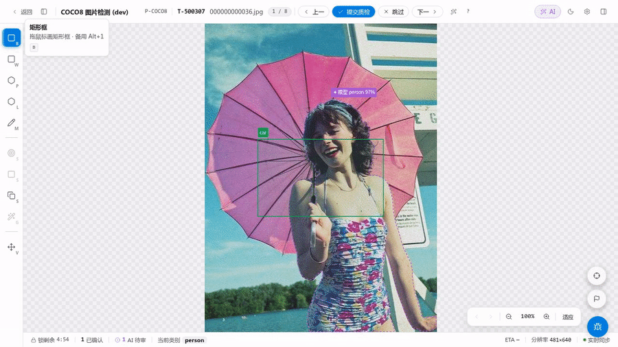

# Bbox 标注

矩形框（轴对齐 Bounding Box）是最常用的目标框，适合标注与图像坐标轴对齐的物体。

## 操作

1. 按 `B` 切到矩形工具
2. 在画布上按下鼠标 → 拖动 → 松开，即生成一个矩形
3. 右侧属性面板选择类别

## 编辑已有 Bbox

- 单击 → 选中（出现 8 个控制手柄：4 角 + 4 边）
- 拖角或拖边 → 缩放
- 拖中心 → 移动

## 多选与批量操作

- `Shift + 单击` 画布中的框可叠加多选；`Ctrl + A` 全选当前帧全部人工框。
- 多选后，右侧属性面板顶部浮条可**批量改类别**；右键菜单可批量删除、锁定、隐藏。

## 常见错误

- **画框太小**：归一化宽或高低于 0.5%（即 `w < 0.005` 或 `h < 0.005`）的框会被拦截，提示重画
- **超出图像**：会被自动 clip 到图像范围内
- **类别未选**：提交前必须为每个 Bbox 指定类别

## IoU 与 AI 去重高亮

工作台内部使用 IoU（Intersection over Union）做 **AI 候选去重**：当一个 AI 候选框与已有的人工框重合度超过项目设置的去重阈值（默认 0.7）时，该候选框会在列表中标记为「已被覆盖」并半透显示，`全部采纳` 时自动跳过这些候选，防止重复落库。

> 注意：IoU 在此是**去重/高亮**工具，不是审核评分。审核退回依据的是审核员的人工判断，不存在与「基准框」比对 IoU 的评分环节。
