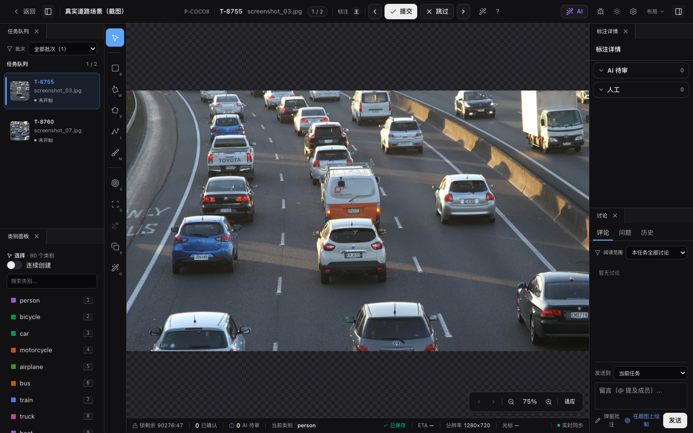
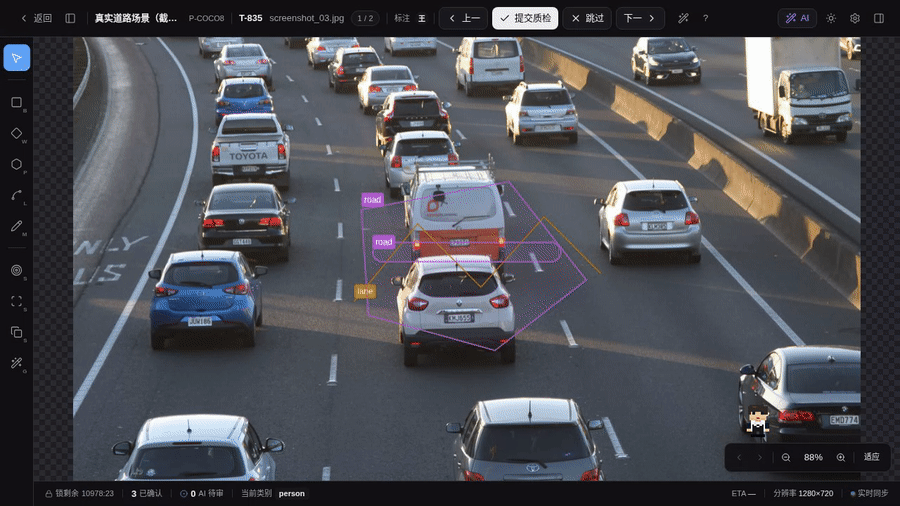

# 标注工作台 — 界面与快捷键

进入工作台前，标注页（`/annotate`）的着陆态是按项目分组的**批次卡片网格**：每张卡含批次封面缩略图、状态与进度（标注中 / 送审 / 通过），点卡即进入该批次的任务队列；左侧栏顶部「全部待标任务」可跨批次平铺全部待标任务，进入某批次后标题区「返回全部批次」回到卡片概览。

工作台是日常标注的主要工作场所，由以下区域组成：

工具：`V` 选择（点选 / 移动已有标注与预标注，默认工具，`Esc` 回退到它）· `B` 矩形 · `W` 旋转框 (OBB) · `P` 多边形 · `L` 折线 · `F` 关键点。平移画布用 `Space` + 拖拽或右键拖拽。完整快捷键列表见下方（按工作台代码 SoT 自动生成）。

图片和视频任务使用同一个工作台外壳：左侧任务队列、工具栏、右侧属性 / AI 面板、底部状态栏保持一致，中间 Stage 会按任务类型切换。

- 图片任务显示图像画布，支持 bbox、旋转框 (OBB)、多边形、折线、关键点 (COCO 范式骨骼)、SAM、AI 候选采纳和画布批注；polygon 可用 [Mask 笔刷编辑器](./mask-brush) 像素级精修，也可多选同类别 polygon / multi_polygon 后合并。
- 视频任务切到视频时间轴视图，支持单帧矩形框 / 多边形 / 折线、跨帧轨迹、关键帧与轨迹操作，交互式 AI 工具也可用于单帧。详见 [视频追踪标注](./video-track)。
- 3D 点云任务切到 Three.js 工作台：可旋转 / 平移 / 缩放查看点云、按高度上色或经标定的相机图 RGB 上色，在主 3D 视图绘制并编辑 `lidar_box_3d` 框（gizmo W/E/R 平移 / 转 Z / 缩放 + 数值面板补齐三轴朝向），也可用 `point_mask_3d` 分割工具做矩形 / 套索 / 多边形选点并增删编辑点集；三正交视图浮层可在 3D 画布内拖动、调整尺寸、折叠并记住位置，内部支持拖边 / 拖角 / 拖方向线精修；3D 框经标定实时投影到悬浮在主视图四周的相机面板，3D↔2D 双向选中，相机面板也可拖动避让。详见 [3D 立体框标注](./3d-box)。

顶部 ⚙ 菜单里可以打开“隐藏孤儿标注”。孤儿标注指项目设置中已删除当前类别定义、但历史标注仍保留旧 `class_name` 的数据；开关打开后画布和右侧人工列表会同步隐藏，关闭时列表行会以“已删除”标记提示。

## 布局偏好与浮窗

工作台会按当前用户记住布局偏好：左 / 右侧栏的开合、左右栏宽度、任务队列 / 类别面板 / 标注详情 / 讨论 Issue 面板的浮窗位置尺寸、3D 三视图浮层位置尺寸和折叠态都会同步到账号偏好。换设备或重新登录后会恢复；离线或未登录时继续使用本机 localStorage 兜底。

左侧任务队列、类别面板，以及右侧「标注详情」「讨论 / Issue」面板都有分离按钮。点击后对应区块会脱离侧栏变成同窗口浮窗，侧栏默认收起，中心 Stage 自动吃满释放出的空间。四个浮窗使用一致的最小尺寸，可拖动标题栏移动，拖右下角调整尺寸；顶栏按钮可合并回侧栏，或关闭并保持侧栏收起。

再次展开侧栏时，工作台只显示仍嵌入的区块，不会把已经分离的浮窗自动合并回去。合并回侧栏只恢复嵌入状态，不主动展开侧栏；若某一侧的两个区块都已分离，展开 / 收起该侧栏不会产生可见变化。

## 任务队列里的状态标签

<!-- TODO(v0.14.18) IMAGE_CHECKLIST: images/workbench/task-status-labels.png — 六种状态标签竖列 -->

左侧任务队列每条任务会显示一个状态标签，反映这条任务标到了哪一步：

| 标签 | 含义 |
|---|---|
| 未开始 | 还没有任何人工标注，也没有 AI 预标结果 |
| AI 已预标 | 有 AI 预标候选待你确认，但还没开始人工标注 |
| 进行中 | 已经有人工标注，尚未提交审核 |
| 待审核 | 已提交，等待审核员复核 |
| 待重做 | 审核被退回，需要修改后重新提交 |
| 已完成 | 审核通过 |

“未开始 / AI 已预标 / 进行中”反映的是当前标注进度（有没有标注、有没有 AI 候选）；“待审核 / 待重做 / 已完成”反映的是审核流程所处的阶段。

## 选择与批量操作

- 图片任务：`Shift + 点击`画布里的人工框，或右侧「人工」列表条目，可叠加多选；`Ctrl + A` 会全选当前帧人工框。AI 待审候选保持单选，需要先采纳后才会进入人工框批量选择。
- 视频任务：右侧轨迹列表支持 `Shift` / `Cmd` / `Ctrl + 点击`多选轨迹，批量改类、删除、显隐和锁定都只作用于轨迹列表里的多选结果。

## 审阅键盘流转

<!-- TODO IMAGE_CHECKLIST: images/workbench/review-two-level-cycle.png — 两级循环示意 [manual] -->
<!-- TODO IMAGE_CHECKLIST: images/workbench/review-auto-advance.gif — 决策后自动前进 [manual] -->

从 AI 结果接管、逐个采纳 / 拒绝时可全程键盘操作（图片与视频 2D 工作台通用）：

- **两级循环**：`Tab` / `Shift+Tab` 在**同类**对象间流转（AI 待审 / 人工 / 轨迹，按当前选中类循环）；`` ` `` / ``Shift+` `` **跨类**跳到下 / 上一类的首个对象（AI 待审 → 人工 → 轨迹）。
- **决策后自动前进**（设置项，默认开）：`A` / `D` 采纳 / 拒绝 AI 候选后，选中自动推进到下一个待决对象，连续审阅无需重新点选。
- **选中自动聚焦**（设置项，默认关）：键盘循环或点选时，若对象在画布外或过小，自动平移居中并适度放大；关闭则只移动选中、不动视口。

两项开关都在设置抽屉，见[工作台设置](./settings)。

## 右键菜单

- 图片任务：选中人工标注后，右键轻点 bbox、旋转框、多边形、折线或关键点实例，可直接改类、锁定 / 隐藏、调整层级、复制 / 粘贴或删除；同类别 polygon / multi_polygon 多选时可合并。（遮挡不再是内置状态位，改为属性 schema 的「遮挡样式」开关，详见[项目设置 · 工具维度类别 / 属性](../projects/#工具维度类别-属性)。）
- 视频任务：右键轻点当前帧的轨迹框可打开轨迹菜单；右键轻点单帧 `video_bbox` 可直接改类、删除。若当前已多选多个同类单帧框，还可从右键菜单直接聚合为轨迹。
- 右键按住拖拽仍然是平移画布，不会弹出菜单。关键点**绘制中**右键仍是「跳过当前节点」，只有实例已经提交并被选中后，右键才会打开通用菜单。

## 完整快捷键

> 真值来源：`apps/web/src/pages/Workbench/state/hotkeys.ts`。下表由 `docs-site/scripts/generate-hotkeys.mjs` 在每次 docs build 前自动重生成，与代码必然一致。

在工作台内按 `?` 随时打开「键盘快捷键」面板，支持按动作 / 按键搜索，也可按使用频率排序：

<!--@include: ./hotkeys.generated.md-->

## 数据持久化与离线队列

工作台采用**即时保存**策略：每次标注操作（新增、编辑、删除）都即时通过 API 写入服务端；不存在 30 秒定时器。

当网络断开或后端返回 5xx 时，操作会进入**IndexedDB 离线队列**（`anno.offline-queue.v1`），网络恢复后自动顺序回放（`drain`），多标签页通过 `BroadcastChannel` 同步队列状态。底部状态栏的离线图标可展开「离线队列抽屉」查看待回放的操作条目，并支持逐条重试。

**Canvas 草稿**（画布批注绘制中尚未提交的笔触）以不同机制保留：活跃笔触写入 `sessionStorage`，TTL 5 分钟；刷新或意外关闭时浏览器原生确认弹窗阻止离开。

## AI 预标注

如果项目开启 AI 预标注，进入任务时已有候选框：

- 候选标签会显示来源：`模型` 表示 ML backend 预标，`导入` 表示外部文件导入的预测。
- 右侧「AI 待审」列表的「来源」开关可隐藏 / 恢复 `模型`、`导入` 两类候选；隐藏后画布和列表都会同步过滤，`全部采纳` 也只作用于当前可见候选。
- 选中候选 → 修正位置/类别 → `A` 采纳。
- 误识别 → `D` 驳回。
- 漏标 → 切换工具自行标注。

人工标注仍在「人工」分组中展示；采纳预测后会进入人工标注列表，并保留 AI 采纳来源标识。

选中单个 AI 候选时，画布旁会浮出**选中信息卡**：顶部按置信度阈值着色显示大置信度条与模型来源 / 候选序号（识别到 OCR 文本也会一并列出），下方是结构化几何指标，底部直接提供采纳 / 精修 / 忽略动作，无需回到右侧列表。选中人工框时卡片同样浮出，承载改类 / 锁定 / 隐藏 / 删除与几何指标（人工框不显示置信度）。

画布右上的 **当前题 AI** 面板是单图推理入口：调好模型 / 参数后点 **运行当前题**，只对正在标的这一张图跑一次预标，候选随即出现在「AI 待审」里。若项目在 [AI 预标注](../projects/#ai-预标注) 页保存过项目编排，面板会多出 **运行当前题（按项目编排 · N 阶段）**，对当前图按那条多阶段编排跑完整流水线（检测 → 分类 → 写属性），产出带属性的候选可在选中信息卡的「属性审阅」区先改属性、再从列表行点采纳，改动会随采纳一并落库（画布贴框采纳仍走候选原值）。该面板只执行、不编辑编排——编排在 AI 预标注页定义保存。

交互式分割（SAM 点/框/Exemplar）的详细说明见 [AI 工具组](./sam-tool)；项目级 AI 预标（批量预标注与批次管理）见 [AI 预标注](../projects/#ai-预标注)。

## 二次推理（选中框 → 补属性 / 产子框）

选中一个**已落库的人工或已采纳标注**（非 AI 待审候选、非交互工具态、图片任务）时，画布顶部会浮出 **✦ 二次推理** 面板：把这个框当父框喂给下游模型，一次跑出缺失属性字段（如颜色 / 车型）或从中检出子物体（如车牌）。运行结果按项目 schema 补进选中框的 `attributes`，或作为**子框**挂到它下面，右栏「标注详情」和画布同步更新。参数（阈值、可选模型档位、开集文本 prompt）在浮层里改，按 backend 记忆到当前用户；文本 prompt 支持开集词表 / 自由输入。

面板默认常显。**不常跑二次推理**的用户可从三处一键关掉它，偏好跨设备存在服务端：

- 顶部设置抽屉 ⚙ → **二次推理面板** 开关（正门）
- 「标注详情」浮卡头部的 ✦ 图标 button（激活即打开中）
- 画布上标注的右键菜单 → **打开 / 关闭二次推理面板**

关闭后即便条件满足，面板也不再浮出；重新打开无需刷新。

## 属性溯源（✦ AI 徽标）

标注的属性表单里，凡是**来自 AI**（预标注采纳、二次推理补写、多阶段编排产出）的字段旁边会挂一枚极轻的 `✦ AI` 徽标，hover 显示写入这个值的具体模型。字段被人工改过后徽标随之消失（改回来即人工产物）。这是每个属性键（per-key）独立记录的溯源，同一个框可以「颜色是 AI 写、车型是人工改」共存。

## 父子标注（画布联动）

一层父子关系（如「车 → 车牌 / 车灯」）会在画布上给出两种呈现：

- **同胞高亮**：选中父框，它的所有直接子框在画布上以异色描边一起亮起，一眼看清归属；选中普通框（无子）无高亮。
- **Alt 拖动联动**：按住 `Alt` 拖父框主体时，子框按同样位移一起搬，一次撤销回到原位；不按 `Alt` 只搬父框（保留旧行为）。作用面限父框主体拖动，不与折线 / 关键点的 `Alt` 顶点交互冲突。当前 scope 为图片任务的 bbox 父框，视频 / 3D 与多边形父暂不联动。
