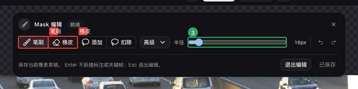
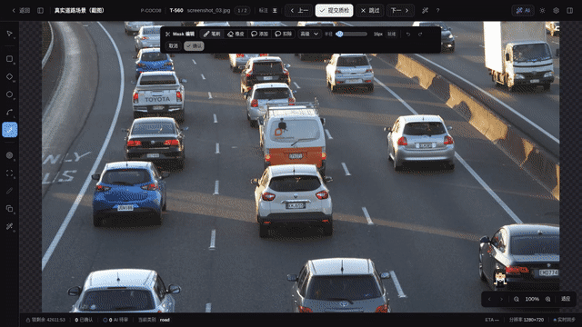

# Mask 像素编辑器

> 开启项目原生 Mask 能力后，图片与视频都保存逐像素 RLE；未开启的旧图片项目仍保留 polygon 兼容提交。

Mask 像素工具使用 `M` 键进入。它既可逐笔涂擦，也可用套索和区域填充一次修改连续区域。常见用法：

- **AI 候选过糙** —— 文本 / SmartBox 出来的 polygon 边缘偏移几个像素 → 一笔刷快速纠
- **已落库 polygon 局部修正** —— 不想重画整个轮廓，只想把右上角凸出去的几个像素擦掉
- **从零开始** —— 当 AI 没合适候选、polygon 工具又嫌点位太繁琐时，直接刷个 mask

图片工作台会先读取任务 Mask 能力。当部署总闸、项目开关与 `region` 工具均开启时，笔刷结果直接保存为
`raster_mask`；关闭时可只读渲染已有 Mask，或在后端明确允许时走旧 polygon 路径。能力加载失败不会被当成兼容许可。

工作台会按浏览器报告的设备内存选择缓存档位；无法识别时使用 Standard（128 MiB、同时加载 2 个）。正在
编辑或选中的 Mask 优先保留，其它对象无法进入硬预算时会显示“预算延后”，可在选中后或释放缓存后重试。
单个大 Mask 会先显示受限预览，但选择仍读取原始 RLE 的精确像素，不会把缩略图的近似像素当作真值。

## 图片任务的进入方式

1. **空白 mask（从零开始）**
   - 按 `M` 或工具栏点 Mask 图标 → 鼠标在画布上拖拽即开始画
   - 完成后按 `Enter` 提交；原生项目创建 `raster_mask`，兼容项目创建 polygon

2. **AI prediction polygon 精修**
   - 右侧 AIInspector 中找到 polygon 候选行 → 点该行的「精修」按钮
   - 自动进 mask 工具，buffer 从候选 polygon 初始化（已涂为红色 mask）
   - 用 `B`(笔刷)/`E`(橡皮) 修正 → `Enter` 提交
   - 原生提交前会显示 polygon → Mask 的面积、组件、孔洞和 XOR 报告，确认后用候选 label 落库

3. **SAM 候选精修**
   - SAM 工具（SmartPoint / SmartBox）出 polygon 候选后，**不要按 Enter 采纳**
   - 按 `R`，或点画布上候选附近的「✎ 精修」浮按钮
   - 进 mask 编辑 → `Enter` 提交 → 原 SAM 候选消失，新 Mask 或兼容 polygon 入库

4. **已落库 user polygon 精修**
   - 选中右侧侧栏的 polygon 行 → 点该行「精修」按钮（用户行 / AI 行都有）
   - mask 编辑 → `Enter` 提交：直接 **update** 原 annotation 的 geometry，保留 id、类别、属性、来源和层级

5. **已有 Raster Mask 再编辑**
   - 在列表或选中卡点「编辑 Mask」，工作台先加载已存 RLE，不会从空白 Buffer 覆盖真值
   - 保存顺序为读取、编辑、上传不可变内容、带版本条件更新 annotation；冲突或网络失败保留 Buffer 和笔画历史
   - 如果对象被擦空，提交时可选择删除对象、撤销本次擦空，或保持空白继续编辑
   - 也可保持选中对象并切到[智能笔迹](./sam-tool.md#智能笔迹smart-scribble在已存-mask-上做加减法)，用正负点、框或笔迹让 AI 原位精修；浏览器只提交 annotation ID 与版本

## 大画布图片

图片 Mask 最大支持 8192 像素单边和 67,108,864 总像素。任一边超过 4096 或总像素
超过 16,777,216 时，工作台自动进入分块模式：

- 笔刷、橡皮与套索加减只加载笔迹相交的区域，撤销、重做、保存和刷新后回读保持逐像素一致。
- 形态学只处理当前视口 ROI；工作台会自动读取核半径需要的外围像素，只把视口核心区写回。
- 区域填充、组件 / 孔洞、拆分 / 合并 / 非重叠、整图形态学与标注转换会明确禁用，
  不会偷偷回退到主线程扫描全图。
- 设备内存无法容纳当前可见分块时，画布保持只读预览并提示放大局部 ROI 或更换设备；
  已产生的脏分块与撤销历史不会因为后续准入失败而丢失。

大画布暂不从 polygon 整图栅格化进入精修；可直接新建空白 Mask，或编辑已有 Raster Mask。
视频 Mask 和交互式 AI 候选仍保持 4096 像素单边与 16,777,216 总像素边界。

## Mask 质检与对比

审核工作台的右侧讨论区包含独立的「Mask 质检」页签，不与人工 Issue 混用。页签顶部显示
当前任务的扫描状态、进度和问题数，可按状态、严重级别与规则筛选，也可对当前任务重新扫描。
问题范围可在“当前任务”和“整个项目”之间切换；项目范围按游标继续加载，不会把首批之外的问题静默丢弃。

点击一条问题后，工作台会依次切换任务、定位视频帧、选中标注并将问题区域缩放到可见范围。如果
当前 Mask 尚有未保存修改，切换仍会先走离开确认；任一定位阶段失败时保留问题选中态，可直接重试。

对比基线可选上一版本、Tracker 候选、当前浏览器内的 AI Mask 候选或邻近关键帧。存在多个与目标标注、
帧和任务匹配的 Tracker 候选时，可按任务 revision、实例和内容摘要明确选择。可在叠加、边界、
XOR、新增和移除五种模式之间切换，并查看两侧版本、来源、面积、IoU、Dice 与变化像素数。大图对比
只加载当前视口的分块；整图缩放时使用有界预览级别，放大后恢复精确像素分块。
对比激活时，参与对比的已提交 Mask、AI / Tracker 候选和未提交编辑缓冲都不会叠到
证据图层上；笔刷、套索和编辑快捷键也会暂时冻结。关闭对比后，原未提交缓冲仍可继续编辑。

当视频问题具有精确像素区域且选择了匹配的 Tracker 候选时，可使用“区域接受”或“区域拒绝”。
决定只作用于问题区域内的差异：区域外、其它帧和其它实例保持不变，仍可继续审阅。提交前会再次确认
问题版本、候选摘要、任务认领、标注 / 分段锁和已审区域；冲突时整次决定失败，不会留下部分像素。
人工关键帧不会通过这个入口被快捷覆盖。每次区域决定都会留下审核员、来源任务、版本、帧和区域摘要记录。

未解决的小孤岛、小孔洞和同类重叠问题可多选后打开“预览批量修复”。第一屏只做
dry-run，冻结问题、标注版本、精确像素范围和分片，并列出实际对象数、变化像素、原子分片与逐条跳过原因。
预览收据 15 分钟内有效；只有确认后才会异步写入，锁定对象、已审区域、人工关键帧或版本冲突项不会被强制覆盖。

批次部分失败时可重试未完成分片，已完成分片不会重复执行。成功分片的修复证据保留 7 天；期间可从批次面板回滚，
但只有当前标注版本仍等于该分片的修复后版本时才会恢复。修复后又经人工修改的对象会以版本冲突失败，不提供强制覆盖。

可在当前问题区域记录评论；问题、区域范围、视频帧、对比模式、两侧内容摘要和 Tracker 候选身份
会与评论一起保存。刷新后仍可按原模式重放可用证据；本地 AI 候选已消失或不可变内容已过期时会
明确报错，不会用当前内容冒充。评论较多时可继续加载后续页面。
标注版本已改变的问题显示为过期，仍可查看保留期内的对比证据，但不能改写问题状态；重新扫描会产生基于
当前版本的新证据。过期问题也不能新增区域评论，提交时服务端会再次核对问题与标注版本。

## 区域加减与操作预览

工具栏把像素编辑分为四类主工具：

- **笔刷 / 橡皮**：按下并拖动后直接写入当前 Buffer；可选圆形或方形硬边笔头。
- **套索添加 / 套索减去**：沿目标边缘拖动，松开后按 pixel-center 规则闭合并计算区域。
- **区域添加 / 区域减去**：在高级菜单中选择后点击画布，填充与落点相连的前景或背景区域；可切换 4 邻域或 8 邻域。

套索和区域填充先生成橙色预览，并显示变化像素数，不会立刻覆盖当前 Mask。点击「应用」或按 `Enter`
后才写入 Buffer，且整次操作只占一个撤销步骤；点击「取消预览」或按 `Esc` 只丢弃预览。再次按
`Esc` 才退出整个 Mask 编辑会话。

## 组件、孔洞与形态学

高级菜单还提供按像素真值工作的清理操作：

- **保留 / 删除命中组件**：先选择对应工具，再点击前景像素；组件使用当前 4 / 8 邻域设置，点击组件
  包围框里的背景不会误命中。
- **填充命中孔洞**：点击封闭背景区；接触画布边缘的背景不算孔洞。孔洞识别固定使用 4 邻域，不随
  组件连接规则变化。
- **按面积清理**：输入像素阈值后，可删除不大于阈值的小组件、填充不大于阈值的小孔洞，或填充全部孔洞。
- **形态学**：选择圆盘 / 方形 kernel 和 1–32px 半径后执行膨胀、腐蚀、开运算、闭运算；「边界平滑」
  固定执行闭运算再开运算。

这些操作都先显示变化像素、面积、组件数和孔洞数的前后对比。结果为空时，「应用预览」还会要求第二次
确认。复制命中组件或拆分全部组件会显示蓝色实例预览及来源 / 结果数量；实例预览不会用多次单对象保存
模拟提交。

### 实例拆分、复制、合并与严格非重叠

- **复制 / 拆分组件**：在当前 Mask 上生成蓝色实例预览，点击「原子提交」后才创建新对象。
- **合并 Mask**：在图片对象或视频 Mask 轨迹清单中使用 `Shift` 多选至少两个当前可见的同类
  Mask。图片可明确选择「替换来源」或「保留来源」；替换模式会二次确认将删除的实例。
  视频只在当前帧创建合并副本并保留源轨迹，不会因为单帧操作删除整条轨迹。
- **严格非重叠**：可选择只从同类实例扣除当前 Mask，或从当前媒体 / 帧的所有原生 Mask 扣除。
  预览会列出受影响对象；如果重叠对象已锁定，或视频对象会被擦成空帧，严格提交会被阻止。

原子提交会同时校验任务状态、范围成员、每个对象的版本、标注锁和视频分段锁。冲突时蓝色预览与
Buffer 都会保留；网络或服务暂时错误可用原幂等键「重试」，范围或版本冲突只提供「刷新范围」重算。只有服务端确认整批成功后，
工作台才会清除草稿并刷新标注。

超过一百万像素的区域操作会转到浏览器 Worker 计算，切题、切帧、退出编辑或再次发起操作时会取消旧任务；
迟到结果不会覆盖当前会话。

## Polygon 与 Mask 显式转换

选中卡和 Mask 高级菜单都可打开「标注转换中心」。图片或视频中选中多个同来源类型对象时，也可用同一对话框批量转换。转换先冻结来源版本和内容摘要，再显示 source / target、保留来源 / 替换来源、范围、逐对象像素面积、组件、孔洞、顶点、XOR 变化及损失原因。

- polygon / multi-polygon → Mask 按原图分辨率和 pixel-center 规则让全部外环与孔洞参与栅格化；低于像素分辨率的组件或孔洞若发生拓扑变化，报告会标记为有损。
- Mask → polygon / multi-polygon 追踪所有像素边界，不会只取最大外环。
- Mask → bbox 生成非空前景的紧致轴对齐框；报告会显示框内新增的背景像素，不会把它冒充旋转框。
- 视频单帧 polygon 或 polygon track 当前帧可转成只有该帧人工关键帧的 Mask 轨迹；polygon track 也可只转换全部可见关键帧。保持帧需要显式勾选「允许物化 held / 插值帧」。Mask 轨迹转 bbox 只派生当前帧。
- 默认「创建副本并保留来源」；选择「替换来源」或报告存在损失时必须二次确认。视频当前帧替换只抑制该帧，不会删除整条来源轨迹。

预览计划十分钟内有效，预览和取消都不写 Mask 内容、不占用上传配额。执行时服务端重新检查任务、分段和对象锁以及全部冻结版本，重算结果与报告一致后才写入内容；任一对象或报告漂移会使整批返回冲突，不会部分写入。计划过期后点「重新配置」生成新预览。

## 视频 Mask 轨迹

<!-- TODO IMAGE_CHECKLIST: images/mask-brush/video-mask-track-edit.gif — 视频 Mask 创建、保持帧编辑与关键帧物化全过程 [auto-gif] -->

在视频任务中按 `M` 或点击「Mask 轨迹」工具：

1. 没有选中 Mask 轨迹时，在当前帧落笔会从空白画布开始；确认后创建一条只有当前帧关键帧的 Mask 轨迹。
2. 选中已有 Mask 轨迹再进入工具，会加载当前帧解析到的 mask。若当前帧只是关键帧之间的保持帧，提交会在当前帧物化一个人工关键帧，不会覆盖来源关键帧。
3. 时间轴把 Mask 关键帧之间显示为「保持」，不会标成 bbox 的线性插值。`outside` 帧不显示 mask；`occluded` 仍表示对象存在。
4. 每次笔刷拖动或确认一次区域预览都是一条独立历史；`Ctrl/⌘+Z` 撤销一步，`Ctrl/⌘+Shift+Z` 或 `Ctrl/⌘+Y` 重做（图片和视频路径一致）。
5. 选中卡与右键菜单都可跳到上一 / 下一个可见关键帧；落在 `outside` 内的关键帧会被跳过。
6. 「复制当前帧」保存当前解析 Mask 的像素正文、来源轨迹 / 帧、内容摘要、类别和尺寸。「粘贴当前轨迹」只生成未保存草稿；「粘贴新轨迹」先显示蓝色预览，确认后才原子创建一条仅含当前人工关键帧的新轨迹。来源版本、类别或尺寸变化时必须重新复制。
7. 当前 Mask 可按连通组件拆为多条轨迹。预览确认后只在当前帧创建新轨迹，不复制后续关键帧、`outside` 或自动追踪身份。
8. 「标记消失」只新增当前帧的人工 `outside`；「恢复保持」只移除人工区间并重新解析 held 来源。预测 `outside` 会明确标成「预测消失」，不能在此冒充人工恢复。
9. `Delete` 只删除当前可见的精确关键帧，且至少保留一个关键帧。删除后如果邻近帧可保持，画布会立即恢复 held Mask；删除整条轨迹用 `Ctrl/⌘+Delete` 或右键菜单的「删除整条轨迹」。

当 Tracker 在某帧发生漂移时，编辑该帧 Mask 后可选择「仅保存」、向更早帧、向更晚帧或双向重传播。当前帧会先以人工关键帧单独保存；传播结果只进入待审候选，不会立即覆盖轨迹。窗口会同时受当前视频分段和模型单窗上限约束，纠错帧本身不进入候选。

模型能原生消费 Mask seed 时使用已保存的 RLE；只支持 bbox seed 的模型会明确显示降级原因，并要求手动确认和填写必需文本。作业创建失败时，已保存的人工帧保留；只有可重试错误才会复用同一版本与内容摘要重试创建作业。取消纠错作业会清除暂存候选，不会删除人工纠错帧。

## 快捷键

| 键 | 作用 |
|---|---|
| `M` | 切到 Mask 工具 |
| `B` | mask 工具激活时切笔刷（涂） |
| `E` | mask 工具激活时切橡皮（擦） |
| `Shift + 滚轮` | 调笔刷半径 ±2px（clamp [1, 200]） |
| `Enter` | 有像素操作预览时先应用预览；有实例预览时原子提交；否则提交当前 Mask |
| `Esc` | 有区域预览时先取消预览；否则退出并丢弃当前 mask buffer |
| `Ctrl/⌘ + Z` | 撤销上一步笔画或已应用的区域操作（图片 / 视频一致） |
| `Ctrl/⌘ + Shift + Z` / `Ctrl/⌘ + Y` | 重做上一步笔画或区域操作（图片 / 视频一致） |
| `Delete` | 视频：删除选中 Mask 轨迹的当前关键帧（非整轨） |
| `Ctrl/⌘ + Delete` | 视频：删除整条选中 Mask 轨迹 |
| `R` | SAM 候选存在时启动「精修」（同浮按钮） |

完整快捷键索引见 [hotkeys.generated.md](./hotkeys.generated.md)。

## 浮动工具栏控件说明

进入 Mask 工具后，画布顶部居中会出现浮动工具栏，从左到右依次为：

- **主工具组**：笔刷、橡皮、套索添加和套索减去互斥；笔刷与橡皮分别对应 `B` 和 `E` 快捷键。
- **高级菜单**：选择区域添加 / 减去、组件 / 孔洞处理、面积阈值、形态学、圆形 / 方形笔头，以及
  4 / 8 邻域连接规则。
- **半径输入**：范围 `[1, 200]` px，默认 **16px**；可直接输入或用 `Shift + 滚轮` 微调（±2px/格）。
- **操作预览**：像素操作完成后显示变化像素、面积、组件和孔洞的前后指标，并提供应用与取消按钮；
  多对象实例计划使用蓝色高亮并显示来源 / 结果数量。
- **状态文字**：明确显示加载中、就绪、未保存、保存中或失败；失败时可重试或恢复编辑。
- **撤销 / 重做**：工具栏按钮与快捷键共用同一操作历史。
- **取消 / 确认按钮**：确认按钮在 `active && dirty` 同时为真时才可点击；仅 active 但尚未涂抹（`!dirty`）时确认按钮置灰。

## 已知限制

- **bbox 候选不支持初始化**：AI 给的是 bbox 时「精修」按钮不显示。
- **兼容项目的 polygon 限制**：只有旧 polygon 提交路径才会在多连通或含孔时阻止有损落库；原生 Mask 路径保留全部像素。
- **大于编辑上限的图片**：当前单幅 Mask 最大边长与像素数由任务能力响应给出；超限时不进入编辑器。
- **大画布全图操作**：分块模式不支持需扫描全图的区域、组件、孔洞和多实例操作；
  形态学只作用于当前视口 ROI。

## 故障排查

- **按 M 不响应**：确认非只读模式（task 已锁定 / 已审完），输入框聚焦时 hotkey 会被吞
- **图片 Mask 无法保存**：先看工具栏是否为加载/保存失败，再确认项目原生开关、`region` 工具和任务状态。版本冲突后稿件保留，可刷新对象后重试。
- **列表显示“预算延后”**：表示当前设备的 Mask 缓存已达到硬上限，不是内容损坏。先选中目标对象让它取得优先级，或减少同屏 Mask 后点击重试；受限预览仍可按原始 RLE 精确选择。
- **部署开关已开但项目仍显示关闭**：`RASTER_MASK_CREATE_ENABLED` 是默认开启的部署总闸；既有项目的「原生 Mask 编辑」仍是独立 opt-in，需在项目设置中开启。
- **实例操作提示范围过期**：表示预览后有 Mask 被新建、删除或修改。草稿仍在；先点「刷新范围」重算，不要连续点击普通保存。
- **锁定 Mask 无法修改或删除**：先在列表或选中卡解锁对象；后端也会拒绝锁定对象的几何替换和删除。
- **视频任务确认后无 Mask 关键帧**：先确认当前帧已产生有效笔迹且任务可编辑；若编辑的是保持帧，成功提交后应在当前帧新增人工关键帧，而不是改写来源关键帧
- **纠错帧已保存但传播未启动**：可重试的网络或队列错误可直接重试，不会重复保存关键帧；版本、内容摘要或模型能力冲突需关闭对话框、刷新标注后重新发起。
- **mask 与 SAM 候选重叠看不清**：mask 是半透红，透明度可在工作台设置的「图片 → Mask 覆盖透明度」调整；SAM 是紫虚线，可按 `E` 临时擦掉 mask 中已被 SAM 覆盖的部分

## 相关 ADR

- [ADR-0022 · Mask 编辑器工具架构](/dev/adr/archive/0022-mask-editor-tool-architecture)
- [ADR-0052 · 共享栅格 Mask 与图片 geometry 合同](/dev/adr/0052-shared-raster-mask-and-image-geometry)
- [ADR-0054 · Raster Mask 大画布内存与分块决策](/dev/adr/0054-raster-mask-large-canvas-memory-and-tiles)
