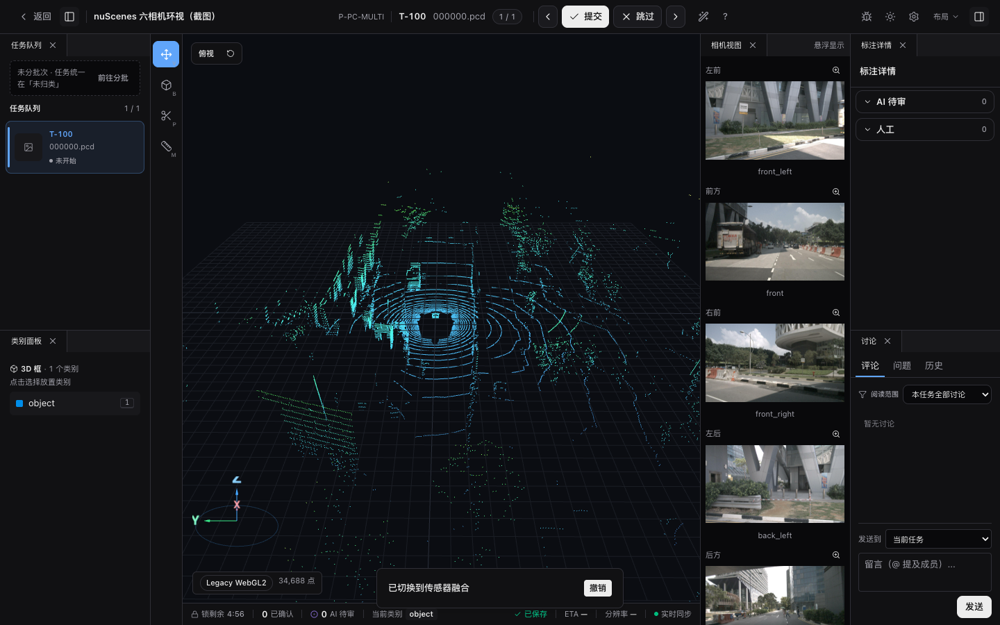

# 点云视图与上色

3D 点云项目（`data_type=lidar`）进入 Three.js 3D 舞台后，工作台中心是主 3D 视图，悬浮在四周的相机面板按物理朝向贴边显示标定的相机图。本页讲**怎么看点云**——视角导航、相机面板与上色 / 深度；绘制和编辑 3D 框见 [3D 立体框标注](./3d-box)。

示例画面使用 nuScenes / Motional 的六相机公开样例，经 OpenMMLab MMDetection3D
版本固定的演示资产接入；仅用于非商业文档演示，并按
[nuScenes 使用条款](https://www.nuscenes.org/terms-of-use)保留署名。

## 视图导航

<DocsVideo
  src="/media/pointcloud/orbit.mp4"
  poster="/media/pointcloud/orbit-poster.webp"
  alt="拖动主 3D 视图平滑旋转点云并在新视角稳定停留"
/>

- 主 3D 视图可旋转 / 平移 / 缩放查看点云。
- 控件浮条「重置视角」回到默认斜视（跟随车头朝向）；「俯视」切到正上方鸟瞰（BEV），便于框选地面 footprint。两者随时切换。
- 「重置相机布局」只恢复 2D 相机图浮窗的默认贴边布局，不会改变 3D 主视图视角。
- 控件浮条的「框体精修」会展开三视图并收起当前相机面板；「传感器融合」会收起三视图并让相机面板回到默认贴边位置；「点级分割」会同时收起三视图和当前相机面板。三个按钮只恢复面板布局，不切换当前标注工具
- 工作台设置抽屉的「点云」分组可调整点大小、点选模式、相机上色、深度提示、地面网格、坐标轴、相机灵敏度和 3D 视角持久化；抽屉与控件浮条读写同一份偏好。
- 开启「持久化 3D 视角」后，平台会记住主 3D 视图的相机位置、目标点、up 向量和当前 orbit / BEV 模式；再次打开点云任务时会在点云加载完成后恢复该视角。
- 在同一 scene 的相邻帧之间切换时，主 3D 视图会保留当前相机位置、目标点、up 向量和 orbit / BEV 模式，无需开启持久化。切换到不同 scene 时，开启持久化则恢复账号视角，未开启则使用新场景的默认取景
- Scene 时间轴会立即预解析相邻帧点云并预解码相机图。切帧期间画布会明确显示加载状态，不会继续显示上一帧点云；新点云到位后先显示高度色，相机资源准备好后至多切换一次 RGB，不会为了等待上色隐藏画布。
- 相机面板标题条的「⛶」按钮展开居中大图浮层（按 70vh 放大），再次点击右上角箭头或按 `Esc` 可收起。

> 框选目标时建议先切「俯视」鸟瞰视角更顺手，但斜视下也能选对（框选屏幕里的真实点，与视角无关）。详见 [3D 立体框标注 · 操作](./3d-box#操作)。

## 相机面板

- 经标定的相机图悬浮在主视图四周，按物理朝向贴边显示；标定缺失的相机面板不显示。
- 相机面板标题条可拖动做临时避让；第一次从默认贴边位置拖动时会先锁定当前位置再进入浮动布局，避免轻拖后跳出画布。双击标题条或点「归位」回到默认物理锚点；控件浮条「重置相机布局」会一次性恢复所有相机面板。中等窄屏下相机默认折叠为小标签，手动展开 / 收起状态优先。
- 相机面板标题条「⛶」展开居中大图浮层（图按 70vh 放大），`Esc` 关闭。
- 3D 框会实时投影到这些相机面板上，并支持 2D↔3D 双向选中——详见 [点云跨模态联动](./pointcloud-projection)。

## 上色与深度

<DocsVideo
  src="/media/pointcloud/controls.mp4"
  poster="/media/pointcloud/controls-poster.webp"
  alt="切换点云相机上色并调整点大小和深度范围"
/>

### 相机 RGB 上色

<!-- TODO(v0.14.18) IMAGE_CHECKLIST: images/workbench/pointcloud-rgb-colorize.png — 相机上色前后对比 [manual] -->

设置「相机上色」（默认关）：逐点投影到各标定相机像面采样像素 RGB，主视图和三视图一致跟随；无标定的点回退高度色带。开启后自动按 z-test 剔除被前景遮挡的背景点（容差 10cm），避免背景墙面被前景车辆“染色”。常规渲染路径在持久 worker 中完成颜色与深度计算；实验渲染路径会缓存解码后的相机图和相邻帧遮挡深度，并由 GPU 直接采样纹理，不读取 Canvas 像素。

上色结果可通过「上色对比度」「上色亮度」「上色 Gamma」继续微调。这些字段存入账号级工作台设置，跨浏览器同步；调整色彩时只重映射已经采样出的 RGB，不会重复加载点云。

### WebGPU 实验渲染器

工作台设置的「实验」分组提供 WebGPU 点云渲染器开关。它默认关闭，切换后需要刷新或重新打开 3D 任务；状态栏会显示实际使用的 `WebGPU`、`WebGL2 fallback` 或 `Legacy WebGL2`，不能只凭浏览器支持标记判断是否真的启用了 WebGPU。

该开关用于在同一套真实任务上对比切帧、选框和三视图性能。初始化失败或运行时设备丢失会自动回到 Legacy，不影响当前标注数据。在真实 nuScenes A/B 和多设备验证确认有效前，它不会成为默认功能。

### 深度热力图

<!-- TODO(v0.14.18) IMAGE_CHECKLIST: images/workbench/pointcloud-depth-heatmap.png — 深度热力图 + figcaption 深度读数 [manual] -->

设置「深度提示」：相机图叠深度热力图（近=红、远=蓝），鼠标 hover 显示最近点深度。该开关存入账号级工作台设置，跨浏览器同步。

## 点云点选（PointMask）

启用 `point_mask_3d` 工具单位后，控件浮条会出现点选工具入口。按 `P` 切到分割工具，在主 3D 视图用矩形、套索或多边形选取目标点集，闭合后选区内可见点自动聚合为一条 `point_mask_3d` 标注。详细操作见 [3D 立体框标注 · 点云分割](./3d-box#点云分割)。
