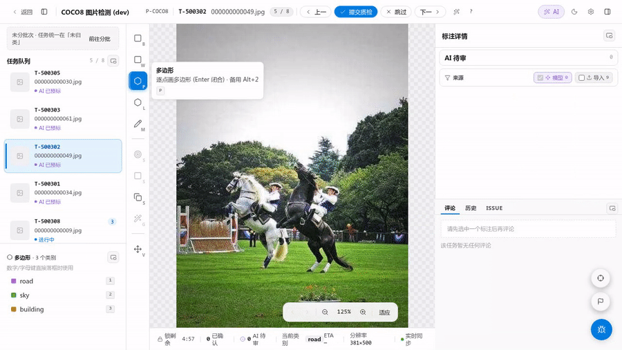
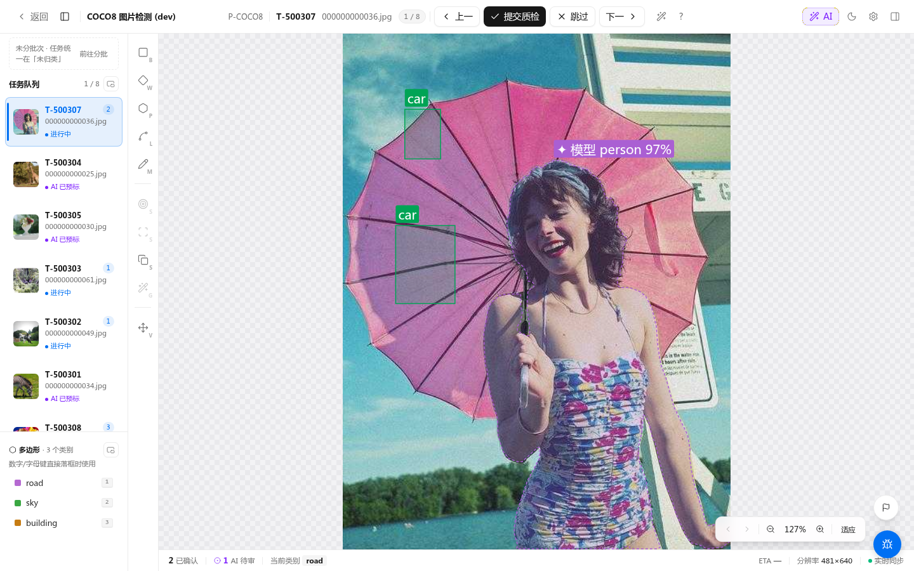

# Polygon 标注

## 操作

1. 按 `P` 切到多边形工具
2. 沿目标边界依次单击落点，每点会生成一个顶点
3. 双击 / 按 `Enter` 闭合多边形
4. 右侧属性面板选择类别

## 绘制快捷键

| 操作 | 快捷键 |
|---|---|
| 撤销最后一个落点 | `Backspace` |
| 取消当前草稿 | `Esc` |
| 闭合多边形（≥ 3 个顶点） | `Enter` 或双击 |
| 自动闭合 | 单击第一个顶点（首点高亮时出现「单击闭合」提示） |

## 编辑

<!-- TODO(v0.14.18) IMAGE_CHECKLIST: images/polygon/vertex-insert-alt.png — 按住 Alt 悬停边上光标变「+」的瞬间 -->

- 选中已有多边形，鼠标悬停在**边**上 → 出现「+」图标，按住 `Alt` 后单击边插入新顶点
- 拖动顶点 → 修改形状
- `Shift + 单击顶点` → 删除该顶点（多边形 ≤ 3 个顶点时拒绝删除）
- 绘制 polygon / polyline 或拖动 polygon 顶点时，会在 8px 屏幕距离内吸附到可见 polygon / multi_polygon 的顶点或边界；按住 `Alt` 可临时关闭吸附
- 多选同类别 polygon / multi_polygon 后，可在浮条或右键菜单点「合并」生成一个新的 polygon / multi_polygon；原标注会被删除，整次操作可一次撤销
- 不同类别、锁定标注或非 polygon 几何不会合并；属性完全相同时保留，不一致时新标注属性为空

## 属性模式

当当前工具的属性 schema 包含 boolean / select / multiselect 字段时，画布顶部会显示属性模式栏。

1. 打开「属性模式」
2. 选择要补录的字段和值
3. 直接点击 bbox、旋转框或 polygon / multi_polygon 标注，把该值写入标注属性

快捷键:

- `[` / `]`: 切换当前属性字段
- `1` - `9`: 选择当前字段的第 N 个候选值
- `N`: 跳到下一个未填写当前字段的可支持标注

text / number / range 字段仍在右侧属性面板编辑。

## 性能提示

- 渲染层 LOD（Douglas-Peucker 简化）：未选中态下顶点数超过 **60** 时，画布渲染会按当前视口缩放级别自动简化；编辑态和选中态始终使用完整顶点，保证拖拽手感。
- 顶点数量本身没有硬性上限，但顶点过多（如 > 500）会明显增加序列化和 API 传输开销，建议合并/简化后再提交。
- 复杂形状可考虑拆分为多个多边形；Slice 切割工具仍在后续版本中补齐。

## 典型场景

<!-- TODO(0.8.1) IMAGE_CHECKLIST: 多边形选中态，鼠标悬停在边上出现 + 图标的瞬间。 -->

<!-- TODO(0.8.1) IMAGE_CHECKLIST: 三顶点已落点，第四点贴近第一点出现「单击闭合」提示。 -->
