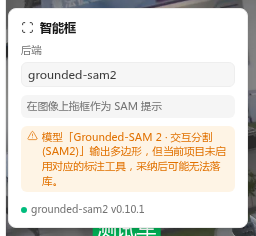
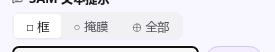
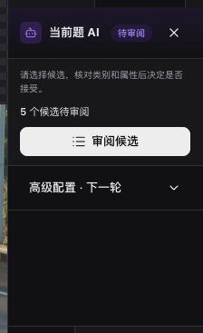

# AI 工具组

> 点 / 框 / 示例 / Magic Box — 选一种交互方式让 AI 把 polygon 画出来,或直接收紧到 bbox。

<!-- history: prompt-first tools and Magic Box were introduced in separate releases; this page describes the current tool model. -->

工具栏按交互范式拆成 4 个独立 AI 工具(均为**画布手势驱动**)。你直接选择「想怎么交互」，AI 自动走对应模型 prompt。

| 工具 | 图标 | 默认快捷键 | 后端要求 | 输出形态 |
|---|---|---|---|---|
| **智能点** | 🎯 | `S` 循环 | `point` | polygon 候选 |
| **智能框** | ▭ | `S` 循环 | `bbox` | polygon 候选 |
| **Magic Box** | ✨ | `G` / `S` 循环 | `bbox` | **直接** bbox 标注 |
| **Exemplar 示例** | ⎘ | `S` 循环 | `exemplar` (仅 SAM 3) | polygon / bbox 候选 |

> **文本提示「找全图」已归批量线(v0.14.18)**:给词→全图找所有实例本质是批量语义(后端自报 detection/segmentation 文本路径 `is_interactive: False`),不再是工具栏交互工具,改在 **AI 面板 / 批量预标页** 使用(见下方「文本预标『找全图』」一节)。工具栏只保留需要在画布上画点/框/示例的交互工具。

按 `S` 在 4 个 AI 工具之间循环，**跳过当前后端不支持的工具**（按钮置灰）；循环顺序: smart-point → smart-box → **magic-box** → exemplar → 回 smart-point。`Alt+3` 与 `S` 等价。

> **能力来自后端 `/setup.supported_prompts`(按交互后端并集，v0.14.18)**：项目可注册多个后端,工具栏某交互工具只要**任一已注册的交互后端**支持该 prompt 就亮。挂 `grounded-sam2`（point/bbox）时 Exemplar 灰;挂 `sam3-backend`（exemplar）时 **Smart Point、Smart Box、Magic Box 都灰**——sam3 这一档物理上只做 PCS「找全图相似」(走 Exemplar),不做单物体的点/框分割(需 grounded-sam2 或大显存卡开 inst_interactivity)。鼠标 hover 灰按钮会显示「当前后端不支持此交互模式」。同时注册 gsam2 + sam3 时,point/bbox 自动路由到 gsam2、exemplar 路由到 sam3,各司其职(见[交互后端选择](#交互后端选择多后端))。

## 工具说明

<!-- screenshot pending: interactive-toolbar.png — 画布顶部交互工具栏全貌（引擎/模型/档位下拉 + 工具特定控件 + 状态灯）。旧 ai-tool-drawer.png 已退役。 -->

> 选中点 / 框 / Exemplar 任一交互工具时，画布顶部居中浮出**交互工具栏**（横排布局，取代了旧的贴 ToolDock 右侧竖排抽屉）：左侧是引擎 / 模型 / 档位选择，右侧是工具特定控件（极性 / 输出形态 / 叠加文本 / 阈值），最右边是兼容性警告 + 状态指示。Mask 笔刷工具激活时改显 MaskToolbar，两者互斥。

### 智能点（Smart Point）— 单击让 SAM 找边缘

- **单击**：在目标上点一下 → SAM 把这个东西的轮廓找出来（positive point）
- **Alt + 单击**：负向点，告诉 SAM「这块不要」做减法
- 工具激活时**交互工具栏**显示极性切换圆按钮，按 `=` / `+` 切正向，按 `-` 切负向

### 智能框（Smart Box）— 拖框作 bbox prompt

拖框，SAM 把框内主要前景的 polygon 找出来。比智能点更明确「就是这一块」，适合背景杂乱时。

### Magic Box — 拖框 → SAM 收紧到对象紧凑外接矩形

拖框时不要求精准，拖一个**大致包住目标**的框就行;SAM 跑 mask → 自动取 mask 的紧凑外接矩形 → **直接落 bbox 标注**(不经过候选层确认)。

| 与 Smart Box 的区别 |
|---|
| Smart Box: 输出 polygon 候选,等 `Enter` 接受 + 选类 |
| Magic Box: 输出 **bbox** 直接落库,跳过候选层 |

**使用场景**: 想要精准 bbox 但不想拖到对象边缘的精细位置 — 粗框一下,SAM 帮你把"距离对象边 5px"的浪费空间砍掉。

**注意**: 落库的 bbox 类别取当前 `activeClass`(左侧调色板高亮的类);若未选类则用 SAM 返回的 label 或类别列表首个。Magic Box 的标注归 `ai_interactive` 工具单位,类别集从该单位读取（工具维度类别详见[创建项目](../projects/index.md#工具维度类别--属性)）。

### 文本预标「找全图」— AI 面板(批量线)

> v0.14.18 起,文本提示不再是工具栏交互工具。给词→全图找所有实例属**批量能力**,在悬浮 **AI 面板**(点工具栏「AI」打开)或**批量预标页**使用。

在 AI 面板的 Prompt 输入框填英文 prompt（如 `ripe apple`、`car . truck . bicycle`），GroundingDINO 或 SAM 3 PCS 批量返回候选。

输出形态三选一(由后端顶层 `supported_text_outputs` 决定可见性,v0.14.18 修复了 gsam2 只能选 box/DINO 变体的问题):

- `□ 框`：仅 box，跳过 mask（速度最快，image-det 项目首选）
- `○ 掩膜`：mask → polygon（image-seg 项目默认）
- `⊕ 全部`：同实例配对 box + polygon

变体选择器对 gsam2 文本路径同时给出 **SAM2 变体 + DINO 变体两组**(后端内部按 output_mode 编排 detection/segmentation)。项目设置 → ML 模型 →「SAM 文本预标默认输出」可锁定项目级默认。

输出形态会按账号记住上次显式选择。下次进入没有项目默认的项目时,优先使用本会话选择,再使用账号记忆;项目级「SAM 文本预标默认输出」始终优先。

### Exemplar 示例（仅 SAM 3）

拖框圈出图中**已有的一个示例实例**，SAM 3 PCS 一步返回**全图相似实例**。这不是一发定生死——拖第一个框后进入**迭代 refine 会话**，可以一边看结果一边收紧：

- **继续加正框** — 漏检的实例旁再拖一个框，扩大召回。
- **加负框排误检** — `Alt+拖框` 或先在交互工具栏把极性切到 `−`，框住误检的实例，它就会从结果里消失。会话框在画布上以颜色区分：**正框绿色实线 / 负框红色虚线**。
- **拖置信度阈值** — 交互工具栏的滑块实时增减结果（调高更准、调低更全），无需重新拖框。
- **叠加文本概念** — 在「叠加文本概念」输入框填如 `car`，与示例框组合成「这个概念 + 长这样的」。

每次操作都重发全量（多框 + 文本 + 阈值），满意后再逐条 `Enter` 确认。`Esc` 清空整个会话。

交互工具栏提供与文本提示相同的输出形态三选一（`□ 框` / `○ 掩膜` / `⊕ 全部`），默认 `○ 掩膜`；选 `□ 框` 仅返回 box，`⊕ 全部` 同实例配对 box + polygon。该选择与文本提示共用账号级记忆规则。

适用场景：

- 图里有 50 个红苹果，你只想框 1 个让模型批量补齐，再框掉混进来的青苹果
- 不容易用英文描述的形态（特定造型部件 / 罕见品类）

> 与「智能框」手势相同（拖框），但意图不同：智能框是「就找这块的轮廓」，Exemplar 是「找全图所有跟这块相似的」。激活的工具决定路由。

## 候选确认

所有 AI 工具返回的 polygon 都是**待确认紫虚线**，需要确认才落库：

- **`Enter`** — 接受当前候选 → 弹类别选择器 → 选好类别才进库
- **`Tab` / `Shift+Tab`** — 切换候选（文本 / exemplar 路径常见多条）
- **`Esc`** — 全部取消

### 精修 SAM 候选（Mask 编辑器）

AI 候选列表行右侧有「精修」按钮（仅 polygon 类型候选显示）。点击后工具切换到 **Mask 笔刷工具（M）**，可在像素级修改轮廓边缘，完成后按 `Enter` 提交落库。精修不需要先 `Enter` 接受候选——直接在候选态启动 Mask 编辑，commit 时同时清除候选并落库。已落库的人工 polygon 行也有「精修」按钮，通过 update mutation 替换原始几何。

## 参数面板（悬浮 AI 面板）

点工具栏「AI」打开可拖动的悬浮面板，其中有一份**由所绑定后端 `/setup.params` 自动生成的参数表单**，每个字段下方带简短说明。常见字段及项目级默认值：

| 字段 | 后端 | 项目级默认 | 范围 | 说明 |
|---|---|---|---|---|
| `box_threshold` | grounded-sam2 | 0.35 | [0.0, 1.0] | DINO bbox 置信度阈值 |
| `text_threshold` | grounded-sam2 | 0.25 | [0.0, 1.0] | DINO token 置信度阈值 |
| `score_threshold` | sam3 | 后端自定义 | — | PCS 候选置信度 |
| `simplify_tolerance` | 两者 | 后端自定义 | 像素 | polygon 轮廓 Douglas-Peucker 容差 |
| `model_variant` / `embedding_cache_size` | — | — | — | 只读信息（禁用展示，不可改）|

> 文本提示格式：在 AI 面板 Prompt 输入框填英文短语，多个类别用 ` . `（空格+点+空格）分隔，格式与 GroundingDINO 一致，例如 `ripe apple . green apple . orange`。

模型变体（SAM2 / DINO 变体）在同一面板的「变体选择器」里切换。backend 若上报 `/setup.supported_variants`，选项会显示显存估算、快速/均衡/精度档位和推荐标识；未上报时回落到 `/setup.params` 的 enum。参数按**所绑定后端**动态显示——绑 sam3 不会出现 DINO 阈值，绑 gsam2 才有。

调整后再次触发的 AI 请求会带上新参数。普通阈值/容差设置**按你个人 + 后端独立保存**（存入用户偏好），刷新或下次进工作台仍保留；工作台里的模型变体保持会话级，ai-pre 批量预标页面的变体选择则按 backend 记忆。

## 交互后端选择（多后端）

项目注册了**多个交互后端**且不止一个支持当前工具的 prompt 时,交互工具栏的「后端」下拉可切换(能力作用域化:**只列支持当前工具的后端**,所以选不到没该能力的后端)。

- 选中值 = 当前工具**实际会跑**的后端,显示与执行始终一致。
- 切某个工具的后端后会记为你的「首选交互后端」(**按 user × project 持久化**);切到另一个该首选不支持的工具时,自动按兜底链(首选 → 项目默认 → 注册序)回退到能跑的后端。
- 只有 1 个候选后端时下拉只读(无 UI 噪音),行为 = 单后端现状。

> 交互线(point/bbox/exemplar)与批量线(文本/几何/OCR/版面)各自独立选后端:工具栏「后端」管交互,AI 面板顶部的 backend 选择器管当前题运行。项目「项目主后端」(`ml_backend_id`)只是初始选择 / fallback + AI 总开关,不再是交互能力闸门。

## 多模型选择与兼容性提示

若所绑定 backend 在[能力声明协议 v2](../../dev/reference/ml-backend-protocol) 中暴露**多个 model 条目**，交互工具栏会出现「模型」下拉，按 task 中文分组并**按当前工具的 prompt 过滤**——只列声明支持该交互的图像 model(如智能点 → 仅交互式分割 model),过滤后通常剩 1 个则自动隐藏,真正的权重选择交给「档位」选择器(即变体选择器,横排在「模型」之后)。切换后续 AI 请求改用所选 model。

> 与「变体选择器」的区别：**变体**是同一 model 的不同权重档位（如 SAM2-L / SAM2-B）；**模型**是同一 backend 暴露的不同 model 条目（往往 task 不同）。backend 只有单个 model（含老 backend / 协议 v1）时不渲染模型下拉，行为完全不变。

选中 model 的输出与当前项目配置不匹配时，交互工具栏与 AI 面板会显示**非阻断**警告条幅（不影响触发）：

- **几何不匹配**：模型输出某种几何但项目未启用对应标注工具，采纳后可能无法落库。
- **缺文本属性**：模型会输出识别文本（OCR），但项目未配置 text 属性，采纳后文本将丢失——需在项目设置为对应工具添加 text 属性。

## 与 BboxTool / PolygonTool 的关系

- `B` 矩形工具：完全自己画框，AI 不参与，最快最精准但累。
- `S` AI 工具组：给 prompt 让 AI 出 polygon，最省手但需要确认候选。
- `P` polygon 工具：逐顶点画，最精细。

**典型工作流**：先在 **AI 面板**文本「找全图」拿大类目(批量),Tab + Enter 收明显的 → `B` 手补漏的 → `P` 精修 AI 没拟合好的边缘 → 复杂形态目标用 `S` 切 Exemplar 一键批量补齐 / Smart Point 单点精修。

## 快捷键速查

| 键 | 行为 |
|---|---|
| `S` | 在 4 个 AI 工具间循环（跳过置灰；含 Magic Box） |
| `G` | 直接切到 Magic Box |
| `Alt + 3` | 同 `S` |
| 单击 | Smart Point: positive point |
| `Alt + 单击` | Smart Point: negative point |
| `=` / `+` / `-` | Smart Point 默认极性切换 |
| 拖框 | Smart Box / Magic Box / Exemplar 触发 |
| `Enter` | 接受当前候选（Magic Box 跳过此步直接落库） |
| `Esc` | 取消所有候选 |
| `Tab` / `Shift+Tab` | 切换候选 |

## 常见问题

- **某个 AI 工具置灰**：当前项目已注册的交互后端都不支持该 prompt 类型；hover 工具看 tooltip，或到项目设置注册一个支持它的后端（无需设为主后端）。
- **交互工具栏没显示**：当前激活的不是 AI 工具（Mask 笔刷会改显 MaskToolbar），或 `/setup` 拉取失败（看工具栏右侧状态指示，红 = 失败）。
- **参数调了没生效**：确认是在悬浮 AI 面板里调（非画布顶部交互工具栏，那里只暴露极性 / 输出形态 / 阈值等会话控件）；只读字段（模型版本 / 缓存容量）不可改。参数按个人 + 后端保存，切到使用不同后端的项目会各用各的设置。
- **Exemplar 框出来 0 个结果**：示例区域太小 / 太模糊；尝试更明显的示例，或调低 `score_threshold`。
- **同图反复点击很慢**：第一次会跑 image encoder（~1.6s SAM2 / ~2-3s SAM3），命中 LRU 缓存后 < 50ms。
