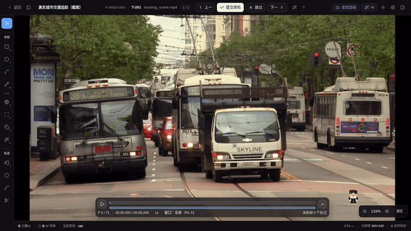

# 视频关键帧传播与 AI 追踪

把一条轨迹扩展到更多帧有两条路：纯前端的**复制后续**和调用模型的 **AI 延展**。要在画布上发现或播种多个新目标，则使用顶部的**发现目标**。三种入口会明确显示自己的作用范围，避免把“修改当前轨迹”和“新建多目标轨迹”混为一谈。轨迹与关键帧的基础操作见[视频追踪标注](./video-track)。

## 两种传播机制对比

| 维度        | 复制后续（关键帧传播）           | AI 追踪                                    |
| ----------- | -------------------------------- | ------------------------------------------ |
| 是否调用 AI | 否                               | 是，真实模型需要项目启用对应 ML Backend    |
| 几何来源    | 把当前帧的框原样复制到目标帧     | 模型根据框、点、文本等提示逐帧推理         |
| 适用场景    | 目标位置变化小，复制后再手工微调 | 运动复杂、范围较长或需要一次追多个目标     |
| 结果落库    | 操作完成即写入，可整体撤销       | 先显示候选预览，可按目标与帧窗口接受后写入 |
| 放弃结果    | 撤销复制操作                     | 在候选审阅条拒绝所选范围，标注零改动       |

## 复制后续（关键帧传播）

选中轨迹后，点击选中卡上的**复制后续**（copy 图标），选择方向、帧数和是否覆盖已有关键帧。系统会把当前帧的框原样铺到目标帧，不调用模型，整个传播可作为一次操作撤销。

开启帧采样后，弹窗里的数量按采样网格格子计算，与 `←` / `→` 的导航单位一致。

## 先选择正确的作用范围

<!-- TODO IMAGE_CHECKLIST: images/video-propagate/track-vs-copy-buttons.png — 选中卡「AI 追踪」vs「复制后续」两按钮对比 [manual] -->

<AutoImage src="video-propagate/ai-tracking-panel.png" alt="视频工作台右上的 AI 追踪检查器，顶部入口位于 AI 单题按钮左侧" />

| 目的                 | 入口                                                                                      | 面板作用范围                                 |
| -------------------- | ----------------------------------------------------------------------------------------- | -------------------------------------------- |
| 延展当前轨迹         | 选中矩形框或 Mask 轨迹，点击 **延展此轨迹**；也可按 `Ctrl+B` 或右键选择 **AI 延展此轨迹** | 只回填当前选中的一条轨迹，不创建额外目标     |
| 批量延展已有轨迹     | 多选至少两条轨迹，点击 **批量延展**                                                       | 各源轨迹在同一作业中独立延展，各自回填原轨迹 |
| 发现或播种多个新目标 | 点击顶部 **发现目标**，它位于 **AI 单题**左侧                                             | 画布级新建；不会修改当前选中轨迹             |

面板标题下方会先显示「单轨 · 延展」「多选 · 延展」或「画布级 · 新建」。确认作用范围后，再选择方向、范围、模型与输出几何；按模型需要填写文本或采集点 / 框种子，最后点击与作用范围对应的「开始延展」「开始批量延展」或「开始发现」。

面板默认停在中间画布右上角。拖动头部可在画布内移动，拖右下角可调整尺寸；关闭重开或刷新后会恢复上次位置和尺寸，窗口变小时会自动夹回可见区域。**AI 追踪**与 **AI 单题**互斥：打开其中一个会收起另一个，避免同时遮挡画布。

<DocsVideo
  src="/media/video/ai-tracker-panel.mp4"
  poster="/media/video/ai-tracker-panel-poster.webp"
  alt="AI 追踪面板拖动、缩放、重开恢复与 AI 单题互斥"
  caption="追踪面板可在画布内移动和缩放，并与当前题 AI 面板保持互斥。"
/>

方向使用时间轴语义，避免“向前 / 向后”歧义：

- **更晚帧 →**：向时间轴右侧传播。
- **← 更早帧**：向时间轴左侧传播。
- **⇆ 双向**：同时覆盖更早和更晚帧。

范围可选 10 / 30 / 60 帧、到相邻关键帧、到视频端点。开启帧采样后，数字范围按网格格子计算。也可以在时间轴上按住 `Shift` 拖选自定义范围；工具条会显示实际起止帧，并在大范围需要分窗时给出粗略窗口数。

## 按意图选择模型

模型下拉只列出**当前项目已启用、已连接且能力可达**的 backend 所声明的 tracker，并在模型名后显示提供它的 backend 名称。未绑定、未连接或未声明该能力的模型不会出现在列表中；如果没有可用模型，面板会直接提示到项目设置启用并连接 ML Backend。生产界面不显示测试用 `mock`，它只在开发构建且没有真实模型时作为流程验证兜底。

单轨和多选延展只展示消费现有目标的 SAM2 / SAM3 点框模型；会按文本自动发现新实例的 SAM3 文本与 combo 模型只在画布级「发现目标」入口展示。

| 模型                    | 交互方式                      | 适合场景                                                                       |
| ----------------------- | ----------------------------- | ------------------------------------------------------------------------------ |
| SAM2 · 框追踪           | 选中轨迹框；也可补点 / 框种子 | 已有目标框，沿时间传播；需要人工纠偏或多目标播种                               |
| SAM3 · 点框交互追踪     | 点 / 框种子 + 视频记忆        | 需要明确告诉模型追谁，并在中途追加修正提示                                     |
| SAM3 · 文本检测追踪     | 必填文本描述                  | 按描述在每帧自动发现并关联多个目标                                             |
| SAM3 · 发现追踪 (combo) | 必填文本描述 + 目标类别       | 先按文本自动发现目标，再逐对象记忆追踪；想要“自动发现”又要“干净跨帧身份”时用它 |
| mock · 测试框           | 复用输入框，不调用 backend    | 仅开发构建保留，用于无 GPU 流程验证                                            |

SAM 尺寸档位只在 **SAM2 · 框追踪**时显示，因为 `tiny / small / base_plus / large` 是 SAM2 checkpoint 档位。SAM3 文本、点框交互和发现追踪使用各自权重，不显示这个选项。更大的 SAM2 档位通常更耗显存、冷启动也更慢。

**发现追踪 (combo)** 是文本检测与点框交互两个能力的编排：一个作业里先用文本在起始帧自动发现画面里的多个目标，再把每个目标当作独立种子逐对象记忆追踪，因此同时需要文本描述和新目标类别（发现的目标都是新轨迹）。只有同一个已连接 backend 同时声明文本检测与点框交互能力时，它才会出现在列表中。

文本检测追踪的工作台入口只收集文本描述。不要把图片工作台的 Exemplar 示例框当作视频种子；需要通过 API 传视觉示例的调用方见 [Video Tracker Jobs](../../api/guides/video-tracker-jobs#文本与视觉示例)。

## 点 / 框种子、多目标与中途纠偏

SAM2 和 SAM3 点框交互追踪支持在发起前采集种子。三种种子分别录制，避免把点、负点和框的操作混成一段：

### 跨帧多正点

<DocsVideo
  src="/media/video/tracker-cross-frame-points.mp4"
  poster="/media/video/tracker-cross-frame-points-poster.webp"
  alt="为左右两辆公交车分别添加跨帧正点，追踪后拖动时间轴核对两个候选"
  caption="两个目标分别在 F0 与 F4 添加正点，发起一次多目标追踪，并在接受前跨帧复核。"
/>

### 正负点修正

<DocsVideo
  src="/media/video/tracker-positive-negative.mp4"
  poster="/media/video/tracker-positive-negative-poster.webp"
  alt="为两辆公交车添加正点和红色负点，追踪后跨帧核对候选"
  caption="Alt + 单击加入负点，用于排除紧邻目标的背景或相邻物体；面板会分别统计正负提示。"
/>

### 整车框种子

<DocsVideo
  src="/media/video/tracker-box-seed.mp4"
  poster="/media/video/tracker-box-seed-poster.webp"
  alt="沿左右两辆公交车完整车身绘制框种子并同时追踪"
  caption="每个框覆盖完整车身；生成两个候选后拖动时间轴检查跨帧位置，再整批接受。"
/>

1. 在追踪面板的「种子」区选择**点**或**框**，进入采集状态。
2. 点模式下，单击目标添加正点；`Alt + 单击` 添加负点，表示“这块不要”。框模式下，在目标上拖出提示框。
3. 同一目标可混合使用点和框。种子区按目标逐行显示点数、框数和具体所在帧（如 `F12、F18`），并标明后续种子会归入的「当前」目标。
4. 在画布级「发现目标」中，要同时追另一个对象，先点击「+ 新目标」，再为新目标落点或画框，各目标在接受后分别创建新轨迹。单轨延展不显示「+ 新目标」，避免把新建目标混入当前轨迹操作。
5. 要做中途纠偏，保持追踪面板打开，跳到后续帧继续为同一目标添加正点、负点或框。提示会按目标和帧累积；首次种子帧仍是传播范围的锚点。

没有采集任何种子时，种子驱动模型会回退到选中轨迹在当前帧的框。若模型跟错目标，优先在出错帧加负点或更紧的框，而不是盲目扩大传播范围。

## 多选批量：一次延展多条轨迹

已经有多条轨迹要一起往后追时，不必逐条发起：

1. 在右侧轨迹清单或画布内的多选卡里，用 `Shift` / `Ctrl` 多选 ≥2 条轨迹（需在「当前帧」视图下）。
2. 点击批量条上的 **批量延展**，打开追踪面板。标题和作用范围摘要会显示「批量延展 N 条轨迹」及类别（同类显类名，混类显「N 类」）。
3. 选好模型与范围后发起。各条源轨迹在**同一个作业**里被并行追踪，各自回填各自轨迹——只产生一条审阅记录、一次接受，而不是每条轨迹一个作业。

批量追踪与单条一样以起始帧的轨迹几何为种子，因此发起前把播放头停在这些轨迹都有框的帧上。接受后各源轨迹一并更新；作业运行期间若任一源轨迹被删除、锁定或修改，整次接受都会停止并要求刷新，不会把失效源静默降级成新轨迹。

## 在漂移帧修正 Mask 并重传播

当 Mask 轨迹从某一帧开始漂移时，不必删除整段轨迹：

1. 跳到第一个明显漂移帧，选中 Mask 轨迹并进入 Mask 编辑器，修正边缘后保存。系统先把这一帧保存为人工关键帧。
2. 在纠错弹窗选择**仅保存**、**向更早帧**、**向更晚帧**或**双向**。传播范围会限制在当前 segment 和模型单窗上限内。
3. 选择明确显示 backend 的模型。支持 Mask seed 的模型直接使用修正像素；只支持框的模型会显示 fallback 原因，必须勾选确认后才能继续，文本模型还要填写目标描述。
4. 作业完成后，在候选审阅条核对纠错帧、实际起止窗口、方向、seed 类型和 fallback，再按目标与帧窗口接受或拒绝。

纠错候选不会包含刚保存的人工帧，也不会越过所选窗口。窗口外、其它轨迹与其它人工关键帧保持不变。传播启动失败时，人工帧已经保存；直接点重试即可，系统不会重复写同一关键帧。取消传播同样保留人工帧，只丢弃未接受候选。

## 运行、取消与候选审阅

<!-- TODO IMAGE_CHECKLIST: images/video-propagate/tracker-review-bar.png — AI 追踪候选审阅条与画布候选叠加 [manual] -->

运行期间，轨迹卡片显示 `queued / running` 进度与取消按钮，顶栏「后台任务」和 `/ai-pre/jobs?tab=video` 的「视频」页保留任务记录。取消只停止后续计算；如果模型已经产出部分帧，这部分结果仍会进入候选审阅；尚无结果时不会出现审阅条。

追踪完成后不会立刻改写轨迹：

- 画布先叠加显示当前任务的追踪候选。
- 顶部「AI 追踪候选」审阅条显示已审 / 总候选数，可勾选一个或多个目标并填写起止帧。
- 选择**接受所选**后，只有选中目标且落在帧窗口内的候选会写入。单轨延展把主目标回填所选源轨迹；多选延展把各目标回填对应源轨迹；画布级发现的目标新建轨迹。窗口外、未选目标和剩余未决候选保持不变。
- 选择**拒绝所选**只移除该范围的暂存候选，不修改现有标注。部分决定后可以继续选择其它范围，刷新页面也会恢复剩余候选。
- 人工关键帧默认受保护。选区命中人工帧时，第一次接受会被拒绝并显示二次确认；只有确认覆盖后才写入，操作同时进入审计记录。

每次决定都绑定当前 job revision 和源轨迹版本。如果其他用户或页面已经处理候选，审阅条会刷新服务端状态，避免用旧页面覆盖新结果。接受落库后，关键帧来源仍标为 prediction；如果还要逐帧修订，可以在轨迹关键帧列表中继续接受、拒绝或手工调整单帧结果。

开启帧采样时，模型内部仍按源视频帧追踪，但接受后只持久化落在采样网格上的帧，使关键帧列表、导航与导出范围保持一致。

## 常见问题

- **模型没有出现在列表中**：项目没有启用并连接声明该 `model_key` 的 backend，backend 的能力探测不可达，或当前入口的作用范围不适用该模型。SAM3 combo 还要求同一个 backend 同时提供文本发现与点框追踪能力。
- **SAM3 文本追踪只在第一窗有结果**：平台会把上一窗每个实例最后的有效框作为下一窗正提示，同时保留文本发现；若升级后仍复现，检查 SAM3 backend 是否已重建并运行最新镜像。
- **文本模型无法开始**：文本检测追踪必须填写目标描述。
- **追踪范围被拒绝**：普通标注员需要持有覆盖该范围的视频 segment lock；范围也不能跨越多个 segment。
- **多边形 / 折线轨迹没有 AI 追踪按钮**：当前工作台入口对矩形框与 Mask 轨迹开放。多边形 / 折线轨迹可以手工管理，但折线追踪尚不支持。
- **Mask 候选显示为紫色半透明区域**：候选接受前按真实像素预览；接受后仍保持同一 RLE，不会改成预览外接框。
- **取消后仍出现候选**：这是已经算出的部分结果；选择接受可保留，选择丢弃可完全放弃。
- **纠错提示已有活跃作业**：同一轨迹一次只允许一个纠错作业。先处理或取消现有候选，再重试。
- **纠错提示版本或 segment 已变化**：刷新任务并重新进入当前帧；不要用旧弹窗反复提交。
- **模型只支持框 fallback**：确认后会用修正 Mask 的外接框播种，审阅条会明确显示 fallback；这不是原生 Mask seed。
- **刷新页面后仍有待审任务**：工作台重新进入当前视频任务时会从服务端恢复尚未处理或部分处理的候选，以及带有部分结果的已取消任务。若审阅条没有恢复，先检查当前账号是否仍能看见该任务、候选是否已被其他有权限用户处理，再到 `/ai-pre/jobs?tab=video` 核对任务状态。
