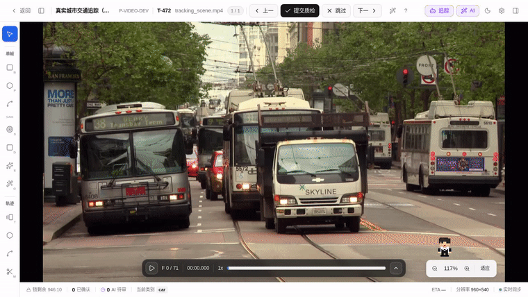

# 视频关键帧传播与 AI 追踪

把一条轨迹扩展到更多帧有两条路：纯前端的**复制后续**和调用模型的 **AI 追踪**。复制后续从画布内的轨迹选中卡发起；AI 追踪还可以从顶部 AI 工具组直接打开，在没有选中轨迹时新建目标。两者的结果、成本和审阅方式不同。轨迹与关键帧的基础操作见[视频追踪标注](./video-track)。

## 两种传播机制对比

| 维度 | 复制后续（关键帧传播） | AI 追踪 |
|---|---|---|
| 是否调用 AI | 否 | 是，真实模型需要项目启用对应 ML Backend |
| 几何来源 | 把当前帧的框原样复制到目标帧 | 模型根据框、点、文本等提示逐帧推理 |
| 适用场景 | 目标位置变化小，复制后再手工微调 | 运动复杂、范围较长或需要一次追多个目标 |
| 结果落库 | 操作完成即写入，可整体撤销 | 先显示候选预览，整批接受后才写入 |
| 放弃结果 | 撤销复制操作 | 在候选审阅条选择「丢弃」，标注零改动 |

## 复制后续（关键帧传播）

选中轨迹后，点击选中卡上的**复制后续**（copy 图标），选择方向、帧数和是否覆盖已有关键帧。系统会把当前帧的框原样铺到目标帧，不调用模型，整个传播可作为一次操作撤销。

开启帧采样后，弹窗里的数量按采样网格格子计算，与 `←` / `→` 的导航单位一致。

## 发起 AI 追踪

<!-- TODO IMAGE_CHECKLIST: images/video-propagate/track-vs-copy-buttons.png — 选中卡「AI 追踪」vs「复制后续」两按钮对比 [manual] -->

<AutoImage src="video-propagate/ai-tracking-panel.png" alt="视频工作台右上的 AI 追踪检查器，顶部入口位于 AI 单题按钮左侧" />

1. 要延展已有目标时，先选中矩形框轨迹 `video_track_bbox` 或 Mask 轨迹 `video_track_mask`，再点选中卡的 **AI 追踪**，也可按 `Ctrl+B`。
2. 要不依赖现有轨迹发现新目标时，直接点顶部 **追踪**；它位于 **AI 单题**按钮左侧。
3. 在画布右上的追踪面板里选择方向、范围、模型与输出几何。「跟随当前轨迹」会保持 bbox / mask 类型，也可以显式选择 Mask、多边形或矩形框。
4. 按模型需要填写文本或采集点 / 框种子，然后点击「开始追踪」。

面板默认停在中间画布右上角。拖动头部可在画布内移动，拖右下角可调整尺寸；关闭重开或刷新后会恢复上次位置和尺寸，窗口变小时会自动夹回可见区域。**AI 追踪**与 **AI 单题**互斥：打开其中一个会收起另一个，避免同时遮挡画布。

方向使用时间轴语义，避免“向前 / 向后”歧义：

- **更晚帧 →**：向时间轴右侧传播。
- **← 更早帧**：向时间轴左侧传播。
- **⇆ 双向**：同时覆盖更早和更晚帧。

范围可选 10 / 30 / 60 帧、到相邻关键帧、到视频端点。开启帧采样后，数字范围按网格格子计算。也可以在时间轴上按住 `Shift` 拖选自定义范围；工具条会显示实际起止帧，并在大范围需要分窗时给出粗略窗口数。

## 按意图选择模型

面板提供下表四种真实 tracker。生产界面不显示测试用 `mock`；它只在开发构建且项目没有绑定真实 backend 时作为流程验证兜底。真实模型只有项目已启用、并由 backend 声明支持相应 `supported_trackers` 时才能成功运行。文本检测追踪会在缺少对应声明时直接置灰。

| 模型 | 交互方式 | 适合场景 |
|---|---|---|
| SAM2 · 框追踪 | 选中轨迹框；也可补点 / 框种子 | 已有目标框，沿时间传播；需要人工纠偏或多目标播种 |
| SAM3 · 点框交互追踪 | 点 / 框种子 + 视频记忆 | 需要明确告诉模型追谁，并在中途追加修正提示 |
| SAM3 · 文本检测追踪 | 必填文本描述 | 按描述在每帧自动发现并关联多个目标 |
| SAM3 · 发现追踪 (combo) | 必填文本描述 + 目标类别 | 先按文本自动发现目标，再逐对象记忆追踪；想要“自动发现”又要“干净跨帧身份”时用它 |
| mock · 测试框 | 复用输入框，不调用 backend | 仅开发构建保留，用于无 GPU 流程验证 |

SAM 尺寸档位只在 **SAM2 · 框追踪**时显示，因为 `tiny / small / base_plus / large` 是 SAM2 checkpoint 档位。SAM3 文本、点框交互和发现追踪使用各自权重，不显示这个选项。更大的 SAM2 档位通常更耗显存、冷启动也更慢。

**发现追踪 (combo)** 是文本检测与点框交互两个能力的编排：一个作业里先用文本在起始帧自动发现画面里的多个目标，再把每个目标当作独立种子逐对象记忆追踪，因此同时需要文本描述和新目标类别（发现的目标都是新轨迹）。它只在 backend 同时声明文本检测与点框交互能力时可选，否则置灰。

文本检测追踪的工作台入口只收集文本描述。不要把图片工作台的 Exemplar 示例框当作视频种子；需要通过 API 传视觉示例的调用方见 [Video Tracker Jobs](../../api/guides/video-tracker-jobs#文本与视觉示例)。

## 点 / 框种子、多目标与中途纠偏

SAM2 和 SAM3 点框交互追踪支持在发起前采集种子：

1. 在追踪面板的「种子」区选择**点**或**框**，进入采集状态。
2. 点模式下，单击目标添加正点；`Alt + 单击` 添加负点，表示“这块不要”。框模式下，在目标上拖出提示框。
3. 同一目标可混合使用点和框。工具条会显示已采集的点数、框数、目标数和涉及帧数。
4. 要同时追另一个对象，先点击「+ 新目标」，再为新目标落点或画框。第一个目标回填选中的源轨迹，其余目标在接受后各创建一条新轨迹。
5. 要做中途纠偏，保持追踪面板打开，跳到后续帧继续为同一目标添加正点、负点或框。提示会按目标和帧累积；首次种子帧仍是传播范围的锚点。

没有采集任何种子时，种子驱动模型会回退到选中轨迹在当前帧的框。若模型跟错目标，优先在出错帧加负点或更紧的框，而不是盲目扩大传播范围。

## 多选批量：一次延展多条轨迹

已经有多条轨迹要一起往后追时，不必逐条发起：

1. 在右侧轨迹清单或画布内的多选卡里，用 `Shift` / `Ctrl` 多选 ≥2 条轨迹（需在「当前帧」视图下）。
2. 点击批量条上的 **AI 追踪**，打开追踪面板。摘要会显示「延展 N 条轨迹」及类别（同类显类名，混类显「N 类」）。
3. 选好模型与范围后发起。各条源轨迹在**同一个作业**里被并行追踪，各自回填各自轨迹——只产生一条审阅记录、一次接受，而不是每条轨迹一个作业。

批量追踪与单条一样以起始帧的轨迹几何为种子，因此发起前把播放头停在这些轨迹都有框的帧上。接受后各源轨迹一并更新；作业运行期间若某条源轨迹被删，只有那一条降级，不影响其余轨迹。

## 运行、取消与候选审阅

<!-- TODO IMAGE_CHECKLIST: images/video-propagate/tracker-review-bar.png — AI 追踪候选审阅条与画布候选叠加 [manual] -->

运行期间，轨迹卡片显示 `queued / running` 进度与取消按钮，顶栏「后台任务」和 `/ai-pre/jobs?tab=video` 的「视频」页保留任务记录。取消只停止后续计算；如果模型已经产出部分帧，这部分结果仍会进入候选审阅；尚无结果时不会出现审阅条。

追踪完成后不会立刻改写轨迹：

- 画布先叠加显示当前任务的追踪候选。
- 顶部「AI 追踪候选」审阅条显示候选覆盖的帧数和目标数。
- 选择**接受**后，主目标回填源轨迹，额外目标各创建新轨迹；人工关键帧不会被预测覆盖。
- 选择**丢弃**后，整批暂存候选被清除，现有标注保持不变。

这里的接受 / 丢弃是 **job 级决策**。接受落库后，关键帧来源仍标为 prediction；如果还要逐帧修订，可以在轨迹关键帧列表中继续接受、拒绝或手工调整单帧结果。

开启帧采样时，模型内部仍按源视频帧追踪，但接受后只持久化落在采样网格上的帧，使关键帧列表、导航与导出范围保持一致。

## 常见问题

- **模型置灰**：项目没有启用声明该 `model_key` 的 backend，或 backend 最近一次能力快照没有该 tracker。
- **文本模型无法开始**：文本检测追踪必须填写目标描述。
- **追踪范围被拒绝**：普通标注员需要持有覆盖该范围的视频 segment lock；范围也不能跨越多个 segment。
- **多边形 / 折线轨迹没有 AI 追踪按钮**：当前工作台入口对矩形框与 Mask 轨迹开放。多边形 / 折线轨迹可以手工管理，但折线追踪尚不支持。
- **Mask 候选显示为紫色半透明区域**：候选接受前按真实像素预览；接受后仍保持同一 RLE，不会改成预览外接框。
- **取消后仍出现候选**：这是已经算出的部分结果；选择接受可保留，选择丢弃可完全放弃。
- **刷新页面后仍有待审任务**：工作台重新进入当前视频任务时会从服务端恢复尚未处理的 `pending_review` 候选，以及带有部分结果的已取消任务。若审阅条没有恢复，先检查当前账号是否仍能看见该任务、候选是否已被其他有权限用户处理，再到 `/ai-pre/jobs?tab=video` 核对任务状态。
