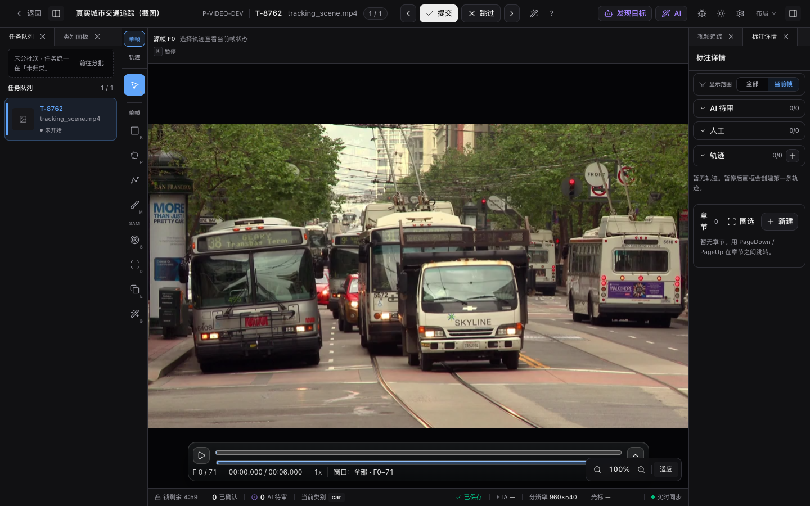
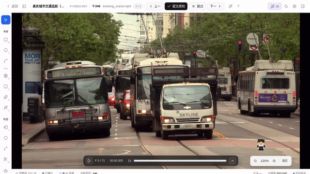
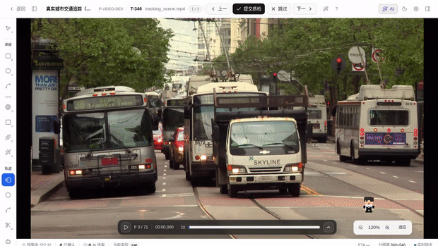
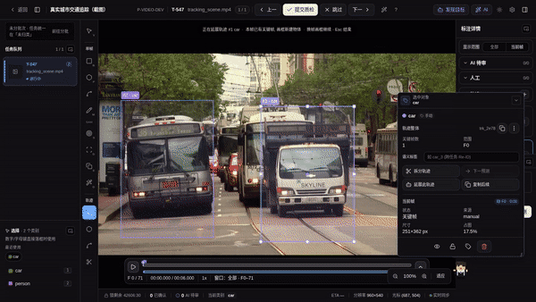

# 视频追踪标注

视频任务在同一个工作台里打开，左侧队列、顶部提交、右侧属性与评论仍沿用图片工作台。画布区域会切换为视频播放器，时间轴悬浮在画布底部。本页讲**矩形框、轨迹与关键帧**的标注。相关页：

- 播放、逐帧、帧采样软网格与章节导航 → [视频播放、帧导航与采样](./video-playback)
- 复制后续（关键帧传播）与 AI 追踪 → [视频关键帧传播与 AI](./video-propagate)

## 基本操作

1. 打开 `video-track` 项目的任务。
2. 用悬浮时间轴、`←` / `→` 或 `,` / `.` 定位到目标帧（详见 [播放与帧导航](./video-playback)）。
3. 暂停视频，从左侧工具栏选择工具。选择工具 `V` 保持独立；创建工具按「单帧」和「轨迹」分组：`B` 是当前帧独立矩形框，`M` 是当前帧逐像素 Mask，`T` 是矩形框轨迹。按 `Esc` 取消当前绘制或回到选择工具；平移视图用右键拖拽或按住 `Space` 后拖拽画布。
4. 在当前帧完成矩形框、多边形、折线或新 Mask 后，在紧邻几何的类别浮层里选择该工具单位的类别。
5. 如果使用轨迹工具，选中这条轨迹后跳到其它帧继续绘制，系统会把结果保存为同一条轨迹的关键帧。矩形框轨迹可继续画框、拖动或缩放；Mask 轨迹可在其它帧继续逐像素编辑。若矩形框轨迹当前帧还没有框，画布会显示最近关键帧的虚线参考框，也可以点击「复制到当前帧」先生成当前帧关键帧再微调。
6. 如果目标在当前帧消失或被遮挡，可在画布内选中卡点击「标记消失」/「标记遮挡」，右键轻点矩形框轨迹打开菜单，或用 `O` / `Q` 快捷键。单帧矩形框、多边形、折线和旋转框支持右键改类 / 删除；多边形 / 折线轨迹支持显隐、锁定、改类和删除整条。
7. 标完后点击「提交质检」。

## 矩形框、轨迹与关键帧

视频工作台明确区分两类对象：

左侧工具栏以时间作用域组织工具：「单帧」内先列基础几何工具，再列 SAM 交互工具；「轨迹」内列各类跨帧轨迹工具。画布级 **发现目标**入口位于顶部 **AI 单题**按钮左侧，不选轨迹也能新建多个目标；它与选中卡里的 **延展此轨迹**是不同作用范围。两个 AI 面板互斥，避免同时遮挡画布。项目未启用的几何或 AI 能力会被自动隐藏，空分组不会显示。

| 工具                                 | 数据                                           | 说明                                                                            |
| ------------------------------------ | ---------------------------------------------- | ------------------------------------------------------------------------------- |
| 选择 `V`                             | —                                              | 点选、移动、resize 已有视频标注，不在空白处创建新框                             |
| 矩形框 `B`                           | `video_bbox`                                   | 只属于当前 `frame_index`，其它帧不显示                                          |
| 矩形框轨迹 `T`                       | `video_track_bbox`                             | 一条对象轨迹，多个关键帧之间会插值                                              |
| 单帧 Mask `M`                        | `video_mask`                                   | 当前帧用笔刷、橡皮、套索与区域填充编辑逐像素 Mask；只在当前帧显示，归入人工标注 |
| 多边形 `P`                           | `video_polygon`                                | 逐点画，`Enter` / 双击闭合；只属于当前帧                                        |
| 折线                                 | `video_polyline`                               | 同上，但不闭合；没有快捷键（`L` 在视频里是播放快进）                            |
| 多边形轨迹 / 折线轨迹                | `video_track_polygon` / `video_track_polyline` | 跨帧关键帧版本；没有快捷键                                                      |
| Mask 轨迹                            | `video_track_mask`                             | 跨帧逐像素 Mask 关键帧；支持保持、outside、AI 延展与逐帧修正；没有快捷键        |
| 智能点 `S` · 智能框 `D` · 示例框 `E` | `video_polygon`                                | 交互式 SAM 分割当前帧，详见 [AI 工具组](./sam-tool)                             |
| Magic Box `G`                        | `video_bbox`                                   | 粗框 → SAM 收紧成紧凑外接矩形                                                   |

单帧 Mask 与 Mask 轨迹是两个独立对象：前者只进入 **人工**标注列表，后者只进入
**Mask 轨迹**分区。切换帧不会把单帧 Mask 延展成轨迹；需要跨帧编辑时应选择「Mask 轨迹」工具。

AI 工具产出的都是**单帧**标注，不是轨迹。它们是否出现，取决于项目的「交互式 AI 工具」总开关、
ML 后端支持的交互模式，以及其产出几何所属工具单位是否启用——所以只启用矩形框时，Magic Box 仍在，
而智能点 / 智能框 / 示例框（产多边形）会隐藏。

各类标注只读取自身工具单位的类别与属性：矩形框使用 `bbox`，多边形与 Mask 使用 `region`，折线使用 `polyline`。项目管理员可在**项目设置 → 类别与属性**里分别控制单帧与轨迹变体；关闭的创建工具不会出现在工具栏，选择工具始终保留。选择、移动、缩放已有标注在选择工具下明确可用，平移视图使用右键拖拽或 `Space`+拖拽。

选中当前帧的矩形框或轨迹框后，画布会显示 8 个控制点；拖动边或角可调整大小。按住 `Shift` 可锁定纵横比，按住 `Alt` 可从中心缩放。

轨迹规则：

- 一条轨迹对应一个对象，轨迹列表会显示类别和 `track_id`。
- 同一对象在不同帧上的框会保存为 `keyframes[]`，不会展开成每一帧一条 annotation。
- 两个有效关键帧之间会显示线性插值框，插值框用虚线区分。
- 当前帧不在两个有效关键帧之间时，选中轨迹会显示最近关键帧的参考框；拖动参考框、调整参考框大小或点击「复制到当前帧」会在当前帧创建关键帧。
- 参考框的运动预测可在设置抽屉「实验 › 参考框运动预测」切换四档：`关（最近关键帧）`（默认）、`恒速外推（前两关键帧）`、`卡尔曼 · 平稳`、`卡尔曼 · 灵敏`。卡尔曼档会遍历当前帧之前所有可见关键帧做前向滤波再外推到当前帧，对变速 / 转向目标比最近关键帧更贴合（平稳档更顺滑抗噪、灵敏档更紧跟最新关键帧），参考框标签相应显示「卡尔曼 F{帧}↗」，并在框外画一圈淡色虚线**误差椭圆**表示预测不确定度（椭圆越大越不确定）。该预测为实验特性，默认关闭。
- 如果某段目标消失，给当前帧标记「消失」后，插值不会跨过该帧。
- 「遮挡」用于标记目标仍存在但可见性差，画布会用虚线状态展示。
- 单个关键帧的新增、移动、消失和遮挡标记支持 `Ctrl + Z` / `Ctrl + Shift + Z` 撤销重做。
- 在当前帧已有关键帧时，可以点击「复制当前关键帧」，跳到目标帧后点「粘贴到当前帧」复用同一框位置；这不会占用全局 `Ctrl + C` / `Ctrl + V`。

右侧**轨迹清单**聚焦「全部轨迹」的清单态操作；选中单条轨迹后的详情、关键帧与逐帧编辑改由画布内**选中卡**承载（见下文「画布内选中卡」）。矩形框轨迹提供完整关键帧编辑；多边形 / 折线轨迹当前提供几何指标与管理操作；Mask 轨迹在独立分组显示关键帧数与当前 hold / outside 状态，可直接进入像素编辑或 AI 追踪。

| 操作          | 说明                                                                                                          |
| ------------- | ------------------------------------------------------------------------------------------------------------- |
| 多选          | `Shift` / `Cmd` / `Ctrl + 点击`轨迹行，或在画布上同样按住修饰键点击轨迹框；被选中的轨迹框与轨迹路径线都会高亮 |
| 批量操作      | 对已选轨迹批量改类、删除、显隐、锁定、合并或跳连                                                              |
| 显隐          | 临时隐藏 / 显示某条轨迹，只影响当前工作台视图                                                                 |
| 锁定          | 防止误拖动或误追加关键帧，只影响当前工作台视图                                                                |
| 重命名 / 颜色 | 修改该轨迹的类别名；点颜色点打开取色器自定义轨迹色                                                            |
| 删除整条      | 选中轨迹后按 `Ctrl + Delete` / `Ctrl + Backspace` 删除整条轨迹                                                |

关键帧的查看 / 删除、复制或拆为独立框在选中卡里进行：「复制为独立框」会保留原轨迹并新增 `video_bbox`；「拆为独立框」会从原轨迹中移除对应关键帧，整条拆分会删除原轨迹。选择「全帧」时会把插值后的可见帧展开为独立框，系统会限制一次最多生成 5000 个框。

## 轨迹拆分 / 合并 / 跳连

<!-- TODO(v0.14.18) IMAGE_CHECKLIST: images/workbench/video-track-compose-dialog.png — 跳连对话框两种 gap 模式 [manual] -->

对齐 CVAT 的 track 组织能力：

| 操作           | 触发                           | 说明                                                                                                                             |
| -------------- | ------------------------------ | -------------------------------------------------------------------------------------------------------------------------------- |
| **拆分 Split** | 选中单条轨迹，在当前可见帧     | 把一条轨迹在切点拆成前后两条独立轨迹                                                                                             |
| **合并 Merge** | 选中两条同类、帧号不重叠的轨迹 | 合并为一条，中间 gap 自动标为消失段                                                                                              |
| **跳连 Join**  | 选中两条同类、帧号不重叠的轨迹 | 同一对象被分成两段时跳连为一条；弹窗选择 gap 填充方式：**插值**（gap 端点间线性过渡）或**标记消失**（gap 区标为 outside 后合并） |

## 逐帧 / 轨迹属性

轨迹面板会显示项目 schema 中标记为「可逐帧变化（mutable）」的属性，分两层写入：

- **轨迹默认值**：写到整条轨迹（`annotation.attributes`），对所有帧生效。
- **当前帧覆盖**：只对当前帧生效（写到该帧关键帧），用于属性随时间变化（如「车门：关→开」）。

此外可在轨迹卡片内编辑 **语义标签 `semantic_label`**（如 `car_3`），作为跨任务 Re-ID 的人工心智标记，不影响内部 `track_id`。

## 画布内选中卡、右键菜单与轨迹清单

选中一条轨迹后，画布内会浮出一张聚焦该轨迹的**选中卡**，分两层语义：

- **轨迹整体**：关键帧数、帧范围、语义标签 `semantic_label`、轨迹属性，以及拆分轨迹（在当前帧把一条轨迹切成前后两条）、下一预测、延展此轨迹（只回填当前轨迹）、复制后续（纯几何铺帧）、转换为独立框等轨迹级操作。
- **当前帧**：当前帧的状态 / 来源 / 几何指标与逐帧属性，以及复制到当前帧、复制 / 粘贴关键帧、标记消失 / 遮挡等帧级操作。
- **关键帧**：上一 / 下一关键帧导航 + 关键帧表（逐帧跳转、接受 / 拒绝预测帧、复制 / 转为独立框、删除关键帧）。

卡片可拖动、缩放、折叠，内容超出时滚动查看。关键帧的跳转已并入卡内关键帧表与上 / 下关键帧按钮。

右键轻点当前帧的轨迹框会在光标处打开同一组常用操作：消失、遮挡、锁定、隐藏、AI 延展此轨迹、改类、当前帧转独立框、删除当前关键帧和删除整条轨迹。

右键轻点单帧 `video_bbox` 会打开更轻量的框菜单：改类、删除；如果你已经多选了多个**同类且帧号不重复**的单帧框，右键其中任意一个还会直接出现「聚合为轨迹」。单帧多边形、折线和旋转框同样支持改类 / 删除；多边形 / 折线轨迹支持显隐、锁定、改类和删除整条。

右键按住拖拽仍然是平移画布；拖拽时不会弹出菜单。

轨迹列表每行同样支持隐藏、锁定（锁定后该轨迹在画布不可拖拽 / 缩放）和**自定义颜色**（点颜色点打开取色器）。这些都是当前工作台的本地视图状态，不写入标注数据。

## AI 结果审阅

<!-- TODO IMAGE_CHECKLIST: images/workbench/video-track-candidate-render.png — 画布渲染检测式轨迹候选 video_track_bbox [manual] -->
<!-- TODO IMAGE_CHECKLIST: images/workbench/video-track-keyframe-source-bar.png — 右栏关键帧来源迷你条(紫=AI/灰=人工) [manual] -->
<!-- TODO IMAGE_CHECKLIST: images/workbench/video-track-multiselect-batch-card.png — 多选 ≥2 轨迹浮卡批量卡 [manual] -->

视频工作台里有两层 AI 候选，不要混淆：

- **单帧 / 批量预标 Prediction**：当前题 AI 在视频中只为当前帧生成 `video_bbox` 候选；`/ai-pre` 的视频编排则按选择的执行单位生成逐帧框或跨帧轨迹候选。它们都按单条候选采纳 / 忽略。
- **视频追踪 Job 候选**：AI 追踪完成或取消后先暂存在 job 中，通过顶部审阅条按目标与帧窗口接受 / 拒绝；接受后才写入轨迹。完整流程见[视频关键帧传播与 AI 追踪](./video-propagate#运行取消与候选审阅)。

AI 结果无需先落库就能核对，画布与右栏统一用 **violet** 表示「来自 AI」：

- **候选先可见**：单帧 / 批量预标的候选和当前视频追踪 job 的暂存结果都可在落库前预览；前者逐条决策，后者可按目标与帧窗口分批决策。
- **关键帧来源可辨**：AI 追出的关键帧常态可辨——画布上带 violet 角标，选中卡右侧还有一条**关键帧来源迷你条**（紫=AI / 灰=人工），一眼看清整条轨迹里哪些帧是模型追的、哪些是人工画的。

### 跨网格帧续写

开启帧采样后逐个网格帧续写多条轨迹时：上一网格帧有关键帧、当前帧却还没画的轨迹，会在当前帧显示一个**淡色 ghost 参考框**提示「这条还没续」。

- `Tab` / `Shift+Tab` 会把这些待续轨迹一并纳入循环；点选 ghost 框即在当前帧续写该轨迹。
- 打开设置里的**「续写后自动前进」**（默认关），续完一条会自动选中同帧下一条待续轨迹，连续续写无需逐条 `Tab` / 点选。

### 粘轨迹态与多选

- 用轨迹工具连续画时进入**「粘轨迹」态**，画布顶部有常驻提示条说明当前正粘着哪条轨迹；避免同帧再画一个框时误把上一个框吞掉。
- 一次多选 **≥2 条轨迹**时，画布浮卡直接渲染**批量卡**（批量改类 / 删除 / 显隐 / 锁定等），与右栏轨迹清单的批量操作条对等。

审阅时对象间的键盘流转（`Tab` 同类、`` ` `` 跨类、决策后自动前进、选中自动聚焦）见[工作台总览](./)的「审阅键盘流转」。

## 质量提示

<!-- TODO(v0.14.18) IMAGE_CHECKLIST: images/workbench/video-track-qc-warnings.png — 画布左上角质量提示浮层 [manual] -->

工作台会在画布左上角提示基础质量问题：

- 同一轨迹关键帧间隔过大。
- 当前帧存在极小框。
- 当前帧同类别框高度重叠。

这些提示不会阻止保存，但提交前应尽量处理。

## 导出格式结构

视频导出支持 Video JSON、YOLO / COCO 逐帧、MOT、KITTI、DAVIS 与 AAP JSON。Mask 轨迹在 Video JSON / AAP JSON 中保真，在 COCO 中输出标准 RLE，在 bbox-only 格式中按非空像素外接框降级，在 DAVIS 中输出 palette PNG；章节信息暂不进这些导出格式。

### Video Tracks JSON 顶层字段

| 字段             | 说明                                                                                                                                                                                              |
| ---------------- | ------------------------------------------------------------------------------------------------------------------------------------------------------------------------------------------------- |
| `export_type`    | `"video_tracks"`                                                                                                                                                                                  |
| `exported_at`    | ISO 8601 导出时间戳                                                                                                                                                                               |
| `frame_mode`     | `"keyframes"`（默认）或 `"all_frames"`                                                                                                                                                            |
| `project`        | 项目元数据（`id / display_id / name / type_key`，含属性 schema 时加 `attribute_schema`）                                                                                                          |
| `categories`     | `[{id, name}]`，与项目类别配置对齐                                                                                                                                                                |
| `tasks`          | 任务列表，含文件名、路径、批次 ID、视频元数据等                                                                                                                                                   |
| `tracks`         | 轨迹数组，每条含 `annotation_id / task_id / track_id / class_name / source / confidence / keyframes / outside`（含属性时加 `attributes`）；`frame_mode=all_frames` 时额外含 `frames` 全帧展开数组 |
| `keyframes`      | 所有轨迹的关键帧打平列表（含 `annotation_id / task_id / track_id / class_name` 冗余字段方便离线分析）                                                                                             |
| `video_bbox`     | 单帧 `video_bbox` 数组（旧格式兼容）                                                                                                                                                              |
| `video_metadata` | 以 `task_id` 为键的视频元数据字典                                                                                                                                                                 |

### VideoTrackKeyframe 字段

每个关键帧对象包含以下字段：

| 字段          | 类型                                         | 说明                                                                              |
| ------------- | -------------------------------------------- | --------------------------------------------------------------------------------- |
| `frame_index` | `int`                                        | 原始帧序号（0-based，基于源视频帧率，未经网格采样换算）                           |
| `bbox`        | `{x, y, w, h}`                               | 归一化坐标，与单帧 bbox 格式一致                                                  |
| `source`      | `"manual" \| "interpolated" \| "prediction"` | 关键帧来源                                                                        |
| `occluded`    | `bool`                                       | 是否标记遮挡                                                                      |
| `attributes`  | `object \| null`                             | 逐帧属性覆盖（仅 `mutable=true` 的 schema 键；`include_attributes=false` 时省略） |

### 全帧展开上限

「复制为独立框 → 全帧」或 `frame_mode=all_frames` 导出时，后端将插值后的可见帧展开为逐帧对象。单次最多生成 **5000** 个框（`VIDEO_BBOX_CONVERSION_LIMIT`，定义于 `apps/api/app/services/annotation.py`），超出时截断并提示。

## 当前边界

旧 `video_bbox` 会继续在对应帧显示；也可以通过矩形框工具继续创建新的单帧 `video_bbox`。

当前工作台可渲染和管理单帧 polygon / polyline / rotated bbox / Mask，以及 polygon / polyline / Mask 轨迹。矩形框轨迹仍拥有最完整的组合与转换能力；Mask 轨迹已支持逐像素关键帧编辑、最近帧保持、AI 延展、接受 / 丢弃结果和无损导出。点集轨迹目前先提供选择、指标、帧定位、显隐、锁定、改类和整条删除，完整关键帧编辑与自动 Re-ID 仍未开放。
