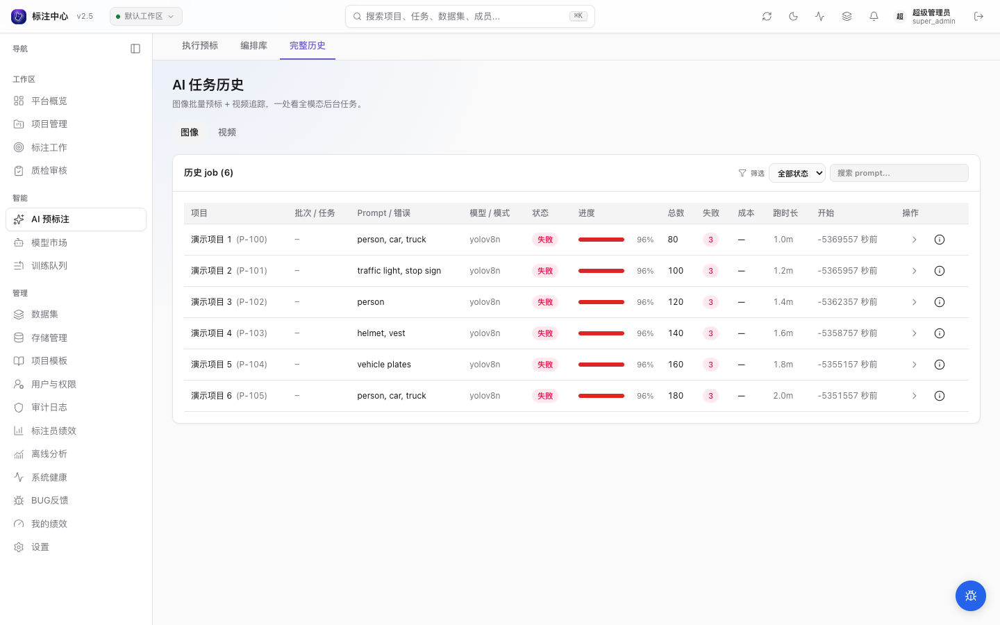

# AI 任务与失败恢复

本页说明项目管理员和超级管理员如何在应用内查看 AI 任务、取消不再需要的批量预标、恢复可重试的失败项，并在需要时把基础设施问题交给运维人员。图片批量预标、外部预测导入等长任务显示在 `/ai-pre/jobs`；视频追踪记录在同页的「视频」标签（`/ai-pre/jobs?tab=video`），但候选审阅仍在视频工作台完成。

## 先在 Jobs 页面定位

1. 主导航进入 **AI 预标**，打开 **Jobs**；失败任务可用 `?status=failed` 过滤。
2. 按项目、状态、任务类型或关键词缩小范围，打开任务详情查看错误、时间线和结果摘要。
3. 确认任务属于当前项目和当前操作；不要只看浏览器右上角的任务铃。任务铃可以隐藏终态记录，完整历史以 Jobs 页面为准。

## 按状态处理

| 状态或现象  | 应用内处理                                         | 数据影响                             |
| ----------- | -------------------------------------------------- | ------------------------------------ |
| `pending`   | 确认配置无误后等待 worker 领取；不再需要时取消     | 尚未写入预测                         |
| `running`   | 需要停止时取消；批量预标会在下一条预测边界协作停止 | 已处理的候选不会回滚                 |
| `completed` | 打开对应批次或工作台审阅候选                       | 未接受候选仍可拒绝或清理             |
| `failed`    | 查看错误和可重试项；修正配置或服务后重试           | 已成功写入的候选保留                 |
| `cancelled` | 查看结果摘要；保留部分候选或按来源清理后重跑       | 只停止后续处理，不自动删除已写入结果 |

批量预标仅允许取消 `pending` 或 `running` 任务。取消不是强杀：worker 会在安全边界停止并保留成功、失败、跳过和取消位置的摘要。

## 重试或重新运行

当任务详情包含可重试的失败项时，项目管理员或超级管理员可从详情页排队重试。旧任务没有可重试项时，转到失败列表逐条处理，或在修复前置条件后重新发起批量预标。

重试会沿用原失败项的模型和推理参数，成功后在 Jobs 列表新增一条「已完成」的 `prediction_retry` 记录；原批量任务仍保留失败终态作为历史快照。打开「全部状态」即可同时核对原失败记录和完成的重试记录，再从重试行点击「去工作台」审阅新候选。

<DocsVideo
  src="/media/workflows/jobs-retry-recovery.mp4"
  poster="/media/workflows/jobs-retry-recovery-poster.webp"
  alt="打开 RapidOCR 失败作业详情，重试一条失败项，确认新的重试作业已完成后进入图片工作台查看真实 OCR 候选"
  caption="原失败作业保留为历史快照；恢复结果以新的已完成 retry 作业呈现，并可直接进入单题审阅候选。"
/>

重新运行前，先决定怎样处理已有候选：

- **跳过已预标**：只补尚无预测的任务，适合恢复局部失败。
- **覆盖**：先清除该范围的 AI 预测与 AI 标注，再重新预标；人工标注保留。
- **追加**：在已有预测上再写一份，只适合明确需要并行比较结果的场景。

这些模式和运行前置条件见[AI 预标](../projects/ai-preannotate)。需要按来源批量删除候选时，使用[外部预测导入 / 导出](../datasets/prediction-import-export#清理预测)。

## 什么时候应升级给运维

以下情况不要在界面中反复重试：

- 多个项目或多个 backend 同时失败；
- 错误提示连接失败、认证失败、超时或模型服务不可用；
- 任务长期停留在 `pending` 或 `running`，且队列没有推进；
- 视频追踪发生 GPU 内存不足、分窗或帧服务问题。

把 job ID、项目、出现时间和错误摘要提供给运维人员，并使用对应 runbook：

- [ML Backend 不可用](/ops/runbooks/ml-backend-down)
- [Celery Worker 卡死](/ops/runbooks/celery-worker-stuck)
- [视频帧服务](/ops/runbooks/video-frame-service)

## 与候选审阅的边界

恢复任务不会自动把模型结果变为正式标注。批量预标和外部导入产生的是候选，标注员仍需在工作台接受、拒绝或编辑；候选审阅的快捷键和数据边界见[审阅 AI 候选](../ai/candidate-review)。

视频 AI 追踪使用单独的 job 级审阅：即使取消后仍有部分结果，也要在视频工作台中整批接受或丢弃，见[视频关键帧传播与 AI 追踪](../workbench/video-propagate)。

## 相关页面

- [AI 辅助标注](../ai/) — 按任务选择其它 AI 流程。
- [项目 ML 模型](../projects/ml-backends) — 检查项目是否启用了需要的 backend 和能力。
- [失败预测排查](../superadmin/failed-predictions) — 超管视角的跨项目诊断与审计信息。
