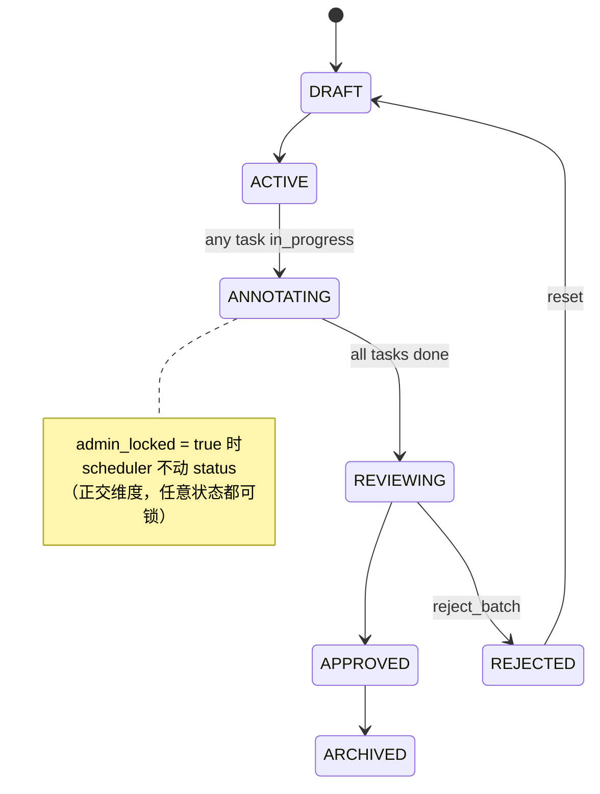

# ADR-0008: 批次 admin-locked 字段（与状态机正交）

## 状态

**Proposed（v0.8.2 仅设计；实现推迟到 v0.9 评估窗口，前提是 scheduler 测试覆盖补齐到能验证锁短路路径）**

## 背景

`BatchService.check_auto_transitions`（`apps/api/app/services/batch.py:661-692`）是批次状态机的"自动驾驶"——基于子 task 的状态自动推进 batch.status：

```
ACTIVE        ─→  ANNOTATING   （任意 task 进入 in_progress）
ANNOTATING    ─→  REVIEWING    （所有 task 离开 pending / in_progress）
```

每个写 task 的端点（assign / submit / reset）调用一次 `check_auto_transitions`，让运维不需要手动推 batch 状态。

但 ROADMAP A §批次状态机二阶段提到一个真实需求：**临时叫停一个批次（`annotating → active`）**——比如标注规范要改、数据有版权问题、客户要求暂停。当前这条迁移做不动：

1. 直接改 `batch.status = ACTIVE`；
2. 下一个标注员请求 task 时，scheduler 看到任 task 是 in_progress，立即把 batch 推回 ANNOTATING；
3. 等于没暂停，且每次重试还覆写状态，运维体感"按钮失灵"。

强行做的话还要把 in_progress task 全部复位到 pending（等于踢断标注员现场），代价大且语义错（暂停不应丢数据）。

## 决策

引入 batch 级 `admin_locked: bool` 字段，**与 7 态 `status` 枚举正交**。`check_auto_transitions` 起始处短路返回：

```python
async def check_auto_transitions(self, batch_id: uuid.UUID | None) -> None:
    if not batch_id:
        return
    batch = await self.db.get(TaskBatch, batch_id)
    if not batch or batch.admin_locked:
        return  # admin 锁定时 scheduler 不动 status
    # ... 既有逻辑保持不变 ...
```

`admin_locked = True` 时：
- scheduler 完全不读 / 不写 batch.status，已 in_progress 的 task 保持原位（标注员可继续在已锁的题上保存——锁的是 batch 级状态推进，不是 task 锁）；
- 新分配 task 走 `BatchAssignmentService` 的另一条短路（仍需在该服务也加同样的检查；`/batches/{id}/lock` API 应触发"停止派单"事件）。

### 状态机示意



### 表迁移

```sql
ALTER TABLE task_batches
    ADD COLUMN admin_locked BOOLEAN NOT NULL DEFAULT FALSE,
    ADD COLUMN admin_locked_at TIMESTAMPTZ NULL,
    ADD COLUMN admin_locked_by UUID NULL REFERENCES users(id);

CREATE INDEX ix_task_batches_admin_locked ON task_batches(admin_locked) WHERE admin_locked;
```

部分索引（`WHERE admin_locked`）让"列出所有被锁的批次"扫描成本与锁定批次数线性相关，而非全表。

### API 影响

新增两个端点（admin / project_owner only）：

- `POST /batches/{id}/lock`，body `{ "reason": "..." }` → 写 `admin_locked=true / _at=now / _by=current_user.id`，写审计 `BATCH_ADMIN_LOCK`，通知 batch.assignee。
- `POST /batches/{id}/unlock` → 清三字段，写审计 `BATCH_ADMIN_UNLOCK`。

前端在批次列表 / 详情页显示 lock 徽标（`<Lock />` 图标 + tooltip "由 X 于 Y 锁定，原因：..."）。

### 通知

- 锁定时：通知项目所有 super_admin / project_owner / 批次内所有 assignee（`NotificationService.dispatch(NotifType.BATCH_ADMIN_LOCK, ...)`）。
- 解锁时：通知同上群体 + 让前端取消"批次已暂停"的 banner。

## 拒绝的方案

### A. 新增 PAUSED 枚举值

把 `BatchStatus` 扩成 8 态。

**为什么不**：
- 状态机基数膨胀，下游查询（`status IN ('annotating', 'reviewing')` 之类的过滤）都要加 `OR PAUSED`；
- 看板 / 报表 / 项目卡片"批次概览"全都得跟改，触发点 8+；
- 暂停语义本就**正交**于业务推进——它不是另一种业务状态，而是"业务推进按钮被关掉"。塞进枚举是把维度混掉。

### B. task 级锁

给每个 task 加 `locked: bool`。

**为什么不**：
- 粒度错：运维场景几乎都是项目 / 批次级（数据版权、规范修订、客户 hold），而不是单题；
- O(N) 写代价：锁批次 1 次变更 → 锁 task 要 N 次 UPDATE；
- 标注员同一批次内"有的题能标有的不能"是糟糕 UX。

### C. 不动 scheduler，靠"标志位 + 调度器忽略"绕过

例如把 `BatchStatus.ARCHIVED` 当临时锁。

**为什么不**：ARCHIVED 是终态，语义为"批次已归档不可操作"，借它当暂停按钮等于丢失了"暂停后还要恢复"的语义。

## 后果

**正向**：
- 运维有了真正的暂停按钮；锁状态独立记录 actor / time / reason，审计完整；
- 状态机基数不变，下游零改动；
- API 设计简单（只两个端点，无 transition graph）。

**需注意**：
- `BatchAssignmentService`（task 派发入口）要加同样的 `if batch.admin_locked: raise Locked` 短路，否则锁的是 status 推进但 task 还能新派——半锁状态。实施时一并改。
- 既存 `check_auto_transitions` 调用方（约 10+ 处）零侵入：只要短路在函数内部，调用方该怎么调还怎么调。
- 前端列表过滤需要新增 `?admin_locked=true|false` query；中等改动量。

## 不在本 ADR 范围

- 实现代码（v0.9 跟进）；
- "批次级超时自动解锁"（如锁定 30 天后自动解锁）—— 暂不引入，避免与 ARCHIVED 冷归档语义重叠，等真实运营需求出现再开新 ADR。

## 引用

- `apps/api/app/services/batch.py:661-692` —— `check_auto_transitions` 当前实现
- `apps/api/app/db/enums.py:27-34` —— `BatchStatus` 7 态枚举
- ROADMAP A §批次状态机增补 · 二阶段 ——「`annotating → active` 暂停」难点描述
- ADR-0005 —— 任务锁与审核流转角色矩阵（task 锁的实现参考）
