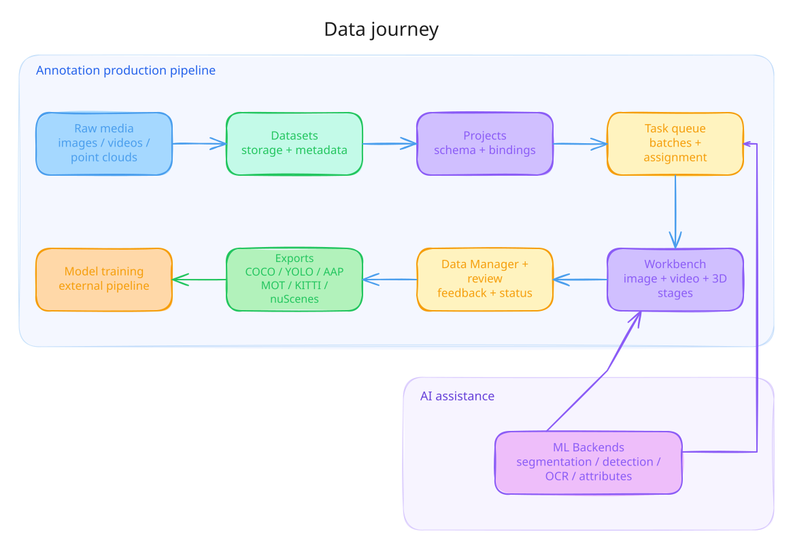
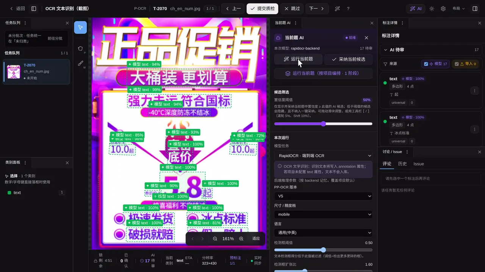
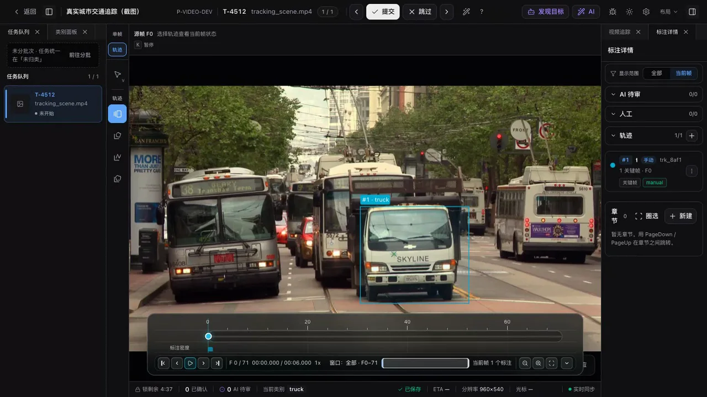
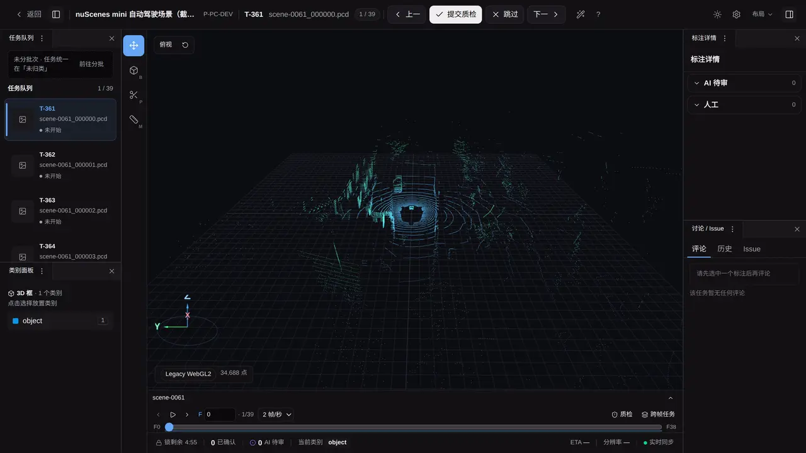
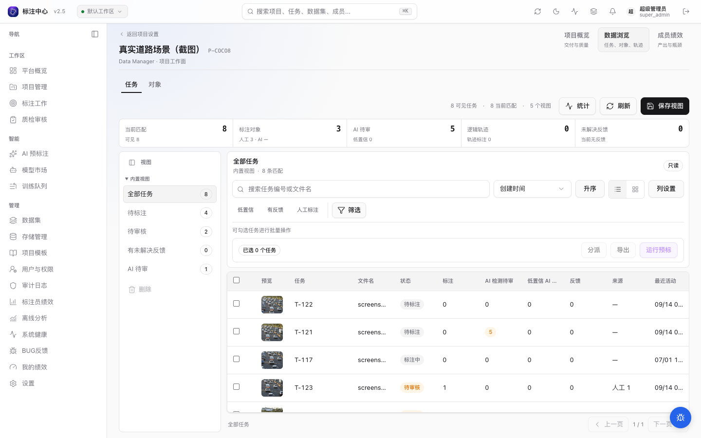
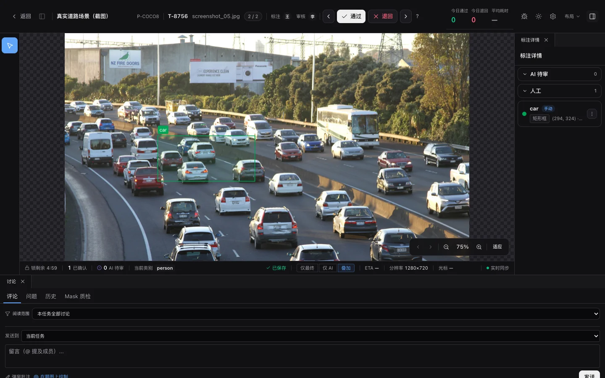
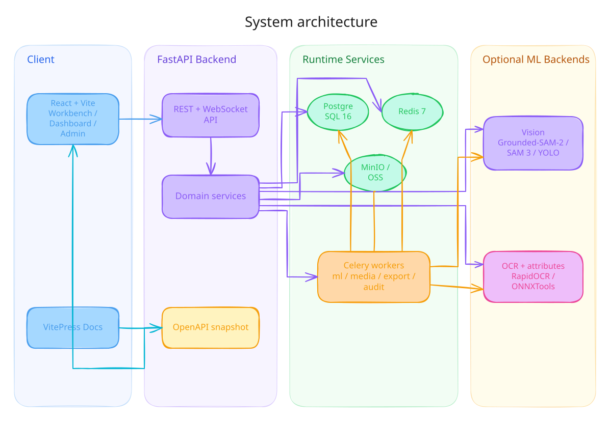

# 我做了一个开源 AI 标注平台：让团队、标注员和 AI 模型在一条工作流里协作

> 发布平台：知乎、微信公众号、掘金等<br>
> 推荐话题：数据标注、计算机视觉、人工智能、开源项目、产品设计<br>
> 项目地址：[GitHub](https://github.com/yyq19990828/ai-annotation-platform)<br>
> 在线文档：[AI Annotation Platform Docs](https://yyq19990828.github.io/ai-annotation-platform/)

<!-- 发布时可删除上面的编辑信息。文中的仓库相对路径图片需要逐张上传到目标平台。 -->

如果只是给几张图片画框，单机工具已经足够多。团队真正开始生产数据后，难点很快会从“怎么画”变成另外三件事：谁可以创建项目和分配任务，标注员怎样用更少的操作完成判断，模型如何稳定地进入生产流程。

数据要先导入和组织，项目要拆成批次与任务，不同角色只能看到和操作自己负责的部分。AI 生成的结果不能直接当成答案，还要经过候选审阅、人工修正和质量审核。模型本身也需要注册、启用、编排、监控和失败恢复。

我做 AI Annotation Platform 的出发点，就是把这三类对象放进同一个系统：团队通过用户与权限协作，标注员通过交互式工作台完成判断，AI 模型通过可管理的工作流参与生产。


_在真实道路图片中调用模型生成候选，再由人工确认类别和结果。_

## 这个项目是什么

AI Annotation Platform 是一个面向团队协作的开源 AI 标注平台，支持图像、视频和点云数据。它的重点不是堆叠画图工具，而是把用户管理、交互式标注和 AI 模型工作流连成一条可追踪的数据生产线。

它覆盖一条完整的数据生产链路：

1. 导入本地文件或对象存储中的数据；
2. 创建项目、数据集、批次和标注任务；
3. 使用人工工具或模型生成标注结果；
4. 在工作台中修正、补充并提交；
5. 由审核员检查结果，必要时回退重做；
6. 通过开放格式导出，进入训练、评估和下一轮模型迭代。

这条链路里，模型负责处理适合自动化的部分，人负责边界、类别和异常判断，系统负责保存任务状态与操作上下文。



_数据从导入到交付的主要路径。_

## 三个最突出的产品特点

### 1. 用户管理：先明确谁能做什么

标注项目通常由多种角色共同完成。平台内置超级管理员、项目管理员、质检员、标注员和观察者五种角色：超级管理员负责平台配置与全局管理，项目管理员组织项目和人员，质检员负责审核，标注员只处理分配给自己的任务，观察者用于只读查看。

用户管理页集中处理成员邀请、角色调整、数据组、账号停用与解封、API Key 和权限矩阵。角色权限会继续作用到项目、任务、审核、数据与模型管理入口，而不是只在用户列表里显示一个标签。


_管理员可以查看团队成员、角色、数据组和邀请记录。_


_权限矩阵明确不同角色可以执行的项目、任务、用户、数据和模型操作。_

这部分解决的是团队生产最基础的问题：标注员不需要接触系统配置，质检员不会误改项目结构，项目管理员可以按角色和数据组组织人员，历史标注与审核记录也不会因为账号停用而消失。

### 2. 交互式标注：让标注员留在画布里完成判断

交互式标注不只是“多提供几个工具”。它要缩短从看到目标、给出提示、检查结果到确认入库的操作路径。平台既提供 bbox、旋转框、polygon、polyline、keypoint、mask 等人工工具，也提供点、框、笔迹和视觉示例驱动的 AI 工具。

标注员可以在目标上点一下、拖一个粗框、补一笔正负区域，或者框出一个示例让模型查找相似对象。大部分结果先显示为候选，标注员可以切换、接受、拒绝、修改类别或继续精修；Magic Box 则在模型收紧粗框后直接进入类别确认。整个过程不需要离开当前任务去运行独立脚本。

### 3. AI 模型工作流：模型不止是一个接口地址

模型接入之后，还需要回答一组产品问题：它支持什么任务，能接收哪些输入，会输出什么几何和属性，在哪些项目中启用，批量任务如何运行，失败后在哪里重试。

平台用模型市场集中展示 ML Backend、模型能力和运行状态；项目管理员再按项目启用所需模型。运行侧同时支持当前题推理、批量预标、视频追踪和多阶段编排，模型结果统一进入候选审阅，而不是绕过人工流程直接写成最终标注。


_模型市场集中呈现模型能力、连接状态和基础设施信息。_

下面分别展开这三条产品主线中的工作台与模型流程。

## 多模态标注工作台

交互式体验建立在不同模态的工作台之上。目前平台覆盖图像与 OCR、视频轨迹、点云，以及结果管理和审核。

### 图像、OCR 与像素级标注

图片工作台支持 bbox、旋转框、polygon、polyline、keypoint 和 mask，也包含 OCR 的检测与识别流程。

除了常规目标检测，平台也在持续处理更接近真实生产的问题。例如大图需要按视口加载瓦片，栅格掩码需要控制浏览器内存与计算资源，复杂对象则需要画笔、布尔运算和边界修正。对使用者来说，它们最后仍然应该表现为一个顺手的工作台，而不是一组需要手动拼装的底层能力。


_图像工作台把工具、画布、对象列表和任务操作集中在同一页面。_



_[观看完整演示](../../docs-site/public/media/ai/ocr-current-task.mp4)：OCR 当前题推理从启动模型到生成文本区域候选。_

### 视频轨迹标注

视频不是把图片标注重复很多次。平台提供关键帧、轨迹、插值、outside 区段、帧缓存与 chunk 服务，让同一个目标可以沿时间轴持续编辑和检查。



_[观看完整演示](../../docs-site/public/media/video/workbench-overview.mp4)：在时间轴中查看关键帧，并持续编辑同一目标的轨迹。_

### 点云与多模态联动

三维工作台支持点云 3D 框、点级分割和 scene 时序数据，并处理 LiDAR 坐标归一化与相机投影联动。标注员可以在三维视图里确认空间位置，也可以借助图像视角判断目标边界。



_[观看完整演示](../../docs-site/public/media/pointcloud/orbit.mp4)：旋转三维视角，检查空间结构和标注位置。_

### Data Manager、审核与数据交付

标注结果不能只留在画布里。Data Manager 提供任务、对象和轨迹视图，用来筛选数据、查看进度和定位异常。审核流程支持通过、回退与反馈，导出侧覆盖 COCO、YOLO、DAVIS、MOT、KITTI、nuScenes、Point Mask 等格式。



_Data Manager 用于查看任务、对象、轨迹和聚合信息。_



_审核员可以检查标注结果，并将有问题的任务退回修正。_

## 交互式标注：人和模型在画布上配合

我不希望 AI 在平台里只是一个“点击后自动生成结果”的按钮。对标注员来说，模型应该直接响应画布手势；对项目管理员来说，结果还要保留任务、参数、模型与后台作业上下文。

当前图片工作台提供五种画布手势驱动的 AI 工具：

- 智能点：在目标上点击，生成轮廓候选；
- 智能框：拖出目标范围，在框内提取边界；
- 智能笔迹：在已有 Mask 上追加正向或负向笔迹，修正缺失和误分区域；
- Magic Box：先画一个粗框，再由模型自动收紧；
- Exemplar：给出一个视觉示例，查找画面中外观相似的目标。


_[观看完整演示](../../docs-site/public/media/sam/smart-point.mp4)：智能点单击目标后生成可选择的轮廓候选。_


_[观看完整演示](../../docs-site/public/media/sam/smart-box.mp4)：智能框拖出目标范围，由模型提取框内对象边界。_


_[观看完整演示](../../docs-site/public/media/ai/assisted-annotation.mp4)：Magic Box 从一个粗略矩形开始，自动得到贴合目标的检测框。_


_[观看完整演示](../../docs-site/public/media/sam/exemplar.mp4)：Exemplar 用一个示例目标查找画面中的相似对象。_

项目级 AI 预标注可以先对一批任务运行模型，再把候选结果送入人工工作台。视频侧可以调用 tracker 延续目标轨迹，OCR 侧可以完成文本检测与识别。平台已经接入 Grounded-SAM-2、SAM 3、YOLO、ONNXTools 和 RapidOCR，并通过开放的 ML Backend 协议管理模型能力、连接状态与任务路由。


_[观看完整演示](../../docs-site/public/media/projects/ai-pre-variant-selector.mp4)：项目管理员可以选择模型能力与变体，再把预标注任务交给后台队列。_

这里仍然坚持 human in the loop。模型输出默认是候选，不应该在缺少检查的情况下直接变成最终训练数据。

## AI 模型工作流：从接入模型到人工接管

AI 工作流在平台里分成六步：

1. 超级管理员在模型市场注册或检查 ML Backend，平台读取模型声明的任务、输入、输出、参数和资源能力；
2. 项目管理员为具体项目启用模型，只有与项目工具和数据模态匹配的能力才会进入工作台；
3. 管理员选择直接运行单模型，或在可视化 DAG 中搭建“检测 → 分类 → 属性写回”等多阶段编排；
4. 编排可以针对当前图片执行，也可以提交到后台，对一个或多个批次运行；
5. 模型结果先保存为 Prediction 候选，标注员接受后才成为可以继续编辑的 Annotation；
6. 任务历史保留进度、取消、部分结果和失败项，项目管理员可以定位并重试可恢复任务。

多阶段编排用于处理单次推理解决不了的问题。例如先检测车辆，再对每个车辆框判断车型、颜色或车牌；也可以先检测文本区域，再把裁剪结果交给 OCR 识别模型写回 `text` 属性。不同阶段可以来自不同 ML Backend，编排保存后还能在当前题推理和批量预标之间复用。

这条流程把“模型接上了”推进到“模型可以被团队稳定使用”。模型能力、项目配置、运行任务、候选结果和人工决定都有明确位置。

## 我所说的“面向生产”

这里的 production-grade 是一个工程目标，不是一句“部署后什么都不用管”的承诺。它主要体现在几个具体方面：

- 五类用户角色、权限矩阵、邀请、数据组和任务分配共同约束团队协作；
- 标注之外还有项目、批次、候选审阅、审核回退和通知；
- AI 预标、导出、视频帧处理等耗时操作进入后台任务队列；
- PostgreSQL、Redis 和 MinIO / OSS 分别承担结构化数据、队列状态与对象存储；
- Prometheus、Grafana、结构化日志和错误监控用于观察运行状态；
- API 契约、自动化测试、视觉回归、架构决策记录和独立文档站跟随代码维护；
- ML Backend 使用开放协议，工作台不和某一个模型实现绑死。

生产环境仍然需要根据团队的数据规模、GPU 资源、安全要求和可用性目标完成部署配置。这个项目提供的是一套可运行、可扩展、可以继续迭代的基础，而不是替每个团队做出相同的运维决策。

## 技术架构

前端使用 React 18、TypeScript、Vite、TanStack Query、Zustand、Konva 和 Three.js。后端使用 FastAPI、Pydantic、SQLAlchemy 2、Alembic 与 Celery。数据层由 PostgreSQL、Redis 和 MinIO / OSS 组成，模型服务则以独立 ML Backend 的形式接入。

浏览器通过 API 完成项目管理和标注读写，Celery Worker 处理预标注、导出、通知、视频帧等异步任务。GPU 模型服务可以按资源条件单独部署，不要求所有模型挤在同一个进程里。



_平台的主要服务、存储与模型调用边界。_

整个仓库采用 pnpm workspace 组织。Web、API、多个模型后端、共享协议、基础设施配置、用户文档和架构记录都放在同一个代码库里，方便在修改产品行为时同步更新接口与文档。

## 如何本地运行

本地开发需要 Node.js 20、pnpm 10、Python 3.11、uv 和 Docker Compose。基础启动流程如下：

```bash
# 安装依赖
pnpm install
cd apps/api && uv sync --extra test && cd ../..
pnpm codegen

# 启动 PostgreSQL、Redis、MinIO 和开发邮件服务
docker compose up -d postgres redis minio mailpit

# 初始化数据库
cd apps/api && uv run alembic upgrade head && cd ../..

# 分别启动后端与前端
pnpm dev:api
pnpm dev:web
```

启动后，Web App 默认位于 `http://localhost:3000`，Swagger UI 位于 `http://localhost:8000/docs`。Grounded-SAM-2、SAM 3、YOLO、ONNXTools、RapidOCR、Celery Worker 和监控服务可以根据机器资源按需启动，具体命令在项目 README 与部署文档中维护。

## 这个项目适合谁

如果你正在做下面这些工作，这个仓库可能值得参考：

- 为计算机视觉项目搭建内部数据标注与审核流程；
- 管理标注员、质检员和项目管理员之间的角色与任务边界；
- 研究图像、视频或点云工作台的交互与数据结构；
- 把 SAM、YOLO、OCR 或自研模型接入交互式与批量标注流程；
- 编排检测、分类、OCR 和属性写回等多阶段模型任务；
- 处理批量预标、异步导出、对象存储和任务调度；
- 了解一个全栈标注平台如何组织 API、前端、模型服务、文档和测试。

它也适合希望参与开源协作的开发者。项目使用 MIT License，代码、文档、API 与架构决策都可以在仓库中查看。

## 接下来准备写什么

这篇先介绍全貌。后续文章计划沿着真实的数据生产流程展开：

1. 五类用户角色、权限矩阵、邀请与任务分配；
2. 智能点、智能框、智能笔迹、Magic Box 和 Exemplar 的交互设计；
3. 模型市场、项目启用与多阶段 AI 编排；
4. 视频关键帧、插值与多目标追踪如何组织；
5. 点云 3D 框、点级分割和相机投影联动；
6. Data Manager、审核回退与多格式导出；
7. ML Backend 协议、后台任务、GPU 资源调度与可观测性；
8. 大图、视频解码和栅格掩码在浏览器里的性能处理。

如果你想先了解某一部分，可以直接查看在线文档；如果你正在做类似系统，也欢迎在 GitHub 查看实现、提交 Issue 或参与讨论。

- GitHub：<https://github.com/yyq19990828/ai-annotation-platform>
- 在线文档：<https://yyq19990828.github.io/ai-annotation-platform/>
- License：MIT

---

## 发布时的配图与摘要建议

<!-- 本节是编辑备注，正式发布时可删除。 -->

### 推荐封面文案

```text
AI Annotation Platform
面向团队的开源 AI 标注平台
用户管理 · 交互式标注 · AI 模型工作流
```

封面优先使用 AI 辅助标注工作台截图，保留真实产品界面，不建议使用纯概念插画。

正文优先保留 Smart Point、Smart Box、Magic Box、Exemplar、视频轨迹、点云旋转、OCR 和项目级预标注这 8 张 GIF。发布到知乎或公众号时需要逐张重新上传，不要直接使用仓库相对路径。如果平台压缩后文字变得模糊，可以保留 GIF 的操作区并裁掉浏览器边框与大面积静态区域。

### 备选标题

1. 一个标注平台，不该只是“能画框”：用户、工作台与 AI 模型如何协作
2. 我做了一个开源 AI 标注平台：从交互式标注到模型工作流
3. 开源 AI 标注平台：用户管理、交互式标注与多阶段模型编排

### 发布摘要

AI Annotation Platform 是一个面向团队协作的开源 AI 标注平台。它通过角色与权限管理组织人员，通过图像、视频和点云工作台完成交互式标注，并把模型注册、项目启用、多阶段编排、批量运行、候选审阅与失败恢复连成完整的 AI 工作流。
