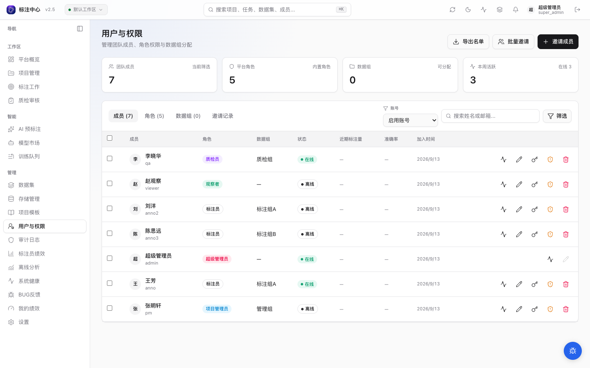
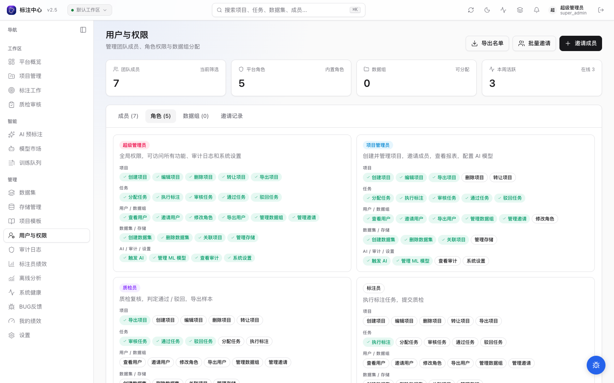
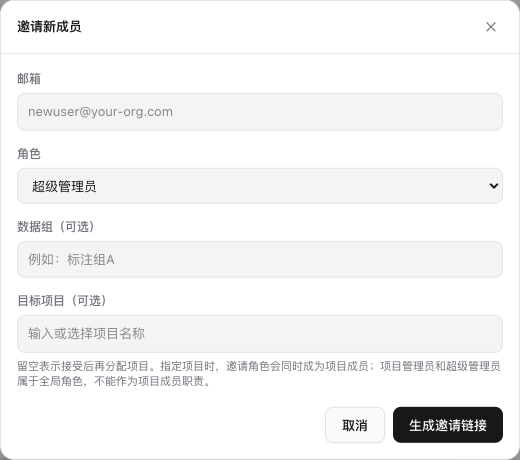
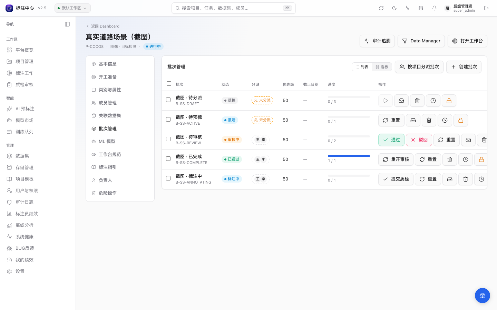
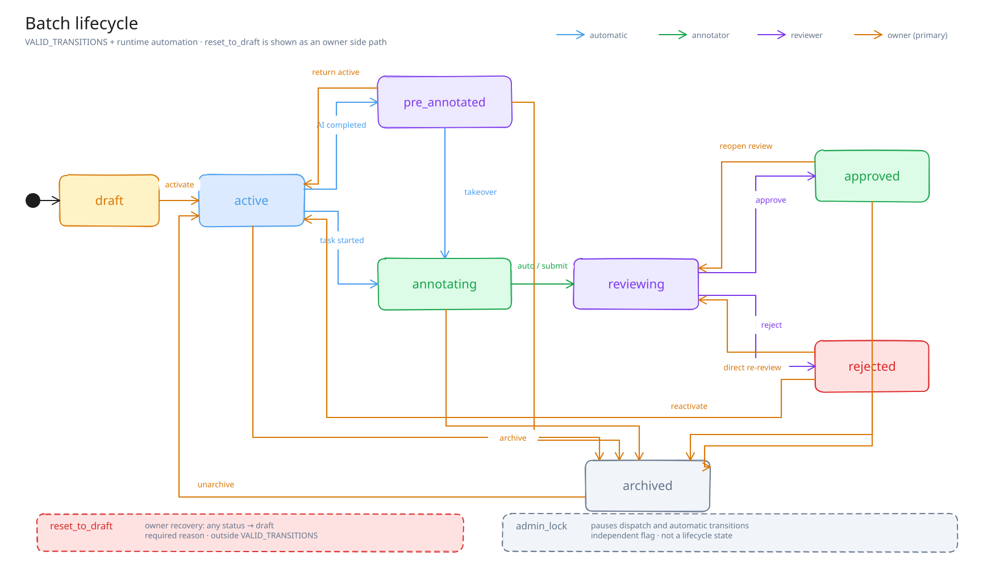
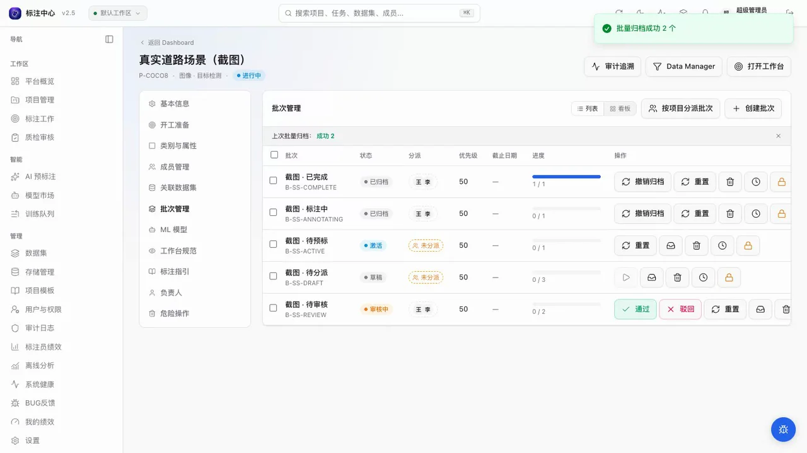
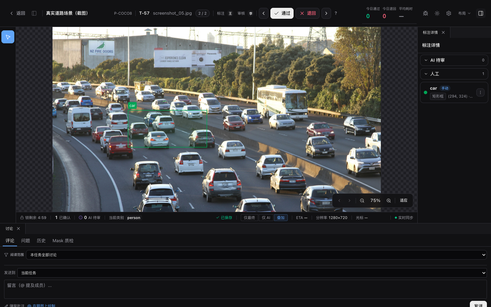
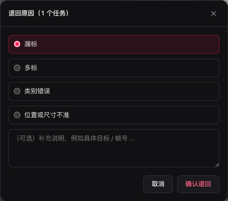

# 一批标注数据，怎样在 5 种角色之间流转？

> 系列：AI Annotation Platform 产品拆解 · 第 2 篇<br>
> 发布平台：知乎、微信公众号、掘金等<br>
> 推荐话题：数据标注、计算机视觉、团队协作、权限管理、开源项目<br>
> 项目地址：[GitHub](https://github.com/yyq19990828/ai-annotation-platform)<br>
> 在线文档：[AI Annotation Platform Docs](https://yyq19990828.github.io/ai-annotation-platform/)

<!-- 发布时可删除上面的编辑信息。文中的仓库相对路径图片需要逐张上传到目标平台。 -->

两三个人一起标数据时，共用一个管理员账号也能干活。人一多，谁能改项目、谁负责这一批数据、谁有资格通过结果，很快就比多一个画框工具更紧迫。所有人共用一个账号，出了问题也很难还原是谁完成、谁审核、谁重新打开了任务。

AI Annotation Platform 内置了五种角色，同时决定页面入口、项目可见范围、批次分配和状态迁移。成员登录后只会看到与自己工作有关的入口。一批任务交给下一个角色时，状态、负责人和审核反馈都会保留下来。



_用户与权限页集中展示成员、角色、数据组、活跃状态和邀请入口。_

## 五种角色，各自负责一段工作

平台目前固定为五种角色，每一种都对应一组具体操作。

| 角色       | 在平台里的主要工作                                     |
| ---------- | ------------------------------------------------------ |
| 超级管理员 | 管理全平台用户、系统设置、审计、模型运行与基础设施入口 |
| 项目管理员 | 创建项目和数据集，配置工具与模型，组织成员、批次和导出 |
| 质检员     | 查看待审核任务，在完整工作台中通过或退回结果           |
| 标注员     | 从允许领取的批次进入工作台，完成标注并提交质检         |
| 观察者     | 只读查看被授权的项目与数据，不参与标注和审核操作       |

权限矩阵按项目、任务、用户与数据组、数据集与存储、AI 与系统设置分组。项目管理员可以创建项目和分配任务，但不能修改系统设置；标注员可以提交标注，不能自行通过结果；质检员负责审核，也不能改项目配置。



_权限矩阵按业务动作展示五类角色的能力范围，绿色条目表示该角色拥有对应权限。_

## 页面会收起，接口也会拦住

前端会按角色收起无关页面，后端再独立检查每次操作。超级管理员可以查看全部项目，项目管理员只能管理自己负责的项目，其他成员必须先加入项目。无权查看的项目按不存在处理，不向调用方暴露项目是否存在。

批次状态也受角色约束。被分配的标注员可以把标注中的批次送审；质检员或项目负责人决定通过与退回；归档、重开审核和重置批次由项目负责人处理。直接调用接口不能绕过这些限制。

## 邀请发出时，角色和数据组已经定好

管理员发起邀请时填写邮箱、角色和可选的数据组。项目管理员只能邀请质检员、标注员或观察者，超级管理员可以选择全部角色，这个范围由服务端校验。



_邀请时预设邮箱、角色和数据组，成员接受后直接进入对应工作位置。_

平台生成一次性邀请链接，默认有效期为 7 天，明文链接只在创建时显示。平台不会代发邀请邮件，管理员需要通过受控渠道把链接交给成员。接受邀请时，成员补充姓名和密码；系统按邀请创建账号，并将邮箱视为已验证。邀请里指定了数据组时，系统会复用已有组，或创建同名数据组，再写入正式的成员关系。

邀请记录可以继续跟踪、重发或撤销。撤销后旧链接立即失效。项目管理员只能管理自己创建的邀请，超级管理员可以管理全部邀请。高权限邀请要求签发者仍是有效的超级管理员，签发者被停用或降权后，链接也会失效。

数据组方便按长期分工筛选成员，比如道路场景组、OCR 组或夜班审核组。项目成员和批次负责人仍然逐个选择，换组只影响之后的派题，已经分配的任务不会自动换人。

## 批次记录谁来标，谁来审

批次（Batch）是分配、推进、审核和归档的基本单位。每个批次记录一名主标注员和一名主审核员。项目管理员可以按数据来源、采集时间、难度或工作节奏拆分批次，也可以把多个批次循环分给选中的标注员和审核员。分配结果会同步到批次内的任务。



_一个项目里的批次可以分别处于草稿、标注中、AI 预标完成、审核中、已通过或已归档等阶段。_

一批数据通常按下面的顺序流转：

1. 项目管理员创建批次并指定人员；
2. 批次激活后进入标注队列；
3. 标注员开始处理任务，批次进入标注中；
4. 全部任务完成或标注员主动送审后，批次进入审核中；
5. 质检员决定通过或退回；
6. 项目负责人归档已完成批次，或在需要时重新打开。

AI 预标也在这条路径里。模型批量生成候选后，批次会显示为“AI 已预标，等待人工接管”。标注员接手后检查、修改候选，再进入正常审核流程，模型结果不会直接变成已通过数据。



_批次状态机把项目负责人、标注员、质检员和 AI 后台任务的交接位置放在同一张图里。_

批次较多时，可以多选后执行激活、归档、重新分配、删除、批量通过或批量驳回，批量操作不会绕过角色和状态限制。



_[观看完整演示](../../docs-site/public/media/projects/batch-bulk-actions.mp4)：勾选多个批次后，页面显示当前状态下可用的批量操作工具栏。_

## 标注员的页面只保留眼前的工作

标注员从自己的项目或批次进入工作台，系统从允许领取的队列中选择下一条任务。项目管理员提前配置类别、工具、AI 候选和工作台规范，标注员不用接触全平台的用户、模型和存储设置。

任务由谁领取、谁创建标注、何时提交、是否被退回，都有对应记录。账号停用后不能继续登录，已有标注和审核历史仍然保留。用户还有待处理任务时，删除操作会被阻止，管理员需要先完成转交。

## 审核退回时，问题跟着任务走

质检员从待审批次和任务队列进入审核工作台，在与标注员一致的图片画布或视频时间轴中检查结果。审核模式会换成通过、退回、任务锁和差异视图，不会只给一张缩略图让人判断。



_质检员在完整画布中查看标注对象，再决定通过或退回。_

退回时必须选择原因：漏标、多标、类别错误，或位置与尺寸不准。质检员还可以补充具体对象、轨迹编号和帧号。任务会回到原来的标注流程，已有标注历史不会被清空，标注员按反馈修改后重新提交。



_结构化原因用于统计常见质量问题，自由备注则帮助标注员定位具体目标。_

标注员负责修改结果，质检员决定是否通过，项目管理员处理批次的重开、归档和异常恢复。

## 当前边界

平台目前只有五种固定角色，不能自行创建任意权限组合。一个批次对应一名主标注员和一名主审核员，还不支持多人共识标注。数据组不会追溯修改已经发出的任务；批次锁定只暂停新派题和自动推进，不会把已有任务强制改成只读。

平台目前主要面向中小算法团队、研究团队和需要私有化部署的内部项目。

## 项目与文档

AI Annotation Platform 采用 MIT License 开源，支持图像、视频和点云标注，也包含 AI 预标注、模型工作流、审核、数据管理和多格式导出。

- GitHub：<https://github.com/yyq19990828/ai-annotation-platform>
- 在线文档：<https://yyq19990828.github.io/ai-annotation-platform/>
- 用户与权限文档：<https://yyq19990828.github.io/ai-annotation-platform/user-guide/superadmin/user-management>
- 批次与分配文档：<https://yyq19990828.github.io/ai-annotation-platform/user-guide/projects/batch>
- License：MIT

系列下一篇会继续拆解图片工作台里的交互式 AI：智能点、智能框、智能笔迹、Magic Box 和 Exemplar。

---

## 发布编辑备注

<!-- 本节是编辑备注，正式发布时可删除。 -->

### 推荐封面文案

```text
一批标注数据
怎样在 5 种角色之间流转？
邀请 · 分配 · 标注 · 审核
```

封面建议使用用户列表或权限矩阵截图，避免使用“企业级权限管理”这类过宽的表述。

### 备选标题

1. 标注平台里的五种角色：成员、批次和审核如何接力
2. 成员接受邀请后，一批标注数据怎样走到审核通过
3. 开源标注平台的权限设计：角色要进入任务流

### 发布摘要

AI Annotation Platform 内置超级管理员、项目管理员、质检员、标注员和观察者五种角色。成员接受邀请后，角色会继续影响项目可见范围、批次分配、标注队列和审核操作。文章也说明了固定角色、单批次单标注员与主审核员等当前边界。

### 短视频口播预告

> 标注团队一变大，谁能改项目、谁负责这一批数据、谁来审核，很快就会变成实际问题。AI Annotation Platform 用五种角色划分权限，再用批次连接项目管理员、标注员和质检员。成员接受邀请时就确定角色，标注提交后进入审核，退回原因会跟着任务回到工作台。

### 配图上传顺序

1. `users/list.png`：开场，展示团队成员与管理入口；
2. `users/permission-matrix.png`：说明五类角色的能力差异；
3. `users/invite-modal.png`：说明邀请时预设邮箱、角色和数据组；
4. `projects/batch-status-list.png`：展示批次、人员与状态；
5. `batch-lifecycle.svg`：解释角色交接与状态迁移；
6. `public/media/projects/batch-bulk-actions.mp4`：展示多选后出现批量操作栏；
7. `review/workbench.png`：展示完整审核画布；
8. `review/reject-form.png`：展示结构化退回原因。

发布到知乎或公众号时需要逐张上传，不要保留仓库相对路径。权限矩阵和批次状态截图在手机端文字较小，建议裁掉左侧导航和顶部统计卡，保留角色卡片或批次表格主体。`batch-lifecycle.svg` 如无法直接上传，可先导出为宽度 1600px 以上的 PNG。
