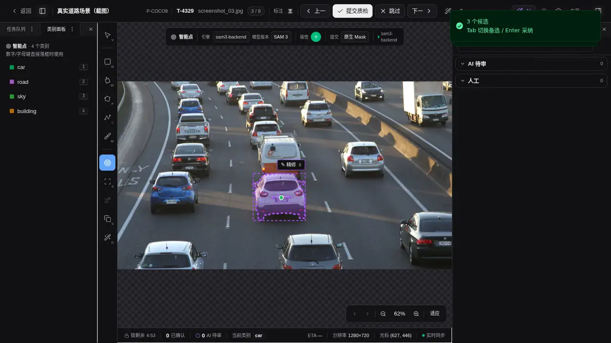
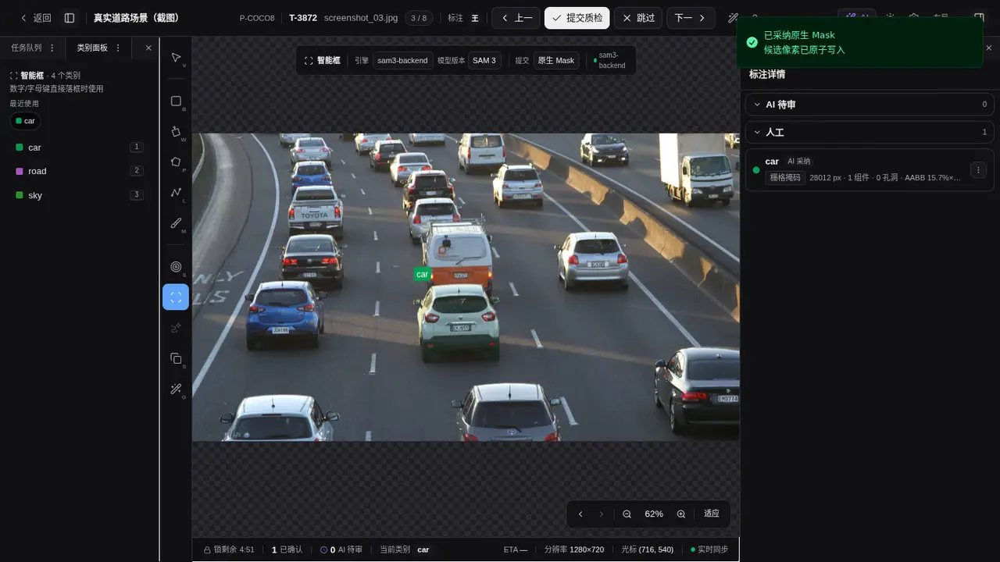
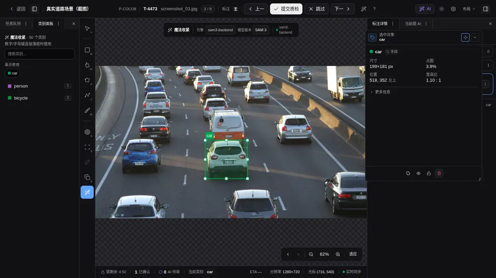
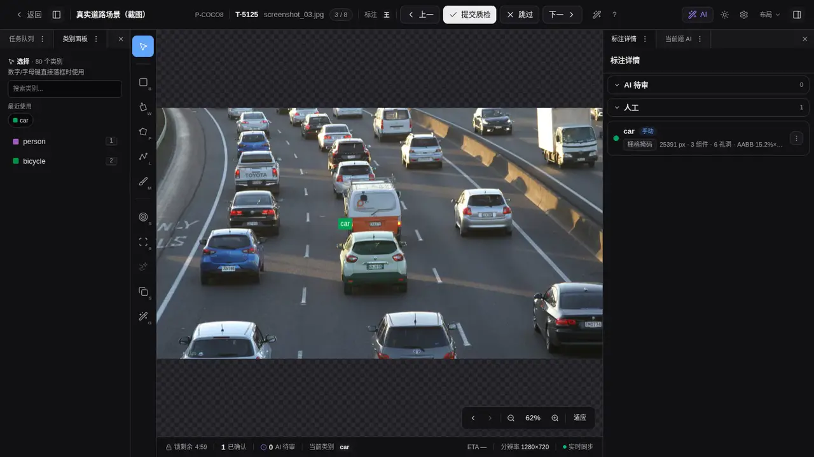
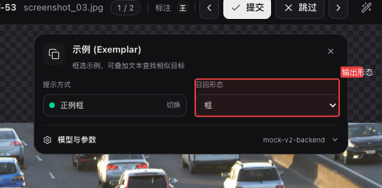
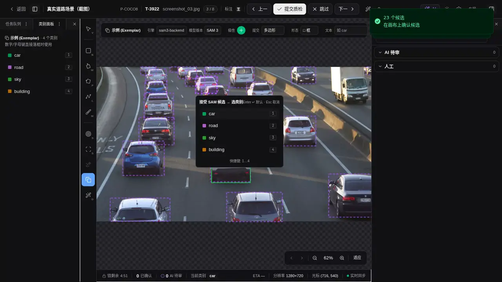

# 点一下、框一下、补一笔：标注工作台里的交互式 AI

> 发布平台：知乎、微信公众号、掘金等<br>
> 推荐话题：数据标注、计算机视觉、SAM、人工智能、开源项目、交互设计<br>
> 项目地址：[GitHub](https://github.com/yyq19990828/ai-annotation-platform)<br>
> 在线文档：[AI Annotation Platform Docs](https://yyq19990828.github.io/ai-annotation-platform/)

<!-- 发布时可删除上面的编辑信息。文中的仓库相对路径图片需要逐张上传到目标平台。 -->

给模型一张图，拿回一批框或 Mask，只解决了推理。标注员还得告诉模型目标在哪、哪些区域不要、结果该保存成什么几何，并在边界不准时继续修。

我在 AI Annotation Platform 里把这些动作放回画布。标注员可以点一下目标、拖一个范围、补一笔需要增减的区域，或者框出一个视觉样例。模型返回的结果大多先停在候选层，确认类别后才成为正式标注。

这组工具目前包括智能点、智能框、智能笔迹、Magic Box 和 Exemplar。五种工具共用交互分割能力，各自传递的操作意图不同。

| 标注员想做什么                 | 画布动作               | 工作台给出的结果                    |
| ------------------------------ | ---------------------- | ----------------------------------- |
| 指出一个目标                   | 单击或追加正负点       | polygon 或原生 Mask 候选            |
| 明确目标所在范围               | 拖出一个框             | 框内主要前景的轮廓候选              |
| 修正一条已有 Mask              | 追加正负点、框或笔迹   | 原位更新同一条原生 Mask             |
| 把粗略检测框贴紧目标           | 大致框住目标           | 紧凑 bbox，直接进入类别确认         |
| 用一个样例查找画面里的相似目标 | 框出正样例或追加负样例 | 多个 bbox、polygon 或原生 Mask 候选 |

## 点一下，先让模型判断边界

智能点适合目标明确、边界还没有现成几何可用的情况。标注员在目标内部单击，工作台把归一化坐标作为正向点交给支持点提示的模型，返回一个或多个轮廓候选。



_[观看完整演示](../../docs-site/public/media/sam/smart-point.mp4)：在车辆内部单击后，画布显示模型返回的轮廓候选，顶部提示可用 Tab 切换、Enter 采纳。_

第一次点击有歧义时，模型可以给出多个候选。`Tab` 和 `Shift+Tab` 用来切换，`Enter` 打开类别选择器，`Esc` 放弃这一轮。标注员也可以继续补点：正向点告诉模型目标还包括哪里，按住 `Alt` 单击，或切到负向极性，则表示这部分不要。

点会在当前精修会话里累加。模型每次都会拿到完整的正负点集，最后一次点击不会覆盖前面的提示。切题、切帧、切模型或主动取消时，这组临时提示会一起清理，不会留到另一张图上。

## 同样是拖框，智能框和 Magic Box 要的结果不同

背景杂乱时，一个点可能不足以说明目标范围。智能框让标注员先画出大致区域，模型只需要在这个范围里找主要前景。返回结果仍是轮廓候选，可以保存为 polygon；模型、项目和工具单位都支持时，也可以直接提交为原生 Raster Mask。



_[观看完整演示](../../docs-site/public/media/sam/smart-box.mp4)：拖框圈定车辆后，模型在框内提取主要前景，结果先以紫色轮廓候选显示。_

Magic Box 复用了拖框手势，但目标是检测框。标注员不必把矩形四条边拖到很准，只要大致包住目标。模型先算出目标 Mask，工作台再取它的紧凑外接矩形，随即打开类别选择器。选好类别后，结果作为 bbox 保存，不进入普通的多候选审阅流程。



_[观看完整演示](../../docs-site/public/media/ai/assisted-annotation.mp4)：Magic Box 先接收一个粗框，再按模型轮廓收紧边界。确认类别后，画布保存紧凑的车辆检测框。_

智能框回答的是“这个范围里的对象边界在哪里”，Magic Box 处理的是“把这个粗框收紧成检测框”。两者都使用单框提示，后续确认和保存路径不同。

## 已有 Mask 偏了，用智能笔迹继续改

智能笔迹只在选中一条已保存、未锁定的原生 Raster Mask 后启用。绿色正向笔迹用于补回漏掉的区域，按住 `Alt` 绘制或切到负向极性后，红色笔迹用于去掉误分区域。笔迹在这里是模型提示，不直接改写像素。



_[观看完整演示](../../docs-site/public/media/sam/smart-scribble.mp4)：选中已存原生 Mask 后，画布依次接收正向和负向笔迹，精修结果保持候选态，等待标注员确认。_

同一条 Mask 还可以继续用正负点或框精修。工作台把源 Annotation 的 ID 和版本交给平台，服务端读取已存 RLE，再将当前提示送给模型。确认候选后，系统更新原来的 Annotation，不会再创建一条重叠对象。

保存前还会检查源版本。如果这条 Mask 已被其他操作改过，旧候选不能覆盖新结果。网络请求失败时，当前候选、笔迹和源 Mask 会保留，标注员可以原样重试。

智能笔迹需要模型同时声明 Mask 与 scribble 提示能力，项目也要允许写入原生 Mask。有一项不满足，入口就会保持置灰并说明原因。

## 框一个样例，让 Exemplar 查找相似目标

智能框只处理框内的一个主要对象。Exemplar 使用相同的拖框动作，却把框里的对象当作视觉样例，在整张图里查找外观相似的实例。



_Exemplar 工具栏会按当前后端能力显示输出形态、正负样例、文本组合和置信度筛选控件。_



_[观看完整演示](../../docs-site/public/media/sam/exemplar.mp4)：框出一辆白色车辆后，Exemplar 在整张道路图中返回多个相似车辆候选。_

第一次结果不理想时，不必清空重来。支持完整 Exemplar 精修能力的 SAM 3 可以继续增加正样例来补召回，也可以用负样例排除误检；置信度阈值用来控制结果数量，还能叠加一个简短文本概念。每次调整都会带着当前框集、文本和阈值重新计算。

YOLOE 的视觉提示也能用多个正样例和置信度阈值找相似对象，但不接受负样例，也不叠加文本。工作台读取后端声明的 Exemplar 能力，只显示当前模型能处理的控件，不会让标注员填一组后端会忽略的参数。

Exemplar 的推理输出可以按模型能力选择框、掩膜或两者。结果多时可以逐条切换和确认，接受一个候选不会把其余候选一起写入正式标注。

## 候选先留在画布上

智能点、智能框、智能笔迹和 Exemplar 返回的是待确认候选。画布用紫色轮廓或 Mask 预览展示结果，标注员检查形状和类别后再接受。Magic Box 是例外，它只取一个紧凑矩形，结果返回后直接进入类别确认。

原生 Mask 也遵循这条路径。模型必须声明 Mask 输出，图片项目需要开启原生 Raster Mask 编辑，`region` 工具单位还要允许写入。条件不足时，提交选项会置灰并给出原因，不会悄悄把 Mask 换成 polygon。

候选只属于当前交互会话。切换任务、视频帧、模型或输出形态时，尚未接受的结果会被清理；请求失败则保留现场，方便重试。正式写入发生在确认之后，模型生成了候选不等于任务已经标完。

## 工具栏只显示当前模型能做到的事

交互式 AI 是否出现，要经过项目开关、模型能力和几何工具单位三层判断。项目关闭交互式 AI 时，整组工具隐藏；没有后端声明所需提示时，对应工具置灰；项目只启用 bbox 时，Magic Box 可以保留，生成 region 结果的工具不会出现。

工具按能力选择模型服务。项目可以同时注册多个交互后端，智能点和智能框路由到支持 `point`、`interactive_box` 的后端，Exemplar 则选择声明 `exemplar` 的后端。画布顶部的交互工具栏会按当前工具筛选后端、模型和档位，只有多个可选项时才增加选择控件。

文本提示“找全图”没有放进这组画布工具。它不需要点、框或笔迹，更适合在 AI 面板和批量预标页运行，再把结果交给候选审阅。

## 放进视频工作台时，它们只处理当前帧

视频侧目前提供智能点、智能框、Exemplar 和 Magic Box，用来处理暂停后的当前帧。点、框和示例产生单帧 polygon 或 Mask 关键帧，Magic Box 产生单帧 bbox。候选与帧绑定，切到另一帧后会清空。

这些工具不会自动把结果传播到后续帧。需要跨帧延续同一目标时，要改用轨迹工具或视频 AI 追踪。智能笔迹目前是图片工作台中已存原生 Mask 的精修入口，没有放进视频侧的单帧 AI 工具组。

## 当前边界

交互工具依赖已连接且声明对应能力的 ML Backend。智能笔迹只能处理已保存、未锁定的原生 Mask；Exemplar 也需要一个足够清楚的视觉样例，样例太小或太模糊时可能没有结果。图片上的五种操作不会代替视频追踪，文本找全图也仍走单题或批量推理入口。

AI Annotation Platform 采用 MIT License 开源。五种工具的前端交互、平台路由、Grounded-SAM-2、SAM 3 和 YOLOE 后端实现，以及对应文档与测试都在同一个仓库里。

- GitHub：<https://github.com/yyq19990828/ai-annotation-platform>
- 在线文档：<https://yyq19990828.github.io/ai-annotation-platform/>
- 交互式 AI 用户指南：<https://yyq19990828.github.io/ai-annotation-platform/user-guide/workbench/sam-tool>
- ML Backend 协议：<https://yyq19990828.github.io/ai-annotation-platform/dev/reference/ml-backend-protocol>
- License：MIT

系列下一篇会继续介绍模型市场与 ML Backend：模型能力怎样被平台识别、全局 Backend 为什么还要由项目显式启用。

---

## 发布编辑备注

<!-- 本节是编辑备注，正式发布时可删除。 -->

### 推荐封面文案

```text
点一下，框一下，补一笔
标注工作台里的交互式 AI
轮廓 · Mask · 紧凑检测框
```

封面建议截取智能笔迹候选和 Exemplar 多候选两个局部，左右拼接。智能笔迹使用 `public/media/sam/smart-scribble.mp4`，不要用普通 Mask 笔刷素材代替。

### 备选标题

1. 在标注画布上告诉 AI 你要什么：点、框、笔迹与视觉样例
2. 同样是拖框，智能框、Magic Box 和 Exemplar 有什么不同
3. AI 留在画布里：五种交互式标注工具怎样配合人工确认

### 发布摘要

AI Annotation Platform 把点、框、笔迹和视觉样例变成画布里的模型提示。智能点与智能框生成轮廓候选，智能笔迹原位修正已有 Mask，Magic Box 把粗框收紧为 bbox，Exemplar 用一个样例查找全图相似目标。文章也说明了候选确认、模型能力路由和视频侧只处理当前帧的边界。

### 短视频口播预告

> 标注员不必离开画布去单独跑模型。点一下，AI 给出目标轮廓；拖一个框，可以提取边界，也可以让 Magic Box 收紧检测框；已有 Mask 偏了，就用正负笔迹继续修；同类目标很多时，框一个样例交给 Exemplar。大部分结果先作为候选，确认后才写入正式标注。

### 配图上传顺序

1. `public/media/sam/smart-point.mp4`：开场，展示单击后出现车辆轮廓候选；
2. `public/media/sam/smart-box.mp4`：展示拖框后提取框内主要前景；
3. `public/media/sam/smart-scribble.mp4`：展示选中已有 Mask 后依次添加正向与负向笔迹；
4. `public/media/ai/assisted-annotation.mp4`：展示粗框、类别确认和紧凑 bbox；
5. `sam/exemplar-output-mode.png`：说明 Exemplar 的输出和筛选控件；
6. `public/media/sam/exemplar.mp4`：展示一个视觉样例返回多个相似车辆候选。

五段交互媒体都来自工作台录制。智能点、智能框、Magic Box 和 Exemplar 使用真实 SAM 3；智能笔迹使用可重复的签名候选响应，保留真实手势、候选渲染和会话状态。发布到知乎或公众号时需要逐个上传，不要保留仓库相对路径。智能笔迹和 Exemplar 视频宽度较小，移动端建议保留画布目标、顶部工具栏和候选状态，裁掉无关空白。

智能笔迹演示停在候选态，没有展示最终确认入库。发布图注不要把它写成“已经更新 Mask”；原位更新行为由正文说明。
