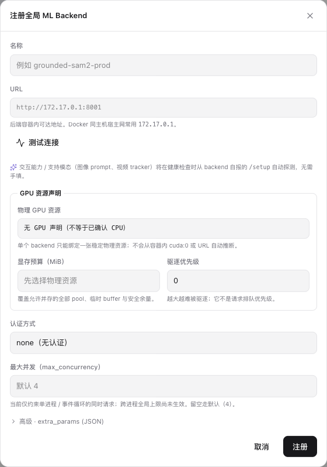
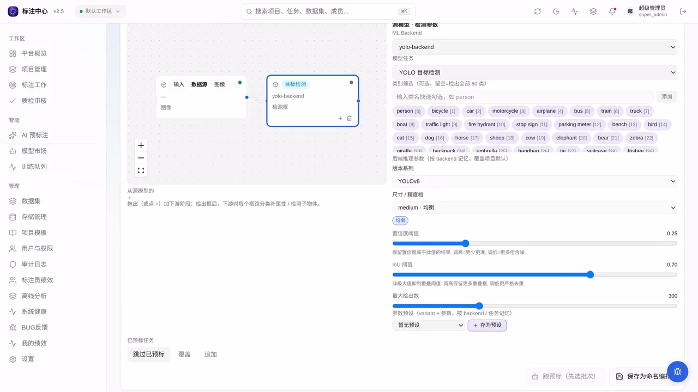

# 从一个模型，到一项平台能力：模型市场与 ML Backend

> 发布平台：知乎、微信公众号、掘金等<br>
> 推荐话题：数据标注、计算机视觉、MLOps、模型部署、人工智能、开源项目<br>
> 项目地址：[GitHub](https://github.com/yyq19990828/ai-annotation-platform)<br>
> 在线文档：[AI Annotation Platform Docs](https://yyq19990828.github.io/ai-annotation-platform/)

<!-- 发布时可删除上面的编辑信息。文中的仓库相对路径图片需要逐张上传到目标平台。 -->

一个模型服务能返回推理结果，还只是接入平台的起点。平台需要知道它接受什么输入、产出什么结果，由哪些实例承载，又允许哪些项目调用，模型才能成为工作台和预标流程里可管理的能力。

AI Annotation Platform 把全局接入和项目使用分成两层。超级管理员负责把推理服务接入平台，项目管理员再决定当前项目允许使用哪些能力。检测项目可以只启用 YOLO 和 OCR，精细分割项目可以启用 SAM 3，互不影响，也不用为每个项目重复填写服务地址和鉴权信息。

这条链路里有四个容易混在一起的对象：

| 对象         | 它回答的问题                             |
| ------------ | ---------------------------------------- |
| 协议能力     | 平台理解哪些 AI 标注任务                 |
| ML Backend   | 哪个实际推理服务提供这些模型             |
| 服务池       | 一组等价实例如何作为同一个逻辑服务被路由 |
| 项目启用关系 | 当前项目允许调用哪些服务                 |

模型市场把这四层放在一起看，但没有把它们合并成同一个开关。

## 模型市场先展示平台能理解什么

AI Annotation Platform 的模型市场不是下载权重的应用商店。能力目录先按协议列出目标检测、旋转框、分割、关键点、分类、OCR、文档版面、追踪和交互式分割九类任务，即使还没有注册任何 Backend，这些能力卡也会保留。


_模型市场按协议能力组织已接入模型，并提供任务、模型族、推理框架和模态筛选；截图中的连接数和模型数只是生成素材时的页面状态。_

Backend 接入后，它上报的模型会挂到对应能力卡下。卡片不只显示模型名称，还会说明：

- 接受整图、裁剪图、框提示还是点提示；
- 产出 bbox、polygon、Mask 等几何，或 `class`、`text` 等属性；
- 能否批量运行，是否属于交互式或有状态模型；
- 支持图像还是视频，以及可选模型档位和资源信息。

这些字段会继续影响工作台和预标流程。智能点需要点提示能力，Exemplar 需要视觉样例能力，分类模型通常接收裁剪图，OCR 识别模型需要把文本写回属性。平台根据 Backend 的声明显示控件、选择路由，并在后续工作流里判断模型接口能否连接。

能力目录描述的是协议和已上报的模型，不代表某个服务此刻在线，也不代表它已经被任何项目使用。

## ML Backend 是实际运行的推理服务

模型代码、权重和推理运行时仍在独立服务中。AI Annotation Platform 通过 ML Backend 协议与它通信，注册表保存的是这个服务的全局记录。



_全局注册表单填写服务名称和 URL，可测试连接，并配置鉴权、GPU 资源声明、显存预算和最大并发；具体模型能力由 Backend 接口探测。_

注册动作由超级管理员完成。表单处理的是部署层信息：服务地址、鉴权方式、GPU 资源、显存预算、驱逐优先级、最大并发和扩展参数。模型任务、提示类型和输出几何不需要在表单里重新抄一遍，平台会在健康检查时读取 Backend 的 `/setup` 声明。

“测试连接”和“注册”也有不同含义。测试连接只做无副作用探测；正式注册会创建全局记录。注册后的自动健康检查失败不会删除这条记录，它会保留并显示 `error` 状态，方便修正网络、鉴权或服务配置。

一条 Backend 记录全局只维护一次。修改 URL、刷新能力或更新健康状态后，引用它的项目看到的是同一份信息，不会各自保存一套容易漂移的副本。

## 一个 Backend 后面还可以有服务池

项目在界面上选择的是熟悉的 Backend 名称，底层绑定的是逻辑服务池。每个新注册的 Backend 会先得到一个只包含自身的单实例服务池，所以本地部署或单机使用时，体验和直接绑定一个 URL 一样。

当同一模型服务部署了多个等价实例，超级管理员可以把它们放进同一服务池。平台会比较稳定的能力指纹，只有模型目录、请求格式和变体组合等契约一致的实例才能进入同一池。启用路由后，请求可以在池内选择实例，项目配置不用跟着物理机器变化。

模型市场中的“运行时观测”和“注册管理”分别处理这两类信息：

- 运行时观测关注服务池、实例健康、并发容量、GPU 驻留和数据新鲜度；
- 注册管理维护服务池、物理实例、项目绑定和需要处理的问题。

超级管理员可以查看这两部分并执行维护操作。项目管理员看到能力目录和只读注册信息，项目自己的启用操作仍回到项目设置完成。页面不会把缓存中的 `connected` 当成实时健康，也不会把缺失的路由指标显示成零。

## 注册完成，项目还要明确启用

全局注册只增加了一个可选服务。进入“项目设置 → ML 模型”，项目管理员可以从全局清单中勾选当前项目需要的 Backend。


_项目管理面板列出全局 Backend 的名称、地址、交互或批量类型及连接状态；勾选只改变当前项目的可用范围。_

取消勾选只会让这个 Backend 对当前项目停用，不会删除全局记录，也不会影响其它项目。这个边界适合多项目共享同一套推理基础设施：平台统一维护服务状态，各项目只拿自己需要的模型。

项目还可以从已启用项中设置一个主后端。主后端用于工作台 AI 和新建预标配置的初始选择与回退，并不是唯一可用的服务。交互式工具会在所有已启用 Backend 中寻找支持当前提示的服务，多阶段预标的每个节点也可以独立选择自己的 Backend 和模型。

因此，一套项目配置可以同时包含：

- YOLO，负责批量检测；
- SAM 3，接收点、框或视觉样例；
- OCR Backend，识别文本区域；
- 视频 Tracker，处理项目支持的追踪模型。

项目启用了服务，还要满足工具单位、数据模态和模型能力等条件。比如 Backend 支持点提示，但项目关闭了交互式 AI，智能点工具仍不会出现。视频项目设置主后端时，平台会在能力快照可读取的情况下检查服务是否声明视频追踪能力；Backend 当时不可达则按现有策略放行，避免瞬时故障卡住配置。

## 参数跟着模型走，不写死在项目设置里

不同 Backend 的参数差异很大。检测模型可能提供置信度阈值，SAM 系列可能提供不同权重，OCR 又有自己的语言和输出属性。平台不在项目设置里预先维护一张固定参数表，而是读取 Backend 的 `/setup.params` 和变体声明，在工作台或批量预标页生成运行时控件。



_[观看完整演示](../../docs-site/public/media/projects/ai-pre-variant-selector.mp4)：切换模型变体时，页面同步更新档位、显存估算和推荐标记；演示中的 Backend 声明生成运行时选项，不代表某一档在真实数据上效果最好。_

同一个服务可以暴露多个模型尺寸或速度档，不必为了每个组合重复注册 Backend。模型卡上的速度、精度和显存标签属于服务声明的配置元数据，最终效果仍要用项目自己的数据评测。

## 一个模型进入项目要经过五个环节

1. Backend 通过协议声明模型、输入输出、参数和模态；
2. 超级管理员注册服务并检查连接；
3. 平台把模型挂到能力目录，并维护健康与运行信息；
4. 项目管理员勾选当前项目允许使用的 Backend；
5. 工作台和预标页面按项目、能力与模态显示可用模型。

这五个环节把模型服务逐步变成项目能力：能力目录负责描述，注册表负责连接服务，服务池承接运行实例，项目启用划定使用范围，工作台再根据能力与模态提供对应工具。

## 当前边界

模型市场管理的是已经部署的推理服务，不负责训练模型、下载权重或替项目评测精度。注册成功只说明平台保存了服务记录，`connected` 也只是最近一次可信探测的状态；真正发起推理时，网络、并发、GPU 资源和接口输出仍可能让请求失败。

Backend 的能力声明必须和实际实现一致。平台会把不受支持的枚举显示为协议诊断，也会在服务池能力发生变化时停止把不一致实例继续当作等价成员，但声明本身不能代替真实调用验证。

AI Annotation Platform 采用 MIT License 开源。模型市场、ML Backend 协议、服务池路由和项目启用的实现、文档与测试都在同一个仓库里。

- GitHub：<https://github.com/yyq19990828/ai-annotation-platform>
- 在线文档：<https://yyq19990828.github.io/ai-annotation-platform/>
- 模型市场：<https://yyq19990828.github.io/ai-annotation-platform/user-guide/superadmin/model-market>
- ML Backend 注册：<https://yyq19990828.github.io/ai-annotation-platform/user-guide/superadmin/ml-backend-registry>
- 项目启用 ML Backend：<https://yyq19990828.github.io/ai-annotation-platform/user-guide/projects/ml-backends>
- ML Backend 协议：<https://yyq19990828.github.io/ai-annotation-platform/dev/reference/ml-backend-protocol>
- License：MIT

系列下一篇会把这些已经对项目可用的模型放到同一张 DAG 上，看看检测、分类、OCR 和属性写回怎样组装成一条可执行的标注工作流。

---

## 发布编辑备注

<!-- 本节是编辑备注，正式发布时可删除。 -->

### 推荐封面文案

```text
从一个模型
到一项平台能力
模型市场 · ML Backend · 项目启用
```

封面建议使用 `model-market/list.png` 的能力卡作为背景，叠加一条从“全局注册”指向“项目启用”的简洁箭头。不要使用运行时观测概念图代替真实界面。

### 备选标题

1. 让模型成为平台能力：模型市场、ML Backend 与项目启用
2. 标注平台怎样认识一个模型？
3. 模型如何进入标注平台：能力目录、服务实例与项目边界

### 发布摘要

AI Annotation Platform 把模型接入分成协议能力、ML Backend、服务池和项目启用四层。模型市场负责展示能力与运行状态，超级管理员统一注册推理服务，项目管理员再选择当前项目允许使用的 Backend。本文也说明主后端、交互式能力路由和运行时参数如何影响工作台中最终出现的模型工具。

### 短视频口播预告

> 一个模型服务能返回结果，还要经过能力声明、全局注册、服务池和项目启用，才能成为标注平台里可管理的能力。Backend 上报模型能力和运行参数，服务池承接等价实例，项目再决定哪些模型进入自己的工作台和预标流程。下一步，是把这些模型组装成工作流。

### 配图上传顺序

1. `superadmin/model-market/list.png`：展示能力目录、筛选和已接入模型卡；
2. `superadmin/ml-backend/register-form.png`：展示全局 Backend 注册字段；
3. `projects/ml-backends/register-form.png`：展示项目从全局清单中勾选启用；
4. `public/media/projects/ai-pre-variant-selector.mp4`：展示 Backend 声明生成运行时模型档位。

模型市场截图中的数量、连接状态和卡片内容是生成素材时的页面快照，发布文案不得写成实时运营数据。全局注册表单截图处于空白填写状态，不证明注册成功。项目启用截图只展示勾选范围，不展示主后端设置。模型档位演示展示控件联动，不证明速度、显存或精度标签经过独立实测。
