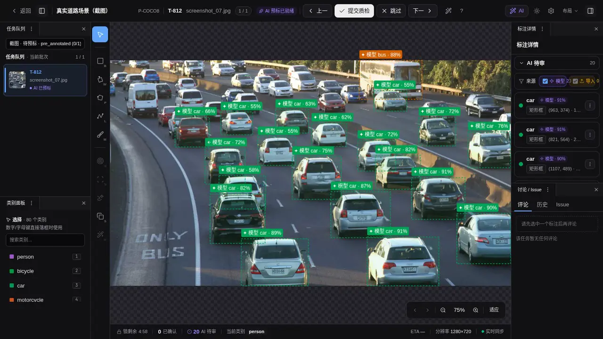
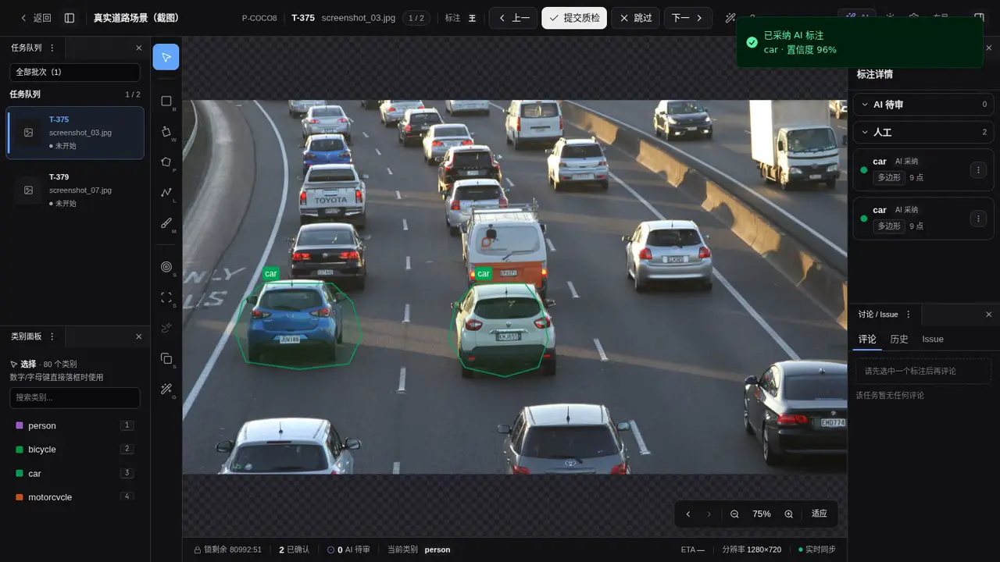

# 模型都能跑，怎样把它们组装成一条 AI 标注工作流？

> 发布平台：知乎、微信公众号、掘金等<br>
> 推荐话题：数据标注、计算机视觉、MLOps、OCR、人工智能、开源项目<br>
> 项目地址：[GitHub](https://github.com/yyq19990828/ai-annotation-platform)<br>
> 在线文档：[AI Annotation Platform Docs](https://yyq19990828.github.io/ai-annotation-platform/)

<!-- 发布时可删除上面的编辑信息。文中的仓库相对路径图片需要逐张上传到目标平台。 -->

检测、分类和 OCR 已经在项目里启用，单独运行也没有问题。可在一条真实标注任务里，它们还得接得起来：检测模型先找车，分类模型只看车辆区域，车牌检测继续在车辆 ROI 中找框，OCR 再读取车牌小图。

模型之间需要一份明确的交接规则。分类器该看整张图，还是只看车辆框？车牌坐标怎样从裁剪图回到原图？OCR 文字应该挂在哪一个对象上？下游失败后，要保留上游框还是丢弃整条结果？

AI Annotation Platform 把 AI 能力放在工作流层管理。在编排画布上，检测、分类、子物体检测和 OCR 可以成为不同节点。上游输出会成为下游输入，平台负责裁剪 ROI、回映坐标和写回属性；整批运行与当前图片运行共用同一份编排，结果统一交给标注员复核。

以车辆项目为例，一条编排可以这样组织：

| 阶段   | 输入             | 模型做什么     | 输出去向                     |
| ------ | ---------------- | -------------- | ---------------------------- |
| 源阶段 | 整张图片         | 检测车辆       | 生成车辆框候选               |
| 下游 A | 每个车辆 ROI     | 判断车型、颜色 | 写入车辆框属性               |
| 下游 B | 每个车辆 ROI     | 检测车牌       | 生成并回映车牌几何候选       |
| 下游 C | 每个车牌候选 ROI | 识别文字       | 写入车牌候选的 `text` 等属性 |

AI Annotation Platform 把这套模型交接做成了产品能力：模型可以按输入、输出和依赖关系组装，工作流可以保存、校验和执行，也能复用于批量预标与当前图片推理。

## 组装前，模型接口要接得上

工作流不是任意连线。每个已启用模型都带着输入输出契约：接受整图、裁剪图、框提示还是点提示，产出 bbox、polygon、Mask 等几何，还是 `class`、`text` 等属性，以及能否批量运行。

编排器据此判断相邻节点能不能交接。分类器通常接收上游框裁出的 ROI，OCR 识别模型可以读取文本框小图，框提示分割模型则需要几何提示。一个只接受点提示的交互模型，即使能输出 Mask，也不能直接塞进批量检测链。

## 用 DAG 组装检测、分类和 OCR

在 AI 预标页打开项目后，左侧是编排画布，右侧只配置当前选中的节点。源节点读取整图并产出第一批几何；下游节点接收父节点的输出，再决定裁 ROI、传几何提示，还是继续生成新对象。


_左侧画布显示源节点与下游节点的连接，右侧配置当前选中的阶段；截图处于配置状态，并不表示任务已经运行。_

以“车辆检测后补属性”为例，下游阶段可以设置：

- **父框类别**：只处理 `car`、`truck` 等指定类别，留空则处理全部父框；
- **ROI 扩展**：在父框四周增加一定比例的上下文，再把裁剪图交给下游模型；
- **写回属性键**：只接收 `vehicle_type`、`color`、`text` 等约定字段；
- **失败策略**：下游失败时保留父框、属性留空，或在明确需要时丢弃该父框；
- **子物体命名**：给同名属性加上前缀，避免不同分支互相覆盖。

同一个父节点可以分出多条支路。车辆框可以并行送给颜色分类器和车型分类器，也可以进入“车牌检测 → OCR 识别”分支。并行阶段要写同一个属性键时，系统默认拦截；只有显式选择末位覆盖后才允许继续。

画布目前使用受限树形结构，最大深度为三层。父阶段必须先出现并产出可继续消费的几何，不能连接成环，也不能把只写属性的分类节点继续当成几何父节点。配置时会显示能力提示，真正派发前还会再次检查模型是否可批量运行、输入输出是否匹配，以及涉及的 Backend 是否已在项目启用。

有些几何只为下一阶段服务。例如框提示分割可以先生成中间轮廓，再让后续模型处理，而不把中间轮廓单独放进候选列表。需要出现在结果中的新框会从 ROI 坐标回映到原图，并作为新候选加入同一条 Prediction。阶段间会保留内部对应索引，供下一步继续路由；这不等于采纳后自动建立正式标注的父子关系。正式子框由下文的二次推理路径创建。

## 组装一次，整批和当前图片都能运行

批量预标时，项目管理员先选择处于 `active` 状态的批次，再选择模型、参数和已有结果处理方式：

- **跳过已预标**：只处理还没有预测的任务；
- **覆盖**：清理目标任务已有的 AI 预测与 AI 标注后重新运行，保留人工标注；
- **追加**：保留旧预测并再加一份，适合少数需要并排比较的场景。



_[观看完整演示](../../docs-site/public/media/ai/preannotate.mp4)：从项目详情选择批次和参数，发起后台预标任务后进入任务历史；演示停在已派发状态，不把它描述成“候选已采纳”。_

批量任务会进入 Jobs 历史，逐阶段记录目标数、成功数、失败数和几何跳过数。多批次可以串行或并行运行，但请求仍受 Backend 并发限制。任务完成只说明 Prediction 已经生成，不代表这些结果已经成为正式 Annotation。

配好的 DAG 可以保存为项目编排。设为默认后，标注员在图片工作台的“当前题 AI”里可以对正在看的这一张图运行完整编排，不必先挑一个批次。这个入口仍然生成候选，只是范围从整批缩小到了当前任务。

需要在多个同构项目复用时，还可以把编排保存成带名称和作用域的模板。模板套用到项目时会复制一份快照；项目后续修改自己的副本，不会反向改动模板，模板更新也不会悄悄覆盖已经套用的项目。

## OCR 可以跑整图，也可以接在检测框后面

OCR 在这条数据流里有两种位置。

端到端 OCR 直接读取整图，产出文本 polygon，以及 `text`、`orientation`、`language` 等属性。纯文本检测模型只负责找区域；识别原子则接收上游文本框裁出的 ROI，把识别结果写回对应框。典型组合就是“车牌检测 → 裁车牌小图 → OCR 识别”。


_[观看完整演示](../../docs-site/public/media/ai/ocr-current-task.mp4)：在真实 OCR 图片上选择 RapidOCR 端到端模型并运行当前题，画布出现文字多边形与文本候选；演示停在待审状态，没有采纳候选。_

采纳候选时，模型返回的 OCR 属性会跟着写入 Annotation。项目仍应在 Schema 里配置 `text`、`language` 等承接字段，让工作台有稳定的显示、编辑和校验入口。当前模型声明了输出属性 Schema 时，页面会提示缺少的字段，并提供一键补全。

## 模型跑完后，人工从候选接管

批量预标和图片当前题编排都把结果写入 Prediction。工作台把这些结果放在 AI 待审层，和已确认标注分开显示。标注员可以检查几何和属性，必要时先改值，再接受或拒绝。



_[观看完整演示](../../docs-site/public/media/ai/candidate-keyboard-review.mp4)：进入 AI 待审候选后，使用 `A` 接受、`D` 拒绝；每次决策后自动前进到下一项。_

接受候选时，平台才创建正式 Annotation。多阶段写入的属性会记录到具体属性键的 AI 来源和模型引用；如果标注员后来手工修改某个键，这个键会转为人工结果，其它没有改动的 AI 属性仍保留来源。

图片中已经存在人工或已采纳的 bbox、polygon 时，标注员可以选中它运行二次推理。分类结果会直接补到父框属性，子物体检测会直接创建一层子框，不再进入 AI 待审列表。二次推理不会覆盖已经由人工改过的属性键，但可以更新上一次仍标记为 AI 来源的值。

因此，同样是调用分类器，落点取决于入口：

| 入口           | 处理范围             | 结果状态                  |
| -------------- | -------------------- | ------------------------- |
| 批量预标       | 一个或多个批次       | Prediction 候选，等待审阅 |
| 图片当前题编排 | 当前图片             | Prediction 候选，等待审阅 |
| 二次推理       | 已确认的单个图片标注 | 直接补属性或创建子框      |

## 当前边界

这套编排不是任意深度的通用 MLOps 系统。当前 DAG 最深三层，重点处理检测、分割、分类、OCR 和属性写回之间的标注数据流。模型训练、权重下载和实验评测仍由外部工具负责，平台管理的是已经接入的推理服务及其生产使用。

模型声明的能力必须和实际接口一致。分类阶段需要返回属性，OCR 识别阶段需要支持裁剪图输入，几何下游要能接收框提示或在 ROI 上检测。配置页的提示用于提前发现问题，派发阶段的校验才是最后门槛；Backend 宕机或输出不符合契约时，任务仍会失败并进入 Jobs 记录。

图片默认编排可以在工作台运行当前题，视频当前帧 AI 不提供同样的多阶段入口。视频批量预标需要在 AI 预标页明确选择“整段序列”或“逐帧”，跨帧追踪也有单独的轨迹工作流。3D 点云项目目前不支持 AI 预标。

AI Annotation Platform 采用 MIT License 开源。编排画布、批量任务、候选审阅、OCR 和属性溯源的实现、文档与测试都在同一个仓库里。

- GitHub：<https://github.com/yyq19990828/ai-annotation-platform>
- 在线文档：<https://yyq19990828.github.io/ai-annotation-platform/>
- AI 预标与多阶段编排：<https://yyq19990828.github.io/ai-annotation-platform/user-guide/projects/ai-preannotate>
- 当前题 AI 与二次推理：<https://yyq19990828.github.io/ai-annotation-platform/user-guide/ai/current-task-inference>
- License：MIT

系列下一篇会继续介绍视频轨迹：单帧交互式 AI、关键帧、跨帧传播和整段追踪之间有什么区别。

---

## 发布编辑备注

<!-- 本节是编辑备注，正式发布时可删除。 -->

### 推荐封面文案

```text
模型都能跑
怎样把它们组装成
一条 AI 标注工作流？
```

封面建议使用 `ai-pre-config-panel.png` 的 DAG 局部作为底图，叠加车辆框、属性标签和车牌文字三个小元素。不要用模型市场列表作为主视觉，配置卡较多，缩成移动端封面后信息会过密。

### 备选标题

1. 别让检测、分类和 OCR 各跑各的：组装一条 AI 标注工作流
2. 模型接进来以后，怎样组装成一条标注工作流？
3. 从检测框到车牌文字：一条多模型工作流怎样组装出来？

### 发布摘要

AI Annotation Platform 通过 DAG 把整图检测、ROI 分类、子物体检测、OCR 和属性写回组装成一条工作流。同一份编排可以用于批量预标和当前图片推理，结果先进入候选审阅，人工接受后才成为正式标注。本文也说明接口校验、属性溯源和三层编排边界。

### 短视频口播预告

> 检测模型负责找车，分类模型识别车型和颜色，车牌检测再把 ROI 交给 OCR。AI Annotation Platform 能把这些模型组装成同一条工作流，让每个模型只处理自己擅长的输入，下游结果回到对应对象。整批运行和当前图片运行都能复用这份编排，结果由标注员确认后才进入正式标注。

### 配图上传顺序

1. `projects/ai-pre-config-panel.png`：展示左侧 DAG 和右侧节点配置；
2. `public/media/ai/preannotate.mp4`：展示选择批次、发起任务和进入历史页；
3. `public/media/ai/ocr-current-task.mp4`：展示真实 RapidOCR 当前题推理与待审候选；
4. `public/media/ai/candidate-keyboard-review.mp4`：展示接受、拒绝和自动前进。

`public/media/ai/ocr-current-task.mp4` 使用真实 RapidOCR Backend，停在候选态。`public/media/ai/preannotate.mp4` 用于说明页面操作与任务派发，不证明模型结果已完成或已采纳。`ai-pre-config-panel.png` 是配置状态截图，图注不得写成“流水线已经运行成功”。候选审阅演示使用可重复的测试候选，真实演示工作台的选择、接受、拒绝和自动前进行为。
