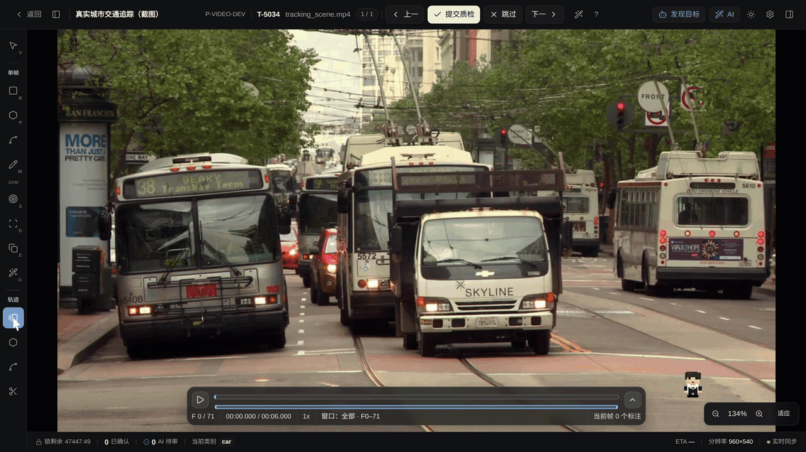
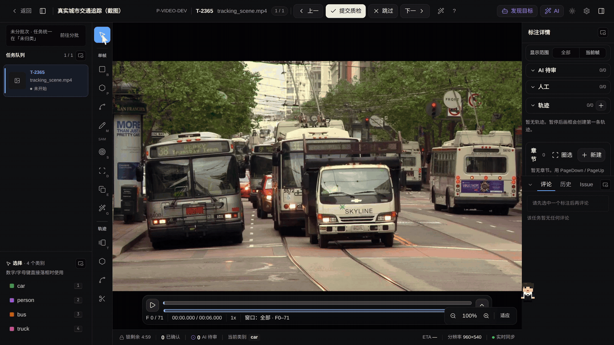
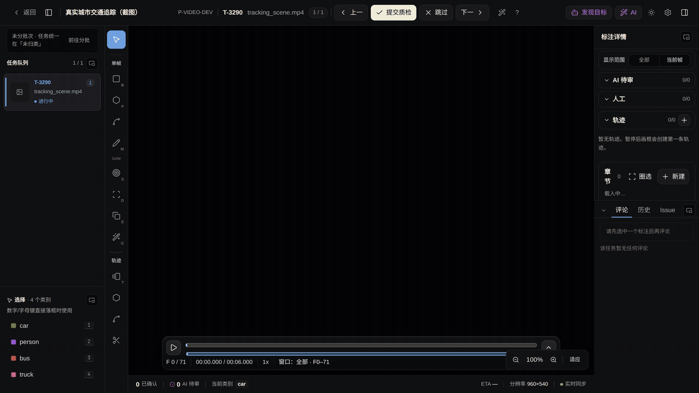
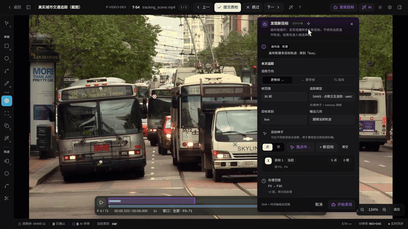
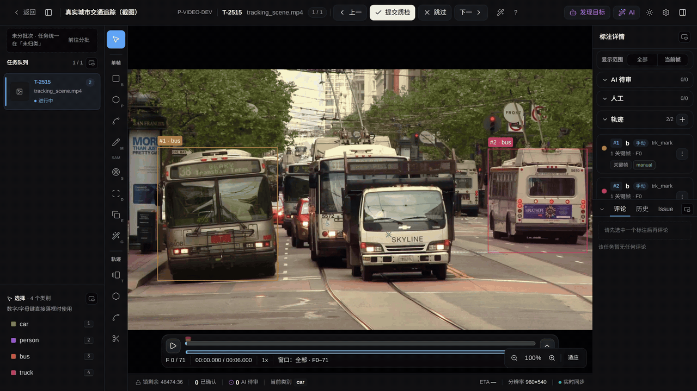

# 视频标注不逐帧画框：关键帧、传播和 AI 追踪怎样接力

> 发布平台：知乎、微信公众号、掘金等<br>
> 推荐话题：数据标注、计算机视觉、目标跟踪、SAM、人工智能、开源项目<br>
> 项目地址：[GitHub](https://github.com/yyq19990828/ai-annotation-platform)<br>
> 在线文档：[AI Annotation Platform Docs](https://yyq19990828.github.io/ai-annotation-platform/)

<!-- 发布时可删除上面的编辑信息。文中的仓库相对路径图片需要逐张上传到目标平台。 -->

图片标注里，一张图给一个答案。视频标注的答案随时间走：同一辆车从画面远端驶到近处，位置、尺寸、遮挡关系每一帧都在变。如果每帧都重新画框，一条 30 帧的轨迹要画 30 次，帧间的抖动还会比人工误差更伤追踪数据。

AI Annotation Platform 的视频工作台用三层机制压缩这份工作量：关键帧加插值处理匀速运动，几何复制处理近似静止的目标，AI 追踪处理复杂运动。选哪层，取决于目标怎么动。

先分清三个容易混淆的对象：

| 对象   | 数据形态              | 作用范围                     |
| ------ | --------------------- | ---------------------------- |
| 单帧框 | `video_bbox`          | 只属于当前帧，其它帧不显示   |
| 关键帧 | 轨迹 `keyframes[]` 项 | 属于一条轨迹，人工或 AI 写入 |
| 轨迹   | `video_track_bbox` 等 | 一个对象一条，跨帧存在       |


_时间轴悬浮在画布底部，播放、逐帧移动和轨迹延续在同一屏里完成；画布上是两条公交车轨迹和一辆正在接近的卡车。_

视频工作台与图片工作台同构：左侧任务队列、顶部提交、右侧属性与评论都沿用。画布换成视频播放器后，多出的是时间轴和轨迹清单。标注员用 `T` 进入矩形框轨迹工具，`B` 画只属于当前帧的独立框；旋转框、关键点、单帧 Mask 各有单帧版本，SAM 交互工具在视频里同样只产单帧标注。

## 两个关键帧，中间交给插值

标注员在起始帧画框、选类别，跳到后续帧再画一个，两个关键帧之间的帧由线性插值生成，画布用虚线框区分插值结果。



_起始帧创建轨迹框，切到后续帧调整第二个关键帧，再来回逐帧检查插值框的位置。_

发现插值漂移，就在漂移处补一个关键帧，插值立刻按新的锚点重算。当前帧落在两个有效关键帧之外时，选中轨迹会显示最近关键帧的虚线参考框；拖动参考框或点「复制到当前帧」都会在当前帧创建新关键帧。目标短暂消失时标记「消失」，插值不会跨过这一帧；「遮挡」则表示目标仍在但可见性差，画布用虚线状态展示。

单帧操作都能撤销：关键帧的新增、移动、消失和遮挡标记走 `Ctrl + Z`，插值结果只是派生视图，不占存储。

## 视频里的当前帧 AI，作用域只有当前帧

图片工作台的当前题 AI 在视频里仍然存在，但作用域收窄到一帧：只为当前 `frame_index` 生成 `video_bbox` 候选。



_定位到车辆清晰的目标帧，选专用车辆检测模型运行当前帧推理，采纳中间卡车候选后切到相邻帧，确认结果不跨帧。_

推理候选带类别、置信度和帧号，采纳后才落库为当前帧的人工采纳标注。切到相邻帧，上一帧的结果不会跟过来；要延续，得进入下一节的传播机制。时间轴、帧号和右侧当前帧计数同屏显示，帧作用域在工作台里是显式的，不靠约定。

## 复制粘贴追不上一辆开过来的卡车

把一条轨迹扩展到更多帧有两条路：纯前端的「复制后续」和调用模型的「AI 延展」。

| 维度      | 复制后续（关键帧传播） | AI 追展                                |
| --------- | ---------------------- | -------------------------------------- |
| 是否调 AI | 否                     | 是，需要项目启用对应 ML Backend        |
| 几何来源  | 当前帧的框原样铺帧     | 模型根据提示逐帧推理                   |
| 适用场景  | 目标近似静止           | 运动复杂、范围长、多目标               |
| 结果落库  | 完成即写入，可整体撤销 | 先进候选审阅，按目标与帧窗口接受后写入 |
| 放弃结果  | 撤销操作               | 拒绝所选范围，标注零改动               |



_同一辆中间卡车、同一个 F0 到 F30 范围：复制后 F30 的固定框已偏离变大、位移的车身；撤销后改用 AI 延展，候选框跟随目标，采纳 F1 到 F30 后回填原轨迹。_

复制后续适合摄像头固定、目标基本不动的监控画面。目标朝镜头运动时，框的尺寸每一帧都在涨，纯几何复制把 F0 的框铺到 F30，偏差会积累到无法使用。AI 延展用真实 SAM3 作业逐帧推理，候选框跟着车身变大变位；人工画下的 F0 关键帧保留，只采纳模型追出的 F1 到 F30。

两种机制在同一张选中卡上并存，入口分别是「复制后续」和「延展此轨迹」。面板顶部会标明作用范围：单轨延展只回填当前选中的一条轨迹，多选后变为批量，画布级的「发现目标」则新建轨迹，三者的边界写在前台。

## 不选任何轨迹，用文本发现目标

前面几种方式都先有一个框。画布级的「发现目标」入口不需要：SAM3 文本检测追踪只要一句目标描述。


_输入 bus，模型返回多目标候选池；取消远处目标和局部部件，只保留左右两辆完整公交车，跨帧核对后采纳两条新轨迹，拒绝剩余噪声。_

文本发现返回的是候选池，不直接落库。远处一辆不完整的车、一个车灯，都会出现在池里；标注员先勾选要保留的实例，再拖时间轴检查所选身份是否持续跟随同一对象，最后只采纳勾选的轨迹。想要「自动发现」又要「干净的跨帧身份」时，还有发现追踪组合：一个作业里先用文本发现目标，再把每个发现框作为内部种子逐对象记忆追踪，跨过分窗边界仍保持同一组身份。

## 正点和负点：追谁、别追谁

SAM2 和 SAM3 的点框交互追踪支持在发起前采集种子。单击落正点，`Alt + 单击` 落红色负点表示「这块不要」，框模式下直接拖提示框。同一目标可以混用点和框，种子区按目标逐行显示点数、框数和所在帧。



_左侧公交车先落正点和紧邻车身的负点，点「+ 新目标」为右侧公交车重复约束；一次作业生成两个候选，跨帧核对后整批采纳。_

负点用来排除紧邻的背景或旁边车辆，比单纯加正点更能锁住边界。追踪中途发现跟错，不必取消重来：保持面板打开，跳到出错帧继续为同一目标补点或补框，提示按目标和帧累积，首次种子帧仍是传播范围的锚点。

## 已有多条轨迹，一次批量延展

一段视频往往已经标了几条轨迹，都要往后追时不必逐条发起。



_Ctrl 多选两条公交车轨迹，画布浮卡与右栏工具条同时显示已选 2 条；一个 SAM3 作业生成 F0 到 F10 双目标候选，接受窗口改为 F1 到 F10 保留人工 F0，一次接受后两条原轨迹各自回填。_

批量延展把多条源轨迹放进同一个作业并行追踪，各自回填各自轨迹，只产生一条审阅记录。发起前把播放头停在所有轨迹都有框的帧上；接受时如果任何源轨迹已被删除、锁定或修改，整次接受会停止并要求刷新，不会把失效源静默降级成新轨迹。

## 结果写入前，先过候选审阅

AI 追踪完成不会立刻改写轨迹。画布先叠加候选，顶部「AI 追踪候选」审阅条显示已审与总数，标注员勾选目标、填写起止帧，接受所选或拒绝所选。窗口外、未选目标和剩余候选保持不变；刷新页面后未决候选从服务端恢复。

接受落库后，关键帧来源标为 prediction。画布上 AI 追出的关键帧带 violet 角标，选中卡里还有一条来源迷你条，紫色是模型追的、灰色是人工画的，整条轨迹里哪些帧可信到什么程度一眼可辨。

人工关键帧默认受保护。接受范围命中人工帧时，第一次接受会被拒绝并弹出二次确认；确认覆盖才写入，操作进入审计记录。每次决定绑定当前作业版本和源轨迹版本，其他人处理过的候选会在审阅条里刷新成服务端最新状态。

## 当前边界

矩形框轨迹拥有最完整的编辑能力，AI 追踪入口目前对矩形框轨迹与 Mask 轨迹开放；多边形和折线轨迹可以手工管理关键帧，还没有追踪按钮。视频里的单帧交互 AI 只处理暂停后的当前帧，跨帧延续要回到轨迹机制；多阶段模型编排仍以图片为主，视频批量预标需要明确选择整段序列或逐帧。3D 点云项目目前不支持 AI 预标。长视频按 segment 分给多人协同时，播放、跳帧和 AI 追踪都限制在领取的 work 范围内，overlap 边界在分段提交后自动生成质量报告。

AI Annotation Platform 采用 MIT License 开源。视频工作台、轨迹与关键帧、传播机制、候选审阅的实现、文档与测试都在同一个仓库里。

- GitHub：<https://github.com/yyq19990828/ai-annotation-platform>
- 在线文档：<https://yyq19990828.github.io/ai-annotation-platform/>
- 视频追踪标注：<https://yyq19990828.github.io/ai-annotation-platform/user-guide/workbench/video-track>
- 关键帧传播与 AI 追踪：<https://yyq19990828.github.io/ai-annotation-platform/user-guide/workbench/video-propagate>
- License：MIT

系列下一篇会进入 3D 点云工作台：多视角环视图片与点云怎样对齐，3D 框种子和跨帧轨迹如何标注。

---

## 发布编辑备注

<!-- 本节是编辑备注，正式发布时可删除。 -->

### 推荐封面文案

```text
视频标注不逐帧画框
关键帧 · 插值 · AI 追踪
一条轨迹的三层接力
```

封面建议使用 `video-propagate-track-vs-copy-cover.png`：F30 处复制框与车身的偏离是全文最有说服力的画面。也可以用 `video-track-cover.png` 的双公交车轨迹画面做底，叠加正负点标记。

### 备选标题

1. 一辆车开 30 帧：视频标注里的关键帧、复制传播和 AI 追踪
2. 从画一个框到追一路车：视频工作台怎样省掉逐帧标注
3. 复制粘贴追不上一辆开过来的卡车：视频轨迹的三层接力

### 发布摘要

AI Annotation Platform 把视频标注拆成三层：关键帧加插值处理匀速运动，几何复制处理近似静止目标，AI 追踪处理复杂运动。文章用同一条卡车轨迹对比复制与 AI 延展的偏差，并介绍文本发现、正负点种子、批量延展和候选审阅，人工关键帧在接受前始终受保护。

### 短视频口播预告

> 视频标注最怕逐帧画框。先在两个关键帧画框，中间交给插值；目标不动就用复制传播铺帧；目标在动，再把轨迹交给 AI 追踪，候选框跟着车身走。不知道追谁，输入一句文本让模型发现目标；两辆车一起追，正点负点同时约束。结果先停在候选审阅，人工画的关键帧不确认覆盖就不会被动。

### 配图上传顺序

1. `video-track.gif`：开场，展示画布、时间轴与轨迹同屏的工作台全貌；
2. `video-draw.gif`：两个关键帧画框，中间帧查看插值；
3. `current-frame-video-inference.gif`：当前帧车辆推理、采纳与相邻帧作用域核对；
4. `video-propagate-track-vs-copy.gif`：核心对比，同一条卡车轨迹的复制偏差与 AI 延展回填；
5. `video-tracker-text-discovery.gif`：文本发现两辆公交车，筛选候选池后采纳双轨迹；
6. `video-tracker-positive-negative.gif`：双公交车正负点约束与整批采纳；
7. `video-track-batch-propagate.gif`：双轨迹多选批量延展与一次回填。

七段 GIF 均由 4K60 高清母版派生，发布到知乎或公众号时逐张上传，不要保留仓库相对路径。`video-track.gif` 与 `video-tracker-positive-negative.gif` 为控制体积降到 800px 宽，移动端小字（时间轴帧号、面板参数）可能不清，图注避免引用具体参数数字；其余五段为 1280px 宽。各 `-cover.png` 为 1600px 静态封面帧，供知乎头图或公众号封面裁切。对比 GIF 停在候选审阅与回填完成的画面，图注不要写成「已通过质检」；文本发现与批量延展段采纳后仍属人工接管前的轨迹状态。
