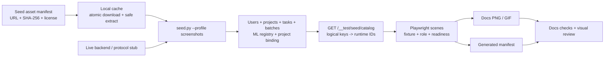

# DEV 浏览器截图与 Seed 项目规范化计划

> Status: in progress · 2026-07-13

## 1. 背景

文档截图已经具备 Playwright 场景、主题/视口矩阵、GIF 录制、manifest 和定时视觉回归框架，但截图数据仍未形成稳定契约：

- 主截图 driver 通过 `/api/v1/__test/seed/peek` 分别选择最新项目和最新任务，任务不保证属于返回项目。
- driver 把 `annotator`、`reviewer` 角色都映射成管理员账号，角色页面没有使用真实角色数据。
- 批次、SAM、AI 工具等场景仍依赖某个开发库中的 `P-0001` 和固定 UUID，该项目不由 `seed.py` 创建。
- COCO8、SUSTechPOINTS、nuScenes 等示例数据依赖仓库外的本地目录；缺失时 `seed.py` 只打印警告并继续成功。
- Seed 图片项目虽然设置了 `ai_enabled=true`，但没有规范创建并绑定 ML Backend，AI 工具会因项目未绑定、backend 未启用或能力快照缺失而置灰。
- 截图目标元素缺失时，部分场景会吞掉异常或退化为整页截图，导致命令成功但图片内容错误。
- 当前已引用资产共 72 个（60 PNG、12 GIF），自动图片最后集中生成于 2026-06-15/19，此后 UI 已有多轮调整，需在数据契约稳定后全量更新。

计划启动时 DEV 数据库只有 `P-VIDEO-DEV`。在这种状态下直接运行全量截图，`seed/peek` 会把视频项目错误地提供给通用图片项目场景，因此本计划不允许先重拍、后补 seed。

## 2. 目标

- 建立独立、幂等、可验证的 `screenshots` seed profile，且只管理 seed 自有对象。
- 让所有项目型截图通过稳定逻辑键获取项目、任务、批次和角色，不再选择“最新/首个”数据。
- 让图片与视频示例项目正确绑定 ML Backend，使 AI 工具栏、模型选择、AI 预标和追踪相关页面可稳定截图。
- 允许公开小型素材按固定版本从网络获取，不再隐式依赖仓库内 `third-party/` 文件夹。
- 固化浏览器、视口、语言、时区、时间、字体、动画和动态字段处理规范。
- 全量更新现有自动截图与文档目标 GIF，清理旧 manifest 和重复二进制副本。
- 建立真正可用的视觉回归基线和 CI 门禁。

## 3. 非目标

- 本轮不补齐维护清单中全部人工截图和尚无对应 UI 的待拍项。
- 不把 5.1 GB nuScenes-mini 设为日常截图的默认依赖。
- 不要求所有截图都运行真实 GPU 推理；静态 AI UI 截图允许使用协议 stub，但其项目绑定和能力协商必须是真实链路。
- 不把文档截图全量任务放进每个 PR 的必跑 CI。
- 不在本计划中迁移整个图片历史到 Git LFS；若后续 GIF 继续增长，单独评估。

## 4. 成功标准

1. 新 clone 且没有 `third-party/` 目录时，可通过一条准备命令拉取小型素材并创建完整截图数据。
2. `screenshots` seed profile 完成后，catalog 能解析所有必需用户、项目、任务、批次和 backend；缺一项即失败。
3. 任意新增普通 DEV 项目都不会改变截图选择结果。
4. 仓库内不再存在截图场景硬编码项目 UUID、`P-0001` 或依赖任意 `.first()` 项目/任务定位的逻辑。
5. `annotator`、`reviewer` 场景分别使用 `anno`、`qa` 的真实 token 和项目成员关系。
6. AI 截图项目具备有效 ML Backend 注册项、项目启用关联、主 backend 绑定和能力快照；AI 工具不再因未绑定而置灰。
7. 全量静态截图运行 `0 skipped`、`0 locator fallback`；必需交互失败时测试直接失败。
8. manifest、scene target、磁盘文件和文档引用四方一致，无 stale entry、孤儿图和未登记自动图。
9. GIF 转码结束后不残留 WebM、palette、Playwright report 或 test-results 等中间产物。
10. 在同一标准环境连续运行两次，静态截图内容稳定；视觉回归基线可在 CI 正常比较。

## 5. 目标架构



稳定键是逻辑资源名、`display_id`、固定媒体相对路径和任务状态语义，而不是数据库 UUID。UUID 可以在修复或重建时变化，catalog 负责在每次运行前解析。

## 6. Seed profile 设计

### 6.1 命令入口

扩展 `apps/api/scripts/seed.py`：

```bash
cd apps/api
PYTHONPATH=. uv run python scripts/seed.py --profile screenshots
```

计划支持：

- `--profile demo`：日常轻量示例数据，继续允许可选项目缺失时警告。
- `--profile screenshots`：截图严格模式，必需数据或 backend 缺失时退出非零。
- `--offline`：只使用已校验缓存；缺少素材时列出 asset id 后失败。
- `--asset-dir <path>`：显式使用本地素材目录，覆盖下载缓存。
- `--repair`：重新收敛 seed 自有对象的配置和状态，不影响用户自建项目。
- `--ml-backend-mode live|stub`：DEV 全量截图默认 `live`；CI 或无 GPU 环境可显式使用 `stub`。

不新增隐式环境变量。若实施时确需增加持久化环境变量，必须同步 `.env.example` 和环境变量参考文档。

### 6.2 项目 catalog

| 逻辑键 | 稳定标识 | 用途 | 必需状态 |
|---|---|---|---|
| `image_demo` | `P-COCO8` | 图片工作台、bbox、polygon、mask、AI 交互、AI 预标、数据管理、导出 | 8 个固定媒体；预测样例；多状态批次；绑定 image AI backend |
| `video_demo` | `P-VIDEO-DEV` | 视频工作台、轨迹、AI 追踪入口 | 固定视频和任务；绑定 tracker backend |
| `pointcloud_demo` | `P-PC-DEV` | 3D 工作台、点云视角与标注控件 | 4 帧真实 RGB-D 扫描；剔除无效深度；固定帧顺序 |
| `ocr_demo` | `P-OCR` | OCR 项目和模型入口 | 单张固定图片；OCR 工具绑定 |

`image_demo` 至少提供以下任务逻辑键：

- `clean`：无标注、无预测，用于空白工作台。
- `predicted`：含固定外部预测，用于预测采纳和 AI 面板。
- `annotating`：分配给 `anno`，处于标注中。
- `submitted`：已提交、待审核。
- `review`：分配给 `qa`，含固定标注和审核上下文。
- `completed`：已通过，用于状态和统计页面。

批次至少覆盖草稿、标注中、待审核、已完成四种有效业务状态。Seed 需显式创建项目成员关系和任务分配，不能只改任务状态。

### 6.3 Desired-state reconcile

截图 profile 不采用“项目存在即跳过”，而是只对带截图 seed 标记的对象执行收敛：

- 按固定 `display_id` 找到项目和数据集。
- 收敛名称、类型、数据类型、工具单位、类别、AI 开关、backend 绑定、成员、批次和固定任务状态。
- 素材摘要变化时重建对应 DatasetItem、对象存储内容和派生元数据。
- 允许开发者在 seed 项目上临时试验，但 `--repair` 会覆盖 seed 管理字段；文档必须明确这一点。
- 用户自建项目、非 seed 数据集和用户标注完全不动。
- 每次完成后输出资源校验表，而不是仅输出“已存在/跳过”。

## 7. ML Backend 绑定规范

### 7.1 为什么绑定是硬前置

项目仅设置 `ai_enabled=true` 不能使 AI 截图可用。Seed 必须同时满足：

1. `ml_backend_registry` 中存在目标 backend，`state=connected`。
2. `health_meta.capabilities` 存在且声明场景需要的模型、prompt、输出和 tracker 能力。
3. `project_ml_backend` 存在 `(project_id, registry_id, enabled=true)` 关联。
4. `projects.ml_backend_id` 指向主 backend，保证兼容选择和优先路由。
5. `projects.ai_enabled=true`。
6. 图片交互式 AI 项目还需 `projects.ai_interactive_enabled=true`。
7. catalog 调用 `MLBackendService.get_project_backend` / `get_tracker_backend` 后必须能得到预期 backend。

这是截图 profile 的校验条件，不允许降级成“按钮置灰也截图”。

### 7.2 DEV live 模式

`--ml-backend-mode live` 用于本地全量重拍：

- 先同步或读取全局 backend registry。
- 按 `health_meta.capabilities` 选择已连接、能力匹配的 backend，不按名称猜测。
- 图片项目需要覆盖 point/bbox 交互、exemplar 或实际截图场景声明的对应能力。
- 视频项目需要声明截图所用 tracker，例如 `sam2_video` 或 `sam3_video_interactive`。
- 同一项目可启用多个 backend，但必须显式设置主 backend；tracker 仍按 `supported_trackers` 路由。
- 缺少场景所需能力时，preflight 输出缺失能力和建议启动的服务后失败。

### 7.3 CI stub 模式

`--ml-backend-mode stub` 用于无 GPU 环境，但不绕过平台绑定逻辑：

- 提供一个最小 ML 协议 stub，暴露 `/health`、`/setup` 和截图需要的交互/预测端点。
- `/setup` 返回固定、受测试保护的能力声明；seed 通过正常健康检查写入 `health_meta.capabilities`。
- registry、`ProjectMLBackend`、主 backend 和项目 AI 开关仍按真实模型创建。
- 对只展示异常/空态的场景，Playwright 可以 mock 平台 API；不得伪造项目未绑定状态来代替正常 AI 页面。
- stub 必须对 API 进程和 Celery worker 都可达，避免健康任务把 backend 从 `connected` 改为 `error`。

优先复用并扩展现有 ML 协议示例/contract test，不复制一套与正式协议漂移的私有响应格式。

### 7.4 场景能力声明

扩展 `ScreenshotScene`：

```typescript
fixture: {
  project: "image_demo",
  task?: "predicted",
  batch?: "review",
  backend?: "image_interactive",
  capabilities?: ["bbox_prompt", "point_prompt"],
}
```

driver 在打开浏览器前统一校验 catalog。AI scene 不再自行寻找 P-0001、GSAM2 或 SAM3，也不通过某个按钮是否刚好可点击来推断数据是否正确。

## 8. 网络素材规范

新增机器可读素材清单，例如 `apps/api/scripts/seed-assets.toml`。每项至少包含：

- 稳定 asset id。
- 固定到 release 或 commit 的 URL，不使用 `latest` 或分支 HEAD。
- SHA-256、预期大小和最大允许字节数。
- 压缩格式、解压后必需文件列表。
- 来源、许可证和用于公开文档截图的许可说明。
- 是否属于默认 profile。
- 可选镜像 URL；所有镜像必须命中相同 SHA-256。

下载器要求：

- 默认缓存到 `$XDG_CACHE_HOME/ai-annotation-platform/seed-assets/<asset-id>/<sha256>/`。
- 流式下载到 `.part`，设置连接/读取超时，完成校验后原子 rename。
- 缓存命中仍校验摘要。
- 安全解压，拒绝绝对路径、`..`、越界路径和符号链接。
- 下载后的媒体上传到 MinIO 稳定 key；浏览器不直接引用公网 URL。
- 测试使用临时本地 HTTP 服务或 mock transport，不依赖真实公网。

清单中的 `public_docs_status` 决定素材能否进入严格 `screenshots` profile。来源审计后，
COCO8、旧行车视频和 SUSTechPOINTS 示例都不进入公开截图 profile；图片改用
Wikimedia Commons 的 CC0 奥克兰车流照片，视频改用 CC BY 3.0 的真实城市交通片段，
点云改用 PCL 数据仓库中固定 commit 的 BSD-3-Clause RGB-D 扫描，OCR 继续使用
RapidOCR 官方示例。完整 nuScenes-mini 保留为显式可选数据源。

网络地址分为两层：DEV 浏览器使用同源 `/minio` 并由 Vite `:3000` 转发，
远程机器无需直连 9000；ML Backend 仍通过 `ML_BACKEND_STORAGE_HOST` 使用 Docker 网关。
两者不得共用 Docker 私网 IP 或远端解释的 `localhost`。

## 9. Seed catalog API

新增仅非 production 挂载的只读端点：

```text
GET /api/v1/__test/seed/catalog?profile=screenshots
```

响应示意：

```json
{
  "schema_version": 1,
  "seed_revision": "screenshots-2026-07-d",
  "users": {
    "admin": {"email": "admin"},
    "project_admin": {"email": "pm"},
    "annotator": {"email": "anno"},
    "reviewer": {"email": "qa"}
  },
  "projects": {
    "image_demo": {
      "display_id": "P-COCO8",
      "id": "<runtime uuid>",
      "tasks": {
        "predicted": {"id": "<uuid>", "status": "pending"},
        "review": {"id": "<uuid>", "status": "review"}
      },
      "batches": {"review": {"id": "<uuid>", "status": "reviewing"}},
      "ml_backend": {"id": "<uuid>", "state": "connected"}
    }
  }
}
```

端点不创建或修改数据。返回前校验：

- 任务、批次确实属于目标项目。
- 角色存在且拥有预期项目关系。
- 媒体对象存在于 MinIO，类型和摘要正确。
- backend 已注册、已启用、状态 connected、能力匹配、主绑定有效。
- 任务排序和逻辑键唯一。

校验失败返回结构化错误，包含 fixture key、缺失条件和修复命令。

## 10. Playwright 场景改造

### 10.1 数据解析

- 删除主 driver 对 `seed/peek` 的依赖。
- 删除 P-0001 UUID 和按卡片文案寻找历史项目的逻辑。
- 合并 COCO8、视频、点云 flow 中重复的 display_id 查询 helper，由统一 catalog fixture 提供数据。
- `role` 映射到真实 seed 用户；多角色 scene 必须明确本次实际使用哪个角色。
- 项目、任务、批次等业务对象禁止以 API `limit=1` 或 UI `.first()` 作为稳定身份。

### 10.2 Fail-closed

- locator capture 找不到目标时直接失败，不再回退 viewport 截图。
- 去除关键等待和点击上的空 `.catch(() => {})`。
- 场景需要的 dialog、toolbar、canvas、backend capability 通过显式 assertion 验证。
- 普通全量运行禁止 skip；真正可选场景必须声明 `optional`、原因和所需 profile。
- flow 找不到项目或关键元素时不得继续 finalize GIF。

### 10.3 稳定等待

- 在首次导航前注入禁动画和 reduced-motion 设置。
- 固定 locale=`zh-CN`、timezone=`Asia/Shanghai`、DPR 和测试时钟。
- 等待 `document.fonts.ready`、图片 decode、目标 API 响应和业务 ready selector。
- canvas/WebGL 场景增加明确的首帧 ready 信号；点云 headless 配置与普通 E2E 对齐。
- 用业务状态替代普遍的 `networkidle + waitForTimeout`。

## 11. 截图与 GIF 规范

本计划采用当前实际基线，统一代码和文档：

- 页面级 viewport：1440×900，DPR 1。
- GIF：1280×720，固定帧率，单文件目标小于 5 MB。
- 浏览器：由 lockfile 固定版本的 Playwright Chromium，不写模糊的“Chrome / Edge”。
- 默认主题：light；dark/mobile 由 scene 显式 opt-in。
- 默认语言：zh-CN；不生成未被文档使用的 locale 矩阵。
- 动态时间、头像、通知数和随机标识使用语义 selector mask；不能靠修改真实 UI 文案伪装。
- 页面级截图优先 viewport；面板、工具栏和 dialog 优先 locator capture。
- 引导标注保持程序化生成，不做无法复现的人工后处理。

tablet project 当前没有任何 scene 使用：实施时要么增加明确文档目标，要么删除，不能保留空矩阵制造“已覆盖”错觉。

## 12. Manifest 与资产治理

manifest 每次全量运行从本轮成功结果重建，不与旧文件增量合并。每项记录：

- scene、target、capture 类型。
- seed profile 和 `seed_revision`。
- fixture/project/task/backend 逻辑键。
- source commit、Chromium 版本。
- viewport、theme、locale。
- SHA-256、尺寸、生成时间。

检查器需验证：

- scene target、manifest、磁盘文件、Markdown/`AutoImage` 引用一致。
- manifest 中的 scene 仍存在，文件哈希匹配。
- 所有自动 scene 都有本轮记录；已删除 scene 不得残留。
- `auto:false` 文件必须真正禁止覆盖。
- stale 图片给出 warning；发布前全量任务要求 seed revision 为当前值。

修复 `apps/web/scripts/screenshots-lint.mjs` 仓库根路径计算错误，并让两个文档图片检查器支持 `<AutoImage>`。同时修正 `AutoImage` 到 scene 源文件的映射方式。

GIF 只保留 `docs-site/user-guide/images/` 中的最终副本。`apps/web/e2e/screenshots/outputs/flows/` 改为临时工作目录，不再跟踪重复 GIF；manifest 本身继续作为受版本控制的生成清单。

## 13. 视觉回归

- 明确设置 `snapshotPathTemplate`，让代码、文档和 CI 指向同一基线目录。
- 提交实际存在的基线，不允许“基线目录为空但 workflow 仍绿”。
- 视觉回归使用同一 screenshot catalog 和 backend stub，不再维护与文档截图完全独立的数据契约。
- 先保留 6–10 个高价值页面：登录、项目列表、图片工作台、AI 工具栏、审核、导出/AI 预标。
- 文档全量截图与像素回归分开：前者产正式资产并需人工审阅，后者只负责发现非预期 UI 变化。
- 更新基线只能通过显式本地命令或可下载 artifact；CI 不假装自动提交临时工作区文件。

## 14. 全量更新范围与顺序

本轮“全量更新”定义为现有自动资产刷新，不等同于补齐维护清单全部待拍项。

执行顺序：

1. 固定截图规范和 backend 模式。
2. 实现素材 manifest、缓存和校验。
3. 实现 `screenshots` seed profile、ML Backend 绑定和 catalog。
4. 将所有 scene/flow 迁移到 catalog，删除 peek、硬编码 UUID 和隐式首项选择。
5. 收紧关键等待、locator fallback、空 catch 和 flow finalize。
6. 修复 manifest/lint/视觉回归基线。
7. 运行全部 desktop-light 静态 scene，要求零 skip。
8. 运行 scene 声明的 dark/mobile 变体。
9. 只运行有文档 target 的 GIF flow；无文档目标的 flow 不生成正式资产。
10. 人工逐图审核，并修复 `polygon/vertex-edit.png` 与 `polygon/close-hint.png` 内容重复问题。
11. 重建 manifest，删除 stale entry 和重复 outputs GIF。
12. 运行文档校验、视觉回归和文档构建。

预计最终静态资产为 60 张自动 PNG 加 1 张手动 PNG，其中包括补齐已有 scene 的 `sam/interactive-toolbar.png`；GIF 以当前 12 个文档目标为基线。若 scene 清理导致数量变化，以“scene/manifest/disk/docs 四方一致”为最终标准，不把数量硬编码进 CI。

## 15. 测试计划

### 后端

- 素材下载：缓存命中、摘要错误、下载中断、大小上限、offline 缺失、安全解压。
- Seed reconcile：首次创建、重复执行、`--repair`、素材 revision 变化、用户自建项目不受影响。
- ML Backend：registry 创建/复用、能力快照、项目 enablement、主 backend、交互开关、tracker 路由。
- Catalog：正确解析；任务跨项目、角色缺失、对象存储缺失、backend 未启用/未连接/能力不足时失败。
- Production guard：production 环境拒绝 seed profile 和 catalog 路由。

重点断言：

```text
ProjectMLBackend(project_id, registry_id, enabled=true)
project.ml_backend_id == registry.id
project.ai_enabled == true
project.ai_interactive_enabled == true  # image interactive scenes
MLBackendService.get_project_backend(project.id) == registry
MLBackendService.get_tracker_backend(video_project.id, model_key) != None
```

### 前端与 Playwright

- fixture 逻辑键解析与真实角色 token。
- scene capability preflight。
- locator 缺失时失败，不产生目标图片。
- manifest 全量重建和 `auto:false` 保护。
- AI 工具栏、exemplar、AI 面板和 tracker 入口在绑定项目中可见且 enabled。
- 同一环境连续两次截图的稳定性检查。

### 集成验证

```bash
cd apps/api
PYTHONPATH=. uv run python scripts/seed.py --profile screenshots --ml-backend-mode live
uv run pytest -q <相关测试>

cd ../web
pnpm screenshots
pnpm screenshots:dark
pnpm screenshots:flows
pnpm screenshots:regression
pnpm screenshots:lint --strict

cd ../..
node docs-site/scripts/check-image-manifest.mjs --strict
node docs-site/scripts/check-orphan-images.mjs --strict
pnpm docs:build
```

每次验证完成后清理下载测试临时目录、WebM、palette、Playwright report、test-results 和未采用的截图；素材正式缓存不属于测试中间产物。

## 16. 实施阶段

### 阶段 A：契约与素材（约 2–3 个工作日）

#### 里程碑 A1：素材与 catalog 地基（已完成）

- [x] 定义 screenshot asset manifest 和下载/缓存器。
- [x] 为 COCO8、视频、OCR、小型点云固定来源和 SHA-256，并记录媒体级公开文档状态。
- [x] 增加 `screenshots` profile 入口；未获公开文档许可的必需素材在数据库写入前 fail-closed。
- [x] 增加 seed catalog schema 和只读端点。
- [x] 增加素材安全、cache/offline、catalog 正常与 backend 未绑定失败的后端单测。

来源审计改变了原先“直接把四类上游素材设为默认截图数据”的假设：COCO8 的八张图片中
存在 NC/ND 许可；行车视频和 SUSTechPOINTS 示例媒体没有独立来源说明。RapidOCR 示例图
可带署名使用。A1 因此先交付可审计、可失败的契约，不把许可证不明确误包装成可公开素材。

#### 里程碑 A2：真实合规素材与 desired-state（已完成）

- [x] 用固定版本与哈希的 CC0 真实道路照片生成 8 张确定性裁剪和固定框。
- [x] 用真实城市交通视频的固定 6 秒 H.264 派生片段替换合成视频。
- [x] 用 PCL 官方数据仓库的 4 帧真实 RGB-D 扫描替换合成点云，剔除 NaN 深度点并明确 `opencv_camera` 坐标约定。
- [x] 实现只管理 seed 自有对象的 `--repair` desired-state reconcile。
- [x] 让 `screenshots` profile 在素材门禁通过后完成写库，并运行 catalog preflight。
- [x] DEV 浏览器签名 URL 改走同源 `/minio` 代理，远程访问不再依赖 9000 端口或 Docker IP。

真实素材派生包固定生成 8 张道路图片、1 段 6 秒 H.264 视频和 4 帧室内点云，
使用源文件摘要与派生内容摘要双重校验缓存；缓存损坏会原子重建。任务逻辑键由固定 `DatasetItem.file_path` 显式
映射，不再依赖文件名排序。数据集记录 `managed_by`、profile、逻辑键、seed revision 和素材
摘要；`--repair` 仅在 marker 匹配或旧 seed 的 owner、名称、独占关联和存储前缀全部匹配时
允许重建，固定 ID 与用户项目碰撞时直接失败。

真实 DEV 栈验证已经完成：首次 `--repair` 创建 4 个项目、14 个任务和 4 个固定批次；重复执行
不重建资源。浏览器中图片、视频、点云和 OCR 四种媒体均真实渲染，同源 `/minio`
请求返回 200/206。catalog 除图片和视频项目尚未绑定 ML Backend 产生的 4 条预期问题外
无其他问题，这些问题由阶段 B 收敛。

### 阶段 B：ML Backend 与项目数据（约 2 个工作日）

- [x] 定义 image/tracker/OCR backend 能力要求。
- [x] 实现 live backend 按能力发现和绑定。
- [x] 实现/复用 CI protocol stub 及 contract test。
- [x] 为图片、视频和 OCR 项目创建 `ProjectMLBackend`、主 backend 和能力校验。
- [x] 创建真实角色、成员、固定批次和任务状态。

live 模式会重新探测 registry 的 `/health` 与 `/setup`，图片按 point、interactive box、
exemplar 和 polygon 能力选择，视频按 `sam3_video_interactive`、`sam2_video` 的明确优先级
选择，OCR 要求整图输入、OCR task、polygon 和 text 属性。选择顺序只依赖能力与稳定 URL，
不猜 backend 名称。每个 seed 项目的启用关联精确收敛为所选 backend，并同步主绑定。

无 GPU 模式直接复用协议参考实现 `mock-v2-backend`，补充交互分割和逐帧 tracker 固定响应，
以 Compose `screenshots` profile 暴露 9100。seed 仍真实探测服务并写入能力快照；宿主 API 与
Celery GPU worker 均验证可达。真实 DEV 栈最终恢复 live 状态：图片和视频绑定 SAM3，OCR
绑定 RapidOCR；catalog 完整返回 200，图片 smart-point、smart-box、exemplar 均 enabled，
exemplar 工具栏可实际打开。

### 阶段 C：Playwright 迁移（约 2–3 个工作日）

- [ ] 扩展 `ScreenshotScene.fixture` 和 capability 声明。
- [ ] 主 driver 改用 catalog。
- [ ] 删除 P-0001、固定 UUID、peek 和重复 resolver。
- [ ] 收紧关键交互与截图失败路径。
- [ ] 固化浏览器环境和稳定等待。

### 阶段 D：资产与 CI（约 1–2 个工作日）

- [ ] 重建 manifest 与完整性检查。
- [ ] 修复 screenshot lint、`AutoImage` 和 snapshot 路径。
- [ ] 建立视觉回归基线。
- [ ] 移除 outputs 重复 GIF，补齐清理逻辑。

### 阶段 E：全量重拍（约 1–2 个工作日）

- [ ] 静态场景全跑，0 skip。
- [ ] dark/mobile 声明矩阵全跑。
- [ ] 文档目标 GIF 全部重录。
- [ ] 人工审核完整图片 diff。
- [ ] 更新正式截图指南、维护清单和 CHANGELOG。
- [ ] 清理全部测试中间产物。

总计约 8–12 个工作日。点云小型素材的许可证确认、ML protocol stub 适配或真实 backend 能力缺口可能影响排期。

## 17. 预期改动位置

| 范围 | 主要文件 |
|---|---|
| Seed 入口与项目配置 | `apps/api/scripts/seed.py`、`seed_coco8.py`、`seed_video.py`、`seed_pointcloud.py`、新增 seed profile/catalog 模块 |
| 网络素材 | 新增 `apps/api/scripts/seed-assets.toml` 与下载/缓存模块 |
| ML Backend | `apps/api/app/db/models/ml_backend_registry.py`、`apps/api/app/services/ml_backend.py` 的既有接口消费；新增或复用 protocol stub |
| Test-only catalog | `apps/api/app/api/v1/_test_seed.py`、`apps/api/tests/test_seed_router.py` 及新 profile 测试 |
| Playwright fixtures | `apps/web/e2e/fixtures/seed.ts`、`seed-fixed.ts` |
| 截图 driver/scenes | `apps/web/e2e/screenshots/screenshots.spec.ts`、`scenes/**`、`flows/**` |
| 配置与命令 | `apps/web/playwright.screenshots.config.ts`、`apps/web/package.json` |
| Manifest/检查 | `apps/web/scripts/screenshots-lint.mjs`、`docs-site/scripts/check-image-manifest.mjs`、`check-orphan-images.mjs` |
| 正式文档 | `docs-site/dev/how-to/update-screenshots.md`、`docs-site/maintainers/image-checklist.md`、`DEV.md`、`CHANGELOG.md` |

若新增或修改公开 API、环境变量或架构边界，实施时按仓库规范额外检查 API 文档、`.env.example` 和 ADR；test-only catalog 保持 `include_in_schema=false`。

## 18. 风险与缓解

| 风险 | 缓解 |
|---|---|
| Mock backend 被健康任务改成 error，AI 按钮再次置灰 | Stub 必须真实可达并通过 `/health`、`/setup`，不只在数据库伪造 connected |
| Seed repair 覆盖开发者数据 | 只操作带稳定 seed 标识的项目/数据集/backend；测试证明用户项目不受影响 |
| 上游素材变更或失效 | 固定 URL + SHA-256 + 镜像 + 本地 override；失败时明确列出 asset id |
| 大型点云数据拖慢日常截图 | 采用 PCL 仓库已确认许可的小型真实扫描，派生时剔除无效深度；完整 nuScenes 置于可选 profile |
| Backend 名称或 URL 漂移 | 按能力和 registry id 绑定，不按显示名称猜测；catalog 返回实际 id |
| Matrix 数量膨胀 | 默认只跑 desktop-light，其它维度显式 opt-in |
| 全量覆盖误伤手动图 | `auto:false` 在写文件前强制检查；人工图不进入自动 target |
| GIF 重录扩大仓库体积 | 只生成文档目标、限制尺寸/帧率/体积、删除 outputs 重复副本 |

## 19. 文档同步

实施完成时同步：

- `docs-site/dev/how-to/update-screenshots.md`：准备命令、backend 模式、场景新增、全量更新和故障排查。
- `docs-site/maintainers/image-checklist.md`：1440×900 单一规范、自动/手动边界、全量审阅清单。
- `DEV.md`：当前场景数量、命令和数据前置，不再保留旧 14 场景描述。
- `CHANGELOG.md` 的 `Unreleased`：记录可复现截图数据、ML Backend 绑定和全量截图更新。
- 若协议 stub 成为长期测试基础设施，补充相应开发参考或 ADR，避免知识只留在本 plan。

---

## Outcome

- 状态：阶段 A–B 已完成；阶段 C–E 待执行。
- 已交付：版本化网络素材清单、安全缓存下载器、许可可追溯的真实图片/视频/点云派生素材、
  desired-state reconcile、显式任务映射、真实角色与多状态任务、只读 screenshot seed catalog、
  ML Backend 场景能力契约、live/stub 发现、图片/视频/OCR 项目绑定、远程 DEV 同源媒体代理
  和定向后端及浏览器测试。
- 当前阻塞：截图 driver 仍依赖 peek、历史项目 UUID 和管理员角色替身，阶段 C 需迁移到
  catalog fixture 并收紧失败路径，之后才能安全全量重拍。
- 正式文档：待阶段 E 同步。
- 未尽事项：维护清单中不属于现有自动场景的待拍项，实施后另立截图覆盖扩展计划。
