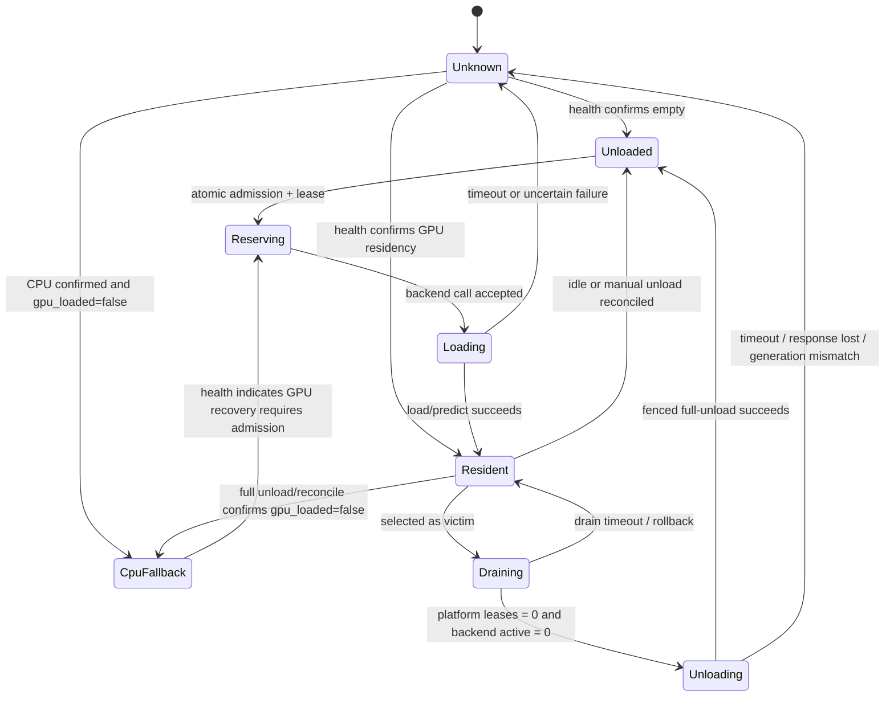

# v0.22.4 · 跨 Backend GPU 显存互斥编排实施计划

> 版本：v0.22.4 · 状态：P0a 地基纠偏已完成 · P0b ADR 冻结待执行 · 仲裁主体尚未实施 · 2026-07-14
>
> 地基基线：初始 `compute` 传输链由 `2026-07-13-v0.22.3-ml-backend-cpu-fallback-audit.md` 交付；本轮已按实际代码、容器镜像、运行中 `/health` 与定向测试完成 P0a 纠偏。完成 §8 P0b 前不得接受 ADR-0049；完成 P1–P5 对应验收前不得开启仲裁 enforce。
>
> 架构依据：ADR-0049（当前仍为 Proposed）、ADR-0044（全局注册表）、ADR-0012（独立 GPU 服务）、ADR-0038（不借机抽 backend 基类）。

## 0. 地基复核结论

### 0.1 P0a 前已确认可复用的基线

- 五个自有 backend 已产出顶层 `compute`；`MLBackendClient.health_meta()`、健康 worker、注册表 JSONB、API schema 和前端类型已能透传。
- P0a 前运行中的 Grounded-SAM2、SAM3、YOLO、RapidOCR `/health` 与 PostgreSQL `health_meta` 均可看到 `compute`；未加载 torch backend 返回 `effective_device=null`，符合“尚未探测”语义。
- P0a 前共享 helper 14 测、API 定向 28 测、PerfHUD WebSocket hook 7 测通过；这些证据只证明既有传输和缓存路径未回归，没有覆盖下列故障语义。

### 0.2 阻断问题与本计划处置

| ID | 审查发现 | 本计划确定的处置 |
|---|---|---|
| F1 | SAM3 image、multiplex、PVS 的 vendor 路径仍有硬编码 CUDA；现有 CPU 重试不能成立，multiplex wrapper 还会调用不存在的 `predictor.to()` | 本期明确 SAM3 为 `gpu_only / cpu_fallback_supported=false`；删除虚假的 CPU fallback 语义。vendor 全面 CPU 移植另立计划，不作为显存仲裁前置 |
| F2 | ORT probe 只看 `InferenceSession()` 是否抛错，没有核对实际 `session.get_providers()`；RapidOCR / ONNXTools 可能把内部 CPU fallback 误报为 CUDA | P0a 已核对实际 session provider；无法读取真实 provider 的 lazy / composite pool 返回 JSON `null`（unknown 语义），不得用偏好列表首项冒充 effective provider |
| F3 | 共享 `_effective_device_cache` 无锁，CPU latch 可被并发 CUDA probe 覆盖；它还是进程级单值，无法表达同进程 GPU/CPU 混合池 | P0 使 latch 线程安全且单调；`compute` 永远只作诊断，allocation 释放只认逐池聚合后的 `residency.gpu_loaded=false` |
| F4 | fallback catch 会把非 CUDA 错误永久 latch；构建后 CUDA 失效、坏上下文下 `empty_cache()`、CPU 重建失败均未形成可靠事务 | 仅在识别为设备错误且 CPU 重建成功后提交 latch；清理 best-effort。无法可靠 fallback 的 backend / 路径显式声明 `gpu_only` |
| F5 | PerfHUD 漏 ORT provider 且会把显式 CPU 配置误报为 fallback；backend / 平台 / UI 没有新增相应契约测试 | 抽共享 CPU fallback 判定并补 torch / ORT / explicit CPU / null 测试；补五 backend health、平台透传、落库与序列化测试 |
| F6 | ONNXTools 虽已由 compose 定义，但没有运行中实例可做部署验证；GPU UUID、MIG UUID、`process_memory_mb` 等嵌套诊断字段仍可能被 schema 丢弃 | 未验证实例不得进入 enforce；P2 补物理资源身份和 response serialization 测试 |

因此，`compute=cpu` 与 `residency.gpu_loaded=true` 是必须支持的合法混合状态。前者不能单独触发减账；只有 full-unload 或可信 reconcile 确认所有 pool / session / GPU tensor cache 均为空，才能释放 allocation。

## 1. 结论与本期边界

本期目标不是做 GPU 调度平台，而是在现有“一 backend 一容器、每个容器静态绑定一张卡”的前提下，给所有平台派发入口增加同一套跨进程显存准入：同卡按静态预算共驻，放不下时按优先级加权 LRU 驱逐，活跃请求受保护，彻底放不下时明确失败；不同卡互不阻塞。

单卡与多卡使用同一模型：**按物理资源卡分片治理**，而不是按“机器是单卡还是多卡”整体分支。当前默认双卡布局仍是 gsam2 / yolo / onnxtools / rapidocr 共用卡 0、sam3 使用卡 1，因此卡 0 仍需仲裁；只有某张卡实际至多绑定一个 backend 时，该卡才自然退化为无驱逐快路径。

本期包含：

- 静态 backend → 单张物理卡映射、每卡独立预算、账本、锁、等待队列和指标。
- `predict`、`predict_interactive`、`warmup`、`reload`、手工 `unload` 以及运行时 smoke-test 的统一生命周期门控。
- 单卡多 backend 共驻 / 驱逐，多卡共享与独占混合布局，API 与多个 Celery 进程并发。
- 把现有 `max_concurrency` 从单进程减压提升为 Redis request lease 约束下的跨进程全局并发上限；本地 semaphore 继续作为第一层背压。
- CPU fallback 与 ORT provider 只参与诊断和下一次加载决策；账本释放由 `residency` 独立决定，不改变既有 Celery 队列路由。
- 默认关闭、observe 影子决策、单卡 enforce、多卡逐卡灰度和即时回滚。

本期明确不做：

- 不做跨卡自动 bin-packing、动态迁移或“挑最空闲卡”。
- 不做同一 backend 多副本、负载均衡或副本 scale-out。
- 不做单个 backend 同时占多卡；配置出现 device set 时首版直接拒绝，另立 ADR 设计全量原子获取与死锁顺序。
- 不把活体 `gpu_info.memory_used_mb` 当准入依据；它是共享卡整卡视角，只做漂移 / 外部占用告警。
- 不引入 ML Backend 基类，不统一各 backend 的模型池内部实现。
- 不做请求级动态显存预测；首版仍使用每 backend 一个保守静态预算。

## 2. 设计决策与阶段验收门

P0 的职责是修复 D1 地基阻断，并把 D2–D14 的**设计选择**写入 ADR-0049；P1–P6 再用各自实现与测试提供验证证据。不得要求 P0 先拿到后续阶段测试，否则会形成循环门槛。ADR 可在设计冻结且 D1 通过后转 Accepted，但 L2 enforce 仍必须等待表中的对应阶段验收完成。

| ID | 当前问题 | 已确定决策 | 验收阶段 |
|---|---|---|---|
| D1 | P0a 前 `compute` 链路已落地，但 SAM3 CPU fallback 不成立、ORT provider 可能误报、latch 非并发单调且缺契约测试 | **已关闭**：保留顶层 `compute` 作为诊断；SAM3 声明 GPU-only；ORT 读取真实业务 session provider；latch、实时/缓存 UI 选择与契约测试已修复。`compute` 不作 allocation 真值 | P0a |
| D2 | ADR 的默认优先级比较导致同级 backend 永远不可驱逐 | 字段命名为 `eviction_priority`；只保护严格更高优先级，`victim.priority <= requester.priority` 可被选，同级再按 LRU | P3 / P4 |
| D3 | ADR 把多卡概括成每卡至多一个 backend，与默认双卡的卡 0 四 backend 共用矛盾 | 单卡、多卡统一逐 `gpu_resource_id` 治理；共享卡仲裁，独占卡快路径，禁止整机级 bypass | P2 / P5 |
| D4 | 裸 `device_id` 会把不同主机的卡 0 合并，容器内 `cuda:0` 也不是物理身份 | registry 显式引用稳定 `gpu_resource_id`；资源配置优先绑定 GPU / MIG UUID，兜底为显式 resource domain + physical token | P2 / P5 |
| D5 | `loaded` 和进程级 `compute` 都无法表达 image / video / variant 混合驻留 | `residency.gpu_loaded` 是释放 allocation 的唯一 backend 真值，并带逐 pool device/provider、active、draining、generation | P1 |
| D6 | RapidOCR 没有 `/unload`，GSAM2 未清 video pool，其他 backend 的物理释放也未统一验证 | 只有通过受管 full-pool unload + fencing 契约的 backend 才 `evictable=true`；其余固定 non-evictable 并保守计费 | P1 |
| D7 | TTL 卡锁无法阻止迟到 HTTP unload | 卡锁只做短状态跃迁；所有加载 / 卸载操作携带单调 generation/fencing token，backend 拒绝旧 generation | P1 / P3 |
| D8 | 平台 lease 结束不等于 backend 已停止计算 | Redis request lease 与 backend active/draining 双层保护；任一侧仍 active 都不得卸载 | P1 / P3 / P5 |
| D9 | 单模型净增不覆盖多池、多变体、并发和 SAM3 视频瞬时工作集 | `vram_budget_mb` 是部署配置下保守最大运行工作集；未校准 backend 按整卡 allocatable 计费 | P2 / P6 |
| D10 | Redis 故障时放行会同时绕过显存账本与跨进程 `max_concurrency` | `off/observe` 保持现状；`enforce` 对所有 GPU resource 一律 fail-closed，不再为独占卡保留隐式例外 | P3 / P4 |
| D11 | `exclusive_group` 未进入算法，关键配置放 JSONB 会形成弱类型真值 | registry 只新增算法实际读取的显式列；删除 `exclusive_group`，整卡保护用 `budget == allocatable` 表达 | P2 |
| D12 | 当前 module-level semaphore 只覆盖单进程 / event loop | 保留本地 semaphore 作背压；Redis request lease 执行 backend 级全局 `max_concurrency`，stale lease 在 backend active 时保守保留 | P3 / P4 |
| D13 | 平台外直连加载端点可绕过账本 | enforce 时所有 predict / warmup / reload / unload 强制验证短期 admission token；生产网络同时限制 backend 加载端点，只读 health / setup 可豁免 | P1 / P4 / P6 |
| D14 | task-major pipeline 和连续视频窗口可能反复冷切 | 每次新 residency 写入 `not_evict_before`；只有 cooldown 到期才可成为 victim。慢请求按卡 FIFO 等到独立 admission timeout，超时返回 503 + `Retry-After`；不做无界 job pin 或 pipeline 特判 | P5 |

## 3. 成功标准与不变量

### 3.1 资源与容量

1. 一个 registry backend 在本期只能声明一个 `gpu_resource_id`；仅显式 configured CPU 的 backend 为 `null`。GPU backend 即使运行时 fallback 到 CPU，也保留静态 resource claim。
2. `allocatable_mb` 是扣除驱动、CUDA context、桌面 / 系统进程、非平台进程和安全余量后的可分配容量，不直接等于显卡标称总显存。
3. `committed_mb` 等于该卡所有 `reserving/loading/resident/draining/unloading/unknown-conservative` allocation 的预算和。
4. enforce 下任何成功的新准入都满足 `committed_mb <= allocatable_mb`；已发现超额漂移时停止新增承诺，先对账或拒绝。
5. 一张卡的锁、状态跃迁、排队或 backend 故障不能阻塞另一张卡；共享 Redis 整体不可用属于基础设施级故障，按 D10 的全局 failure policy 处理，不能宣称天然隔离。

### 3.2 驱逐与并发

1. 同级 backend 可按 `last_used_at` 从旧到新驱逐；严格更高 `eviction_priority` 的 backend 受保护。
2. 准入、allocation 预留和 request lease 创建必须原子完成，不留“已准入但尚未记 inflight”的 TOCTOU 窗口。
3. 同一 backend 的有效 Redis request lease 数不得超过现有 `extra_params.max_concurrency`；裸整数 inflight 不满足崩溃回收要求。
4. lease heartbeat 过期只证明平台调用方失联，不证明 backend 已停止计算；backend 仍 active 时保守占住并发许可和 allocation，直到对账确认空闲。
5. 被选为受害者后先进入 `draining`，不再发新 lease；平台 lease 与 backend active 均为 0 后才能全池卸载。
6. 卡锁不覆盖 drain、HTTP unload 或整个 predict；这些长操作在锁外执行，由 generation token 和 CAS 提交保护。
7. 旧 generation 的进程不能写回账本，也不能卸载新 generation 已重新使用的模型。
8. 卸载成功但响应丢失、backend 不可达或结果不确定时继续保守计费为 `unknown`，不得先减 committed。

### 3.3 用户行为

1. `off` 模式不访问仲裁 Redis key、不改变现有请求顺序、错误和性能。
2. `observe` 模式计算 would-admit / would-evict / would-reject，但绝不调用 `/unload`、不阻断业务。
3. `enforce` 无容量时在发 backend HTTP 前返回结构化 503，例如 `gpu_capacity_unavailable`，交互式、批量、二次推理和视频路径使用同一根因语义。
4. `compute` 为 CPU 只表示当前 / 后续计算路径偏好；仅当 `residency.gpu_loaded=false` 也被可信确认时才不占 GPU budget。`None`、mixed、provider 不可读均按配置 GPU 保守计费。
5. 因硬件失效而 CPU fallback 与因预算不足被仲裁拒绝必须可区分；容量不足不能用静默 CPU 降级掩盖。

## 4. 目标资源与静态配置模型

### 4.1 物理资源标识

采用单资源 claim，registry 直接引用资源配置中的稳定 key：

```text
gpu_resource_id = <resource_domain>/<physical_device_token>

示例：
gpu-node-a/GPU-6ab3...
gpu-node-a/index:0
gpu-node-b/index:0
```

resource domain 必须由运维显式配置，不能从 backend URL hostname 猜测：同一 GPU 主机上的不同容器通常有不同 service DNS，而不同主机又都可能暴露逻辑 `cuda:0`。physical device token 使用 compose 实际绑定的 GPU / MIG UUID，取不到时才用明确的物理 index；容器内重映射后的逻辑 `cuda:0` 不能作为跨 backend 真值。

现有地基没有提供稳定 GPU / MIG UUID，且部分 backend 只可靠解析数字 `CUDA_VISIBLE_DEVICES`。P2 必须补资源配置与 health 的一致性校验；在 UUID 映射尚不可验证的部署上，只能使用运维显式声明的 resource domain + physical token，不能由平台猜测。

首版数据库字段建议直接进入 `ml_backend_registry`：

| 字段 | 类型 / 缺省 | 语义 |
|---|---|---|
| `gpu_resource_id` | `str | null` | 引用 `GPU_ARBITER_RESOURCES_JSON` 的稳定资源 key；显式 CPU backend 为空，禁止逗号 / 多值 |
| `vram_budget_mb` | `int | null` | 该 backend 的保守最大运行工作集 |
| `eviction_priority` | `int = 0` | 越大越难被驱逐；不表示请求排队优先级 |

`evictable` 不由管理员随意勾选，而由 backend `/setup` + `/health.residency` 的受管生命周期能力派生，避免把没有可靠全池卸载能力的第三方 backend 错当受害者。静态字段使用显式列而不是 `extra_params`，因为它们需要类型校验、列表展示、迁移与配置变更护栏。

卡容量使用平台配置 `GPU_ARBITER_RESOURCES_JSON`（`gpu_resource_id -> {node_id, physical_device_token, allocatable_mb}`）；单个 `CARD_TOTAL_MB` 无法表达多卡和多主机。L1 可用 `gpu_info.memory_total_mb` 和 UUID 给出建议值 / 不一致告警；L2 不在缺少明确 allocatable 时猜测容量。新增 / 修改 URL、资源映射、预算时，若该 backend 尚有 allocation 或 active lease，返回 409，要求先 drain + unload，不做热迁移。

现有 `extra_params.max_concurrency` 暂保留兼容，不在本计划顺带搬列；它在 L2 下由 Redis lease 执行真正的跨进程上限，现有本地 semaphore 只负责减少单进程排队压力。后续若单独做注册表强类型化，再迁移该字段。

### 4.2 预算口径

`vram_budget_mb` 必须覆盖：

- backend 内所有允许同时存在的 image / video / variant pool cap。
- `max_concurrency` 下可同时发生的推理临时 buffer。
- 当前最大允许视频窗口；SAM3 16 帧工作集不能套用仅图像模型的约 6GB 建议值。
- CUDA / ORT 上下文中归属于该 backend 且在全池卸载后仍不会释放的必要基线。
- 校准误差安全余量。

性能基准里的默认模型净增只作为首轮测量种子，不能直接复制为 enforce 预算。未完成峰值校准的 backend 暂将预算设为该卡 `allocatable_mb`，等价于保守整卡驻留；本期不另加 `exclusive_group` 或请求级动态 budget。

L1 告警分四级，避免把“允许驱逐”误报成故障：

| 条件 | 级别 | 含义 |
|---|---|---|
| 单 backend `budget > allocatable` 或必填配置缺失 | blocker | 该 backend 在此卡永远无法安全运行 |
| 同卡全部配置预算和 `> allocatable` | warning | 正常弹性超售；运行时将发生驱逐和冷启动 |
| Redis `committed > allocatable` | critical | 账本不变量破坏或重建未完成 |
| 去重后的整卡 observed 与 committed 明显偏离 | warning | 预算漂移或存在平台外 GPU 占用，仅用于校准 |

## 5. 受管 backend 生命周期契约

现有 `compute` 只表达配置意图与探测 / 加载偏好；多池混合和 ORT lazy session 下甚至不等于实际驻留。本计划将它保留为诊断字段，并新增独立的统一 `residency`：

```json
{
  "compute": {
    "configured_device": "cuda",
    "effective_device": "cuda:0",
    "effective_provider": null,
    "cpu_fallback_supported": true
  },
  "residency": {
    "state": "resident",
    "gpu_loaded": true,
    "active_requests": 0,
    "draining": false,
    "evictable": true,
    "generation": "opaque-generation-token",
    "pools": {
      "image": {"resident": true, "device": "cuda:0"},
      "video": {"resident": false, "device": null}
    }
  }
}
```

要求：

- `gpu_loaded` 表示任一 GPU image pool、video pool、ORT session 或 GPU tensor cache 仍驻留；不能只镜像旧顶层 `loaded`。
- `compute` 与 `residency` 允许出现 CPU + GPU mixed；只有 `gpu_loaded=false` 才能释放账本。逐 pool 无法读取实际 device/provider 时状态为 unknown，并按 GPU 保守计费。
- `/unload` 的受管语义是清空该 backend 的全部 GPU pool / session / GPU tensor cache，并返回实际 generation；只卸 image pool 不合格。
- predict / warmup / reload 进入 backend 内部 active guard；draining 后拒绝新工作。受管 unload 只在 active 为 0 且 generation 匹配时执行。enforce 下所有可能加载的端点还必须验证 admission token，防止平台外直连绕过账本。
- 不支持该契约的 backend 仍可运行和计入预算，但 `evictable=false`，绝不能进入自动受害者集合。
- `cpu_fallback_supported=false` 的路径在 GPU 失败时明确报错，不得先写 CPU latch 再执行仍硬编码 CUDA 的重试；本期 SAM3 image / multiplex / PVS 均采用该语义。
- 旧 `loaded`、`pool`、`video_pool` 保留兼容展示；平台对账以 `residency` 为真值。
- 不为此抽统一 backend 基类；五个 backend 分别在现有生命周期锁 / pool 边界做最小改造，共享的只应是协议 schema / header 常量。

当前必须补的已知差异：

- RapidOCR 新增全池 `/unload`，清引擎池、锁 / meta 引用并确认 ORT GPU session 释放。
- Grounded-SAM2 `/unload` 同时清 `_pool` 与 `_video_pool`；当前仅清图片池。
- SAM3 的 `gpu_loaded` 必须合并 image、multiplex video、PVS video，而非只看 `_predictor`。
- YOLO、ONNXTools、RapidOCR 从真实 pool / session 统一映射 residency；ORT 不得把请求 provider 列表首项当成实际 provider。
- ONNXTools 为 lazy handle 构建、predict 与 unload 增 active/draining guard，禁止并发重复构造和卸载仍在使用的 session。
- RapidOCR 为同一 `pool_key` 的冷启动增加 single-flight；当前构造发生在池锁外，并发首调可能短时生成两份引擎。

## 6. Redis 账本、状态机与公平性

### 6.1 Key 与真值边界

Redis 使用版本化 namespace，并让同一卡的 key 可进入同一 Redis Cluster hash slot：

```text
gpu-arbiter:v1:{resource_id}:card
gpu-arbiter:v1:{resource_id}:allocations
gpu-arbiter:v1:{resource_id}:queue
gpu-arbiter:v1:{resource_id}:backend_queue:<backend_id>
gpu-arbiter:v1:{resource_id}:leases:<backend_id>
gpu-arbiter:v1:{resource_id}:transition
```

PostgreSQL 保存静态 claim；Redis 保存运行时 allocation、generation、LRU、等待 ticket 和 request lease。每个请求使用独立 token + heartbeat deadline；deadline 过期后标为 stale，若 backend 仍报告 active 则继续保守计数，待 backend 确认空闲后才清理，不能用一个裸 `inflight` 整数代替。只有 queue / lease / transition owner 有过期 / 接管语义；驻留 allocation 不得因 TTL 自动消失。`committed_mb` 由 allocation 集合原子求和 / 校验，不依赖容易漂移的裸增减计数。

### 6.2 状态机



`Unknown` 保守占用上一份 budget，直到可信 health 证明 `gpu_loaded=false`；不能因 backend 不可达或单独看到 `compute=cpu` 释放额度。若 `compute=cpu` 但仍有 GPU pool，allocation 继续处于 `Resident`，并在观测中标为 mixed。

### 6.3 原子准入

最终 L2b 的 `MLBackendClient` 请求上下文顺序固定为（P4 的 L2a 遇到 busy victim 时在第 6 步直接返回 503，不进入主动 drain）：

1. 先取得现有 per-backend 本地 semaphore，避免还在本进程排队的请求提前占 Redis lease；该 semaphore 不再被描述为全局闸。
2. `off` 直接调用；`observe` 只记录影子决策；`enforce` 进入对应 `resource_id`。
3. 在短卡锁 / Lua 原子区内读取 lease / allocation。若 backend 已达到全局 `max_concurrency`，进入该 backend 自己的 FIFO ticket 队列并在锁外有界等待；不能占住卡级 allocation 队列，也不能阻塞其它 backend。超时返回独立的 concurrency-saturated 503。
4. target 已 resident、未 draining 且有全局并发许可：原子增加带 heartbeat 的 request lease、更新 LRU，立即放行。
5. target 未 resident 且 free 足够：创建 `Reserving` allocation、generation 和 request lease，再释放卡锁。
6. free 不足：从 `evictable=true`、严格不高于 requester priority 的 allocation 中按 `(priority asc, last_used_at asc)` 选足够受害者，标 `Draining` 后释放卡锁。
7. 锁外等待平台 leases 清零并调用受管 drain / unload；超时则回滚 victim 状态并返回 503，绝不在卡锁内等待网络。
8. 重新取得短锁，用 transition owner + generation CAS 提交卸载结果并为 target 预留；旧 owner 的结果只能被丢弃。
9. backend 调用结束后在 `finally` 删除 request lease；成功且 `gpu_loaded=true` 转 `Resident`，成功 fallback 且可信确认 `gpu_loaded=false` 转 `CpuFallback` 并释放预留；确定性加载失败可回滚，超时 / 断连或 residency 不可读转 `Unknown` 保守等待对账。

已 resident 且不参与当前 drain 的 backend 使用快路径，不因另一个慢请求排队而无条件 head-of-line blocking。需要新 allocation / 驱逐的慢路径按卡 FIFO；首版不增加“交互请求优先于批量”的第二种请求优先级，避免与 `eviction_priority` 混淆和引入饥饿。视频追踪仍按现有窗口逐次持 lease，不锁整个作业；每窗结束重新参与排队，避免长视频永久霸卡。

API lifespan 与 Celery 中多次 `asyncio.run` 会使用不同 event loop；实现不得跨 loop 复用一个 module-global `redis.asyncio` client / pool。P3 必须选择按 event loop 管理并显式关闭的异步 client，或封装同步 Redis 调用，并用重复创建 / 销毁 loop 的测试证明不会复用失效连接。

平台内的统一 client gate 只能保证平台派发不绕过。生产 enforce 必须同时限制 backend 加载端点的网络直连，并由 backend 强制校验短期 admission token；否则 Redis 账本只能被称为 best-effort，不能作为 OOM 安全保证。

## 7. 单卡、多卡与 CPU 行为矩阵

| 场景 | 预期行为 |
|---|---|
| 单卡、单 backend、预算合法 | 建一次 allocation；之后 resident 快路径，无受害者选择 |
| 单卡、多 backend、预算和不超卡 | 可同时 resident，不发生驱逐 |
| 单卡、多 backend、弹性超售 | 按同卡 priority + LRU 驱逐；active victim 先有界 drain |
| 单卡、target 自身预算超卡 | 配置 blocker；enforce 在发 HTTP 前拒绝 |
| 双卡，每卡一个 backend | 两张卡各自快路径，可完全并行 |
| 双卡，卡 0 四 backend、卡 1 一个 backend | 只在卡 0 选择受害者；卡 1 不受卡 0 的资源锁 / 队列 / backend 故障影响 |
| 两台 GPU 主机各有 card 0 | 通过不同 resource domain 形成两个 `gpu_resource_id`，账本与锁完全隔离 |
| backend 配置 GPU、`effective=None` | 视为未加载 / 未知，按 GPU budget 准入 |
| backend 已明确 effective CPU / CPU provider，且 `gpu_loaded=false` | 转 `CpuFallback`，不占运行时 GPU allocation；保留静态 resource claim，仍沿原 Celery 队列运行 |
| backend 报 effective CPU，但任一 pool 仍在 GPU / provider unknown | 继续按 `Resident` 或 `Unknown` 保守计费，管理端显示 mixed / unknown |
| 进程重启后从 CPU 恢复到 GPU | 不直接记 resident；以新 generation 重新 bootstrap，下一次 GPU 调用必须重新准入 |
| SAM3 等 `cpu_fallback_supported=false` 的路径发生 GPU 故障 | 明确失败并保守保留不确定 allocation；不执行虚假 CPU 重试 |
| 未实现受管 unload 的第三方 backend | 可以计费并运行，但固定 non-evictable；放不下时驱逐别家或拒绝 |
| 单 backend 声明多个 device | 首版 422 / 配置 blocker；不尝试逐卡拿锁 |

多阶段 pipeline 当前按“每 task 跑完全部 stage”执行；若两个同卡大 backend 互相放不下，仍可能在 task 间反复冷切换。本期不顺带重写为 stage-major pipeline，而由 D14 的 `not_evict_before` + bounded FIFO admission 统一限制切换频率；等不到 cooldown 的请求返回 503 + `Retry-After`。若观测证明需要改变 pipeline 调度形态，再另立计划。

## 8. 工作分解

### P0 · 地基纠偏与 ADR 冻结（硬门）

P0a · 修复 D1（已完成）：

- SAM3 image / multiplex / PVS 明确声明 `cpu_fallback_supported=false`，移除“失败后仍调用硬编码 CUDA builder”的虚假 fallback；本计划不修改 vendor 以追求全面 CPU 支持。
- ORT probe 保存并检查真实 session 的 `get_providers()`；RapidOCR / ONNXTools 的 lazy handle、composite pipeline 无法读取真实 provider 时返回 JSON `null`（unknown 语义），不把 `use_cuda` 或 provider preference 冒充 effective provider。
- 共享 device latch 改为线程安全、CPU 单调不可逆；只在识别为设备错误且 CPU 重建成功后提交，CPU 重建失败回滚。CUDA cache 清理为 best-effort，不得覆盖主错误或令 unload 失败。
- 补五 backend 设备退化 / provider 行为契约、并发 latch、非 CUDA 错误、ORT 内部 fallback、平台 `health_meta` 放行 / 落库 / response serialization、Runtime Observe 与 PerfHUD 判定测试；四个现有运行实例的 `/health.compute` 另以真实 HTTP 响应验证。
- PerfHUD 与 Runtime Observe 复用同一 CPU fallback 纯函数；同时支持 torch / ORT，排除 explicit CPU 和 null。实时 observe 路径也透传 `compute`。
- 修正 CPU fallback 计划 Outcome、CHANGELOG、ROADMAP 与协议文档中超过实际保障范围的表述；物理 GPU 诊断字段统一留在 P2 随资源模型落地。

P0b · 冻结 ADR（待执行）：

- 将 §2 的 D2–D14 设计选择和 §3 不变量写回 ADR-0049；P1–P6 的测试保留为各阶段 exit criteria，不要求 P0 提前伪造验证证据。
- 冻结错误码：至少区分 `gpu_arbiter_not_ready`、`gpu_capacity_unavailable`、`gpu_backend_concurrency_saturated`、`gpu_drain_timeout`、`gpu_arbiter_unavailable`、`gpu_config_invalid`。
- P0a 测试通过后把 ADR 从 Proposed 转 Accepted，再进入 P1；这不代表 L2 已可开启。

P0a 已验收：D1 不再误报 CPU / CUDA，SAM3 GPU-only 能力明确，契约测试覆盖真实新增行为。P0 整体仍未验收：ADR 尚未记录全部设计决策。ONNXTools 未完成运行实例验证前保持 non-evictable、不得加入 enforce allowlist。

### P1 · 受管 backend 驱逐契约（仍不自动驱逐）

主要触点：

- `apps/grounded-sam2-backend/main.py`、`video_pool.py`
- `apps/sam3-backend/main.py`
- `apps/yolo-backend/main.py`、`model_pool.py`
- `apps/onnxtools-backend/main.py`、`predictor.py`
- `apps/rapidocr-backend/main.py`、`predictor.py`
- `apps/_shared/backend_runtime/` 的 device / GPU 清理 helper 与协议 schema
- 五 backend 对应 contract / idle-unload 测试
- `docs-site/dev/reference/ml-backend-protocol.md`

工作：统一 `residency`、逐 pool device/provider、全池 unload、backend active/draining、generation fencing；不抽生命周期基类。旧调用保持兼容，但不具备完整契约者自报 `evictable=false`。CPU-capable 与 GPU-only 是显式 capability，不能从一次失败推断。

验收：未加载、image-only、video-only、image+video、多 variant、mixed CPU/GPU、active、draining、旧 generation、全池 unload、CPU-capable / GPU-only 各状态都有契约测试；RapidOCR 与 GSAM2 的已知缺口关闭。只有 `gpu_loaded=false` 才允许减账。

### P2 · L1 静态 claim、配置校验与 observe 模式

主要触点：

- `apps/api/app/db/models/ml_backend_registry.py`
- `apps/api/app/schemas/ml_backend.py`
- `apps/api/alembic/versions/<next>_ml_backend_gpu_claim.py`
- `apps/api/app/config.py`
- `apps/api/app/services/ml_backend.py`、`ml_backend_env_sync.py`
- `apps/api/app/api/v1/admin_ml_integrations.py`
- `apps/api/app/services/ml_client.py`、`apps/api/app/workers/ml_health.py` 的 health 字段透传
- `apps/web/src/pages/ModelMarket/GlobalBackendFormModal.tsx`
- `apps/web/src/pages/ModelMarket/RegisteredBackendsTab.tsx`
- `apps/web/src/pages/ModelMarket/RuntimeObservePanel.tsx`
- `.env.example`、compose 中 API / 全部相关 worker 的环境透传

工作：新增显式静态字段、每卡 allocatable 映射、`off|observe|enforce`（默认 off）、配置变更 409 护栏和四级告警；平台 schema / health worker 完整保留 `compute`、`residency`、GPU UUID 和进程显存诊断字段。observe 在真实派发点计算 would-*，但绝不卸载或拒绝。

验收：单卡、同宿主双卡、两宿主同号卡聚合正确；observe 零副作用；卡容量 / budget 缺失与不合法均可在管理端看到；OpenAPI / codegen / env 文档同步。

### P3 · Redis 原子账本、lease、慢路径队列与对账

主要触点：

- 新增 `apps/api/app/services/gpu_arbiter.py`
- 如 Lua 规模需要再拆 `apps/api/app/services/gpu_arbiter_store.py`，不预先抽更多层
- `apps/api/app/workers/ml_health.py`
- `apps/api/app/observability/metrics.py`
- `apps/api/tests/test_gpu_arbiter_policy.py`
- `apps/api/tests/test_gpu_arbiter_redis.py`

工作：实现 versioned key、allocation 状态机、短卡锁、generation CAS、request lease TTL + heartbeat、backend 级全局 `max_concurrency`、慢路径 FIFO、取消 / 超时清理、bootstrap 与 60 秒 repair loop。Redis 为空时必须先从 DB 静态 claim + live backend health 重建；完成前 enforce 不得把空账本当空卡。Redis client 生命周期必须兼容 API 长驻 event loop 与 Celery 反复创建 event loop。

验收：两个独立 Redis client 模拟 API / Celery 并发时不超卖；进程在每个状态跃迁点崩溃都能收敛；卡 A 的延迟 / 锁故障不影响卡 B；unload 响应丢失不提前释放额度。

### P4 · 单卡 L2a enforce、空闲驱逐与全部入口收口

主要触点：

- `apps/api/app/services/ml_client.py`
- `apps/api/app/services/ml_backend.py`
- `apps/api/app/api/v1/ml_backends.py`
- `apps/api/app/api/v1/admin_ml_integrations.py` 的 smoke-test
- `apps/api/app/services/secondary_inference.py`
- `apps/api/app/workers/tasks.py`
- `apps/api/app/workers/frame_preannotate.py`
- `apps/api/app/services/video_tracker_adapters.py` / `video_tracker_runner.py`
- `apps/api/app/workers/predictions_retry.py`

工作：把 semaphore 与 arbiter context 组合进 `MLBackendClient`，覆盖 predict / interactive / warmup / reload / unload；注册 backend 的 smoke-test 改走受管 client，未注册 URL 在 enforce 下只能做只读 health、不得直接加载。统一 503 错误和批量失败记录；手工 unload 成功后立即对账，不等 60 秒。首个 enforce 子阶段只驱逐平台 lease 与 backend active 均已为 0 的 victim；受害者仍忙时立即返回带 `Retry-After` 的结构化 503，不在第一步启用主动 drain。

验收：可共驻、刚好容量、逐个驱逐多个空闲 victim、同级 LRU、高优先保护、busy fail-fast、完全放不下、Redis 故障、CPU fallback、warmup / reload / raw smoke-test 绕过尝试全部通过。`off` 模式的现有 ML client 行为无回归。

### P5 · L2b 有界 drain、多卡验证与防抖护栏

工作：

- 每卡独立展示 allocatable / committed / observed、resident / draining / non-evictable backend。
- 增加 admission、would-evict、eviction、drain、reject、arbiter-unavailable / fail-closed、reconcile 和 budget drift 指标。
- 在 P4 稳定后才启用 `draining`：阻止 victim 新 lease，锁外有界等待平台 lease 与 backend active 清零，超时回滚并返回 503。
- 落实 D14：新 residency 写 `not_evict_before`，slow-path FIFO 只等待到独立 admission timeout，超时返回 503 + `Retry-After`；observe / canary 只校准 cooldown 时长，不再切换到另一套策略。
- 后端删除、URL / 卡 / budget 修改前检查 allocation + active lease；首版只允许 unloaded 状态修改。
- 同宿主双卡与两宿主同号卡分别做集成测试；显式拒绝多卡 device set。

验收：active victim 能有界 drain 且不会被新请求续住；超时不误卸载；高频 pipeline 不会无界冷切；卡 0 驱逐不触碰卡 1；两卡可并行；资源映射修改在驻留 / active 时 409；默认双卡布局不会被错误整体 bypass。

### P6 · 灰度、回滚、正式文档与收尾

灰度顺序：

```text
off
  → observe 全量并校准预算
  → enforce 单张测试卡
  → 单卡多 backend canary
  → 多卡部署中的一张共享卡
  → 全部已校准共享卡
```

回滚只把模式切回 observe / off，停止新驱逐；不清 Redis、不假定真实模型已卸载，先跑一次 reconciliation，再让现有 backend 按自身 idle 策略自然收敛。API、GPU worker 和其它调用 ML client 的 worker 必须全部部署同一版本并重启后才能开启 enforce，避免旧进程绕过 gate。

## 9. 测试与验收矩阵

| 维度 | 必测场景 | 关键断言 |
|---|---|---|
| 纯策略 | `<`、`==`、`>` 容量，差 1MB，单 budget 超卡 | 选择结果确定，超卡不发 HTTP |
| 优先级 | 同级、低请求遇高 victim、高请求遇低 / 同级 | 同级 LRU；只保护严格更高者 |
| 原子性 | API + 两个 Celery client 同时准入 | allocation + lease 原子，committed 不超 allocatable |
| 快慢路径 | resident 命中、慢路径 FIFO、非 victim resident | 快路径不被无关 drain 阻塞 |
| drain | L2a busy fail-fast；L2b victim 活跃、持续新流量、超时、取消 | L2a 不冒险等待；L2b draining 后不发新 lease并有界结束 |
| generation | 卡锁 TTL 过期、旧 owner 恢复、迟到 unload | 旧写回和旧 unload 均无效 |
| backend 真值 | 客户端超时后 backend 继续算 | active 非零时不能清模型 |
| unload | 成功、失败、超时、成功但响应丢失、重复调用 | 只在可信成功后释放；不确定转 unknown |
| 对账 | idle unload、手工 unload、backend 重启、Redis flush | 丢账后先 bootstrap；最终与 health 收敛 |
| residency | image / video / PVS / 多 variant / ORT session / mixed CPU+GPU | 任一 GPU pool 驻留即 `gpu_loaded=true`；compute CPU 不触发减账 |
| CPU | configured CPU、effective CPU + 空 residency、CPU + GPU mixed、None、GPU-only、CPU→GPU | 只有空 residency 不计费；mixed / None 保守；GPU-only 明确失败；恢复重新准入 |
| 单卡 | 多小 backend 共驻、大 backend 驱逐、多阶段交替 | 不 OOM；驱逐 / 冷载次数可观测 |
| 多卡 | 同机两卡、两主机各 card 0、卡 A transition owner 卡住 | 无 key 碰撞、跨卡并行、资源级故障隔离 |
| 管理入口 | warmup、reload、manual unload、smoke-test、删除 / 改卡 | 无加载绕过；有 active 时拒绝配置变更 |
| 模式 | off、observe、enforce、运行时回滚 | off 零回归；observe 零副作用；回滚不清状态 |
| 长任务 | SAM3 视频逐窗、job cancel、Celery revoke | 每窗租约；不整 job 霸卡；临时 ticket 清理 |
| 防抖 | task-major 不可共驻 pipeline、连续 tracker 窗口 | 驱逐频率有界；cooldown / FIFO timeout 行为确定且可观测 |
| 绕过 | 未注册 smoke-test、平台外直连加载端点 | enforce 不产生账本外 GPU residency |
| P0 地基 | latch 并发、ORT session 内部 fallback、SAM3 GPU-only、explicit CPU / ORT badge | compute 不误报，新增契约均有回归测试 |

验证层次：

1. 纯策略和状态机单测不依赖 GPU。
2. Redis 集成测试使用独立 key 前缀和两个以上独立 client，验证 Lua / CAS 真原子性。
3. 五 backend contract test 用 mock 模型覆盖 lifecycle，不要求 worktree 内有 GPU。
4. 主工作区合入后跑 API 定向 pytest、backend 定向 pytest、前端定向 Vitest、OpenAPI、typecheck、CSS token 检查和 docs build。
5. 真机单卡用人为缩小 allocatable / 放大 budget 强制走共驻、驱逐、拒绝；真机双卡并发验证卡间隔离，并用 `nvidia-smi` / health 仅作旁证。

每个 Redis 测试使用唯一 namespace 并在 fixture `finally` 删除；fake backend、临时 socket、探测缓存、pytest / Playwright 临时目录和真机测试生成物在测试结束后清理。不得删除运行环境原有数据或用户已有未提交产物。

## 10. 正式文档与发布检查

实施时按阶段同步，而不是最后补写：

- 架构决策：更新并接受 `docs/adr/0049-cross-backend-gpu-memory-arbitration.md`。
- 协议：`docs-site/dev/reference/ml-backend-protocol.md` 增 `compute` / `residency` / 受管 unload / generation。
- 开发概念：`docs-site/dev/concepts/ai-models.md`、`prediction-pipeline.md`、`deployment-topology.md` 说明真正的跨进程并发闸、逐卡治理与多卡边界。
- 运维：`docs-site/ops/deploy/docker-compose.md`、`observability/index.md`、`runbooks/ml-backend-down.md` 增配置、告警、排障和回滚。
- 用户手册：`docs-site/user-guide/superadmin/model-market.md`、`ml-backend-registry.md` 与项目 ML backend / 预标文档更正 `max_concurrency` 语义，并增加卡预算、驻留 / 驱逐状态和配置 blocker。
- 环境变量：更新 `.env.example`，运行 `pnpm docs:gen-env-vars`，核对 worker / production compose 透传。
- 用户可见变更按类型写入 `CHANGELOG.md` 的 `Unreleased`，正式文档只描述当前状态，不写可见版本流水账。
- API / schema 变化刷新 OpenAPI snapshot 与前端 codegen，并检查 SDK 手写类型是否同步。

## 11. 本次复核记录与 P0 交接

- [x] 记录 CPU fallback 地基 commits、实际 diff、计划 Outcome 和部署残留。
- [x] 验证运行中四个 backend `/health.compute` 与 PostgreSQL `health_meta` 传输链。
- [x] 审查 SAM3 image / multiplex / PVS、GSAM2 image / video、YOLO pool 与 ORT 两条 provider 路径。
- [x] 复跑 shared runtime 14 测、API 定向 28 测、PerfHUD hook 7 测；确认现有测试通过但缺少新契约覆盖。
- [x] 冻结 allocation 释放规则：只认 `residency.gpu_loaded=false`，不认单独的 `compute=cpu`。
- [x] 冻结单卡 / 多卡、优先级、failure policy、admission token、global concurrency 与 cooldown 设计。
- [x] 执行 P0a 地基纠偏：shared runtime 36 测；新镜像内 Grounded-SAM2 6、SAM3 11、YOLO 10、ONNXTools 22、RapidOCR 6 测；API 定向 45 测；前端纯函数 14 测与 typecheck 通过。
- [x] 重建五个 backend 镜像；重建原本运行的 Grounded-SAM2、SAM3、YOLO、RapidOCR 并验证容器 healthy 与新 `/health.compute` 语义。ONNXTools 未启动新实例。
- [ ] 将 D2–D14 设计写回 ADR-0049，完成评审后改为 Accepted。
- [ ] 按 P1–P6 exit criteria 逐阶段实施；任何 P0 / P1 blocker 未关闭时保持 `enforce=off`。

## Outcome

P0a 已完成：Grounded-SAM2 / YOLO 的 fallback 改为设备错误限定且事务提交，SAM3 明确 GPU-only，ORT 只报告实际业务 session provider，平台实时与缓存消费不再误报。`compute` 仍仅是诊断字段。

P0b–P6 待实施：ADR-0049 当前仍为 Proposed，Redis 账本、受管 residency / unload、静态 claim、observe/enforce、驱逐、多卡灰度均未开始。后续在此回填各阶段 commit、正式文档、预算校准、灰度结果与未尽事项。
