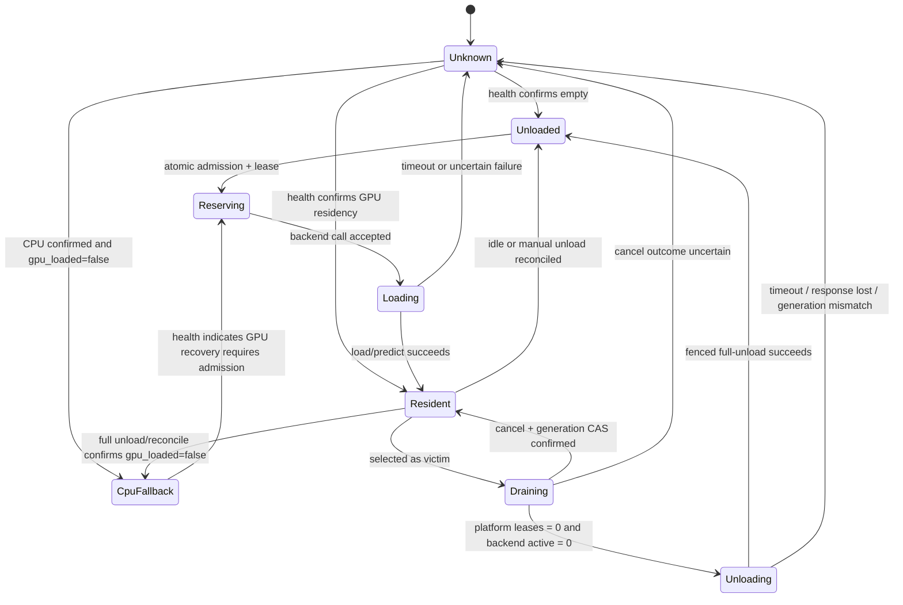

# v0.22.4 · 跨 Backend GPU 显存互斥编排实施计划

> 版本：v0.22.4 · 状态：P0、P1a、P1b、P1d、P1e、P1f 已完成 · P1c ONNXTools 代码纵切已实现，真实 GPU 回落验证待模型就绪 · P2a/P2b 静态 claim、配置诊断、管理端与 observe 影子派发已完成 · P3a/P3b durable fence 与 Redis 原子账本、P3c-1 Redis 安全重建原语、P3c-2a 持久成员域与令牌时域地基、P3c-2b-I Redis v2 三域演进、P3c-2b-II-A generation-null Unknown 账本表达已完成 · P3c-2b-II-B/III live proof、reset、GC 与 worker、P4–P6 待实施 · 2026-07-15
>
> 地基基线：初始 `compute` 传输链由 `2026-07-13-v0.22.3-ml-backend-cpu-fallback-audit.md` 交付；P0a 已完成设备语义纠偏，P0b 已将 D2–D14 与不变量写入 ADR-0049。P1a 进一步冻结 D15 的 EdDSA token/keyring 并实现共享 wire schema；完成 P1–P5 对应验收前不得开启仲裁 enforce。
>
> 架构依据：ADR-0049（Accepted，逐物理 GPU 资源治理）、ADR-0044（全局注册表）、ADR-0012（独立 GPU 服务）、ADR-0038（不借机抽 backend 基类）。

## 0. 地基复核结论

### 0.1 P0a 前已确认可复用的基线

- 五个自有 backend 已产出顶层 `compute`；`MLBackendClient.health_meta()`、健康 worker、注册表 JSONB、API schema 和前端类型已能透传。
- P0a 前运行中的 Grounded-SAM2、SAM3、YOLO、RapidOCR `/health` 与 PostgreSQL `health_meta` 均可看到 `compute`；未加载 torch backend 返回 `effective_device=null`，符合“尚未探测”语义。
- P0a 前共享 helper 14 测、API 定向 28 测、PerfHUD WebSocket hook 7 测通过；这些证据只证明既有传输和缓存路径未回归，没有覆盖下列故障语义。

### 0.2 阻断问题与本计划处置

| ID | 审查发现 | 本计划确定的处置 |
|---|---|---|
| F1 | SAM3 image、multiplex、PVS 的 vendor 路径仍有硬编码 CUDA；现有 CPU 重试不能成立，multiplex wrapper 还会调用不存在的 `predictor.to()` | 本期明确 SAM3 为 `gpu_only / cpu_fallback_supported=false`；删除虚假的 CPU fallback 语义。vendor 全面 CPU 移植另立计划，不作为显存仲裁前置 |
| F2 | ORT probe 只看 `InferenceSession()` 是否抛错，没有核对实际 `session.get_providers()`；RapidOCR / ONNXTools 可能把内部 CPU fallback 误报为 CUDA | P0a 已核对实际 session provider；无法读取真实 provider 的 lazy / composite pool 返回 JSON `null`（unknown 语义），不得用偏好列表首项冒充 effective provider |
| F3 | 共享 `_effective_device_cache` 无锁，CPU latch 可被并发 CUDA probe 覆盖；它还是进程级单值，无法表达同进程 GPU/CPU 混合池 | P0 使 latch 线程安全且单调；`compute` 永远只作诊断，allocation 释放只认逐池聚合后的 `residency.gpu_loaded=false` |
| F4 | fallback catch 会把非 CUDA 错误永久 latch；构建后 CUDA 失效、坏上下文下 `empty_cache()`、CPU 重建失败均未形成可靠事务 | 仅在识别为设备错误且 CPU 重建成功后提交 latch；清理 best-effort。无法可靠 fallback 的 backend / 路径显式声明 `gpu_only` |
| F5 | PerfHUD 漏 ORT provider 且会把显式 CPU 配置误报为 fallback；backend / 平台 / UI 没有新增相应契约测试 | 抽共享 CPU fallback 判定并补 torch / ORT / explicit CPU / null 测试；补五 backend health、平台透传、落库与序列化测试 |
| F6 | ONNXTools 虽已由 compose 定义，但没有运行中实例可做部署验证；GPU UUID、MIG UUID、`process_memory_mb` 等嵌套诊断字段仍可能被 schema 丢弃 | 未验证实例不得进入 enforce；P2 补物理资源身份和 response serialization 测试 |

因此，`compute=cpu` 与 `residency.gpu_loaded=true` 是必须支持的合法混合状态。前者不能单独触发减账；只有 full-unload 或可信 reconcile 确认所有 pool / session / GPU tensor cache 均为空，才能释放 allocation。

## 1. 结论与本期边界

本期目标不是做 GPU 调度平台，而是在现有“一 backend 一容器、每个容器静态绑定一张卡”的前提下，给所有平台派发入口增加同一套跨进程显存准入：同卡按静态预算共驻，放不下时按优先级加权 LRU 驱逐，活跃请求受保护，彻底放不下时明确失败；不同卡互不阻塞。

单卡与多卡使用同一模型：**按物理资源卡分片治理**，而不是按“机器是单卡还是多卡”整体分支。当前默认双卡布局仍是 gsam2 / yolo / onnxtools / rapidocr 共用卡 0、sam3 使用卡 1，因此卡 0 仍需仲裁；只有某张卡实际至多绑定一个 backend 时，该卡才自然退化为无驱逐快路径。

本期包含：

- 静态 backend → 单张物理卡映射、每卡独立预算、账本、锁、等待队列和指标。
- `predict`、`predict_interactive`、`warmup`、`reload`、手工 `unload` 以及运行时 smoke-test 的统一生命周期门控。
- 单卡多 backend 共驻 / 驱逐，多卡共享与独占混合布局，API 与多个 Celery 进程并发。
- 把现有 `max_concurrency` 从单进程减压提升为 Redis request lease 约束下的跨进程全局并发上限；本地 semaphore 继续作为第一层背压。
- CPU fallback 与 ORT provider 只参与诊断和下一次加载决策；账本释放由 `residency` 独立决定，不改变既有 Celery 队列路由。
- 默认关闭、observe 影子决策、单卡 enforce、多卡逐卡灰度和即时回滚。

本期明确不做：

- 不做跨卡自动 bin-packing、动态迁移或“挑最空闲卡”。
- 不做同一 backend 多副本、负载均衡或副本 scale-out。
- 不做单个 backend 同时占多卡；配置出现 device set 时首版直接拒绝，另立 ADR 设计全量原子获取与死锁顺序。
- 不把活体 `gpu_info.memory_used_mb` 当准入依据；它是共享卡整卡视角，只做漂移 / 外部占用告警。
- 不引入 ML Backend 基类，不统一各 backend 的模型池内部实现。
- 不做请求级动态显存预测；首版仍使用每 backend 一个保守静态预算。

## 2. 设计决策与阶段验收门

P0 的职责是修复 D1 地基阻断，并把 D2–D14 的**设计选择**写入 ADR-0049；P1–P6 再用各自实现与测试提供验证证据。不得要求 P0 先拿到后续阶段测试，否则会形成循环门槛。ADR 可在设计冻结且 D1 通过后转 Accepted，但 L2 enforce 仍必须等待表中的对应阶段验收完成。

| ID | 当前问题 | 已确定决策 | 验收阶段 |
|---|---|---|---|
| D1 | P0a 前 `compute` 链路已落地，但 SAM3 CPU fallback 不成立、ORT provider 可能误报、latch 非并发单调且缺契约测试 | **已关闭**：保留顶层 `compute` 作为诊断；SAM3 声明 GPU-only；ORT 读取真实业务 session provider；latch、实时/缓存 UI 选择与契约测试已修复。`compute` 不作 allocation 真值 | P0a |
| D2 | ADR 的默认优先级比较导致同级 backend 永远不可驱逐 | 字段命名为 `eviction_priority`；只保护严格更高优先级，`victim.eviction_priority <= requester.eviction_priority` 可被选，同级再按 LRU | P3 / P4 |
| D3 | ADR 把多卡概括成每卡至多一个 backend，与默认双卡的卡 0 四 backend 共用矛盾 | 单卡、多卡统一逐 `gpu_resource_id` 治理；共享卡仲裁，独占卡快路径，禁止整机级 bypass | P2 / P5 |
| D4 | 裸 `device_id` 会把不同主机的卡 0 合并，容器内 `cuda:0` 也不是物理身份 | registry 显式引用稳定 `gpu_resource_id`；资源配置优先绑定 GPU / MIG UUID，兜底为显式 resource domain + physical token | P2 / P5 |
| D5 | `loaded` 和进程级 `compute` 都无法表达 image / video / variant 混合驻留 | `residency.gpu_loaded` 是释放 allocation 的唯一 backend 真值，并带逐 pool device/provider、active、draining、generation | P1 |
| D6 | RapidOCR 没有 `/unload`，GSAM2 未清 video pool，其他 backend 的物理释放也未统一验证 | 只有通过受管 full-pool unload + fencing 契约的 backend 才 `evictable=true`；其余固定 non-evictable 并保守计费 | P1 |
| D7 | TTL 卡锁无法阻止迟到 HTTP unload | 卡锁只做短状态跃迁；generation high-water 先持久化再签发 fencing token，backend 拒绝旧 generation | P1 / P3 |
| D8 | 平台 lease 结束不等于 backend 已停止计算 | Redis request lease 与 backend active/draining 双层保护；lease、active operation、builder 或 borrower 任一未清零都不得卸载 | P1 / P3 / P5 |
| D9 | 单模型净增不覆盖多池、多变体、并发和 SAM3 视频瞬时工作集 | `vram_budget_mb` 是部署配置下保守最大运行工作集；未校准 backend 按整卡 allocatable 计费 | P2 / P6 |
| D10 | Redis 故障时放行会同时绕过显存账本与跨进程 `max_concurrency` | `off/observe` 保持现状；`enforce` 对所有 GPU resource 一律 fail-closed，不再为独占卡保留隐式例外 | P3 / P4 |
| D11 | `exclusive_group` 未进入算法，关键配置放 JSONB 会形成弱类型真值 | registry 只新增算法实际读取的显式列；删除 `exclusive_group`，整卡保护用 `budget == allocatable` 表达 | P2 |
| D12 | 当前 module-level semaphore 只覆盖单进程 / event loop | 保留本地 semaphore 作背压；Redis request lease 执行 backend 级全局 `max_concurrency`，stale lease 在 backend active 时保守保留 | P3 / P4 |
| D13 | 平台外直连加载端点可绕过账本 | enforce 时所有 predict / warmup / reload / unload 强制验证短期 admission token；平台/backend 以 control epoch 握手 enforce gate，生产网络同时限制加载端点，只读 health / setup 可豁免 | P1 / P4 / P6 |
| D14 | task-major pipeline 和连续视频窗口可能反复冷切 | 每次新 residency 写入 `not_evict_before`；只有 cooldown 到期才可成为 victim。慢请求按卡 FIFO 等到独立 admission timeout，超时返回 503 + `Retry-After`；不做无界 job pin 或 pipeline 特判 | P5 |
| D15 | opaque signed token 未冻结算法、验签 key 分发与轮换；backend 单独选择 HMAC 会持有可签名秘密 | 使用带 `kid` 的 Ed25519 / EdDSA compact JWS；平台 signer 独占私钥，backend 只持可重叠轮换的公钥 keyring，固定 audience 并拒绝算法混淆 | P1a / P3 / P6 |

## 3. 成功标准与不变量

### 3.1 资源与容量

1. 一个 registry backend 在本期只能声明一个 `gpu_resource_id`；仅显式 configured CPU 的 backend 为 `null`。GPU backend 即使运行时 fallback 到 CPU，也保留静态 resource claim。
2. `allocatable_mb` 是扣除驱动、CUDA context、桌面 / 系统进程、非平台进程和安全余量后的可分配容量，不直接等于显卡标称总显存。
3. `committed_mb` 等于该卡所有 `reserving/loading/resident/draining/unloading/unknown-conservative` allocation 的预算和。
4. enforce 下任何成功的新准入都满足 `committed_mb <= allocatable_mb`；已发现超额漂移时停止新增承诺，先对账或拒绝。
5. 一张卡的锁、状态跃迁、排队或 backend 故障不能阻塞另一张卡；共享 Redis 整体不可用属于基础设施级故障，按 D10 的全局 failure policy 处理，不能宣称天然隔离。

### 3.2 驱逐与并发

1. 同级 backend 可按 `last_used_at` 从旧到新驱逐；严格更高 `eviction_priority` 的 backend 受保护。
2. 准入、allocation 预留和 request lease 创建必须原子完成，不留“已准入但尚未记 inflight”的 TOCTOU 窗口。
3. 同一 backend 的有效 Redis request lease 数不得超过现有 `extra_params.max_concurrency`；裸整数 inflight 不满足崩溃回收要求。
4. lease heartbeat 过期只证明平台调用方失联，不证明 backend 已停止计算；backend 仍 active 时保守占住并发许可和 allocation，直到对账确认空闲。
5. 被选为受害者后，Redis 与 backend `/drain` 都进入 `draining`，不再发新 lease / workload；平台 lease 与 backend active/builder/borrower 均为 0 后才能全池卸载。
6. 卡锁不覆盖 drain、HTTP unload 或整个 predict；这些长操作在锁外执行，由 generation token 和 CAS 提交保护。
7. 旧 generation 的进程不能写回 allocation / transition / LRU，也不能卸载新 generation 已重新使用的模型；合法在途请求只可用 owner token heartbeat / release 自己的 request lease。
8. 卸载成功但响应丢失、backend 不可达或结果不确定时继续保守计费为 `unknown`，不得先减 committed。

### 3.3 用户行为

1. `off` 模式不访问仲裁 Redis key、不改变现有请求顺序、错误和性能。
2. `observe` 模式计算 would-admit / would-evict / would-reject，但绝不调用 `/unload`、不阻断业务；只允许把未经有效 token/generation 的 residency 保守标为 unmanaged，不保留 evictable 资格。
3. `enforce` 无容量时在发 backend HTTP 前返回结构化 503，例如 `gpu_capacity_unavailable`，交互式、批量、二次推理和视频路径使用同一根因语义。
4. `compute` 为 CPU 只表示当前 / 后续计算路径偏好；仅当 `residency.gpu_loaded=false` 也被可信确认时才不占 GPU budget。`None`、mixed、provider 不可读均按配置 GPU 保守计费。
5. 因硬件失效而 CPU fallback 与因预算不足被仲裁拒绝必须可区分；容量不足不能用静默 CPU 降级掩盖。

## 4. 目标资源与静态配置模型

### 4.1 物理资源标识

采用单资源 claim，registry 直接引用资源配置中的稳定 key：

```text
gpu_resource_id = <resource_domain>/<physical_device_token>

示例：
gpu-node-a/GPU-6ab3...
gpu-node-a/index:0
gpu-node-b/index:0
```

resource domain 必须由运维显式配置，不能从 backend URL hostname 猜测：同一 GPU 主机上的不同容器通常有不同 service DNS，而不同主机又都可能暴露逻辑 `cuda:0`。physical device token 使用 compose 实际绑定的 GPU / MIG UUID，取不到时才用明确的物理 index；容器内重映射后的逻辑 `cuda:0` 不能作为跨 backend 真值。

现有地基没有提供稳定 GPU / MIG UUID，且部分 backend 只可靠解析数字 `CUDA_VISIBLE_DEVICES`。P2 必须补资源配置与 health 的一致性校验；在 UUID 映射尚不可验证的部署上，只能使用运维显式声明的 resource domain + physical token，不能由平台猜测。

首版数据库字段建议直接进入 `ml_backend_registry`：

| 字段 | 类型 / 缺省 | 语义 |
|---|---|---|
| `gpu_resource_id` | `str | null` | 引用 `GPU_ARBITER_RESOURCES_JSON` 的稳定资源 key；显式 CPU backend 为空，禁止逗号 / 多值 |
| `vram_budget_mb` | `int | null` | 该 backend 的保守最大运行工作集 |
| `eviction_priority` | `int = 0` | 越大越难被驱逐；不表示请求排队优先级 |

`evictable` 不由管理员随意勾选，而由 backend `/setup` + `/health.residency` 的受管生命周期能力派生，避免把没有可靠全池卸载能力的第三方 backend 错当受害者。静态字段使用显式列而不是 `extra_params`，因为它们需要类型校验、列表展示、迁移与配置变更护栏。

卡容量使用平台配置 `GPU_ARBITER_RESOURCES_JSON`（`gpu_resource_id -> {node_id, physical_device_token, allocatable_mb, mode}`）；单个 `CARD_TOTAL_MB` 无法表达多卡和多主机。`GPU_ARBITER_MODE=off|observe|enforce` 是默认 off 的全局上限 / 紧急回滚开关；资源级 `mode` 可选，缺失安全按 off，但要进入 observe/enforce 必须显式声明。desired mode 取全局与资源级中更保守者（`off < observe < enforce`），以支持单张卡逐步 enforce。平台配置是三态 mode 唯一 desired-state 真值；backend 只维护 `legacy|enforce` gate，平台 off/observe 都对应 legacy，只有 promotion 到 enforce 才用 durable control epoch 握手。promotion/rollback 未完成全部 backend 确认时保持旧 effective mode 或 not-ready，禁止 split-brain。L1 可用 `gpu_info.memory_total_mb` 和 UUID 给出建议值 / 不一致告警；L2 不在缺少明确 allocatable 时猜测容量。新增 / 修改 URL、资源映射、预算时，若该 backend 尚有 allocation 或 active lease，返回 409，要求先 drain + unload，不做热迁移。

现有 `extra_params.max_concurrency` 暂保留兼容，不在本计划顺带搬列；它在 L2 下由 Redis lease 执行真正的跨进程上限，现有本地 semaphore 只负责减少单进程排队压力。后续若单独做注册表强类型化，再迁移该字段。

### 4.2 预算口径

`vram_budget_mb` 必须覆盖：

- backend 内所有允许同时存在的 image / video / variant pool cap。
- `max_concurrency` 下可同时发生的推理临时 buffer。
- 当前最大允许视频窗口；SAM3 16 帧工作集不能套用仅图像模型的约 6GB 建议值。
- CUDA / ORT 上下文中归属于该 backend 且在全池卸载后仍不会释放的必要基线。
- 校准误差安全余量。

性能基准里的默认模型净增只作为首轮测量种子，不能直接复制为 enforce 预算。未完成峰值校准的 backend 暂将预算设为该卡 `allocatable_mb`，等价于保守整卡驻留；本期不另加 `exclusive_group` 或请求级动态 budget。

L1 告警分四级，避免把“允许驱逐”误报成故障：

| 条件 | 级别 | 含义 |
|---|---|---|
| 单 backend `budget > allocatable` 或必填配置缺失 | blocker | 该 backend 在此卡永远无法安全运行 |
| 同卡全部配置预算和 `> allocatable` | warning | 正常弹性超售；运行时将发生驱逐和冷启动 |
| Redis `committed > allocatable` | critical | 账本不变量破坏或重建未完成 |
| 去重后的整卡 observed 与 committed 明显偏离 | warning | 预算漂移或存在平台外 GPU 占用，仅用于校准 |

## 5. 受管 backend 生命周期契约

现有 `compute` 只表达配置意图与探测 / 加载偏好；多池混合和 ORT lazy session 下甚至不等于实际驻留。本计划将它保留为诊断字段，并新增独立的统一 `residency`：

```json
{
  "compute": {
    "configured_device": "cuda",
    "effective_device": "cuda:0",
    "effective_provider": null,
    "cpu_fallback_supported": true
  },
  "residency": {
    "state": "resident",
    "gpu_loaded": true,
    "active_requests": 0,
    "draining": false,
    "evictable": true,
    "generation": "42",
    "pools": {
      "image": {"resident": true, "device": "cuda:0", "provider": null},
      "video": {"resident": false, "device": null, "provider": null}
    }
  }
}
```

要求：

- `gpu_loaded` 表示任一 GPU image pool、video pool、ORT session 或 GPU tensor cache 仍驻留；不能只镜像旧顶层 `loaded`。
- `residency.state` 固定为 `unloaded|loading|resident|draining|unloading|unknown`；CPU fallback / mixed 由 `compute`、`gpu_loaded` 与 pool device/provider 表达。逐 pool 项至少包含 `resident: bool|null`、`device: str|null`、`provider: str|null`。
- `compute` 与 `residency` 允许出现 CPU + GPU mixed；只有 `gpu_loaded=false` 才能释放账本。逐 pool 无法读取实际 device/provider 时状态为 unknown，并按 GPU 保守计费。
- 带有效 generation/token 的 managed `/unload` 与受签名 `/lifecycle/reset` 必须清空该 backend 的全部 GPU pool / session / GPU tensor cache；只卸 image pool 不合格。off 下 bodyless legacy `/unload` 只保留原 wire/响应兼容，不可作为减账证据。
- predict / warmup / reload 进入 backend 内部 active guard；draining 后拒绝新工作。受管 unload 只在 active 为 0 且 generation 匹配时执行。enforce 下所有可能加载的端点还必须验证 admission token，防止平台外直连绕过账本。
- 不支持该契约的 backend 仍可运行和计入预算，但 `evictable=false`，绝不能进入自动受害者集合。
- `cpu_fallback_supported=false` 的路径在 GPU 失败时明确报错，不得先写 CPU latch 再执行仍硬编码 CUDA 的重试；本期 SAM3 image / multiplex / PVS 均采用该语义。
- 旧 `loaded`、`pool`、`video_pool` 保留兼容展示；平台对账以 `residency` 为真值。
- 不为此抽统一 backend 基类；五个 backend 分别在现有生命周期锁 / pool 边界做最小改造，共享的只应是协议 schema / header 常量。
- active 必须覆盖等待 pool、builder、executor/threadpool future、推理与模型 borrower；协程超时 / 取消后底层 future 未完成时不得提前减 active。pool 只能淘汰 borrower=0 的 entry，全繁忙时可重试拒绝，不能删除仍被请求局部变量使用的 GPU 对象。
- 同 key builder 必须 single-flight，提交 executor 前原子预留 build slot，并保持 `resident_entries + reserved_build_slots <= cap`；无空 slot/idle victim 时 503，失败/超时/取消只在底层 future 真结束后释放 reservation。
- 一个 registry URL 只能对应一个生命周期状态域；当前单 worker 可使用进程内 guard，多 worker / 多副本必须分别注册或使用共享外部 lifecycle/replay state。

受管 wire 同步冻结为：

- generation header 使用 `X-AAP-GPU-Generation`（规范正 int64 十进制字符串），token header 使用 `X-AAP-GPU-Admission-Token`；token 是 `alg=EdDSA`、`typ=aap-gpu+jwt`、带 `kid` 的 compact JWS，`aud=aap-gpu-lifecycle`，绑定 registry id、resource id、boot id、generation、control epoch、scope、`jti` 与 `exp`，不复用 `Authorization` 或用户 JWT key。backend 只持公钥 keyring，私钥只在平台 signer；`scope=mode|reset` 只携带 control epoch，不要求 generation header。
- workload `jti` 等于 Redis request lease id，并由 backend 原子单次消费、保留 replay tombstone 到 expiry；transition `jti` 绑定 transition owner/operation，同 owner+route+generation 重试 single-flight 幂等。token expiry 不晚于 lease/owner hard deadline；不确定投递在 expiry 前保留计费 capability，不能先删 lease 再允许迟到 token 首次到达。
- generation 与 control epoch high-water 持久化到 PostgreSQL `gpu_backend_fences`。建立新 allocation ownership、drain owner/cancel 时推进 generation；建立新 mode/reset control operation 时推进 control epoch；同一 drain→unload 或 mode/reset operation 的后续 token/幂等重试复用已取得 epoch，Redis 只存副本。普通 workload 只能命中当前 generation；只有 active/builder/borrower 全为 0 且 `gpu_loaded=false` 时可采用更大 generation。durable high-water 不可信时 enforce not-ready，禁止从 1 猜测。mode/reset 的 body 与 token control epoch exact-match，同 boot+epoch+owner 重试幂等，同 epoch 不同 owner/operation 或更小 epoch 冲突。
- drain 使用 `POST /drain` 进入新 generation、`POST /unload` 在同 generation 且全部 active 为 0 时先 CAS unloading 再锁外全池释放、`POST /drain/cancel` 仅从 draining 用更新 generation 回滚；相同 transition single-flight，cancel 不得与 unloading 并发。
- `/setup.managed_lifecycle` 声明 protocol version、generation fencing、mode/drain/drain-cancel/unload/reset endpoint 与 generation/token header 名；缺失即 non-evictable。`residency.gpu_loaded` 与逐 pool GPU `resident` 允许 `null` 表示 unknown；纯 CPU handle 的 pool 报 `resident=false` 与 CPU device/provider。只有所有 pool GPU residency、builder、borrower 明确为空时才显式 false。
- backend 启动为 `lifecycle_gate=legacy` 并生成 health `boot_id`。平台 off/observe 都保持 legacy，P2 observe 只做 shadow 决策、不依赖 durable control epoch；只有 enforce promotion 才通过绑定 boot id、仅控制网络可达的 `/lifecycle/mode` + 单调 durable control epoch 切 gate，并在 health 握手确认后派发 enforce workload。首次有效 mode/reset 控制调用把 audience、registry id、resource id 绑定到该 boot 的 lifecycle domain，后续 token exact-match；重复 URL/alias/多进程状态域是 enforce blocker。off 下 headerless workload 和 bodyless legacy unload 兼容；observe 不阻断；enforce 才强制 generation + token。off/observe 中任何未通过 token+generation 的 workload 都将 residency taint 为 `generation=null,evictable=false`；进入 enforce 前必须走受签名 `/lifecycle/reset` full-unload 并由 health 确认空池，再以新 generation 冷启动，不允许直接收编。
- 错误统一使用 `{"detail":{"error_code":"..."}}`：draining workload 为 503，active/stale generation/transition conflict 为 409，generation 格式/不一致为 422，enforce token 无效/重放为 403，清理失败为 500 并保持 Unknown 保守计费。

当前必须补的已知差异：

- RapidOCR 新增全池 `/unload`，清引擎池、锁 / meta 引用并确认 ORT GPU session 释放。
- Grounded-SAM2 的 managed unload/reset 同时清 `_pool` 与 `_video_pool`；当前 bodyless legacy 路径仅清图片池且保持不可信兼容。
- SAM3 的 `gpu_loaded` 必须合并 image、multiplex video、PVS video，而非只看 `_predictor`。
- YOLO、ONNXTools、RapidOCR 从真实 pool / session 统一映射 residency；ORT 不得把请求 provider 列表首项当成实际 provider。
- ONNXTools 为 lazy handle 构建、predict 与 unload 增 active/draining guard，禁止并发重复构造和卸载仍在使用的 session。
- RapidOCR 为同一 `pool_key` 的冷启动增加 single-flight；当前构造发生在池锁外，并发首调可能短时生成两份引擎。
- YOLO、Grounded-SAM2 与 RapidOCR 的 LRU 改为 acquire/release borrower 语义；仍被请求持有的 model/engine 不能从 pool 索引淘汰，全 key busy 时结构化 503，不得制造 cap 外隐藏 residency。
- executor/threadpool 中的 build / infer 用 operation future 跟踪真实结束；HTTP timeout/cancel 后 future 未完成时继续 active/unknown 保守计费，禁止 late resurrection 后仍报告空池。

## 6. Redis 账本、状态机与公平性

### 6.1 Key 与真值边界

Redis 使用版本化 namespace，并让同一卡的 key 可进入同一 Redis Cluster hash slot：

```text
resource_tag = sha256(exact gpu_resource_id)
gpu-arbiter:v1:{resource_tag}:card
gpu-arbiter:v1:{resource_tag}:allocations
gpu-arbiter:v1:{resource_tag}:queue
gpu-arbiter:v1:{resource_tag}:backend_queue:<backend_id>
gpu-arbiter:v1:{resource_tag}:leases:<backend_id>
gpu-arbiter:v1:{resource_tag}:transition
```

花括号内是 Redis Cluster hash tag，不直接插入未经编码的资源 ID。`resource_tag` 对完整
`gpu_resource_id` 做确定性 SHA-256，避免资源 ID 自带花括号时改变分槽；`card.resource_id` 仍保存原始值，
所有原子脚本 exact-match 原始身份，摘要碰撞或 key 身份不一致时 fail-closed。

逐资源 key、队列和 transition owner 消除逻辑状态与应用层跨卡互锁；standalone Redis 命令执行仍属于共享
延迟域。Lua 工作量必须有界，Redis 服务整体拥塞或不可用按 D10 处理；hash tag 只冻结可分槽 key 设计，
不宣称当前普通 `redis.asyncio.Redis` client 已支持多节点 Redis Cluster 或物理延迟隔离。

PostgreSQL 保存静态 claim 与 `gpu_backend_fences.generation_high_water` 持久 fencing 真值；Redis 保存运行时 allocation、generation 副本、LRU、等待 ticket 和 request lease。每个请求使用独立 token + heartbeat deadline；deadline 过期后标为 stale，若 backend 仍报告 active 则继续保守计数，待 backend 确认空闲后才清理，不能用一个裸 `inflight` 整数代替。只有 queue / lease / transition owner 有过期 / 接管语义；驻留 allocation 不得因 TTL 自动消失。`committed_mb` 由 allocation 集合原子求和 / 校验，不依赖容易漂移的裸增减计数。

P3c-1 的安全重建原语要求 repair 调用方提交不晚于 Redis `TIME` 后五分钟的绝对证据 deadline，并把它
冻结到账本；repair 只能在该期限内以 revision + incarnation 双重 CAS 原子提交。allocation、lease、卡级与
backend 级 FIFO、transition 都有完整镜像计数，任何部分删除、身份不匹配或越界输入都会保持 not-ready。
完整 flush 或 revision 接近精度上限时会轮换 incarnation 并安全重置 revision；响应丢失后的同 owner 精确重试
保持只读幂等。backend 域、队列与 lease 数量均有硬上限，过期 ticket/owner 以账本中的逻辑 deadline 为准，
不依赖 Redis 物理 TTL 恰好准时删除。

repair 调用方必须传入来自持久存储的**封闭 backend membership 域**，包含当前成员及尚未确认全部 child key
收敛的 retired tombstone。只传活动 registry 行不能证明不存在被遗漏的 Redis child，Lua `KEYS`/`SCAN`
也不能替代显式、有界的 key domain。P3c-2a 已新增独立 `gpu_backend_memberships`：GPU claim 与 pending
membership/fence 在同一数据库事务建立，资源迁移或 registry 删除会把旧成员冻结为 retiring tombstone，
并保留 health、generation、control/runtime epoch 与令牌过期高水位证据；fence 不再随 registry 级联删除。
membership 通过 `ON DELETE RESTRICT` fence 外键阻止高水位丢失；同一 backend 最多一个 pending/active
成员，retiring tombstone 清理前禁止同资源重入，其冻结证据在 proof-backed GC 落地前禁止 UPDATE/DELETE。
membership 的 backend/resource 身份不可原地改写，epoch 不可回退或跳变；只有 registry 已撤销旧
claim 时才能将旧行原位转 retiring 并严格推进一档。membership epoch 防止配置与探活响应发生 ABA；
探活网络调用后必须锁定 registry 行，再用新语句重读 epoch，
所有会推进 membership epoch 的配置变更都立即清空旧 health。pending 成员记录 runtime baseline，只能在 exact
registry claim 仍匹配时，以同一短事务新推进一档 runtime epoch 后转 active。进入正 runtime
epoch 后，端点、claim、预算、优先级、并发参数的直接修改与硬删除由服务层和数据库 trigger 双重拒绝，
必须走后续受管退役流程。退役时冻结的 `health_meta` 只作诊断快照，不得代替 tombstone GC 所需的 live health。

任何 capability 签发路径都必须在签名前锁定 exact active membership；新 generation/control epoch 与令牌
时域可同事务推进，复用既有 epoch 的普通 workload 则使用 horizon-only 更新，不能为记时域虚增 fencing。
所有路径都以 UPDATE-only 单调持久化 `token_expiry_high_water`，缺失 fence 一律按持久状态损坏 fail-closed，
不得从 1 重建。Redis 连续性丢失后，只有该时域已过且取得时域之后的 live-idle health，或完成
更强的受签 reset，才可恢复 ready。P3c-2b-I 已把 Redis 账本升级为 v2：`backend_domain` 作为有界
all-domain，canonical `membership_domain` 固化 backend ID、positive-int64 membership epoch 与
pending/active/retiring 状态，`active_backend_domain` 只能由 active 成员派生。三域各自带 fingerprint，repair
fingerprint 同时覆盖成员 epoch/state；准入、两级排队和 ticket 消费必须 exact-match active membership epoch，
而 lease、ticket 取消/查询与 transition 收敛仍可访问 all-domain 中的 retiring 成员。域演进仅在卡已
not-ready 时以 revision + incarnation CAS 提交；新成员必须先以 pending@1 加入且 child 为空，既有成员状态
变化与数据库 trigger 同构，all-domain 只允许单调扩张。响应丢失精确重试只读幂等，旧 v1 账本只会闩为
not-ready，必须等待 proof-backed reset，不能原地补字段升级；所有 key 继续按完整 `gpu_resource_id` 分片。
P3c-2b-II-A 已使 Redis allocation 能表达 `generation=null` 的 `Unknown`：该状态固定按完整 budget
计费、`evictable=false`，不得从 durable high-water 猜造当前 generation；新准入、两级排队、
普通 transition 与 owner 获取均 fail-closed，但 sweep/release 仍可对非法历史 lease 做减损清理。
已知 generation 不得经普通 reconcile 回退为 null，而权威证明后可将 null 收敛为已知
positive-int64 generation。P3c-2b-II-B/III 仍需完成 live health 与 token horizon 证明、partial corruption reset、
retired child/tombstone 两阶段 GC、逐资源观测和 60 秒 bootstrap/repair worker。这些闭环完成前 `enforce`
继续保持 off。

### 6.2 状态机



`Unknown` 保守占用上一份 budget，直到可信 health 证明 `gpu_loaded=false`；不能因 backend 不可达或单独看到 `compute=cpu` 释放额度。若 `compute=cpu` 但仍有 GPU pool，allocation 继续处于 `Resident`，并在观测中标为 mixed。
图中的 health/reconcile 直达边由 P3c 的可信修复入口负责；P3b 的普通 workload/transition CAS 不允许从
`Unknown`、`Unloaded` 或 `CpuFallback` 绕过原子 admission，也不允许把 `Resident` 直接减记为已卸载。

### 6.3 原子准入

最终 L2b 的 `MLBackendClient` 请求上下文顺序固定为（P4 的 L2a 遇到 busy victim 时在第 6 步直接返回 503，不进入主动 drain）：

1. 先取得现有 per-backend 本地 semaphore，避免还在本进程排队的请求提前占 Redis lease；该 semaphore 不再被描述为全局闸。
2. `off` 直接调用；`observe` 只记录影子决策；`enforce` 进入对应 `resource_id`。
3. 在短卡锁 / Lua 原子区内读取 lease / allocation。若 backend 已达到全局 `max_concurrency`，进入该 backend 自己的 FIFO ticket 队列并在锁外有界等待；不能占住卡级 allocation 队列，也不能阻塞其它 backend。超时返回独立的 concurrency-saturated 503。
4. target 已 resident、未 draining 且有全局并发许可：原子增加带 heartbeat 的 request lease、更新 LRU，立即放行。
5. target 未 resident 且 free 足够：先持久推进 generation high-water，再创建 `Reserving` allocation、generation 副本和 request lease，释放卡锁。
6. free 不足：从 `evictable=true`、`victim.eviction_priority <= requester.eviction_priority` 的 allocation 中按 `(eviction_priority asc, last_used_at asc)` 选足够受害者；为 victim 持久取得新 generation，绑定 transition owner、标 `Draining` 后释放卡锁。
7. 锁外先调用受管 `/drain`；成功后才等待平台 leases 与 backend active/builder/borrower 清零，再调用同 generation `/unload`。P4 即使只选空闲 victim 也必须先 drain；P5 才允许等待 busy victim。
8. 重新取得短锁，用 transition owner + generation CAS 提交卸载结果并为 target 预留；旧 owner 结果丢弃。超时先调用更新 generation 的 `/drain/cancel`；仅 cancel + CAS 均明确成功才回滚 Resident，任何不确定结果转 Unknown。
9. backend 调用明确完成或明确未被接受时，才以 lease owner token 幂等 release request lease；timeout/cancel/断连时停止 owner heartbeat并标记 uncertain/stale，继续占全局并发与 allocation，直到 token 过期且 health 确认 active/builder/borrower 全零后由 reconcile 清理。成功且 `gpu_loaded=true` 转 `Resident`，成功 fallback 且可信确认 `gpu_loaded=false` 转 `CpuFallback` 并释放预留；确定性加载失败可回滚，超时 / 断连或 residency 不可读转 `Unknown` 保守等待对账。旧 generation 在途请求仍可 heartbeat/release 自己的 lease，但不能更新 allocation/transition/LRU。

已 resident 且不参与当前 drain 的 backend 使用快路径，不因另一个慢请求排队而无条件 head-of-line blocking。需要新 allocation / 驱逐的慢路径按卡 FIFO；首版不增加“交互请求优先于批量”的第二种请求优先级，避免与 `eviction_priority` 混淆和引入饥饿。视频追踪仍按现有窗口逐次持 lease，不锁整个作业；每窗结束重新参与排队，避免长视频永久霸卡。

API lifespan 与 Celery 中多次 `asyncio.run` 会使用不同 event loop；实现不得跨 loop 复用一个 module-global `redis.asyncio` client / pool。P3 必须选择按 event loop 管理并显式关闭的异步 client，或封装同步 Redis 调用，并用重复创建 / 销毁 loop 的测试证明不会复用失效连接。

平台内的统一 client gate 只能保证平台派发不绕过。生产 enforce 必须同时限制 backend 加载端点的网络直连，并由 backend 强制校验短期 admission token；否则 Redis 账本只能被称为 best-effort，不能作为 OOM 安全保证。

## 7. 单卡、多卡与 CPU 行为矩阵

| 场景 | 预期行为 |
|---|---|
| 单卡、单 backend、预算合法 | 建一次 allocation；之后 resident 快路径，无受害者选择 |
| 单卡、多 backend、预算和不超卡 | 可同时 resident，不发生驱逐 |
| 单卡、多 backend、弹性超售 | 按同卡 priority + LRU 驱逐；active victim 先有界 drain |
| 单卡、target 自身预算超卡 | 配置 blocker；enforce 在发 HTTP 前拒绝 |
| 双卡，每卡一个 backend | 两张卡各自快路径，可完全并行 |
| 双卡，卡 0 四 backend、卡 1 一个 backend | 只在卡 0 选择受害者；卡 1 不受卡 0 的资源锁 / 队列 / backend 故障影响 |
| 两台 GPU 主机各有 card 0 | 通过不同 resource domain 形成两个 `gpu_resource_id`，账本与锁完全隔离 |
| backend 配置 GPU、`effective=None` | 视为未加载 / 未知，按 GPU budget 准入 |
| backend 已明确 effective CPU / CPU provider，且 `gpu_loaded=false` | 转 `CpuFallback`，不占运行时 GPU allocation；保留静态 resource claim，仍沿原 Celery 队列运行 |
| backend 报 effective CPU，但任一 pool 仍在 GPU / provider unknown | 继续按 `Resident` 或 `Unknown` 保守计费，管理端显示 mixed / unknown |
| 进程重启后从 CPU 恢复到 GPU | 不直接记 resident；以新 generation 重新 bootstrap，下一次 GPU 调用必须重新准入 |
| SAM3 等 `cpu_fallback_supported=false` 的路径发生 GPU 故障 | 明确失败并保守保留不确定 allocation；不执行虚假 CPU 重试 |
| 未实现受管 unload 的第三方 backend | 可以计费并运行，但固定 non-evictable；放不下时驱逐别家或拒绝 |
| 单 backend 声明多个 device | 首版 422 / 配置 blocker；不尝试逐卡拿锁 |

多阶段 pipeline 当前按“每 task 跑完全部 stage”执行；若两个同卡大 backend 互相放不下，仍可能在 task 间反复冷切换。本期不顺带重写为 stage-major pipeline，而由 D14 的 `not_evict_before` + bounded FIFO admission 统一限制切换频率；等不到 cooldown 的请求返回 503 + `Retry-After`。若观测证明需要改变 pipeline 调度形态，再另立计划。

## 8. 工作分解

### P0 · 地基纠偏与 ADR 冻结（硬门）

P0a · 修复 D1（已完成）：

- SAM3 image / multiplex / PVS 明确声明 `cpu_fallback_supported=false`，移除“失败后仍调用硬编码 CUDA builder”的虚假 fallback；本计划不修改 vendor 以追求全面 CPU 支持。
- ORT probe 保存并检查真实 session 的 `get_providers()`；RapidOCR / ONNXTools 的 lazy handle、composite pipeline 无法读取真实 provider 时返回 JSON `null`（unknown 语义），不把 `use_cuda` 或 provider preference 冒充 effective provider。
- 共享 device latch 改为线程安全、CPU 单调不可逆；只在识别为设备错误且 CPU 重建成功后提交，CPU 重建失败回滚。CUDA cache 清理为 best-effort，不得覆盖主错误或令 unload 失败。
- 补五 backend 设备退化 / provider 行为契约、并发 latch、非 CUDA 错误、ORT 内部 fallback、平台 `health_meta` 放行 / 落库 / response serialization、Runtime Observe 与 PerfHUD 判定测试；四个现有运行实例的 `/health.compute` 另以真实 HTTP 响应验证。
- PerfHUD 与 Runtime Observe 复用同一 CPU fallback 纯函数；同时支持 torch / ORT，排除 explicit CPU 和 null。实时 observe 路径也透传 `compute`。
- 修正 CPU fallback 计划 Outcome、CHANGELOG、ROADMAP 与协议文档中超过实际保障范围的表述；物理 GPU 诊断字段统一留在 P2 随资源模型落地。

P0b · 冻结 ADR（已完成）：

- 已将 §2 的 D2–D14 设计选择和 §3 不变量写回 ADR-0049；P1–P6 的测试仍是各阶段 exit criteria，没有在 P0 伪造后续实现证据。
- 已冻结错误码及触发 / HTTP / 重试语义：`gpu_arbiter_not_ready`、`gpu_capacity_unavailable`、`gpu_backend_concurrency_saturated`、`gpu_drain_timeout`、`gpu_arbiter_unavailable`、`gpu_config_invalid`、`gpu_backend_retirement_required`。
- P0a 测试通过后，ADR 已从 Proposed 转 Accepted 并归档；这不代表 L2 已可开启。

P0 已验收：D1 不再误报 CPU / CUDA，SAM3 GPU-only 能力明确，契约测试覆盖真实新增行为；D2–D14、不变量、模式、错误契约和阶段门禁已由 ADR-0049 冻结。ONNXTools 未完成运行实例验证前保持 non-evictable、不得加入 enforce allowlist。

### P1 · 受管 backend 驱逐契约（仍不自动驱逐）

P1a 共享 wire（已完成）：

- `aap_protocol_v2.lifecycle` 已提供 lifecycle state/gate/scope、canonical generation/control epoch、capability、residency、transition request/response 与 admission claims schema。
- admission token codec 固定 Ed25519 / EdDSA、`kid` 公钥 keyring、audience/expiry/算法白名单；backend lifecycle 错误统一为八个 `detail.error_code`。
- 共享包不实现 lifecycle lock、active/borrower/builder、replay tombstone 或模型池；backend 未完成全契约前不得在 `/setup` 宣告 `managed_lifecycle`。

P1b 已以 YOLO 完成首个逐 backend 纵切，验证完整并发与生命周期边界；其余 backend 继续按相同 wire
分别实现，不抽共享生命周期基类。

P1b 已完成：

- YOLO ModelPool 实现 build slot 预留、同 key single-flight、borrower、逐 entry use lock、先淘汰后构建、
  cancellation-safe builder 跟踪与可信/unknown residency；builder 只在 executor、失败清理与状态提交均完成后
  退休，Unknown 会阻断新冷建直到 force cleanup。LRU 和 idle/manual unload 不再触碰活跃模型。
- YOLO predictor 的图片读取、推理、结果转 CPU 与 tracker 聚合进入受跟踪 executor；同模型可变状态串行，
  tracker 在正常截断与异常路径都显式关闭 stream，临时视频在真实 future 完成后才删除。
- YOLO 增加单进程 lifecycle state domain，覆盖 boot/identity/control epoch、legacy taint、signed reset、
  mode gate、workload JTI、transition 幂等、generation tombstone、drain/cancel/unload fencing 与 Unknown 恢复。
- `/health.residency` 与 `/setup.managed_lifecycle` 已接线；predict、interactive、warmup、idle/manual unload、
  shutdown 全部通过相同 lifecycle/pool 边界。无 keyring 保持 legacy，非法非空 keyring 启动失败。
- 共享 wire 补齐 mode/reset 响应 schema；协议文档、YOLO README、compose/env 与锁文件同步。

P1c ONNXTools 代码纵切已实现：

- 固定 `pipeline/detector/va` 三句柄池实现同 key single-flight、builder slot、waiter、borrower、逐句柄
  use lock、取消安全 cleanup 与原子 snapshot；builder 只在 executor、失败清理与状态提交均完成后退休，
  Unknown 会阻断新冷建直到 force cleanup。三句柄最多持四个业务 ORT session。
- 图片读取、推理与结果映射整体进入 cancellation-safe executor；HTTP 取消或 build timeout 后，active、builder
  与 borrower 持续到真实 future 结束。manual/idle/shutdown 不再卸载仍被使用的 session。
- 本地 lifecycle 覆盖 boot/identity/control epoch、legacy taint、signed reset、mode、JTI replay、generation
  tombstone、drain/cancel 与 managed full-pool unload；`residency.pools` 稳定暴露三个句柄。
- residency 检查完整 provider chain：任一 CUDA/TensorRT session 为 true，全部已知 CPU 为 false，私有路径缺失、
  builder 或清理失败为 unknown；诊断 `effective_provider` 不参与减账。
- Dockerfile 固定已审计的 onnxtools commit，compose/env、协议文档、README 与契约测试同步。由于仓库未提供两个
  业务 ONNX 模型，尚不能执行四 session 真实 GPU 回落 smoke；默认
  `ONNXTOOLS_MANAGED_LIFECYCLE_VERIFIED=0`，因此 `/setup` 暂不宣告 capability、mode 拒绝切入 enforce、
  `evictable=false`。

P1d RapidOCR 已完成：

- 动态 composite 引擎池把 det/cls/rec 三条 ORT session 收入同一 entry，覆盖六个实际权重
  key；默认 cap=3 时容量上限是三个 engine/九个业务 session。
- 同 key 冷启动 single-flight，不同 key 可并行；`entries + reserved_build_slots <= cap`
  在单一 pool lock 下保持。LRU 只摘除无 borrower/waiter 的 entry，锁外先释放受害者再构造
  replacement；全部繁忙时返回可重试 503。
- predict 的图片读取、可变阈值更新、三段 ORT 与结果映射整体进入 cancellation-safe
  executor；同 entry 用 use lock 串行，等待锁的请求也计 borrower。HTTP 取消、build timeout、
  repeated cancellation 和 shutdown 都不会早于真实 owner 完成而归零。
- 启动阶段只做不创建 session 的 ORT 软检查。CPU fallback 只允许明确设备错误且 CPU
  replacement 构造成功后事务提交；OOM、权重或参数错误不会被掉到 CPU 掩盖。部分
  CUDA composite 构造的私有链无法直接证明释放时，即使 CPU replacement 成功也保持
  Unknown，直到成功 force cleanup。
- 本地 lifecycle 实现 boot/identity/control epoch、legacy taint、signed reset、mode、JTI replay、
  generation tombstone、drain/cancel、managed unload 与 idle/shutdown；`residency.pools.engines` 为稳定
  聚合 ID，动态 key 仅留在兼容 pool 快照。
- provider 逐 engine 读取 RapidOCR 固定三条私有所有权链的完整 `get_providers()`；任一
  CUDA/TensorRT 为 true，全部已知 CPU 才为 false，缺链、builder、清理中/失败为 unknown。
- RapidOCR 与 ONNX Runtime 固定到已审计组合；compose/env、README、协议文档、CHANGELOG 与
  契约测试同步。参考镜像、模型和实卡已完成满池 load→LRU→full-unload 回落验证。该门槛仍是
  部署级 opt-in：仓库默认 `RAPIDOCR_MANAGED_LIFECYCLE_VERIFIED=0`，只有与下列证据匹配或重新
  完成同等验证的部署才可设为 `1`；未开启时不宣告 capability、不允许 enforce、`evictable=false`。

P1d 参考实卡证据（2026-07-14）：

| 项目 | 冻结证据 |
|---|---|
| 镜像与运行时 | 镜像 ID `sha256:08c46096bc401c3c6d9c2f9dff3950e25b795b9f63521b5a1026d44da291a94a`；RapidOCR `3.9.0`；ONNX Runtime GPU `1.23.2` |
| 模型 | 13 个 ONNX 均通过 `download_models.py` 的逐文件 SHA-256；按路径排序后的 `sha256sum` 清单摘要为 `d34e3ce3731079741e3b66665c9751de93ceca4d29ea1c7d1fa0923aebe2e17a` |
| GPU | RTX 3090 24 GiB，物理 UUID `GPU-ac5e7f45-7a36-c3f8-1f65-a54f28bfcd31`，驱动 `595.71.05`；容器绑定单卡设备 1 |
| 空池与 provider | 启动空池不创建 GPU 进程；满池三 engine/九 session 的实际 primary provider 全为 `CUDAExecutionProvider`，health 为 `gpu_loaded=true` |
| 真实推理与 LRU | v5 mobile/server、v6 medium/small 四 key 在 cap=3 下触发 LRU；det、rec、e2e 均真实推理，分别返回 98、1、87 项，e2e 命中已加载 engine |
| 物理释放 | 含真实推理的首轮峰值约 1516 MiB，full-unload 后连续采样稳定为必要 CUDA context 基线 296 MiB；再做三轮四 key load/LRU/unload，加载态分别约 958/958/962 MiB，每轮均回到 296 MiB，health 同步为 `unloaded`、`gpu_loaded=false` |
| CPU 路径 | 无 GPU reservation、显式 `RAPIDOCR_DEVICE=cpu` 时完成同图 e2e 真实推理并返回 88 项；三条 session 均为 `CPUExecutionProvider`，进程未出现在 `nvidia-smi`，卸载后 health 为 `gpu_loaded=false` |
| 自动化 | 主工作区虚拟环境与重建镜像内均为 70 项测试通过；包含 pool 并发/取消、provider、fallback、idle、lifecycle、wire endpoint 与真实 owner 跟踪 |

P1e Grounded-SAM2 已完成：

- 图像与视频池共用一个取消安全的 LRU 所有权内核和冷构建串行锁；单一 pool lock 维护 entry、builder、
  reservation、borrower、waiter、淘汰与失败清理隔离，保持 `resident + reserved_build_slots <= cap`。
  同 key 冷启动 single-flight，LRU 只淘汰空闲 entry；全部繁忙时返回可重试 503。
- 图像 predictor 与对应 embedding cache 作为同一 artifact 一起借出、驱逐和清理；图片获取、cache
  restore、可变 predictor 状态与推理全程持有 borrower/use lock。视频下载、propagate 与临时源删除在同一
  executor owner 中完成；HTTP 取消或 build timeout 后仍跟踪真实线程与 builder 到结束。
- 双池 domain 按逐池真实 device 聚合三态 residency：任一池可信驻留即为 true，仅两池均可信空才为 false，
  其余为 unknown。managed unload/reset/shutdown 即使一池失败也继续清理另一池并保守保留 Unknown；
  bodyless legacy unload 继续只清图像池，保持原响应语义，不能作为仲裁减账证据。
- 本地 lifecycle 覆盖 boot/identity/control epoch、legacy taint、signed reset、mode、JTI replay、generation
  tombstone、drain/cancel 与全池 managed unload。predict/warmup/reload 的 admission 在 body 解析前执行，
  同时保留既有 400/422 与成功响应形状；health/metrics/cache 读取锁内值快照，不泄漏活体 attachment。
- attachment cleanup 失败会隔离保留强引用供 force cleanup 重试；替换 builder 首次调度前被取消时，被摘除
  的 LRU victim 仍由独立 cleanup owner 接管。缺权重和缺配置在任何分配前由显式 preflight 拒绝，不进入
  builder 状态机；一旦 factory 已启动，任何未返回完整 artifact 的异常都保守进入 Unknown 并阻止继续冷建。
- Docker、compose/env、README、协议文档、依赖锁与契约测试同步。参考镜像、六份 checkpoint 与 RTX 3090
  已完成 image/video 双池 load→LRU→managed full-unload 及新 generation 冷启动复验。该证据不替代部署验收：
  仓库默认 `GROUNDED_SAM2_MANAGED_LIFECYCLE_VERIFIED=0`；只有制品、模型与硬件匹配或重新完成同等验证的
  部署才可设为 `1`，否则 `/setup` 隐藏 capability、mode 拒绝 enforce、`evictable=false`。

P1e 参考实卡证据（2026-07-15）：

| 项目 | 冻结证据 |
|---|---|
| 镜像与运行时 | 镜像 ID `sha256:149164b1969913a32b4ff1684086198869d301a91e442bb242d6918dc6d9a5ff`；PyTorch `2.3.1`；CUDA `12.1` |
| 模型 | 两份 GroundingDINO 与四份 SAM 2.1 checkpoint 均计算逐文件 SHA-256；按路径排序的 `sha256sum` 清单摘要为 `69df95be53c16b3f79ad5f7e30bdf1fc642a28bbad52c1cacc25763b30c73ecd` |
| GPU | RTX 3090 24 GiB，物理 UUID `GPU-0d0ff398-3fa6-778c-8611-a45fbadecabb`，驱动 `595.71.05`；容器绑定单卡设备 0 |
| 双池真实构建与 LRU | image 依次构建 `sam=tiny/dino=T`、`sam=small/dino=T`，第二次明确淘汰前者，耗时约 7343/3801 ms；video 依次构建 `tiny`、`small`，第二次明确淘汰前者，耗时约 530/573 ms。满池 health 同时报告 image/video `resident=true`、`gpu_loaded=true` |
| fencing 与全量卸载 | workload generation 1 后以新 generation 2 完成签名 drain→managed unload，返回 `unloaded_count=2`；随后 generation 3 重新冷启双池，再以 generation 4 完成第二轮 drain/unload，证明卸载 tombstone 不会被旧 generation 绕过 |
| 物理释放 | 进程初始 CUDA context 约 256 MiB，双池加载态约 818 MiB；两轮 full-unload 后各连续五次采样均稳定为 298 MiB，health 同步为双池空、`gpu_loaded=false`、builder/borrower/active 均为 0 |
| 自动化与默认门禁 | 最终重建镜像内 127 项测试通过；覆盖双池聚合、preflight、partial build Unknown、cleanup quarantine、取消、borrower、lifecycle 与端点兼容。验收后运行实例已恢复默认门禁，`/setup.managed_lifecycle=null`、`evictable=false` |

P1f SAM3 已完成：

- image、multiplex video 和 PVS video 使用三个独立 `cap=1` 池，共享冷构建串行锁。
  每池以 single-flight、build reservation、borrower 和 use lock 保护真实 owner；同 key 取消、
  build timeout 和重复取消均会继续跟踪 executor/builder 到真实结束。
- image 的图片获取、embedding cache、可变 processor 状态、推理与结果转换位于同一
  cancellation-safe owner；multiplex/PVS 的源视频准备、propagate、session/state 清理与临时源删除
  也位于同一 owner 内，取消不再提前删除输入或归还 borrower。
- 三池 domain 按逐池真实 device 聚合三态 residency：任一池驻留即为 true，只有三池与全部
  builder/borrower/session 均可信为空才为 false。managed unload/reset/shutdown 即使前池失败也会继续
  清理后池；bodyless legacy unload 保留 `{ok,unloaded,loaded,video_loaded}` 响应形状。
- 本地 lifecycle 覆盖 boot/identity/control epoch、legacy taint、signed reset、mode、JTI replay、generation
  tombstone、drain/cancel 与 full-pool managed unload。predict/warmup/reload 在 body 解析前 admission，
  仍保留旧 400/422 与成功响应语义。
- vendor 的进程级 BF16 autocast 原会使 full-unload 后仍遗留约 2.5 GiB PyTorch cast cache；
  三条路径已改为请求级 autocast，strict cleanup 以 `clear_autocast_cache → empty_cache →
  ipc_collect` 顺序清理。部署验收脚本会对 context-only 基线、独占进程、PyTorch allocator、
  三池内部 owner 和两轮至少 90% 工作集回收做硬断言。仓库默认
  `SAM3_MANAGED_LIFECYCLE_VERIFIED=0`，未匹配证据的部署不发布能力且拒绝 enforce。

P1f 参考实卡证据（2026-07-15）：

| 项目 | 冻结证据 |
|---|---|
| 镜像与运行时 | 镜像 ID `sha256:8175089b27e66311fd7e75ede5b638d26134bf3fec7550b77fee7b28fadbc749`；PyTorch `2.7.1`；CUDA `12.8` |
| 模型 | `sam3.pt` 大小 3450062241 B、SHA-256 `9999e2341ceef5e136daa386eecb55cb414446a00ac2b55eb2dfd2f7c3cf8c9e`；`sam3.1_multiplex.pt` 大小 3502755717 B、SHA-256 `0567debeec80ba4ac6369540c6c248025283cb3ff2b92827509e57e2b3541cb6` |
| GPU | RTX 3090 24 GiB，物理 UUID `GPU-ac5e7f45-7a36-c3f8-1f65-a54f28bfcd31`，驱动 `595.71.05`；验收时该卡只有当前验证进程 |
| 三路真实推理 | generation 1 中完成图像 point、4 帧 multiplex 文本追踪与 4 帧 PVS 框 seed 追踪，三次 `/predict` 均返回 200，满池 health 同时报 image/multiplex/PVS `resident=true`、`gpu_loaded=true`、`evictable=true` |
| fencing 与全量卸载 | generation 2 签名 drain→managed unload 返回 `unloaded_count=3`；generation 3 重新冷启三池，再以 generation 4 drain/unload 返回 3，两轮最终均为 `state=unloaded`、`gpu_loaded=false`、`evictable=false` |
| 物理释放 | 冷卡 18 MiB，context-only 五次采样均为 280 MiB；两轮三池加载态分别为 12254/11554 MiB，full-unload 后各五次采样均稳定为 360 MiB。两轮 PyTorch `allocated/reserved` 均仅 8/12 MiB，工作集回收超过 99% |
| 自动化与默认门禁 | 最终镜像内 161 项测试通过；覆盖三池聚合、builder/preflight/cleanup quarantine、取消、borrower、临时文件/session、autocast、lifecycle 和 legacy wire。验收后运行实例恢复默认门禁：`/setup.managed_lifecycle=null`、`evictable=false` |

该参考 gate 顺序执行三条真实推理路径，只冻结三池并存、owner 真值与全量释放，不代表 image、multiplex、
PVS 同时推理时的瞬时显存峰值已经校准。P2 不得直接把上述 12254 MiB 当作 SAM3 的
`vram_budget_mb`：按 D9，预算必须覆盖部署允许的跨池并发临时 buffer 与安全余量；完成并发峰值校准前按
整卡 `allocatable_mb` 保守计费，P3 再以全局 `max_concurrency` request lease 收口实际并发。

主要触点：

- `apps/grounded-sam2-backend/main.py`、`video_pool.py`
- `apps/sam3-backend/main.py`
- `apps/yolo-backend/main.py`、`model_pool.py`、`predictor.py`
- `apps/onnxtools-backend/main.py`、`predictor.py`
- `apps/rapidocr-backend/main.py`、`predictor.py`
- `apps/_shared/protocol_v2/` 的 lifecycle wire schema、header 与错误词表
- `apps/_shared/backend_runtime/` 的 device / GPU 清理 helper；只有无状态、无框架依赖的 generation / transition 纯函数才可放入此包
- 五 backend 对应 contract / idle-unload 测试
- `docs-site/dev/reference/ml-backend-protocol.md`

工作：共享 wire / token codec 已落 `protocol_v2`；只有至少两个 backend 验证出相同且真正 framework-neutral 的 generation / transition reducer 后才放入 `backend_runtime`，避免为单一实现提前抽象。asyncio/threading active guard 仍由各 backend 在本地生命周期锁实现。随后统一 `residency`、逐 pool device/provider、全池 unload、backend active/draining、generation fencing 与 admission token；不抽生命周期基类。旧调用保持兼容，但不具备完整契约者自报 `evictable=false`。CPU-capable 与 GPU-only 是显式 capability，不能从一次失败推断。

验收：未加载、loading、image-only、video-only、image+video、多 variant、mixed CPU/GPU、active、draining、unloading、unknown、旧 generation、重复 transition、drain cancel、全池 unload、token audience/scope/expiry/replay、boot id、重启后旧 mode/workload token、mode control epoch 幂等/冲突、unmanaged residency reset 后冷启动、legacy off 兼容、单 lifecycle state domain、CPU-capable / GPU-only 各状态都有契约测试；model borrower 不被 LRU、全 key busy 可重试拒绝、`resident + reserved_build_slots <= cap`、executor 超时/取消不提前减 active；RapidOCR 与 GSAM2 的已知缺口关闭。只有所有 pool/builder/borrower 明确为空且 `gpu_loaded=false` 才允许减账。

### P2 · L1 静态 claim、配置校验与 observe 模式

P2a 已完成：迁移 0122 将 `gpu_resource_id` / `vram_budget_mb` /
`eviction_priority` 落为强类型列；超管专用 schema 隔离了项目管理员权限；
`GPU_ARBITER_RESOURCES_JSON` 已能区分单卡、同主机双卡和两主机同号卡，并严格校验
resource key、容量与逐卡 mode；管理 API 已输出 blocker / 弹性超售诊断。平台
health 链路完整保留 `residency`、GPU/MIG UUID 和进程显存。管理 API 已区分
desired / effective mode；P2a effective 固定为 `off`，observe 未就绪为 warning，
enforce 未就绪为 blocker，不会伪报强制仲裁已生效。本阶段明确不用
`RUNNING batch_predict` 或缓存 health 冒充 allocation / active lease；只有 `connected` 且
3 分钟内成功探测的 health 可用于静态 CPU / 物理身份诊断，URL 变更或探测失败立即
失效旧快照，陈旧值只保留为可观测原始数据；
URL / 卡 / 预算变更的
409 守卫已保留契约，待 P3 接入 Redis 账本真值后启用。

P2b 已完成：超管可编辑资源 claim、预算与驱逐优先级，按逐卡视图查看配置诊断；
运行观测以全局 registry 为真值，因此零项目绑定 backend 仍可做全局健康检查与卸载。
`MLBackendClient` 在 predict、predict_interactive、warmup 与 reload 的真实加载 HTTP 前执行
非权威快照评估，API 使用可注入的独立短会话与严格超时，Celery 使用当前 `asyncio.run()` 所属
`SessionLocal`；注册 smoke-test 走同一客户端，未注册 URL 会记录 unmanaged 旁路。
observe 的加载入口只输出 would-admit / would-evict / would-reject，手工 legacy unload 仅记录请求且不被认作释放证据；
影子请求不携带 managed generation / token，backend 按 P1 契约将非空驻留保守标为 unmanaged。
P2 整体已通过，enforce 仍保持未就绪。

主要触点：

- `apps/api/app/db/models/ml_backend_registry.py`
- `apps/api/app/schemas/ml_backend.py`
- `apps/api/alembic/versions/<next>_ml_backend_gpu_claim.py`
- `apps/api/app/config.py`
- `apps/api/app/services/ml_backend.py`、`ml_backend_env_sync.py`
- `apps/api/app/api/v1/admin_ml_integrations.py`
- `apps/api/app/services/ml_client.py`、`apps/api/app/workers/ml_health.py` 的 health 字段透传
- `apps/web/src/pages/ModelMarket/GlobalBackendFormModal.tsx`
- `apps/web/src/pages/ModelMarket/RegisteredBackendsTab.tsx`
- `apps/web/src/pages/ModelMarket/RuntimeObservePanel.tsx`
- `.env.example`、compose 中 API / 全部相关 worker 的环境透传

工作：新增显式静态字段、每卡 allocatable 映射、`off|observe|enforce`（默认 off）、配置变更 409 护栏和四级告警；平台 schema / health worker 完整保留 `compute`、`residency`、GPU UUID 和进程显存诊断字段。observe 在真实派发点计算 would-*，但绝不卸载或拒绝；未受管调用只触发保守 residency taint。

验收：单卡、同宿主双卡、两宿主同号卡聚合正确；observe 零业务副作用且 unmanaged taint 正确；卡容量 / budget 缺失与不合法均可在管理端看到；OpenAPI / codegen / env 文档同步。

### P3 · Redis 原子账本、lease、慢路径队列与对账

P3a 已完成：新增逐 registry backend 的 `gpu_backend_fences`，以单条 PostgreSQL
UPSERT + RETURNING 独立短事务持久推进 `generation_high_water` 与
`control_epoch_high_water`。并发请求不会重号或丢增量，达到正 int64 上限时
fail-closed；事务提交后的 Redis / token 步骤失败只留下安全空洞，不回滚或复用旧值。
P3a 未访问 Redis、未签发 token、未接入业务派发，`enforce` effective mode 仍保持 off。

P3b 已完成独立 Redis 原子账本：逐物理资源使用 brace-safe Cluster hash tag，allocation 与 request lease
同脚本准入，backend FIFO 与卡 FIFO 分离，全局 `max_concurrency`、generation tombstone、请求 lease owner、
transition owner 和状态 CAS 均 fail-closed。allocation/lease 变更推进同一 `ledger_revision`，快照在前后修订
一致时才返回；损坏 sibling 不会造成部分写，关闭后的 async client 不会跨 event loop 重连，连接与命令超时
有界；所有相对 TTL 限制在 Redis-safe 绝对 deadline 内，not-ready 下连幂等 admission 也拒绝，idle
transition owner 与 lease=0 检查原子完成且建立后立即阻断同 backend 新 lease。P3b 仍是未接业务路径的
存储地基：不执行 bootstrap/reconcile、不签发 token、不改变 off/observe
派发，`enforce` effective mode 继续保持 off，以上边界由 P3c/P4 接续。

P3c-1 已完成 Redis 侧 fail-closed 安全重建闩：repair 提交使用有界绝对证据 deadline，快照与 repair 通过
revision + incarnation 双重 CAS 抵御并发和 flush ABA；账本镜像覆盖 allocation、lease、两级 FIFO 与
transition，部分删除、超大输入和 revision 精度边界均拒绝继续工作。重建提交可原子修复全域、清理已确认
过期的 owner，并在 revision 高水位轮换 incarnation。P3c-1 仍不负责查询 PostgreSQL 或轮询 backend health；
P3c-2a 已交付独立 durable membership/tombstone、fence RESTRICT 存续、受控 runtime 激活、exact membership
fence 签发守卫与 horizon-only `token_expiry_high_water` 单调时域。token/activation 使用 membership→fence
锁序；registry mutation 由 registry row→membership→fence trigger 线性化，避免服务预锁形成环。数据库
trigger 同时冻结 tombstone 并封闭 raw SQL 旁路。P3c-2b-I 已交付 Redis v2 三域 schema、active-only
新工作门禁、all-domain 存量清理、not-ready 下的单调扩域/成员状态 CAS、旧 schema fail-close、响应丢失
幂等与完整资源 ID 隔离；retiring child 不会提前从 all-domain 消失。P3c-2b-II/III 继续负责 proof-backed
reset、live health/token horizon 证据、generation-null Unknown、两阶段 tombstone GC、逐资源观测与
bootstrap/repair worker。该前置未完成前不允许开启 `enforce`。

主要触点：

- 扩展 P2a 已新增的 `apps/api/app/services/gpu_arbiter.py`
- 如 Lua 规模需要再拆 `apps/api/app/services/gpu_arbiter_store.py`，不预先抽更多层
- `apps/api/app/db/models/gpu_backend_fence.py`
- `apps/api/alembic/versions/0123_gpu_backend_fence.py`
- `apps/api/app/workers/ml_health.py`
- `apps/api/app/observability/metrics.py`
- `apps/api/tests/test_gpu_arbiter_policy.py`
- `apps/api/tests/test_gpu_arbiter_redis.py`

工作：新增 `gpu_backend_fences` 持久 generation/control-epoch high-water 并在签发 token 前原子推进；实现 versioned Redis key、allocation 状态机、短卡锁、generation CAS、request lease TTL + heartbeat、backend 级全局 `max_concurrency`、慢路径 FIFO、取消 / 超时清理、bootstrap 与 60 秒 repair loop。Redis 为空时必须先从 DB 静态 claim、durable high-water + live backend health 重建；完成前 enforce 不得把空账本当空卡。Redis client 生命周期必须兼容 API 长驻 event loop 与 Celery 反复创建 event loop。

验收：两个独立 Redis client 模拟 API / Celery 并发时不超卖；Redis flush + backend/API 全重启后 generation 不回退；旧 token 不可重放；timeout/cancel/断连把 lease 标 uncertain 并继续计入并发，迟到 token 不成为无账请求；进程在每个状态跃迁点崩溃都能收敛；卡 A 的延迟 / 锁故障不影响卡 B；unload/cancel 响应丢失不提前释放额度。

### P4 · 单卡 L2a enforce、空闲驱逐与全部入口收口

主要触点：

- `apps/api/app/services/ml_client.py`
- `apps/api/app/services/ml_backend.py`
- `apps/api/app/api/v1/ml_backends.py`
- `apps/api/app/api/v1/admin_ml_integrations.py` 的 smoke-test
- `apps/api/app/services/secondary_inference.py`
- `apps/api/app/workers/tasks.py`
- `apps/api/app/workers/frame_preannotate.py`
- `apps/api/app/services/video_tracker_adapters.py` / `video_tracker_runner.py`
- `apps/api/app/workers/predictions_retry.py`

工作：把 semaphore 与 arbiter context 组合进 `MLBackendClient`，覆盖 predict / interactive / warmup / reload / unload；注册 backend 的 smoke-test 改走受管 client，未注册 URL 在 enforce 下只能做只读 health、不得直接加载。统一 503 错误和批量失败记录；手工 unload 成功后立即对账，不等 60 秒。首个 enforce 子阶段只选择平台 lease、backend active/builder/borrower 均为 0 的 victim，但选中后仍先调用 `/drain` 锁住 backend 接单，再调用 `/unload`；受害者已忙时立即返回带 `Retry-After` 的结构化 503，不在第一步启用主动等待。

验收：可共驻、刚好容量、逐个驱逐多个空闲 victim、同级 LRU、高优先保护、busy fail-fast、完全放不下、Redis 故障、CPU fallback、warmup / reload / raw smoke-test 绕过尝试全部通过。`off` 模式的现有 ML client 行为无回归。

### P5 · L2b 有界 drain、多卡验证与防抖护栏

工作：

- 每卡独立展示 allocatable / committed / observed、resident / draining / non-evictable backend。
- 增加 admission、would-evict、eviction、drain、reject、arbiter-unavailable / fail-closed、reconcile 和 budget drift 指标。
- 在 P4 稳定后才启用 busy `draining`：backend `/drain` 成功后阻止 victim 新工作，锁外有界等待平台 lease 与 backend active/builder/borrower 清零；超时调用更新 generation 的 cancel，只有 cancel + CAS 确认后回滚，结果不确定则 Unknown 保守计费。
- 落实 D14：新 residency 写 `not_evict_before`，slow-path FIFO 只等待到独立 admission timeout，超时返回 503 + `Retry-After`；observe / canary 只校准 cooldown 时长，不再切换到另一套策略。
- 后端删除、URL / 卡 / budget 修改前检查 allocation + active lease；首版只允许 unloaded 状态修改。
- 同宿主双卡与两宿主同号卡分别做集成测试；显式拒绝多卡 device set。

验收：active victim 能有界 drain 且不会被新请求续住；超时不误卸载；高频 pipeline 不会无界冷切；卡 0 驱逐不触碰卡 1；两卡可并行；资源映射修改在驻留 / active 时 409；默认双卡布局不会被错误整体 bypass。

### P6 · 灰度、回滚、正式文档与收尾

灰度顺序：

```text
off
  → observe 全量并校准预算
  → enforce 单张测试卡
  → 单卡多 backend canary
  → 多卡部署中的一张共享卡
  → 全部已校准共享卡
```

回滚请求先立即停止新驱逐与新 admission，但不会在 backend 仍 enforce 时让平台直接进入 off。平台等待旧 control epoch token 已被 backend 原子消费并完成，或撤销/过期且 lease 安全收敛后，才逐个下发并确认 backend `gate=legacy`；全部 health 握手一致后完成 observe/off 切换。partial ACK 时资源 mode-transition fail-closed；若放弃切换，用更大补偿 control epoch 把已切换 backend 恢复到原 gate 并全部确认。回滚不清 Redis、不假定真实模型已卸载，先跑 reconciliation，再让现有 backend 按自身 idle 策略自然收敛。进入 enforce 前，既有 `generation=null` residency 必须在 legacy gate 下暂停 workload、经受签名 `/lifecycle/reset` full-unload 并由 health 确认空池；API、GPU worker、其它调用 ML client 的 worker 与 backend 必须全部部署兼容版本并完成 mode handshake，避免旧进程绕过 gate。

## 9. 测试与验收矩阵

| 维度 | 必测场景 | 关键断言 |
|---|---|---|
| 纯策略 | `<`、`==`、`>` 容量，差 1MB，单 budget 超卡 | 选择结果确定，超卡不发 HTTP |
| 优先级 | 同级、低请求遇高 victim、高请求遇低 / 同级 | 同级 LRU；只保护严格更高者 |
| 原子性 | API + 两个 Celery client 同时准入 | allocation + lease 原子，committed 不超 allocatable |
| 快慢路径 | resident 命中、慢路径 FIFO、非 victim resident | 快路径不被无关 drain 阻塞 |
| drain | L2a busy fail-fast；L2b victim 活跃、持续新流量、超时、取消 | L2a 不冒险等待；L2b draining 后不发新 lease并有界结束 |
| generation | 卡锁 TTL 过期、旧 owner 恢复、迟到 unload、Redis + backend 全重启 | 旧写回/卸载无效；durable high-water 不回退 |
| admission token | audience/scope/expiry、workload replay、transition retry | workload jti 单次消费；transition 同 owner single-flight 幂等 |
| mode gate | backend 重启旧 token、promotion/demotion barrier、partial ACK | boot id 拒绝旧 token；混合 gate fail-closed；补偿 epoch 收敛 |
| backend 真值 | 客户端超时/取消后 executor 继续算、模型仍被 borrower 持有、并发不同 key build | operation/borrow 未清零时不能卸载或报告 false；resident + reserved build 不超 cap |
| unload | 成功、失败、超时、成功但响应丢失、重复调用 | 只在可信成功后释放；不确定转 unknown |
| 对账 | idle unload、手工 unload、backend 重启、Redis flush | 丢账后先 bootstrap；最终与 health 收敛 |
| residency | image / video / PVS / 多 variant / ORT session / mixed CPU+GPU / unknown | 任一 GPU pool/builder/borrower 驻留即不为 false；compute CPU 不触发减账 |
| CPU | configured CPU、effective CPU + 空 residency、CPU + GPU mixed、None、GPU-only、CPU→GPU | 只有空 residency 不计费；mixed / None 保守；GPU-only 明确失败；恢复重新准入 |
| 单卡 | 多小 backend 共驻、大 backend 驱逐、多阶段交替 | 不 OOM；驱逐 / 冷载次数可观测 |
| 多卡 | 同机两卡、两主机各 card 0、卡 A transition owner 卡住 | 无 key 碰撞、跨卡并行、资源级故障隔离 |
| 管理入口 | warmup、reload、manual unload、smoke-test、删除 / 改卡 | 无加载绕过；有 active 时拒绝配置变更 |
| 模式 | off、observe、enforce、运行时回滚 | off 零回归；observe 零副作用；回滚不清状态 |
| 长任务 | SAM3 视频逐窗、job cancel、Celery revoke | 每窗租约；不整 job 霸卡；临时 ticket 清理 |
| 防抖 | task-major 不可共驻 pipeline、连续 tracker 窗口 | 驱逐频率有界；cooldown / FIFO timeout 行为确定且可观测 |
| 绕过 | 未注册 smoke-test、平台外直连加载端点 | enforce 不产生账本外 GPU residency |
| P0 地基 | latch 并发、ORT session 内部 fallback、SAM3 GPU-only、explicit CPU / ORT badge | compute 不误报，新增契约均有回归测试 |

验证层次：

1. 纯策略和状态机单测不依赖 GPU。
2. Redis 集成测试使用独立 key 前缀和两个以上独立 client，验证 Lua / CAS 真原子性。
3. 五 backend contract test 用 mock 模型覆盖 lifecycle，不要求 worktree 内有 GPU。
4. 主工作区合入后跑 API 定向 pytest、backend 定向 pytest、前端定向 Vitest、OpenAPI、typecheck、CSS token 检查和 docs build。
5. 真机单卡用人为缩小 allocatable / 放大 budget 强制走共驻、驱逐、拒绝；真机双卡并发验证卡间隔离，并用 `nvidia-smi` / health 仅作旁证。

每个 Redis 测试使用唯一 namespace 并在 fixture `finally` 删除；fake backend、临时 socket、探测缓存、pytest / Playwright 临时目录和真机测试生成物在测试结束后清理。不得删除运行环境原有数据或用户已有未提交产物。

## 10. 正式文档与发布检查

实施时按阶段同步，而不是最后补写：

- 架构决策：已更新、接受并归档 `docs/adr/archive/0049-cross-backend-gpu-memory-arbitration.md`。
- 协议：`docs-site/dev/reference/ml-backend-protocol.md` 增 `compute` / `residency` / 受管 unload / generation。
- 开发概念：`docs-site/dev/concepts/ai-models.md`、`prediction-pipeline.md`、`deployment-topology.md` 说明真正的跨进程并发闸、逐卡治理与多卡边界。
- 运维：`docs-site/ops/deploy/docker-compose.md`、`observability/index.md`、`runbooks/ml-backend-down.md` 增配置、告警、排障和回滚。
- 用户手册：`docs-site/user-guide/superadmin/model-market.md`、`ml-backend-registry.md` 与项目 ML backend / 预标文档更正 `max_concurrency` 语义，并增加卡预算、驻留 / 驱逐状态和配置 blocker。
- 环境变量：更新 `.env.example`，运行 `pnpm docs:gen-env-vars`，核对 worker / production compose 透传。
- 用户可见变更按类型写入 `CHANGELOG.md` 的 `Unreleased`，正式文档只描述当前状态，不写可见版本流水账。
- API / schema 变化刷新 OpenAPI snapshot 与前端 codegen，并检查 SDK 手写类型是否同步。

## 11. 本次复核记录与 P0 交接

- [x] 记录 CPU fallback 地基 commits、实际 diff、计划 Outcome 和部署残留。
- [x] 验证运行中四个 backend `/health.compute` 与 PostgreSQL `health_meta` 传输链。
- [x] 审查 SAM3 image / multiplex / PVS、GSAM2 image / video、YOLO pool 与 ORT 两条 provider 路径。
- [x] 复跑 shared runtime 14 测、API 定向 28 测、PerfHUD hook 7 测；确认现有测试通过但缺少新契约覆盖。
- [x] 冻结 allocation 释放规则：只认 `residency.gpu_loaded=false`，不认单独的 `compute=cpu`。
- [x] 冻结单卡 / 多卡、优先级、failure policy、admission token、global concurrency 与 cooldown 设计。
- [x] 执行 P0a 地基纠偏：shared runtime 36 测；新镜像内 Grounded-SAM2 6、SAM3 11、YOLO 10、ONNXTools 22、RapidOCR 6 测；API 定向 45 测；前端纯函数 14 测与 typecheck 通过。
- [x] 重建五个 backend 镜像；重建原本运行的 Grounded-SAM2、SAM3、YOLO、RapidOCR 并验证容器 healthy 与新 `/health.compute` 语义。ONNXTools 未启动新实例。
- [x] 将 D2–D14、不变量和错误契约写回 ADR-0049，完成评审后改为 Accepted 并归档。
- [x] P1a 冻结 D15 的 EdDSA / `kid` keyring，落共享 lifecycle wire、token codec 与 82 项协议测试；该阶段未提前宣告 backend capability。
- [x] P1b 完成 YOLO 纵切：受管 pool/predictor/lifecycle/端点及无 GPU 契约测试落地；YOLO 可宣告 managed capability，其他 backend 仍不可驱逐。
- [x] P1c 完成 ONNXTools 代码纵切：固定句柄池、取消安全 executor、本地 lifecycle、full-pool cleanup 与能力门槛落地；真实 GPU 回落验证前仍不可驱逐。
- [x] P1d 完成 RapidOCR 纵切与参考实卡验收：六 key composite 引擎池、三 session 驻留真值、取消安全推理/builder、本地 lifecycle 与全池清理落地；真实 GPU/CPU 路径和稳定显存回落证据已冻结。
- [x] P1e 完成 Grounded-SAM2 代码纵切：图像/视频双池、共享冷构建锁、borrower/use lock、取消安全 executor、本地 lifecycle 与 managed full-pool cleanup 落地；能力门禁默认关闭。
- [x] 完成 Grounded-SAM2 参考镜像的真实 image/video load→LRU→full-unload 显存回落验收，冻结镜像、权重、GPU 与连续采样证据；各部署仍须匹配证据或重新验收后才可开启受管能力。
- [x] P1f 完成 SAM3 代码纵切：image/multiplex/PVS 三池、共享冷构建锁、真实 owner 保护、三态 residency、本地 lifecycle 与 managed full-pool cleanup 落地；能力门禁默认关闭。
- [x] 完成 SAM3 参考镜像的图像/multiplex/PVS 真实推理、两轮 generation 冷启与 full-unload 显存回落验收；冻结镜像、权重、GPU、context-only 基线与 PyTorch allocator 证据。
- [x] 交叉复核并封闭 YOLO / ONNXTools 的 builder 退休、强引用释放、重复取消状态提交与 Unknown 后冷建窗口。
- [x] P2a 落地逐物理资源静态 claim、超管权限边界、配置 blocker / 超售 warning、逐卡 mode 与 residency / GPU identity 传输链。
- [x] P2b 完成单卡、同机多卡和多主机同号卡影子策略，接通 API / Celery / smoke-test 真实派发点，并完成资源编辑与 residency 观测。
- [x] P3a 落地 PostgreSQL durable generation/control-epoch high-water，并以多独立连接验证单语句原子推进、不复用空洞与 int64 溢出 fail-closed。
- [x] P3b 落地 Redis allocation/lease/FIFO/transition 原子账本、严格 generation 与 owner CAS、一致性快照和跨 event-loop client 生命周期测试；业务接入仍保持关闭。
- [x] P3c-1 落地 Redis fail-closed 安全重建闩、revision/incarnation 双重 CAS、全域镜像校验、有界 repair deadline 与 revision rebase；尚未接入权威数据源和 worker。
- [x] P3c-2a 增加独立 durable membership/tombstone、fence RESTRICT 存续、受控 runtime 激活与 horizon-only 令牌过期高水位，并以 exact membership epoch、统一锁序和数据库 trigger 阻断签发、配置及删除旁路。
- [x] P3c-2b-I 将 Redis 账本升级为 canonical all/membership/active 三域，以 exact membership epoch 限制新工作、保留 retiring 清理路径，并完成 not-ready 单调扩域、合法成员状态 CAS、响应丢失幂等、v1 fail-close 与完整资源 ID 隔离。
- [x] P3c-2b-II-A 接通 generation-null Unknown 的保守计费、持久表达与新工作门禁。
- [ ] P3c-2b-II-B 接通 live health/token horizon 证据与 partial corruption proof-backed reset。
- [ ] P3c-2b-III 接通 retired child/tombstone 两阶段 GC、逐资源观测与 60 秒周期 bootstrap/repair worker。
- [ ] 完成 ONNXTools 真实 GPU 回落验收与 P3–P6 exit criteria；任何 P1 blocker 未关闭时保持 `enforce=off`。

## Outcome

P0a 已完成：Grounded-SAM2 / YOLO 的 fallback 改为设备错误限定且事务提交，SAM3 明确 GPU-only，ORT 只报告实际业务 session provider，平台实时与缓存消费不再误报。`compute` 仍仅是诊断字段。

P1a 已实现共享 wire 与验签契约，P1b/P1c/P1d/P1e/P1f 已分别完成 YOLO、ONNXTools、RapidOCR、
Grounded-SAM2 与 SAM3 受管纵切。RapidOCR、Grounded-SAM2 和 SAM3 已按各自参考镜像、模型摘要
与物理 GPU 冻结真实推理、重启和 full-unload 证据，部署门槛继续默认 opt-in。
ONNXTools 仍需在业务模型就绪后完成四 session 真实 GPU 回落验收；在此之前 P1 不算整体通过。
P2a/P2b 已交付强类型静态 claim、逐卡资源配置、配置诊断、health 完整传输、
管理端编辑 / residency 观测与真实派发点的 observe 影子决策。observe effective 现可实事求是地显示为
`observe`，但决策仍是 `authoritative=false`，不驱逐、不拒绝、不排队。P3a 已补齐不回退的
PostgreSQL fencing 高水位，P3b 已交付尚未接业务路径的 Redis 原子账本与 request lease 地基；P3c-1 又补齐
有界、fail-closed 的 Redis 安全重建原语。P3c-2a 已把 claim、成员 epoch、退役墓碑、fence RESTRICT 存续、
runtime 激活与签发前令牌时域纳入持久真值；P3c-2b-I 又以 Redis v2 canonical 三域把成员 epoch/state、
active-only 新工作、retiring 存量收敛、单调扩域和多卡分片纳入原子账本。P3c-2b-II-A 已让
generation-null Unknown 以完整 budget 保守入账并阻断新工作；可信 bootstrap/reconcile 仍需
P3c-2b-II-B/III 的 proof-backed reset、live health/token horizon 证据、两阶段 GC、观测与 worker 才能形成
闭环。enforce、真正驱逐与多卡灰度仍属于后续阶段。
ONNXTools 仍保持 non-evictable，平台 enforce 继续关闭。
