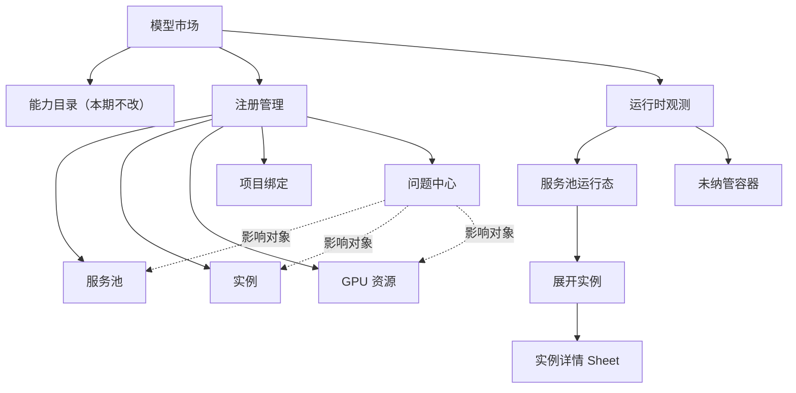
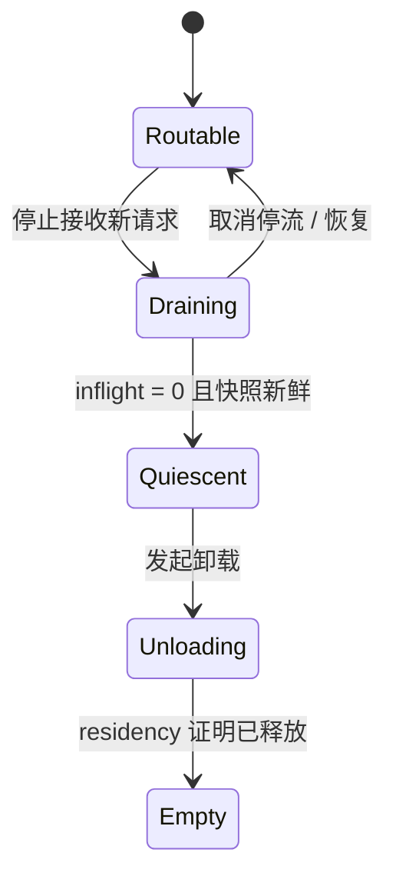

# v0.23.4 · 模型市场注册管理与运行时观测结构化重设计计划

> Status: Completed · v0.23.4 Outcome verified 2026-07-20（P0 证据见 §3.1 表）
>
> 硬前置：[v0.23.3 ML Backend 服务池与真实请求负载均衡地基](2026-07-20-v0.23.3-ml-backend-service-pool-load-balancing-foundation.md)
>
> 当前发布基线：[v0.23.2 旧 Service 导入路径彻底清零](2026-07-17-v0.23.2-legacy-service-import-elimination.md)
>
> 产品与架构前序：[v0.14.10 Model Market Part B](archive/2026-06-07-v0.14.10-canvas-precision-tools-and-attribute-mode.md) · [v0.19.0 全局 ML Backend 注册表](archive/2026-06-25-v0.19.0-global-ml-backend-registry-draft.md) · [v0.22.4 跨 Backend GPU 显存仲裁](2026-07-14-v0.22.4-cross-backend-gpu-memory-arbitration.md)
>
> 盘点基线：分支 `feat/26-07-18`，commit `f7549b09`。当前尚无负载均衡；实际实施必须从 v0.23.3 的最终 release commit 起步，不从该盘点 commit 或 v0.23.3 开发中间态续做。

## 1. 结论与版本边界

v0.23.4 的目标不是给现有两块长页面换一层样式，而是让模型市场的管理与观测对象回到真实运行层级：

```text
服务池（请求路由边界）
└── Backend 实例（URL / 权重 / 接流状态 / 并发）
    ├── GPU 物理资源与仲裁状态
    └── 模型驻留池（模型 / builder / borrower / residency）
```

完成后仍保留模型市场顶层的「能力目录 / 运行时观测 / 注册管理」三段，不改路由和角色入口；本版本只重构后两段，并增加它们所需的权威管理读模型和运行时快照。

当前 v0.23.2 基线仍没有真实负载均衡或服务池合同；这部分不再由本计划等待一个未知外部实现，而是由 v0.23.3 明确交付。v0.23.4 的进入条件是 v0.23.3 已发布并冻结：

- service pool / member / project binding 数据模型和 ADR。
- pool id / selected instance id 双 ID 调用链与溯源。
- topology / runtime snapshot、路由指标、freshness 和 diagnostics 合同。
- traffic drain / resume / quiescent 与实例 lifecycle 安全门。
- off → observe → enforce 灰度和真实双实例验收。

v0.23.4 只消费这些已发布合同，允许增加页面 view-model adapter 和针对展示缺口的只读字段修正，但**不实现或改写负载均衡算法、持久模型、route lease、请求选择器和项目绑定迁移**。若 v0.23.3 未完成，页面实现保持 blocked；不能用前端分组代替前置版本。

## 2. 当前基线审计

### 2.1 后端对象和路由事实

| 事实                          | 当前证据                                                                                                       | 对本计划的影响                                                                      |
| ----------------------------- | -------------------------------------------------------------------------------------------------------------- | ----------------------------------------------------------------------------------- |
| 注册项是一条物理实例记录      | `MLBackendRegistry` 保存唯一 URL、状态、health、GPU claim；admin 路由注释明确“一物理 backend = 一 registry 行” | 现有 registry id 只能称“实例 ID”，不能直接改称服务池 ID                             |
| 项目启用和主 backend 绑定实例 | `ProjectMLBackend(project_id, registry_id)`、`Project.ml_backend_id` 和 pipeline / 用户偏好均保存 registry id  | 真实池路由必须由前置负载均衡版本解决项目到池的绑定，前端不能自行聚合                |
| 推理调用解析到唯一 URL        | API / Celery 传递精确 backend id，worker 读取该 registry 并构造唯一 `MLBackendClient`                          | 当前没有“池内选实例”步骤                                                            |
| GPU 仲裁不是负载均衡          | GPU dispatch request 使用最终 `backend_registry_id + gpu_resource_id` 做准入、排队和驱逐                       | GPU queue / lease 不能被解释成路由流量或副本选择                                    |
| `/observe` 是逐 URL 直探      | 返回 URL、health、latency、GPU、模型 pool、residency；无 pool id、weight、routable、selection                  | 不能从 `/observe` 推断服务池或均衡状态                                              |
| 现有指标不含路由真值          | Prometheus 只有按 backend id / outcome 的请求耗时，进程内 semaphore 也不是共享路由计数                         | 流量分布、inflight、rejection、last selected 必须来自负载均衡域；GPU queue 单独展示 |

当前 ADR-0049 和 v0.22.4 计划都把“同一 backend 多副本、负载均衡、scale-out”明确列为非目标。这是盘点基线事实；v0.23.4 必须消费 v0.23.3 新增的 routing domain，不能把 GPU 仲裁的“跨 Backend 显存准入”改写成“请求在副本间负载均衡”。

### 2.2 注册管理现状

`RegisteredBackendsTab.tsx` 纵向串联三块内容：

1. GPU 物理资源卡片。
2. `min-width: 980px` 的全局 Backend 扁平表。
3. 项目启用概览。

结构性问题：

- Backend 表把 URL、来源、类型、并发、GPU 预算、完整诊断、状态、时间和三个操作同时塞入一行，扫描路径过长。
- GPU 资源诊断既在资源卡里出现，又在实例 GPU 配置里重复；全局诊断还会再显示一次。
- 原始 `gpu_resource_id`、Backend UUID 和完整错误文本占据主视图，真正需要先判断的“服务是否接流、容量是否饱和、影响多少实例”不突出。
- 项目启用是独立长列表，无法从服务池或实例反查项目影响范围。
- 桌面依赖横向滚动，窄屏没有清晰的主次折叠策略。

### 2.3 运行时观测现状

`RuntimeObservePanel.tsx` 当前约 950 行，同时请求 `/all`、`/overview`、`/observe`，再在浏览器里按 URL join：

- 每个注册 Backend 渲染一张大卡，健康、GPU claim、compute、cache、模型版本、residency、项目、操作和变体全部混在同一层。
- 十几个实例会形成连续卡片墙，无法快速比较副本流量与故障分布。
- 缺少实时 observe 时，页面会把缓存的 `backend.state === connected` 回落成“在线”；最近一次登记健康与当前直连可达性共用视觉语义。
- 两个刷新按钮分别刷新“注册状态”和“实时指标”，但页面不解释数据源、快照时间和陈旧程度。
- builder、borrower、generation、gate、identity 等排障字段直接进入主卡；服务可路由性、当前并发、饱和拒绝和流量占比反而不存在。
- “卸载”仍是直接实例动作；负载均衡场景下缺少“停止接流 → 等待活动请求归零 → 卸载”的安全顺序。
- 未注册 env 容器与已注册实例需要不同信任和权限边界，但目前只是第二组同形卡片。

### 2.4 术语冲突

现有 `health_meta.pool`、`video_pool` 和 `residency.pools` 表示 Backend **内部模型驻留池**，不是负载均衡服务池。

本计划统一使用：

| 中文         | 合同命名                           | 含义                                           |
| ------------ | ---------------------------------- | ---------------------------------------------- |
| 服务池       | `service_pool` / `service_pool_id` | 负载均衡器选择实例的逻辑请求边界               |
| Backend 实例 | `instance` / `instance_id`         | 一条可定位到物理 URL 的 registry 记录          |
| GPU 物理资源 | `gpu_resource` / `gpu_resource_id` | GPU 仲裁的逐卡容量与生命周期边界               |
| 模型驻留池   | `model_pool` / `residency.pools`   | 单实例内部的模型权重与 borrower / builder 状态 |

禁止在新增合同中继续使用无前缀的裸 `pool` 表示服务池。

## 3. v0.23.3 硬进入门：核对已发布负载均衡真值

### 3.1 必须保存的实现证据

P0 从 v0.23.3 plan Outcome、ADR、migration、OpenAPI 和部署证据核对一份可复核的负载均衡基线清单，至少包含：

1. release / merge commit、部署镜像摘要和运行态版本。
2. 已接受的 ADR-0050 服务池与请求路由决策；ADR-0044 / 0049 的历史事实不被改写。
3. 服务池、实例成员关系、路由策略、权重、`active | draining | disabled` 接流状态的持久模型。
4. 项目绑定服务池的语义，以及 pipeline、默认模型、用户偏好和历史任务如何从实例 ID 过渡。
5. 请求选择发生在 GPU dispatch 之前的调用链证据；最终被选中的实例 ID 仍进入 GPU token / membership / lease。
6. 请求溯源同时保存 requested pool id 与 selected instance id；历史 prediction 的实例溯源不丢。
7. 跨 API / Celery 进程一致的 inflight、selection、rejection 和 latency / error 指标来源；v0.23.3 首版 router 不排队，GPU queue 必须保持独立。
8. drain / resume 合同、幂等性、权限、超时与审计事件，以及 traffic draining 与 GPU residency draining 的明确区分。
9. env 自动注册如何显式映射服务池；禁止按 backend 名称、`/setup` 名称或 URL 前缀自动合池。
10. 数据迁移、兼容、回滚 / forward-only 结论和完整测试结果。

任一项缺失，v0.23.4 implementation 保持 blocked。可以继续做线框、fixture 和合同评审，但不能合并宣称服务池已可用的生产 UI，也不能在本版本补写路由核心来绕过前置发布。

P0 证据固定回填到下表，不只在聊天、PR 描述或本地环境中口头确认：

| 证据                         | 已核对值                                                                                                                                                                                                                                                                                                                                                                                                                                                                                                            | 出处                                                                                                                                                        |
| ---------------------------- | ------------------------------------------------------------------------------------------------------------------------------------------------------------------------------------------------------------------------------------------------------------------------------------------------------------------------------------------------------------------------------------------------------------------------------------------------------------------------------------------------------------------- | ----------------------------------------------------------------------------------------------------------------------------------------------------------- |
| `V0_23_3_RELEASE_COMMIT`     | `a6504b8c chore(release): 0.23.3 — ML Backend service pools & request routing foundation`（分支 `feat/26-07-18`）；tracker pin 收尾 commit `cc877df6`；13 commits from `f7549b09..cc877df6`                                                                                                                                                                                                                                                                                                                         | `git log --oneline f7549b09..HEAD`                                                                                                                          |
| 部署运行态版本               | `0.23.3`（`app_version` / `pyproject` / `web package.json` / `openapi.snapshot.json info.version` / 运行态 `/health.version` 全部一致）；运行态 `ML_BACKEND_ROUTER_MODE=off`（安全默认）                                                                                                                                                                                                                                                                                                                            | `curl localhost:8000/health` → `{"status":"ok","version":"0.23.3"}`                                                                                         |
| ADR-0050                     | `docs/adr/0050-ml-backend-service-pools-and-request-routing.md`，Accepted，冻结决策 D1–D18；已索引于 `docs/adr/README.md`                                                                                                                                                                                                                                                                                                                                                                                           | ADR 文件 + README                                                                                                                                           |
| schema / migration           | `apps/api/app/db/models/ml_backend_pool.py`（`MLBackendServicePool` + `MLBackendPoolMember`）；alembic `0132_ml_backend_service_pools.py`（singleton backfill + 项目绑定改名 + 分区 prediction 双 ID + 7 类 JSONB 重映射 + forward-only downgrade 守卫）；DB `alembic_version=0132`，运行态已 backfill 4 pools / 4 members                                                                                                                                                                                          | `docker exec ... psql -c "SELECT version_num FROM alembic_version"` → `0132`                                                                                |
| topology / runtime endpoints | `GET /api/v1/admin/ml-integrations/topology`（PROJECT_ADMIN\|SUPER_ADMIN，角色裁剪）、`GET /api/v1/admin/ml-integrations/runtime-snapshot`（SUPER_ADMIN-only）；当前 `response_model=None`（返回 `dict`）—— OpenAPI 序列化为 `{type: object, additionalProperties: true}`，前端 generated TS 会是 `unknown`。**P1 补 Pydantic response_model**；实现入口 `apps/api/app/api/v1/admin_ml_integrations.py:1854-1889`、服务实现 `apps/api/app/services/ml_routing/diagnostics.py:build_topology/build_runtime_snapshot` | OpenAPI + 路由文件                                                                                                                                          |
| 共享 router metrics          | Redis ledger namespace `ml-router:v1`（独立于 GPU 仲裁 `gpu-arbiter:v1`），原子 Lua acquire/heartbeat/finish/cancel + 被动熔断；Prometheus 模块 `apps/api/app/services/ml_routing/metrics.py` 已声明（`ROUTER_SELECTIONS`/`ROUTER_REJECTIONS`/`ROUTER_INFLIGHT` 等）但 **未 wire**（无调用点）。runtime-snapshot 直接读 Redis `zcard`/`hgetall` 取 `route_inflight`/`circuit_open`。**v0.23.4 不 wire Prometheus（§4.2 禁止），metrics-driven 字段渲染为「暂无路由指标」**                                          | metrics.py + diagnostics.py:110-128                                                                                                                         |
| 项目绑定和双 ID 溯源         | `Project.ml_backend_pool_id`（FK→pools CASCADE）、`ProjectMLBackendPool(project_id, pool_id)`；`Prediction.ml_backend_pool_id`（FK SET NULL）、`FailedPrediction.ml_backend_pool_id`、`AsyncJob.payload["ml_backend_pool_id"]`；6 个第一方调用点（predict-frame / batch source+failed / frame fan-out / retry / secondary-inference audit）记录 pool + instance 双 ID；tracker job-scope pin（`runner.py` `MLBackendRouter.acquire(owner="tracker:{job_id}")` + heartbeat + 三出口 finish/cancel）                  | services/ml_backend.py + prediction.py + workers/tasks.py + workers/frame_preannotate.py + workers/predictions_retry.py + services/video_tracking/runner.py |
| drain / resume 合同          | `POST /admin/ml-integrations/service-pools/{pool_id}/members/{registry_id}/drain`（active→draining，幂等）、`POST .../resume`（draining→active，幂等；disabled 需先 enable）；状态机 `MLBackendPoolMember.traffic_state active\|draining\|disabled`；权限 SUPER_ADMIN；drain/resume 与 GPU residency draining **独立**（traffic drain 只影响新 lease 接收，不触发模型权重卸载）                                                                                                                                     | admin_ml_integrations.py:1798-1848 + services/ml_backend.py                                                                                                 |
| 负载均衡测试与灰度           | 9 套件 76 cases（migration_0132/capability_and_policy/ledger/router/dual_id/pool_api/admin_pool_api/topology/alembic_drift）+ 既有 17 文件 ripple，全量绿 0 失败；dev 栈真实双实例 pool（gsam2:8001 + gsam2:8011 同 image 同模型，fingerprint exact match `e75e9d98…`）8 项验收全过：observe 20/20、SWRR 1:1 精确分布、并发饱和 503、crash TTL 回收、被动熔断、drain 隔离、Redis fail-closed、端到端 transport；验收后 dev 栈恢复 `off` + singleton                                                                 | v0.23.3 plan §Outcome「灰度验收证据」表 + `uv run pytest tests/test_ml_routing_*` 本地复核                                                                  |

**核对结论**：§3.1 第 1–10 项已全部映射到可复核证据（文件路径 / commit / DB 值 / 运行态响应）。仅 topology/runtime-snapshot 的 Pydantic `response_model` 缺失属于「展示字段缺口」—— 本计划 §1 明确允许的「针对展示缺口的只读字段修正」，由 P1 在 v0.23.4 内部吸收补齐，**不绕过 v0.23.3 已发布的路由核心**。生产 UI PR 以 `a6504b8c` 为祖先。

### 3.2 前端所需最小权威字段

v0.23.3 发布合同至少要提供以下真值；字段名以已发布 OpenAPI 为准，但语义不能缺失：

| 层级       | 必需字段                                                                                                                              |
| ---------- | ------------------------------------------------------------------------------------------------------------------------------------- |
| 服务池     | `id`、`name`、`enabled`、`routing_policy`、`status`、`total_instances`、`routable_instances`                                          |
| 实例配置   | `id`、`service_pool_id`、`name`、`url`、`traffic_state`、`weight`、`max_concurrency`、GPU claim                                       |
| 实例路由   | `routable`、`routing_reason_codes`、`inflight`、`router_queue_supported=false`、`last_selected_at`、窗口内 selection / rejection 计数 |
| 实例质量   | `health_state`、`health_checked_at`、`health_stale`、P95、错误率                                                                      |
| 资源与驻留 | `gpu_config`、GPU 仲裁摘要、`compute`、`residency`、模型池摘要                                                                        |
| 快照       | `schema_version`、`observed_at`、各来源的 `updated_at / stale / error`、结构化 diagnostics                                            |

缺失值必须为 `null / unknown` 并携带原因，不能把“无数据”渲染成 `0`、空闲或健康。

### 3.3 身份键和关联规则

- 服务池只用稳定 `service_pool_id` 关联。
- 实例只用稳定 `instance_id / registry_id` 关联。
- 物理 GPU 只用完整 `gpu_resource_id` 关联。
- 模型驻留池只在所属实例内部用 backend 自报的 pool key 关联。
- URL 只用于展示和直连诊断，不再充当跨接口 join key。
- 名称只用于展示，可重复，不参与聚合。
- 未注册 env 容器没有实例 ID，只能进入隔离的“未纳管容器”集合，不能被自动并入服务池。

### 3.4 四条独立状态轴

主视图不再用一个“在线”徽标概括全部状态：

| 状态轴      | 推荐枚举                                                                                                   | 数据来源                    | 禁止推断                                                  |
| ----------- | ---------------------------------------------------------------------------------------------------------- | --------------------------- | --------------------------------------------------------- |
| 连通 / 健康 | `healthy / degraded / offline / unknown`                                                                   | 探活快照                    | `connected` 缓存不能冒充实时 healthy                      |
| 路由        | configured `active / draining / disabled` + effective `routable / draining / bypassed / blocked / unknown` | 负载均衡器与 rollout mode   | health 200 或 configured draining 不代表已经有效停流      |
| 容量        | `idle / serving / saturated / unknown`                                                                     | 共享 route inflight / limit | GPU lease、GPU queue 或本地 semaphore 不等于路由 inflight |
| 驻留        | `empty / loading / resident / draining / unloading / unknown`                                              | Backend residency           | CPU compute 不代表 GPU 已释放                             |

服务池可以有派生的总体严重度，但 API 必须返回派生理由；前端只负责显示，不复制路由判定算法。

## 4. 目标与非目标

### 4.1 目标

- 保留模型市场三段顶层信息架构，重构「注册管理」和「运行时观测」。
- 以服务池为默认比较层，以实例、GPU 和模型驻留为逐级下钻层。
- 注册管理拆成服务池、实例、GPU 资源、项目绑定四个结构化视图。
- 运行时观测改为可展开的服务池树表，默认展示路由健康、容量和流量分布，不再堆实例大卡。
- 用权威 ID 和服务端读模型替代浏览器 URL join。
- 分离健康、路由、容量、驻留状态和数据新鲜度。
- 建立诊断归一化与问题中心，同一问题只展示一次并可反查影响对象。
- 将实例详情、原始 UUID、generation、builder / borrower、完整 diagnostics 下沉到详情 Sheet。
- 统一刷新入口，显示每类数据来源和时间；部分失败不抹掉仍可信的其它来源。
- 将停流、卸载、预热、健康检查等操作标明作用域并遵守负载均衡生命周期。
- 保持 superadmin / project admin 现有可见性和写权限边界。
- 使用现有 Tailwind v4、shadcn/ui 和 `--sc-*` 设计令牌，亮暗主题均通过。

### 4.2 明确不做

- 不在本版本实现服务池持久模型、请求选择算法、共享路由计数器或项目绑定迁移。
- 不把 GPU 仲裁、模型驻留池或 env observe URL 重命名成负载均衡。
- 不从名称、URL、能力、GPU 卡或项目绑定猜测服务池关系。
- 不修改 ML Backend `/health`、`/setup`、`/predict` wire protocol 来承载平台路由指标。
- 不重做能力目录、项目设置的 ML 模型页或预标任务历史页。
- 不引入新的图表库、状态管理框架、虚拟列表库或抽象设计系统。
- 不为首版增加自由拖拽拓扑、实时动态图、SSE / WebSocket 新协议或历史趋势分析。
- 不顺手重构 `VariantPanel`、GPU 仲裁领域实现或无关 Model Market 组件。
- 不用只有颜色的状态表达，也不写任意 hex / rgb / oklch class。

## 5. 角色与权限边界

| 能力                                          | Super Admin                  | Project Admin                                            |
| --------------------------------------------- | ---------------------------- | -------------------------------------------------------- |
| 查看服务池 / 实例基础信息                     | 全量                         | 通过角色裁剪后的 topology 沿用当前注册管理只读范围       |
| 查看 URL、路由策略、权重                      | 可见                         | URL 沿用当前可见性；路由策略、权重和内部 reason 默认隐藏 |
| 查看 GPU 资源、预算、UUID、residency 调试细节 | 可见                         | 隐藏                                                     |
| 新增 / 编辑 / 删除实例或服务池                | 可操作，但以负载均衡合同为准 | 不可操作                                                 |
| drain / resume / unload / warmup              | 可操作，受状态门控           | 不可操作                                                 |
| 项目启用概览                                  | 全量只读，并可跳项目设置     | 不展示跨项目概览                                         |
| 未纳管容器                                    | 可观测、可显式注册           | 不展示                                                   |

管理拓扑端点允许 `PROJECT_ADMIN | SUPER_ADMIN`，但必须按角色在服务端返回不同 view：Project Admin 只得到当前 `/all` 已允许的全局注册基础信息及服务池名称 / 成员摘要，不得到跨项目绑定、GPU、预算、路由策略、权重、内部 reason 或诊断拓扑。运行时快照、GPU 数据和全部 mutation 继续只允许 `SUPER_ADMIN`。不能只靠前端隐藏敏感字段。

## 6. 目标信息架构



设计方向是“运维控制台”，不是卡片陈列墙：默认层紧凑、可比较；细节按需展开；危险动作收进明确的操作菜单和确认流程。

### 6.1 注册管理

页头只保留：

- 总服务池数、可路由 / 总实例数、异常资源数、受影响项目数。
- 搜索、状态筛选、统一刷新、问题中心入口。
- superadmin 的“注册实例 / 新建服务池”入口；是否同时出现取决于 P0 的真实管理合同。

Project Admin 不显示跨项目 / GPU 统计和问题中心，只看到裁剪后的服务池、实例两个只读视图；它不回退到浏览器自行拼接的另一套 legacy 页面。若 P0 无法提供角色裁剪后的 topology，本计划不得移除其现有 `/all` 只读视图，必须先补齐服务端合同再切换。

Super Admin 使用 `Tabs` 分四个实体视图；Project Admin 只渲染前两个只读视图：

#### 服务池

| 主列   | 内容                                                                    |
| ------ | ----------------------------------------------------------------------- |
| 服务池 | 名称、稳定 key、策略；ID 只在 tooltip / 复制动作中显示                  |
| 成员   | `可路由 / 总实例`，按状态分段                                           |
| 容量   | `inflight / 总并发`、饱和拒绝；明确标注 router 首版不排队，未知显式显示 |
| 项目   | 启用项目数，可进入项目绑定筛选                                          |
| GPU    | 关联资源数、最高严重度、预算摘要                                        |
| 状态   | 健康、configured → effective 路由、router mode、数据新鲜度分开显示      |
| 操作   | 查看实例、编辑策略、暂停 / 恢复接流；权限和状态门控                     |

服务池行可展开成员实例，但不在同一行展示完整 URL、驻留和诊断全文。

#### 实例

实例表用于配置和定位物理端点，主列为：实例名称、所属服务池、URL、来源、接流状态、权重、最大并发、GPU claim、最近检查和操作。

- 权重和 configured / effective 接流状态必须来自负载均衡配置与 runtime snapshot。
- `connected`、`routable` 和 `resident` 分列或分组显示，不能合成一个状态。
- 行操作收进 `DropdownMenu`；健康检查可保留快捷动作，编辑 / drain / resume / unload / 删除按风险排序。
- 原始错误全文、能力快照、模型池、GPU generation 和诊断进入详情 Sheet。

#### GPU 资源

由现有逐卡大卡改为表格：资源名称、节点、静态预算 / 可分配容量、已声明预算、运行时 committed、Backend / card queue、lease、desired → effective 和最高诊断。

- 资源行展开后列出受影响实例和完整仲裁状态。
- 同一资源问题只在问题中心保留一条主记录；资源 / 实例行显示计数和跳转。
- “静态声明超售”和“运行时实际占用”必须分开，不能用同一 progress 表示。

#### 项目绑定

默认按项目显示所绑定服务池、主服务池、可用实例数和风险；支持切换为按服务池反查项目。

- 本页仍只读，修改入口跳转项目设置。
- 项目已启用但池内无可路由实例时单独告警。
- 若前置负载均衡仍让项目绑定实例而非服务池，P0 不通过，不能用前端聚合掩盖语义冲突。

### 6.2 运行时观测

页头提供单一“刷新”动作和自动刷新开关；展开“数据来源”后显示 topology、router metrics、health、GPU arbiter 各自的更新时间、陈旧阈值和错误。底层可以使用不同 query cadence，但用户不再面对两个无解释的刷新按钮。

默认服务池行展示：

| 分组   | 内容                                                    |
| ------ | ------------------------------------------------------- |
| 可用性 | 总体严重度、`可路由 / 总实例`、draining / offline 数    |
| 流量   | 窗口请求数、实例选择分布紧凑分段条、最近选择时间        |
| 容量   | inflight / limit、saturation、rejection；GPU queue 另列 |
| 质量   | P95、错误率、rejection 摘要                             |
| 资源   | GPU 风险、驻留实例数、CPU fallback 数                   |
| 新鲜度 | 最近快照时间、stale / partial 标记                      |

流量分布首版使用语义色的紧凑分段条和数值，不引入图表库。没有真实 selection 计数时整列显示“暂无路由指标”，不能用权重推算实际流量。

展开服务池后显示实例行：

- 名称 / URL、权重、接流状态和 `routable` reason。
- 当前 / 最大并发、窗口 selection / rejection、P95、错误率、最近选中；GPU queue 仅在资源摘要中展示。
- health、compute、GPU claim、residency 摘要。
- “详情”打开 `Sheet`，里面才展示模型 / 视频驻留池、cache、variant、builder / borrower、generation、原始诊断和复制 ID。

未纳管容器单独放在折叠区：只显示直连 health、latency、compute、GPU 和模型驻留；允许显式注册或 smoke test，但不展示权重、routable、流量分布，也不自动并池。

### 6.3 数据新鲜度和部分失败

- 每个状态必须能追溯到来源和 `observed_at`。
- 陈旧快照继续展示最后值，但使用 `stale` 标记并显示时间，不能沿用实时状态色。
- router metrics 失败不抹掉 topology；health 失败不抹掉最近 GPU 配置；GPU 观测失败不把预算变成 0。
- 服务池聚合包含 partial reason，例如 `2/3 instance health snapshots fresh`。
- 手动刷新失败时保留上次成功数据，并在来源区域显示错误，不把整页替换成一个错误块。

## 7. 诊断归一化与问题中心

### 7.1 诊断合同

服务端返回结构化诊断：

```text
diagnostic_id
code
severity
subject_type
subject_id
message
remediation
affected_service_pool_ids[]
affected_instance_ids[]
observed_at
source
```

稳定去重键为 `code + subject_type + subject_id`。如果同一资源超售影响三个实例，问题中心只显示一条资源问题，并写“影响 3 个实例”；实例行只显示关联标记和跳转，不复制全文。

### 7.2 严重度和展示

- 严重度沿用受控语义：`info / warning / critical / blocker`；`ok` 不是问题记录。
- 问题中心默认按 blocker → critical → warning → info、再按资源稳定排序。
- 支持按服务池、实例、GPU 资源和 code 筛选。
- remediation 只给可执行、与合同一致的建议；不能在 traffic draining 与 GPU draining 之间给错操作。
- 诊断徽标必须有图标 / 文本，不只靠颜色。

## 8. 生命周期操作与安全流程

### 8.1 实例卸载

负载均衡场景下默认流程：



- `routable` 实例不提供一键直接卸载，先 drain。
- router effective mode 不是 enforce 时，drain 只能显示为预配置 / shadow，不能进入“已停流”或普通安全卸载路径。
- 只有 router 权威报告 `inflight = 0` 且快照未陈旧时，才允许进入普通卸载确认。
- 强制卸载若真实合同支持，必须是独立高风险动作，明确可能中断请求并写审计；本计划不自行新增该能力。
- traffic drain 和 GPU eviction drain 分开展示，分别标注来源、owner 和进度。
- 请求被接受不等于完成；最终以新鲜 residency 证明为准。

### 8.2 其它动作

- 健康检查：实例作用域，完成后刷新 health 来源。
- 预热 / 变体：必须显示目标实例或由真实服务池预热合同选择目标，不能静默挑第一实例。
- resume：实例作用域，只恢复路由接流，不隐式加载模型。
- 删除实例：要求前置负载均衡合同先解除或安全迁移成员关系，并保留现有 running-job / GPU retirement 守卫。
- 编辑权重 / 策略：成功后显示 topology 更新时间；实际分布仍取 router metrics，不根据权重即时伪造。

全部 mutation 使用既有 toast、query invalidation 和审计机制；危险动作使用 `AlertDialog`，操作期间禁用重复提交并显示部分成功状态。

## 9. API 与前端数据合同

### 9.1 推荐读模型

v0.23.4 直接消费 v0.23.3 已发布的两层读模型。若实际路由名或字段与下表不同，先按 v0.23.3 OpenAPI 更新本文，再开始页面实现；不能让前端自行补齐缺失的路由真值：

| 读模型     | 推荐端点                                      | 内容                                                                                | 前端刷新特性          |
| ---------- | --------------------------------------------- | ----------------------------------------------------------------------------------- | --------------------- |
| 管理拓扑   | `GET /admin/ml-integrations/topology`         | 服务池、成员实例；superadmin 额外得到项目绑定、GPU 静态配置和配置诊断               | 低频；mutation 后失效 |
| 运行时快照 | `GET /admin/ml-integrations/runtime-snapshot` | router metrics、health、GPU runtime、residency、来源新鲜度、运行诊断；仅 superadmin | 自动 + 手动刷新       |

约束：

- 服务端按稳定 ID join，前端不再拼 `/all + /overview + /observe` 后按 URL 关联。
- topology 必须有 `PROJECT_ADMIN | SUPER_ADMIN` 两套服务端 response view 的合同测试；Project Admin 只能得到 §5 冻结的基础字段。
- 快照在一个明确的 `observed_at` 边界组装；每个异步来源另带时间和 stale / error。
- 单个 Backend 探活允许并发与部分失败，但端点不能形成每个项目 × 每个实例的 N+1 SQL / HTTP。
- router 指标直接读取负载均衡器的共享状态；GPU 资源读取 `gpu_arbitration.*` 当前领域路径，不能恢复已删除的 facade。
- 现有 `/all`、`/overview`、`/observe`、`/gpu-resources` 和 CRUD 路由是否保留由消费者审计决定；本版本不因前端切换就无证据删除公共端点。
- 新 schema 进入 OpenAPI snapshot，再通过现有生成链更新前端类型；手写 adapter 只能封装 transport，不能重复声明漂移 DTO。

### 9.2 前端纯派生层

新增一个小型、可独立测试的纯函数模块，职责仅限：

- 将 topology 与 runtime snapshot 按 ID 合并为页面 view model。
- 保留 `unknown / stale / partial`，不做业务真值猜测。
- 计算展示排序、筛选、严重度和诊断关联。
- 将同一诊断映射到问题中心及受影响行。

推荐文件：`apps/web/src/pages/ModelMarket/runtimeTopology.ts` 及同名测试。路由可用性、服务池健康和 drain 安全判定仍由后端合同给出，不复制到该模块。

### 9.3 查询与失效

- 注册管理默认只消费 topology；打开实例详情时从已取快照读取，除明确的重型原始数据外不逐行发请求。
- 运行时观测消费 topology 缓存 + runtime snapshot。
- 页面只提供一个用户可见刷新动作；内部并行刷新两个 query 并分别报告结果。
- mutation 精确失效 topology / runtime / registry 相关 key，避免刷新整个应用。
- 离开 tab 时停止运行时轮询；浏览器后台按既有 TanStack Query 策略降频或暂停。

## 10. 前端组件边界

复用现有 shadcn/ui `Tabs`、`Table`、`Badge`、`Sheet`、`Tooltip`、`ScrollArea`、`Skeleton`、`Progress`、`DropdownMenu` 和 `AlertDialog`；优先走项目既有兼容组件，不重复添加同类 primitive。

建议文件边界：

```text
apps/web/src/pages/ModelMarket/
├── RegisteredBackendsTab.tsx          # 权限、查询、内部导航
├── RuntimeObservePanel.tsx            # 查询、刷新、页面状态
├── runtimeTopology.ts                 # 纯 view-model 派生
├── registry/
│   ├── ServicePoolsSection.tsx
│   ├── BackendInstancesSection.tsx
│   ├── GPUResourcesSection.tsx
│   ├── ProjectBindingsSection.tsx
│   └── IssueCenter.tsx
└── runtime/
    ├── ServicePoolRuntimeTable.tsx
    ├── BackendInstanceRow.tsx
    ├── InstanceDetailSheet.tsx
    └── RuntimeStatusBadge.tsx
```

约束：

- `RegisteredBackendsTab.tsx` 和 `RuntimeObservePanel.tsx` 只做编排，不再承载全部详情渲染。
- 不为每个字段创建组件；只有跨行复用或具有独立交互 / 状态语义的部分拆分。
- 已无调用方的 `ObserveBackendsPanel.tsx` 在新页面稳定后删除；仍被 `VariantPanel` 使用的 `poolKeyParse.ts` 保留。
- `GlobalBackendFormModal` 首期尽量保留表单逻辑；若负载均衡合同要求服务池、权重、接流状态，再做最小字段扩展，不顺手重写整张表单。
- 状态样式只用 semantic classes；状态文本颜色遵守亮暗主题配对，运行 `pnpm lint:css-tokens`。
- 表格在窄屏保留核心列，次要字段进入展开行 / Sheet；不能仅把 980px 宽表继续横向压缩。

## 11. 实施阶段与 PR 边界

### P0 · v0.23.3 Release 证据与交互冻结

1. 从 v0.23.3 Outcome 回填 §3 全部证据并记录 `V0_23_3_RELEASE_COMMIT`。
2. 冻结服务池 / 实例 / GPU / 模型驻留四层术语和 ID。
3. 冻结四条状态轴、unknown / stale / partial 语义和诊断去重键。
4. 评审 topology / runtime snapshot schema、权限、刷新成本和 mutation 状态机。
5. 用 0 / 1 / N 服务池、混合故障、draining、stale、env-only 的 JSON golden fixture 验证合同表达力。
6. 核对 ADR-0050、migration、OpenAPI、generated types、灰度和真实双实例验收全部属于同一 release baseline。
7. 证据经 v0.23.3 实现 owner 与本计划 owner 评审后，将 implementation status 从 blocked 改为 ready。

验收：不依赖名称 / URL 推断即可构造全部目标页面；每个展示值都有权威来源。

PR 边界：证据回填、fixture 和交互合同；不修改 routing domain，也不提交“先画出来再接数据”的生产 UI。

### P1 · 已发布读模型验证与前端接入

1. 在 v0.23.3 release baseline 重跑 topology / runtime snapshot contract、权限和无 N+1 测试。
2. 对账项目绑定、实例配置、router metrics、health、GPU 仲裁、residency 和 diagnostics 字段。
3. 验证来源时间、stale / partial / error，以及单实例失败不会拖垮整份快照。
4. 验证 Project Admin / Super Admin 两套 topology view 和 runtime 的 superadmin 门控。
5. 复用 v0.23.3 OpenAPI generated types，新增前端 query hooks / transport adapter；不手写漂移 DTO。
6. 若发现后端合同缺陷，先在 v0.23.3 routing contract 上提交独立修复并更新证据，不在 view model 中猜值。

验收：前端不再需要 URL join；快照契约、部分失败、权限和无 N+1 测试通过。

PR 边界：前端 transport / query、合同 fixture 和必要的独立后端 contract fix；不夹带页面视觉重构或路由算法修改。

### P2 · 前端数据层与共享状态组件

1. 增加 query hooks、generated type adapter 和 `runtimeTopology.ts`。
2. 建立四轴状态 Badge、新鲜度提示、流量分段条和诊断关联。
3. 实现 skeleton、空态、整页失败、部分失败和 stale fixture。
4. 建立问题中心基础组件与 URL / ID 复制交互。

验收：纯函数测试覆盖所有 fixture；缺失值不变成 0，stale 不冒充实时，诊断稳定去重。

PR 边界：数据与共享组件；现有页面外观可暂不切换。

### P3 · 注册管理结构化改造

1. 落服务池 / 实例 / GPU 资源 / 项目绑定 Tabs。
2. 将资源和实例从大卡 / 宽表改为主次分层表格。
3. 接入问题中心和影响对象跳转。
4. 收拢行操作，保留 superadmin / project admin 权限边界。
5. 补搜索、筛选、展开、详情 Sheet 和窄屏布局。

验收：同一诊断主文案只出现一次；从服务池可定位实例、GPU 和项目；项目管理员没有敏感字段或 mutation。

PR 边界：注册管理页面与定向测试，不同时改运行时页面。

### P4 · 运行时服务池树表与安全操作

1. 用服务池树表替换实例大卡墙。
2. 展开实例并接入详情 Sheet、模型驻留与变体信息。
3. 接入统一刷新和数据来源 / 新鲜度区域。
4. 接入 drain → quiescent → unload、resume、health、warmup 等真实合同。
5. 隔离未纳管容器，不授予路由状态。
6. 删除无调用方的旧 `ObserveBackendsPanel.tsx`。

验收：多实例可横向比较；health、routable、capacity、residency 互不替代；危险动作不能绕过状态门控。

PR 边界：运行时页面、生命周期交互和定向测试；不改路由算法。

### P5 · 可访问性、性能、截图与正式文档

1. 验证键盘展开、Sheet focus trap、菜单、tooltip 和危险确认。
2. 验证状态不只靠颜色、表头 / 展开行语义和读屏标签。
3. 验证亮 / 暗主题、桌面 / 窄屏、长名称、长 URL 和大量实例。
4. 增加稳定的注册管理与运行时截图场景，更新图片清单。
5. 更新正式用户、运维、开发和 ADR 文档。
6. 更新 CHANGELOG `Unreleased`，记录用户可见变化和实际修复。

验收：前端完整门禁、文档构建和截图检查通过，无测试中间产物遗留。

### P6 · Release 与 Outcome

1. 从 LB 基线到 P5 的全部 required checks 为 0 失败。
2. 折叠 CHANGELOG 的 `Unreleased` 为发布段并留下新的空 `Unreleased`。
3. 同步 API config / pyproject、Web package、uv.lock 和 OpenAPI version。
4. 按 Docker 变更类型决定重建或只重启；运行态 `/health` 与静态版本一致。
5. 部署后验证路由快照、页面权限、drain / resume / unload 和部分失败。
6. 在本文末追加真实 `## Outcome`，记录提交、测试、残余风险和正式文档落点；draft 阶段不预放空 Outcome。

## 12. 测试与验收矩阵

### 12.1 后端合同

- 0 / 1 / N 服务池，0 / 1 / N 实例。
- healthy、degraded、全 offline、部分 health stale。
- active、draining、disabled、blocked、unknown 路由状态。
- inflight、saturated、selection / rejection 计数及窗口边界；router queue 明确为不支持，GPU queue 独立。
- topology 成功但 runtime 部分来源失败；旧成功快照保留且标 stale。
- env-only 容器不进入任何服务池。
- 诊断按 `code + subject_type + subject_id` 去重，影响对象完整。
- superadmin topology / runtime 全量；project admin topology 只含基础服务池 / 实例信息，无跨项目绑定、GPU UUID、预算、路由策略、权重、内部 reason、诊断拓扑和 mutation；project admin 请求 runtime 返回 403。
- SQL 查询数量固定，不随项目 × 实例乘积增长；Backend 探活并发有界。
- selected instance id 精确进入 GPU dispatch 和请求溯源，由前置负载均衡测试继续守卫。

### 12.2 前端行为

- 服务池聚合：正常、降级、不可用、空池、单实例、多实例。
- 实例 online 但 draining、健康但 saturated、可路由但冷驻留、健康快照过期。
- 权重与实际流量不一致时展示真实分布，不用权重覆盖指标。
- 无 selection / inflight / rejection 指标时显示 unknown，不显示 0；不制造 router queue 数值。
- 同一 GPU 超售问题只在问题中心出现一次，实例 / 资源可反查。
- URL 重复格式、同名实例、同名服务池不影响 ID 关联。
- 未纳管容器独立归组，没有 routable / weight / traffic 假字段。
- drain 后等待 quiescent 才启用普通 unload；stale inflight 阻止安全结论。
- health / topology / runtime 任一部分失败不清空其它可信数据。
- project admin 只读行为、superadmin mutation、tab 深链和返回状态不回退。
- 详情 Sheet 的打开、关闭、焦点恢复、复制 ID 和长内容滚动。

### 12.3 视觉与可访问性

- 1440px、1024px 和窄屏布局无关键操作遮挡。
- 十几个实例时默认折叠，不形成实例卡片长墙。
- 长 URL、长中文名、无项目、多个项目和多诊断不破表格。
- 亮 / 暗主题下状态、边框、悬停、焦点和 disabled 均可辨认。
- 键盘可到达 Tabs、展开按钮、菜单、Sheet、AlertDialog。
- `aria-expanded`、表头关联、状态文本和图标替代文本完整。

### 12.4 建议验证命令

后端按实际新增测试路径补齐定向命令，并最终运行完整 API 门禁。前端至少执行：

```bash
pnpm --filter @anno/web test -- \
  src/pages/ModelMarket/RegisteredBackendsTab.test.tsx \
  src/pages/ModelMarket/RuntimeObservePanel.test.tsx \
  src/pages/ModelMarket/runtimeTopology.test.ts
pnpm --filter @anno/web typecheck
pnpm --filter @anno/web lint:css-tokens
pnpm --filter @anno/web lint
pnpm --filter @anno/web build
pnpm docs:build
```

若更新截图，再运行项目既有的 screenshot matrix / scene 命令。每轮测试结束后清理本轮生成的 coverage、临时截图、测试下载和非版本化构建产物；不得删除用户已有文件。

## 13. 正式文档、ADR 与 CHANGELOG

仅新增本文时不修改 CHANGELOG。真正实施时至少同步：

| 变更                           | 正式落点                                                                                    |
| ------------------------------ | ------------------------------------------------------------------------------------------- |
| 模型市场新 IA、角色和操作      | `docs-site/user-guide/superadmin/model-market.md`                                           |
| 服务池 / 实例注册、删除、drain | `docs-site/user-guide/superadmin/ml-backend-registry.md`                                    |
| 项目从池启用 / 选主语义        | `docs-site/user-guide/projects/ml-backends.md`                                              |
| 路由指标、快照新鲜度和告警     | `docs-site/ops/observability/index.md`、相关 runbook                                        |
| 平台层服务池 / 实例 / GPU 分层 | `docs-site/dev/concepts/backend-layers.md`                                                  |
| 新 admin 端点                  | OpenAPI / API 文档；必要时更新内部端点参考                                                  |
| 服务池与路由架构               | 新 ADR，并更新 ADR 索引；不改写已接受 ADR 的历史事实                                        |
| 截图                           | `apps/web/e2e/screenshots/scenes/superadmin.ts`、`docs-site/maintainers/image-checklist.md` |

`docs-site/dev/reference/ml-backend-protocol.md` 只在 Backend wire contract 真正改变时更新；平台内部服务池和 router metrics 不应错误塞进 `/health` 协议。

CHANGELOG `Unreleased` 按实际内容分组：

- `Added`：服务池视图、路由指标、流量分布、问题中心等新增能力。
- `Changed`：注册管理与运行时观测的信息层级和交互。
- `Fixed`：只记录实际修复的重复告警、陈旧健康冒充实时等用户症状。

正式文档描述当前系统，不写用户可见的版本沿革；版本来源只留在 CHANGELOG、ADR、plan、frontmatter 或 HTML 注释。

## 14. Release gate

以下全部满足才能发布：

- P0 保存了可复核的真实负载均衡基线；当前 v0.23.2 单实例模型不再被误称为服务池。
- 页面显式展示 router desired / effective mode；off / observe 不把 configured draining 冒充实际 quiescent。
- 页面不按 URL / 名称 / 能力推断服务池或路由状态。
- topology / runtime snapshot 的 OpenAPI、生成类型和实现一致。
- 注册管理和运行时观测不再重复拼接同一诊断全文。
- health、routable、capacity、residency 和 freshness 五类信息可独立识别。
- 运行时默认是服务池比较视图，实例细节按需展开。
- unsafe unload 不可从普通路径绕过 drain / quiescent 门控。
- 项目管理员权限不扩大，敏感字段由服务端裁剪。
- 无前端 N+1、重复轮询或每实例请求瀑布。
- Web test、typecheck、CSS token lint、lint、build、API tests、OpenAPI、docs build 全绿。
- 亮 / 暗主题、键盘、窄屏、partial / stale / empty / error 状态完成验收。
- CHANGELOG、正式文档、截图、版本源与运行态同步。

## 15. 回滚与停止条件

### 15.1 停止条件

出现任一情况立即停止进入下一阶段：

- 找不到服务池 / 实例的稳定 ID 或项目仍只绑定实例。
- 路由指标只能由前端或单进程 semaphore 推断。
- drain 与 GPU residency draining 无法区分。
- selected instance 无法在 prediction / job / audit / GPU dispatch 中溯源。
- topology 与 runtime 无法标记陈旧和部分失败。
- 新聚合接口出现项目 × 实例 N+1 或无界并发探活。
- 角色权限只能靠前端隐藏而无法服务端裁剪。

### 15.2 回滚

- P1 聚合读模型是加法；旧端点在消费者审计完成前保留，可独立回滚前端切换。
- P2–P4 按 query / component 边界提交，注册管理和运行时观测可分别回滚，不回滚底层负载均衡。
- mutation 只调用前置合同，不增加双写或影子修改。
- 若新 runtime snapshot 在生产出现成本或稳定性问题，前端显示明确不可用状态并停止自动刷新；不能静默退回 URL join 后继续显示“服务池正常”。
- 本计划不拥有负载均衡持久迁移，因此不定义其数据库 downgrade；回滚结论完全引用 v0.23.3 ADR-0050、plan Outcome 和 release runbook。

## 16. 成功标准

v0.23.4 完成时，超管应能在不阅读原始 UUID 和诊断长文的前提下回答：

1. 哪些服务池当前可用，哪些正在降级或停止接流？
2. 每个池有多少实例可路由，流量实际如何分布，是否存在饱和拒绝或 GPU 准入排队？
3. 故障属于连通、路由、容量、GPU 仲裁还是模型驻留？数据是否新鲜？
4. 一个问题影响哪些池、实例、GPU 和项目，而不会看到同一告警重复三四次？
5. 需要维护某实例时，能否安全完成停流、等待归零、卸载和恢复？

并满足以下可自动验证条件：

- 相同 `code + subject_type + subject_id` 的诊断主记录只渲染一次。
- 页面不再以 URL 作为已注册实例的跨接口 identity。
- 缺失 / 陈旧路由指标不显示为 0 或 healthy。
- 注册管理默认按实体分段，运行时默认按服务池比较，十几个实例不会形成卡片长墙。
- 原始调试字段不占据主表，且可从详情 Sheet 完整访问。
- 普通卸载不能在实例仍 routable、inflight 非零或数据 stale 时执行。
- superadmin / project admin 的现有权限和数据遮蔽测试全部通过。

## Appendix · P0 冻结交互合同（v0.23.4 实施基线）

> 以下合同在 P0 冻结；P1+ 实施必须严格按此执行，任何偏离需要更新本附录并重新评审。

### A.1 四条独立状态轴

主视图禁止单一「在线」徽标概括；每条轴独立判定，来源不可互推。

| 状态轴    | 推荐枚举                                                                                                   | 数据来源（v0.23.3/v0.23.4 实际可得）                                                                                                                                                | 禁止推断                                                                                           |
| --------- | ---------------------------------------------------------------------------------------------------------- | ----------------------------------------------------------------------------------------------------------------------------------------------------------------------------------- | -------------------------------------------------------------------------------------------------- |
| 连通/健康 | `healthy / degraded / offline / unknown`                                                                   | runtime-snapshot `RuntimeMemberSnapshot.registry_state` + `health_fresh`                                                                                                            | `connected` 缓存不冒充实时 healthy                                                                 |
| 路由      | configured `active / draining / disabled` + effective `routable / draining / bypassed / blocked / unknown` | topology `traffic_state` + runtime `route_inflight`/`circuit_open` + `router_mode`（off → effective bypassed；observe → configured 真值但 enforce 未生效；enforce → 真实 routable） | health 200 或 configured draining ≠ 已停流；`router_mode != enforce` 时 draining 只能显示为 shadow |
| 容量      | `idle / serving / saturated / unknown`                                                                     | runtime `route_inflight` + 成员 `weight`（`limit` 在 v0.23.4 为 `null` —— max_concurrency 不在已发布合同）                                                                          | GPU lease/queue/semaphore ≠ 路由 inflight；`limit=null` 时不可推算饱和百分比                       |
| 驻留      | `empty / loading / resident / draining / unloading / unknown`                                              | `/observe` residency（v0.23.4 P4 通过 InstanceDetailSheet 透出）；v0.23.4 runtime-snapshot 不 bundle residency，标 `stale + reason="not_bundled_in_v0_23_3"`                        | CPU compute ≠ GPU 已释放                                                                           |

### A.2 unknown / stale / partial 语义

| 语义      | 触发条件                                                                  | 渲染规则                                                             |
| --------- | ------------------------------------------------------------------------- | -------------------------------------------------------------------- |
| `unknown` | 字段值为 `null` 或来源未提供                                              | 显示「未知」/「暂无路由指标」；**禁止**回落为 `0`、`healthy`、`idle` |
| `stale`   | 来源 `updated_at` 超阈值 或 runtime-snapshot `SourceFreshness.stale=true` | 保留上次成功值 + stale 标记 + 时间；**不沿用**实时状态色             |
| `partial` | runtime-snapshot `partial=true`（任一来源 stale/error）                   | 聚合行显示「N/M 来源新鲜」+ partial_reason；**不抹掉**其它可信来源   |

**Metrics-driven 字段**（`last_selected_at` / `selection_count_window` / `rejection_count_window` / `p95_ms` / `error_rate`）在 v0.23.4 **恒为 `null`**：§4.2 禁止 wiring 共享路由计数器，v0.23.3 Prometheus 模块未 wire。这些字段在 Pydantic schema 中保留为 `None` 默认值，前端统一渲染「暂无路由指标」。

### A.3 诊断去重合同

```text
diagnostic_id = sha1(code + subject_type + subject_id)[:16]   # 稳定去重键
code           # 受控枚举（gpu_oversubscription / circuit_open / health_stale / drain_blocked_unload ...）
severity       # info / warning / critical / blocker；ok 不是问题记录
subject_type   # service_pool / instance / gpu_resource / model_pool
subject_id     # 对应稳定 ID（pool_id / registry_id / gpu_resource_id / pool_key）
message        # 人类可读，单文案
remediation    # 可执行建议；traffic drain 与 GPU drain 不可混
affected_service_pool_ids[]
affected_instance_ids[]
affected_gpu_resource_ids[]
observed_at
source         # topology / runtime_snapshot / gpu_resources / observe
```

同一 `code + subject_type + subject_id` 在问题中心**只渲染一次**主记录；影响对象在 `affected_*_ids[]` 完整列出，受影响行只显示计数 + 跳转，不复制全文。

### A.4 ID 关联规则（禁止推断）

- 服务池 ↔ 实例：稳定 `service_pool_id` ↔ `instance_id`（`registry_id`），来自 topology。
- 实例 ↔ GPU：`gpu_resource_id`，来自 topology 成员（super_admin only）。
- 实例 ↔ 模型驻留池：backend 自报 `pool_key`，仅在所属实例内部。
- **URL 仅用于展示和直连诊断，不再充当跨接口 join key**（v0.23.4 view-model 不再做 URL join）。
- 名称可重复，不参与聚合。
- 未注册 env 容器无 instance_id，独立归组，**禁止自动并池**。

### A.5 Golden fixtures（P0 步骤 5）

P2 `runtimeTopology.test.ts` 必须覆盖以下矩阵（每个 fixture 是一份冻结的 `{topology, runtime_snapshot, gpu_resources?, observe?}` JSON）：

| Fixture ID                  | 拓扑                              | health                                 | routing                                | capacity    | freshness                                           | 断言重点                               |
| --------------------------- | --------------------------------- | -------------------------------------- | -------------------------------------- | ----------- | --------------------------------------------------- | -------------------------------------- |
| `F_empty`                   | 0 pool                            | —                                      | —                                      | —           | —                                                   | 空态文案，不渲染 0                     |
| `F_single_healthy`          | 1 pool / 1 instance               | healthy                                | active+routable                        | idle        | all fresh                                           | 正常聚合，无 unknown                   |
| `F_multi_balanced`          | 1 pool / 3 instance               | all healthy                            | all active                             | serving     | fresh                                               | 多实例可比较                           |
| `F_multi_draining`          | 1 pool / 3 instance（1 draining） | healthy                                | 1 draining+2 routable                  | serving     | fresh                                               | drain 隔离 + effective 区分            |
| `F_offline_all_disabled`    | 1 pool / 2 instance               | offline                                | all disabled                           | unknown     | fresh                                               | status=offline + reason_codes          |
| `F_degraded_partial_health` | 1 pool / 3 instance（1 stale）    | 1 stale                                | active                                 | serving     | 1 source stale                                      | partial 标记 + 保留其它数据            |
| `F_router_off`              | 1 pool / 1 instance               | healthy                                | configured active / effective bypassed | unknown     | router_ledger stale(mode!=off 不触发；off 时 fresh) | off 模式下 draining 显示 shadow        |
| `F_router_observe`          | 1 pool / 2 instance               | healthy                                | active（observe 不真生效）             | unknown     | fresh                                               | observe 下 would-select 与 actual 区分 |
| `F_metrics_absent`          | any                               | any                                    | any                                    | any         | fresh                                               | 所有 metrics 字段渲染「暂无路由指标」  |
| `F_env_only`                | 0 pool / observe-only             | —                                      | —                                      | —           | —                                                   | env 容器独立归组，无 routable/weight   |
| `F_mixed_fault`             | 2 pool / 4 instance               | 1 offline + 1 circuit_open + 2 healthy | mixed                                  | 1 saturated | 1 stale                                             | 问题中心去重 + 多轴独立                |

**禁止行为清单**（fixture 驱动的负向断言）：

- `route_inflight=null` 不能渲染为 `0` 或 `idle`。
- `limit=null` 不能推算饱和百分比。
- `last_selected_at=null` 不能伪造时间。
- `health_fresh=false` 不能冒充实时 healthy 色。
- `partial=true` 不能整页替换为错误块。
- 同一 diagnostic 主记录在问题中心 + 资源行 + 实例行**总共只一份主文案**。

### A.6 角色裁剪合同（服务端）

| 字段/能力                                                                    | PROJECT_ADMIN                    | SUPER_ADMIN |
| ---------------------------------------------------------------------------- | -------------------------------- | ----------- |
| topology pool `name`/`member_count`/`enabled`/`routable_instances`/`status`  | ✅                               | ✅          |
| topology pool `routing_policy`/`capability_fingerprint`/`legacy_instance_id` | ❌（P1 改为 `"unknown"`/`null`） | ✅          |
| topology member `state`/`last_checked_at`/`gpu_resource_id`                  | ❌（P1 改为 `null`）             | ✅          |
| runtime-snapshot                                                             | ❌ 403                           | ✅          |
| `/observe`、`/gpu-resources`、`/overview`                                    | ❌ 403                           | ✅          |
| `/all`（field-level null 投影，已存在于 v0.23.3）                            | ✅（GPU 字段 null）              | ✅          |
| pool/member CRUD + drain/resume                                              | ❌ 403                           | ✅          |
| 问题中心                                                                     | ❌ 不展示                        | ✅          |

**P1 必须在服务端拓扑响应中按角色裁剪 `routing_policy`/`weight`/`state`/`gpu_resource_id`，不能只靠前端隐藏**（§5 硬要求）。

### A.7 v0.23.4 内部吸收的合同补齐项（P1）

以下属于 §1 允许的「针对展示缺口的只读字段修正」，不触及路由核心：

1. `topology` + `runtime-snapshot` 加 Pydantic `response_model`（解决 generated TS 变 `unknown`）。
2. `RuntimeSnapshotResponse` 新增 `observed_at`/`partial`/`partial_reason`/`sources[]`/`schema_version`（freshness 信封）。
3. `TopologyPoolEntry` 新增派生 `routable_instances`/`status`/`status_reason_codes`。
4. topology Project Admin 投影收紧（`routing_policy="unknown"`、member `state/gpu_resource_id=null`）。
5. metrics-driven 字段在 schema 中保留为 `None` 默认（不 wire Prometheus）。

**不修改**：路由算法、route lease、请求选择器、项目绑定迁移、`MLBackendRouter` 核心。

## Outcome

落地版本：**v0.23.4**（commit `55f60400`，分支 `feat/26-07-18`，10 commits from `698b01af` to `55f60400`）。

### 落地内容（P0–P6 全部完成）

- **P0 · v0.23.3 证据回填 + 合同冻结**（`698b01af`）：§3.1 证据表 9 行全部从「待 v0.23.3 Outcome」改为可复核值（release commit `a6504b8c` / `cc877df6`、ADR-0050、migration 0132、topology/runtime 端点、router metrics 现状、双 ID 溯源、drain/resume 合同、8 项 dev 栈灰度验收）；页头翻为 `implementation ready`；追加 Appendix A（四状态轴 / unknown·stale·partial 语义 / 诊断去重键 / ID 关联规则 / 11 个 golden fixture / 角色裁剪合同 / P1 补齐范围）。
- **P1.a · 后端读模型补齐**（`0a449dc0`）：新增 `apps/api/app/schemas/ml_routing.py`（`TopologyResponse` / `RuntimeSnapshotResponse` + 嵌套类型 + `SourceFreshness`）；`diagnostics.py` 两个 builder 返回 typed Pydantic 模型 + `_derive_pool_status` 派生 `routable_instances` / `status` / `status_reason_codes`；Project Admin 服务端投影（`routing_policy="unknown"`、member `weight` / `state` / `last_checked_at` / `gpu_resource_id` → `None`）；runtime-snapshot freshness 信封（`observed_at` / `partial` / `partial_reason` / `sources[]`）；路由加 `response_model=`；OpenAPI snapshot 7 个新 component schema。测试 3→4 cases。
- **P1.b · 前端类型 + transport**（`7837a32a`）：`pnpm codegen` 重生成 `types.gen.ts`（含 `TopologyResponse` / `RuntimeSnapshotResponse` / `ServicePoolAdminItem` 等 8+ 新类型，原 stale 于 v0.19.0）；`adminMlIntegrations.ts` 加 11 个 typed 方法（topology / runtimeSnapshot / pool CRUD + member CRUD + drain/resume）。
- **P2 · 纯 view-model + 共享组件**（`fa2b046d` + `079aeaf8`）：`runtimeTopology.ts`（mergeTopologyAndSnapshot / deriveMemberRouting / deriveMemberCapacity / collectDiagnostics 去重 / evaluateUnloadGate 安全门 / 排序筛选）；`runtime/StateTokens.ts` + `RuntimeStatusBadge.tsx` + `FreshnessIndicator.tsx` + `TrafficDistributionBar.tsx` + `DiagnosticBadge.tsx`。27 个测试覆盖 Appendix A.5 golden fixture 矩阵 + 负向断言（null 不冒充 0/healthy）。
- **P3 · 注册管理重构**（`77c5072b`）：`RegisteredBackendsTab.tsx` 重写为编排 shell（`<Tabs>` 5 tab 超管 / 2 tab 项目管理员）；`registry/` 5 个 section（ServicePoolsSection / BackendInstancesSection / GPUResourcesSection / ProjectBindingsSection / IssueCenter）+ 3 个共享模块；19 个测试覆盖 loading/empty/error/partial、角色裁剪、mutation 流、问题中心去重、窄屏。
- **P4 · 运行时观测重构**（`c74176a9`）：`RuntimeObservePanel.tsx` 重写为编排 shell（单一刷新 + 自动刷新 + 数据来源区）；`runtime/` 6 个组件（ServicePoolRuntimeTable 树表 / BackendInstanceRow / InstanceDetailSheet / EnvOnlyContainerCard / LifecycleActions drain→quiescent→unload 门控 / parseResidency 纯提取）；删除 orphan `ObserveBackendsPanel.tsx` + `FailedPredictionsTab.tsx`；14 个测试覆盖树表展开 / Sheet / env-only 隔离 / 安全门 / partial 失败。
- **P5 · 文档**（`32aaa2b9` + `146343a0`）：ADR-0051（四状态轴 + 诊断去重 + 卸载安全门 + 只读字段补齐，索引于 README）；CHANGELOG `[Unreleased]` Added/Changed/Fixed 分组；`docs-site/dev/concepts/backend-layers.md`（typed 读模型 + view-model 段）；`docs-site/user-guide/superadmin/model-market.md` §2 + §3 重写；`docs-site/user-guide/superadmin/ml-backend-registry.md`（服务池管理 + drain/resume 语义）；`docs-site/user-guide/projects/ml-backends.md`（服务池绑定 note）；`docs-site/ops/observability/index.md` §5b（服务池路由观测口径 + 术语区分）。
- **P6 · Release**（`55f60400`）：版本源同步 0.23.4（config.py / pyproject.toml / uv.lock / web package.json / openapi.snapshot.json info.version）；CHANGELOG fold；`/health` 验证 `0.23.4` + 全栈 ok。

### 测试证据（全量绿，0 失败）

| 套件                                                                    | 数量                      | 覆盖                                                                                |
| ----------------------------------------------------------------------- | ------------------------- | ----------------------------------------------------------------------------------- |
| 后端 `test_ml_routing_*` + `test_migration_0132` + `test_alembic_drift` | 78                        | typed read models / 角色投影 / 派生 status / freshness 信封 / migration schema 一致 |
| 前端 `runtimeTopology.test.ts`                                          | 27                        | golden fixture 矩阵 + 负向断言 + 卸载门                                             |
| 前端 `RegisteredBackendsTab.test.tsx`                                   | 19                        | 注册管理 5 视图 + 角色裁剪 + mutation + 问题中心去重                                |
| 前端 `RuntimeObservePanel.test.tsx`                                     | 14                        | 树表 + Sheet + env-only + 安全门 + partial                                          |
| 前端既有套件（含 ModelMarket catalog / GlobalBackendFormModal 等）      | ~2185                     | 不回归                                                                              |
| **合计**                                                                | **2263 web + 78 backend** | typecheck ✓ / lint (0 errors) ✓ / build ✓ / docs:build ✓ / css-tokens ✓             |

### 残余风险 / 未尽事项

- **metrics-driven 字段恒为 null**：`last_selected_at` / `selection_count_window` / `rejection_count_window` / `p95_ms` / `error_rate` 在合同中保留为 `None`，前端渲染「暂无路由指标」。Prometheus 模块 (`metrics.py`) 已声明但未 wire（§4.2 禁止本期 wire 共享路由计数器）。后续版本接入后前端只需移除 sentinel，合同无需重构。
- **gpu / residency 来源在 runtime-snapshot 中标 stale**：v0.23.3 不 bundle 这两项，v0.23.4 通过 `/observe` 在 InstanceDetailSheet 单独取。`sources[]` 中显式标 `not_bundled_in_v0_23_3` 以诚实表达。
- **截图**：plan §13 + §12.4 列出的 `apps/web/e2e/screenshots/scenes/superadmin.ts` + `docs-site/maintainers/image-checklist.md` 更新需要运行中的 UI + 真实数据，属手动操作步骤；TODO 标记已在 `model-market.md` 与 `ml-backend-registry.md` 里以 `<!-- TODO IMAGE_CHECKLIST -->` 注释占位，待截图补充。
- **生产 observe → enforce 稳定窗口**：仍属运维活动（非 v0.23.4 代码交付），按 v0.23.3 plan §14 在目标部署执行。
- **worktree 隔离**：本次 P3 + P4 的并行 worktree subagent 隔离未生效（两 agent 共享同一工作目录），但因文件集不相交（`registry/*` vs `runtime/*`），最终结果仍正确合并；后续应排查 `.claude/settings.json` 的 worktree 机制。

### 验收命令快照

```bash
# 后端
cd apps/api && uv run pytest tests/test_ml_routing_topology.py tests/test_ml_routing_*.py tests/test_migration_0132_*.py tests/test_alembic_drift.py -q
# 前端
pnpm --filter @anno/web typecheck && pnpm --filter @anno/web lint && pnpm --filter @anno/web test
pnpm --filter @anno/web lint:css-tokens && pnpm --filter @anno/web build
# 文档
node scripts/check-doc-version-prefix.mjs && pnpm docs:build
# 运行态
curl -s localhost:8000/health   # → {"status":"ok","version":"0.23.4",...}
```
