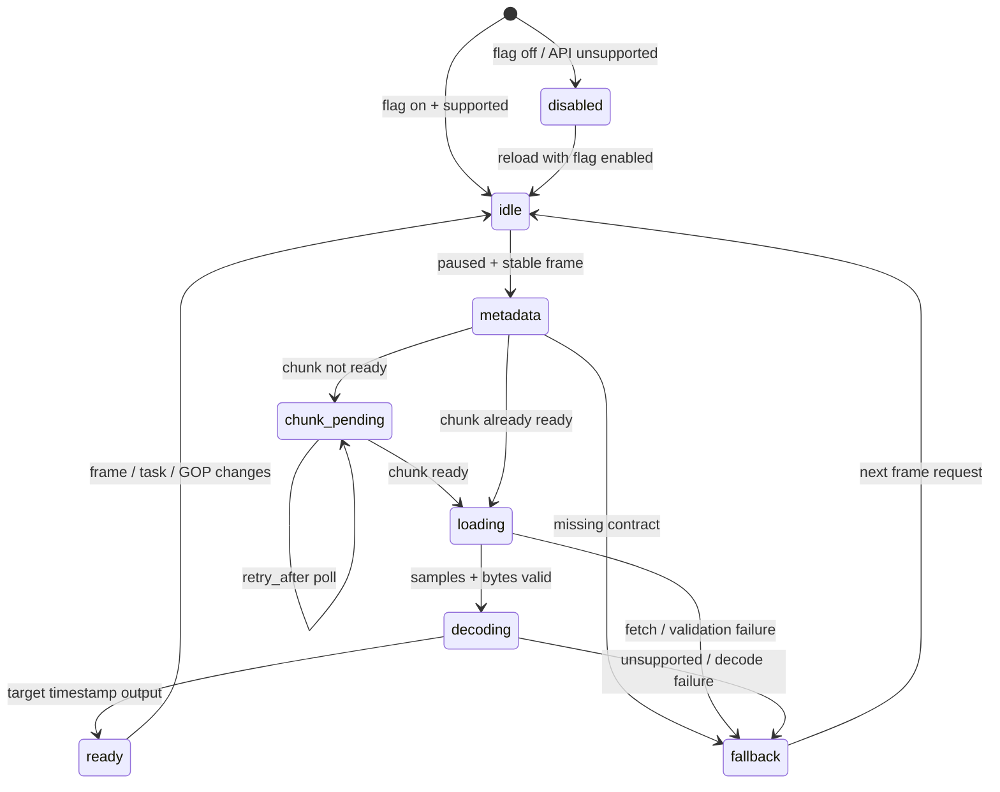

# v0.23.13–v0.23.15 · WebCodecs 精确帧与 Konva 播放链路 Epic

> Status: Completed · default-off experimental release; client qualification remains deferred · 2026-07-25
>
> 来源：[主路线图「视频工作台收尾」](../../ROADMAP.md) ·
> [视频工作台专项路线](../../ROADMAP/2026-05-21-video-workbench-roadmap.md)
>
> 起始版本：v0.23.13
>
> 前置版本：v0.23.12 已有独立计划，本 Epic 顺延使用 v0.23.13–v0.23.15。
>
> 历史依据：[v0.10.46 WebCodecs demux 计划](archive/2026-05-23-v0.10.46-webcodecs-demux.md) ·
> [v0.16.1 视频媒体层进 Konva](archive/2026-06-16-v0.16.1-video-media-layer-to-konva.md) ·
> [ADR-0041 视频画布统一到 Konva](../adr/archive/0041-video-canvas-unify-to-konva.md)

## 1. Epic 结论

本 Epic 不重新实现完整 MP4 demux，也不引入新的浏览器端视频容器解析库。仓库已经具备：

- 后端 chunk 生成、smart-copy / transcode 与 signed URL；
- `ffprobe -show_packets` 产生的解码顺序 sample manifest；
- `avcC` / `hvcC` decoder configuration record 与 codec string；
- `/videos/{dataset_item_id}/chunks/{chunk_id}/samples`；
- `useVideoChunkDecoder`、实验开关、ImageBitmap LRU；
- 唯一的 Konva 视频媒体层。

真实缺口是一次历史迁移断链：

1. v0.10.46 曾把 sample manifest、chunk bytes、`EncodedVideoChunk[]`、`VideoDecoder` 和旧
   `VideoStage` 接通。
2. v0.16.x 把视频画布统一到 Konva 并删除旧 SVG / DOM 栈时，旧栈专用的
   `useChunkSamples`、`videoChunkDemux` 和接线逻辑一并删除。
3. 后端协议、前端 decoder 骨架和设置开关仍保留，但当前生产代码没有调用 decoder；
   设置中的“WebCodecs 精确解码”实际无效。

因此终局应是：

```text
                         连续播放
隐藏 <video> ───────────────────────────────────────┐
                                                   │
frameIndex ─→ chunk/sample ─→ WebCodecs ─→ bitmap ─┼─→ displayBitmap
                                                   │
             <video> seek/capture fallback ────────┘
                                                        ↓
                                              Konva media-bg Layer
                                                        ↓
                                        标注显示 / 当前帧 JPEG / AI 输入
```

连续播放仍由 `<video>` 提供时钟和解码；WebCodecs 只负责暂停、逐帧、关键帧跳转与稳定 seek 后的
精确帧。所有失败都回退到现有 `<video>` / bitmap 路径，不阻断标注。

## 2. 用户问题与成功定义

### 2.1 当前用户问题

原生 `<video>.currentTime` 的 seek 是时间定位，不是平台 `frame_index` 的逐帧解码合同。长 GOP、
B 帧、VFR、高帧率和快速连续 seek 下可能出现：

- 时间轴显示第 N 帧，底图实际为相邻帧；
- 标注几何与错误底图对齐；
- 用户看到的帧与 `captureCurrentFrameJpeg` 提交给 AI / SAM 的帧不一致；
- 慢的旧 seek / decode 在新请求之后完成，造成画面回跳；
- 实验开关已可见但没有功能效果。

### 2.2 Epic 成功定义

Epic 只有同时满足以下条件才算完成：

1. 开启实验开关后，暂停或逐帧导航能把逻辑 `frameIndex` 对应的精确解码帧送入 Konva。
2. B 帧素材按 `VideoFrame.timestamp` 命中目标，不使用全局帧号索引局部输出数组。
3. 连续播放仍使用隐藏 `<video>`，播放期间不按每个播放帧发 chunk/sample 请求。
4. Konva 显示帧与 `captureCurrentFrameJpeg` 使用同一个 `displayBitmap` 真值。
5. pending chunk 会按 `retry_after` 轮询；ready 后自动替换 fallback 帧。
6. 不支持 codec、旧 chunk 无 samples / description、CORS、signed URL 过期、字节越界和 decode
   error 都安全回退，无黑屏、无卡死、无全局错误 toast 风暴。
7. 快速 scrub 使用 latest-request-wins；旧结果可以进入缓存，但不能激活为当前画面。
8. 同一 GOP 向前逐帧不从关键帧重复解码，资源和内存受字节预算约束。
9. Chromium 真实 H.264（含 B 帧）E2E 能用可识别帧 fixture 证明画面与目标帧一致。
10. 默认关闭时零新增请求、零行为变化；本 Epic 不擅自把实验开关改为默认开启。
11. ROADMAP、开发参考、用户设置说明、排障手册和 CHANGELOG 与最终实现同步。

## 3. 版本路线

| 版本                                                                             | 主题                 | 必须交付的结果                                                                         | 依赖     |
| -------------------------------------------------------------------------------- | -------------------- | -------------------------------------------------------------------------------------- | -------- |
| [v0.23.13](2026-07-24-v0.23.13-webcodecs-konva-correctness-wiring.md)            | 正确性与 Konva 接线  | 恢复薄 demux、按 timestamp 解码、chunk 轮询、暂停态精确 bitmap、全失败降级、死代码收口 | v0.23.12 |
| [v0.23.14](2026-07-24-v0.23.14-webcodecs-gop-session-resource-budget.md)         | GOP 会话与资源优化   | 增量向前解码、single-flight、chunk/sample cache、bitmap 字节预算、受控预取和性能诊断   | v0.23.13 |
| [v0.23.15](2026-07-24-v0.23.15-webcodecs-browser-qualification-observability.md) | 浏览器资格验收与收口 | 真实 B 帧 E2E、故障矩阵、bug report 诊断、性能门、Worker 决策、正式文档与 ROADMAP 收口 | v0.23.14 |

顺延规则：

- v0.23.13 未通过正确性退出门，v0.23.14 保持 blocked。
- v0.23.14 未通过资源与性能退出门，v0.23.15 不得把路线图标为完成。
- v0.23.15 的真实浏览器证据不允许由 jsdom mock 或纯函数测试替代。
- 任一版本发现现有后端 sample contract 不足时，只允许先记录最小兼容扩展；不得临时引入
  mp4box.js 或完整自写 MP4 box parser 绕开协议审查。

## 4. 冻结架构决策

### D1 · 后端预 demux，前端只切 packet bytes

后端 sample manifest 是容器解析真值。前端按 `offset_in_chunk + size_bytes` 切出编码 access unit，
不解析 `moov/stbl/stco/moof/trun`。

不选择：

- mp4box.js、Mediabunny 或其它新 demux 依赖；
- ffmpeg.wasm、Broadway.js；
- 手写完整 MP4 box parser。

原因：后端已经有 ffprobe、chunk 临时文件和 codec record；前端再维护容器解析会建立第二套协议真值。

### D2 · WebCodecs 不接管连续播放

播放态继续使用隐藏 `<video>` + `Konva.Animation`；WebCodecs 只在暂停、逐帧和稳定 seek 后工作。
音频、播放速率、J/K/L、loop、浏览器媒体时钟都不迁移到 WebCodecs。

### D3 · 唯一显示真值是 `displayBitmap`

暂停态优先级冻结为：

```text
当前 frameIndex 的 WebCodecs bitmap
  > 当前 frameIndex 的 <video> capture bitmap
  > 隐藏 <video> 当前画面
```

`VideoKonvaStage`、`VideoKonvaMediaLayer` 和 `captureCurrentFrameJpeg` 必须读取同一选择结果。禁止
画布显示 precise bitmap、AI 却抓 fallback video 的双真值。

### D4 · 按 timestamp 选目标

`EncodedVideoChunk.timestamp` 与 `duration` 使用微秒。decoder output 必须按
`VideoFrame.timestamp === targetTimestampUs` 选目标帧。`frameIndex` 只用于平台缓存键和用户语义，
不能作为 decoder output 数组下标。

### D5 · 正确性版本先无状态，性能版本再建会话

v0.23.13 先恢复最小、可证明正确的目标帧解码；v0.23.14 再引入持久 GOP session。避免一次提交同时
混入协议恢复、竞态修复、session 状态机和缓存重写，导致失败时无法定位。

### D6 · latest-request-wins，但允许旧结果缓存

任务、frame 或 generation 变化后，旧 fetch 要 abort；已经进入硬件 decoder 的请求可以完成并进入
缓存，但只有当前 `{taskId, frameIndex, generation}` 能激活画面。

### D7 · 状态与资源都必须有界

- samples：按 dataset + chunk 缓存，chunk 内容不变时可长缓存；
- signed URL：不得永久缓存；
- chunk bytes：短 TTL + 字节预算；
- decoder：最多一个当前 session，切 task/chunk/GOP 时关闭；
- ImageBitmap：按估算字节而不是只按对象个数淘汰，淘汰时显式 `close()`。

### D8 · 实验开关保持本机、默认关闭

本 Epic 让已有 `video.experimental.webcodecs` 真正生效，不迁入用户 preferences，不改变默认值。
是否默认开启必须另有基于 v0.23.15 证据的明确产品决策。

### D9 · 无新数据库迁移和持久媒体资产

现有 `VideoChunk.diagnostics.samples`、description、signed URL 与 manifest v2 足够支撑本 Epic。
不增加表、不回填全部旧 chunk、不复制新视频资产。旧 chunk 缺数据时按需重新生成或回退。

### D10 · Worker 由门槛触发，不先验引入

WebCodecs 可运行在 Dedicated Worker，但硬件 decode 本身异步；Worker 是否能显著降低主线程长任务需要
真实数据证明。v0.23.15 先测：

- 若 decode pipeline 造成的 JS blocking p95 不超过 16 ms，且没有归因于该 pipeline 的 50 ms
  long task，则保留主线程编排；
- 若超门，必须在 v0.23.15 完成 Worker 迁移后才能关闭 Epic。

## 5. 当前代码与死代码清单

| 位置                                                  | 当前状态                                                          | Epic 处理                                        |
| ----------------------------------------------------- | ----------------------------------------------------------------- | ------------------------------------------------ |
| `stage/useVideoChunkDecoder.ts`                       | decoder、LRU、flag 存在；生产无调用者；按全局帧号取局部输出有 bug | v0.23.13 修正并接入                              |
| `api/videos.ts#getChunks/getChunkSamples`             | 前端 wrapper 当前无生产消费者                                     | 新增 `getChunk`；若 `getChunks` 仍无消费者则删除 |
| `types/index.ts#VideoChunksResponse`                  | 仅服务无消费者 wrapper                                            | 随 `getChunks` 使用情况清理                      |
| `useVideoPlaybackController.displayBitmap`            | 已计算并返回，但 Konva stage 不读取                               | v0.23.13 变为真实统一显示源                      |
| `useVideoPlaybackController.showCachedBitmap`         | 全仓无消费者                                                      | v0.23.13 删除                                    |
| `performanceTier.videoDecoderCache`                   | 三档值存在但未被 decoder 消费                                     | v0.23.13 接入；v0.23.14 升级为字节预算           |
| `experiment.webcodecs`                                | 只写 localStorage，用户开启后无效果                               | v0.23.13 恢复真实功能                            |
| controller 顶部 WebCodecs TODO                        | 已长期存在                                                        | 接线完成后删除                                   |
| `video-frame-service.md`                              | 声称旧 `VideoStage` 已接通                                        | v0.23.15 改为当前 Konva 架构                     |
| concepts 文档中的旧 `VideoStage` / `VideoBitmapLayer` | 指向已删除实现                                                    | v0.23.15 修正                                    |

后端 `/chunks`、`/samples`、worker sample extraction 和 `VideoChunk.diagnostics` 不按死代码删除；它们是稳定
API 与媒体缓存合同。

## 6. 跨版本接口合同

### 6.1 前端 manifest / chunk 合同

精确帧 pipeline 需要：

```ts
interface PreciseVideoSource {
  taskId: string;
  datasetItemId: string;
  chunkSizeFrames: number;
}
```

来源优先使用既有 task `manifest-v2`。不再通过无范围 `GET /chunks` 拉整段视频 chunk 列表，因为该调用
会为长视频创建和调度全部 chunk。

单 chunk 状态：

```ts
type PreciseChunkState =
  | { status: "idle" }
  | { status: "pending"; retryAfterMs: number }
  | { status: "ready"; chunkId: number; url: string }
  | { status: "failed"; reason: string }
  | { status: "fallback"; reason: PreciseFrameFallbackReason };
```

### 6.2 demux build 合同

```ts
interface EncodedVideoDecodePlan {
  config: VideoDecoderConfig;
  chunks: EncodedVideoChunk[];
  targetFrameIndex: number;
  targetTimestampUs: number;
  chunkId: number;
  gopStartDecodeIndex: number;
  targetDecodeIndex: number;
}
```

构造函数必须拒绝：

- target frame 不存在；
- target 前没有 key sample；
- codec string 为空；
- coded width / height 非正数；
- description 非法 base64；
- offset / size 非整数、负数、零长度或越界；
- `EncodedVideoChunk` 不可用。

`duration_ms > 0` 时传 `duration = duration_ms * 1000`；零或未知 duration 时省略。

### 6.3 decoder 合同

```ts
decodePlanToBitmap(
  plan: EncodedVideoDecodePlan,
): Promise<DecodedVideoFrameBitmap | null>
```

- 先执行 `VideoDecoder.isConfigSupported(plan.config)`；
- output callback 只保留 timestamp 命中的 `VideoFrame`，其它帧立即关闭；
- `flush()` 完成后创建 `ImageBitmap`；
- error callback、configure/decode/flush/createImageBitmap 任一失败都返回 null 并计诊断；
- 所有 frame / decoder 在 finally 中关闭；
- bitmap 交给缓存后由缓存拥有，不能在 decoder finally 中关闭。

### 6.4 显示来源合同

控制器应暴露：

```ts
type VideoFrameSource = "webcodecs" | "video-bitmap" | "video-element";

interface VideoDisplayFrame {
  bitmap: CachedVideoBitmap | null;
  source: VideoFrameSource;
  frameIndex: number;
}
```

仅当 precise entry 的 `frameIndex === controller.frameIndex` 时允许选择 `webcodecs`。

### 6.5 fallback reason

至少覆盖以下稳定枚举，供诊断和 E2E，不直接向普通用户弹错误：

```text
flag_disabled
api_unavailable
dataset_item_missing
chunk_pending
chunk_failed
samples_unavailable
description_unavailable
codec_unsupported
invalid_sample_range
chunk_fetch_failed
decode_failed
stale_request
memory_budget_exceeded
```

`chunk_pending` 是过渡状态，不计错误；其余 reason 只进入本地诊断和 bug report 附件。

## 7. 跨版本状态机



播放开始时当前 precise bitmap 可以保留在 LRU，但 pipeline 停止创建新请求；媒体层立刻切回 `<video>`。

## 8. 跨版本测试策略

### 8.1 纯函数与 hook

- B 帧 packet 解码顺序和 PTS 展示顺序不同；
- target 是 key / B / P 帧；
- description、duration、offset/size 与越界；
- unsupported config；
- decoder output 乱序；
- task 切换和快速 frame 变化；
- pending → ready 轮询；
- signed URL 403 后 refetch 一次；
- flag off / dataset id 缺失零请求；
- cache hit、eviction 和资源 close。

### 8.2 组件与控制器

- 暂停态 precise bitmap 优先；
- precise entry frameIndex 不匹配时不得显示；
- 播放态 `VideoKonvaMediaLayer` 始终选择 `<video>`；
- `captureCurrentFrameJpeg` 与媒体层读取同一 bitmap；
- fallback 不黑屏；
- 设置开关写入后刷新生效。

### 8.3 后端合同

本 Epic 不重写后端，但补齐缺失的端点回归：

- `/samples` ready 200，完整带 description；
- 旧 chunk 无 samples 返回 404 `samples_not_available`；
- 不可见 dataset item 返回 404；
- pending chunk 不伪装成 ready；
- sample manifest 保持 packet 解码顺序和 presentation rank。

### 8.4 真实浏览器

使用确定性小视频 fixture：

- H.264 baseline 无 B 帧；
- H.264 main/high 含 B 帧；
- GOP 边界；
- VFR 或非整数 fps；
- 可选 HEVC：浏览器支持则验证精确帧，不支持则验证 fallback。

每帧必须有可机器判定的颜色块或 frame id，不能只凭“看起来差不多”的截图。

测试 fixture 必须写入 E2E 专用库和测试 bucket；全局 cleanup 删除数据库行和对象。临时生成文件放
`mktemp -d`，测试结束删除，不写入开发库。

## 9. 性能与资源总门

资格环境使用 Chromium、1080p/30、1080p/60、4K/30 三档，至少记录：

- cold chunk ready 后首次精确帧延迟；
- warm same-chunk / same-GOP seek p50 / p95；
- bytes cache hit；
- bitmap cache bytes；
- decoder session reset 数；
- fallback rate 与 reason；
- main-thread JS blocking p95；
- 50 ms long task 数；
- 30 分钟连续逐帧操作后的稳定内存。

建议目标：

| 指标                            | 目标               |
| ------------------------------- | ------------------ |
| warm same-GOP seek p95          | ≤ 80 ms            |
| warm same-chunk random seek p95 | ≤ 200 ms           |
| 连续播放新增 WebCodecs 请求     | 0                  |
| flag off 新增 API / chunk 请求  | 0                  |
| stale frame 激活                | 0                  |
| 超预算后内存继续增长            | 0                  |
| pipeline 归因的 50 ms long task | 0；否则触发 Worker |

性能门在固定 CI 机器用于相对回归，在开发机记录绝对值；不把硬件 codec 差异伪装成所有浏览器统一 SLA。

## 10. 文档与版本同步总要求

每个子版本日常变更先写 `CHANGELOG.md` 的 `Unreleased` 正确分组；真正发版时再按项目规则折叠版本并同步：

- `apps/api/app/config.py`
- `apps/api/pyproject.toml`
- `apps/web/package.json`
- `apps/api/uv.lock`
- OpenAPI snapshot（仅 API 有变时）

Epic 完成时必须更新：

- `ROADMAP.md`：删除“接通 MP4 demux、EncodedVideoChunk 与 Konva”缺口；
- `ROADMAP/2026-05-21-video-workbench-roadmap.md`：记录当前链路并删除遗留描述；
- `docs-site/dev/reference/video-frame-service.md`：按当前 Konva pipeline 写 sample / decode / fallback；
- `docs-site/dev/concepts/video-annotation-workbench.md`：统一显示来源与媒体层；
- `docs-site/dev/how-to/video-workbench-performance-regression.md`：加入精确帧矩阵与预算；
- `docs-site/ops/runbooks/video-frame-service.md`：samples、description、codec、CORS、signed URL 和 decode 排障；
- `docs-site/user-guide/workbench/settings.md`：说明实验开关只影响暂停 / seek，连续播放不变；
- 由源生成 `settings.generated.md`，不得手改生成页。

正式文档描述当前态，不在渲染正文留下版本号。

## 11. 回滚与故障隔离

- 首要回滚：关闭本机 `video.experimental.webcodecs`，现有 `<video>` 路径立即接管。
- 代码回滚不删除后端 samples 或 chunk；它们向后兼容。
- precise pipeline 失败不得修改 annotation、frameIndex、播放状态或时间轴。
- decoder crash / OOM 后清空 precise session 与缓存，保留 native bitmap cache。
- 不把 fallback 当致命错误；只有原生 `<video>` 也失败时才沿用现有 `playbackError`。
- 一旦产生新的前端 manifest v2 类型，旧前端仍可继续用 v1 manifest，不要求同版本部署。

## 12. Epic 非目标

- 不实现音频解码、音画同步或 WebCodecs 播放器。
- 不替换 `<video>`、`useFrameClock`、J/K/L、loop 或 playback rate。
- 不支持 HLS / DASH / WebRTC / adaptive bitrate。
- 不物理重采样原视频，不生成低 fps 新 MP4。
- 不改 annotation geometry、track、segment、tracker 或导出语义。
- 不新增用户级 codec 参数或 about:config 面板。
- 不承诺 Safari / Firefox / HEVC 在缺少浏览器能力时强行工作。
- 不在没有性能证据时引入 Worker、SharedArrayBuffer、COOP / COEP 或 Range 多请求复杂度。
- 不恢复已删除的 SVG / DOM `VideoStage`。

## 13. 主要风险

### 13.1 B 帧与 decode / presentation 顺序

sample 数组按 packet 解码顺序，`frame_index` 按 PTS rank。任何以数组位置等同展示帧号的代码都会取错；
必须由 timestamp 合同覆盖。

### 13.2 chunk 起点非关键帧

若 sample target 前没有 key sample，不能把首个 delta 伪装为 key。直接 fallback，并记录
`invalid_sample_range`。后续是否重建 chunk 由帧服务排障处理。

### 13.3 signed URL 与 CORS

chunk URL 会过期；bytes query 不以 URL 作为稳定业务 id。403 时只允许刷新 chunk metadata 后重试一次，
避免无限循环。MinIO CORS 不满足时 fallback 并进入诊断。

### 13.4 ImageBitmap 内存

按帧数缓存对 4K 不安全。v0.23.13 先消费现有上限但加入实际尺寸诊断；v0.23.14 必须完成字节预算，
否则不允许进入 v0.23.15。

### 13.5 decoder session 竞态

同一个 `VideoDecoder` 不能被多条未序列化的 seek 命令并发 reset / decode / flush。v0.23.14 使用单命令队列
和 generation，不允许靠 React effect 的偶然执行顺序维持正确性。

### 13.6 测试环境缺 Celery

现有 Playwright webServer 不负责媒体 worker。真实精确帧 E2E 必须直接 seed ready chunk、samples 和对象
存储，或显式启动测试 worker；不能等待一个永远不会执行的 pending chunk。

## 14. Outcome 回填模板

Epic 完成后在此追加：

```markdown
## Outcome

- 落地版本：v0.23.13 / v0.23.14 / v0.23.15
- release commits：...
- 最终显示来源合同：...
- Chromium H.264 / B-frame E2E：...
- 1080p / 4K 性能与峰值内存：...
- Worker 决策：...
- 用户文档：...
- 开发与运维文档：...
- ROADMAP：缺口已移除
- 未尽事项：...
```

## 15. Outcome

- **总体状态**：Epic 三个子阶段已完成并以默认关闭的实验功能发布；封版提交为 `c67eb39d`。
- **最终显示合同**：暂停与稳定 seek 在开关开启、客户端支持且精确帧匹配时使用 WebCodecs bitmap；连续播放继续由 `<video>` 驱动，任何合同、网络、codec 或资源失败都回退到原生媒体路径。Konva 底图与当前帧 JPEG 读取同一显示来源。
- **解码与资源**：生产链已接通 sample manifest、chunk bytes、GOP plan、有状态 decoder session、方向预取、bitmap / chunk 字节预算与资源关闭账本。
- **浏览器证据**：确定性 H.264 baseline / B-frame / GOP / VFR fixture 复用真实 ffprobe 与 chunk 管线；最终有头 Chromium 严格 E2E `9/9` 通过，且无 capability skip。详细硬件、延迟和清理证据见 [浏览器资格验收计划](2026-07-24-v0.23.15-webcodecs-browser-qualification-observability.md#outcome)。
- **Worker 决策**：实测未触发 Dedicated Worker 迁移门；主瓶颈位于 codec / session，而不是可迁移的 demux、bitmap 转换或 Konva paint。
- **文档与路线图**：视频帧参考、工作台架构、性能指南、运维排障、用户设置、CHANGELOG 与 ROADMAP 均已收口。
- **未尽事项**：目标客户端的 H.264 硬解 profile、跨平台 strict 1080p / 4K 性能和默认开启仍是独立资格门，不得由当前 Linux 软解证据替代。
